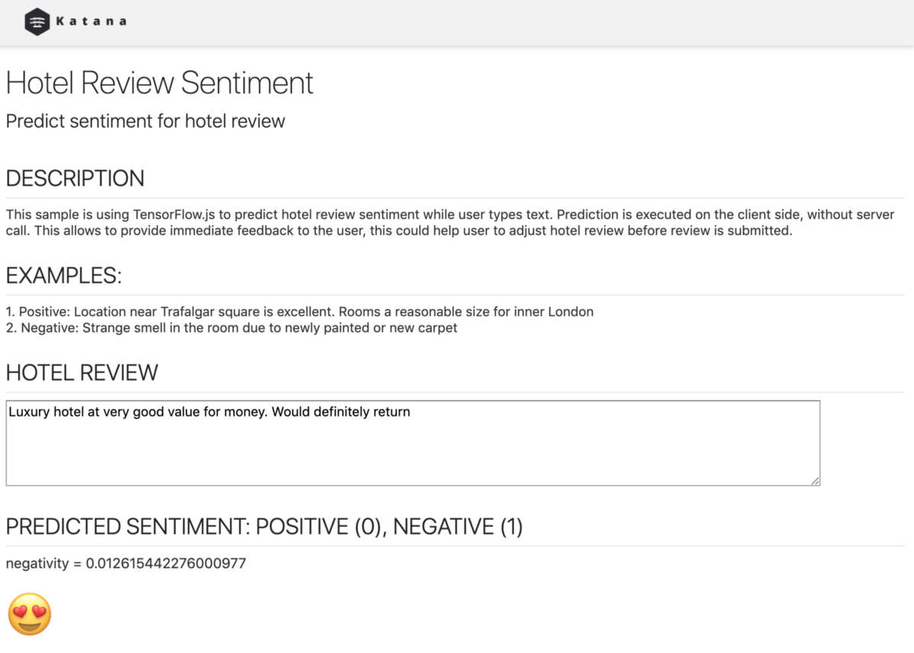
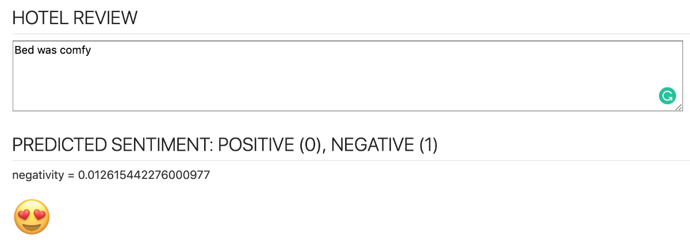
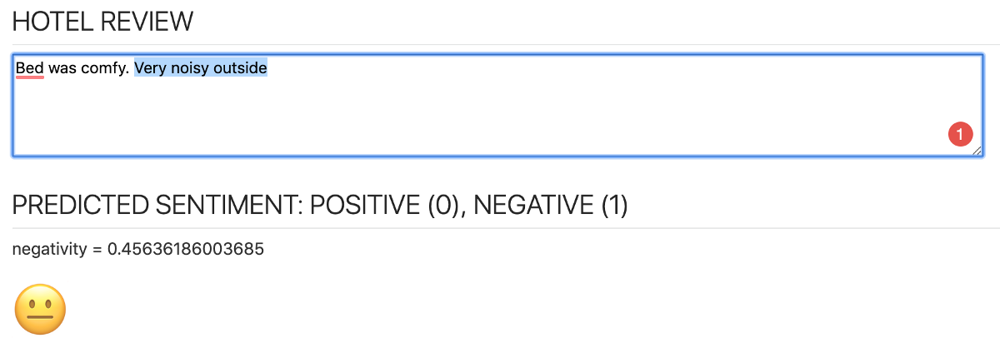
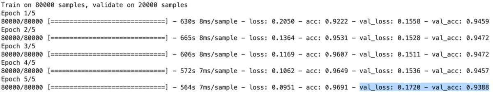

# TensorFlow.JS-使用JavaScript Web Worker运行ML Predict函数
## 这篇文章是关于客户端的机器学习的。 我将解释如何在JavaScript Web Worker中运行ML模型。 该模型在TensorFlow / Keras（使用Python）中进行了训练，以检测酒店点评的情绪。

> Source: Pixabay


我是JavaScript开发人员，当机器学习模型在客户端（在浏览器中）运行时，我感觉很好。 我将在这篇文章中介绍几个主题，如果您决定在浏览器中运行ML模型，我相信您会发现它们很有用：
+ 如何在Python中训练ML模型
+ ML模型如何转换为与TensorFlow.js兼容
+ JavaScript Web Worker运行TensorFlow.js预测功能

我正在使用ML模型来预测酒店评论的人气。 我在Kaggle上找到了这个出色的数据集—欧洲的515K酒店评论数据。 它提供了515K记录，这些记录来自Booking.com。 使用此数据集，我训练了Keras模型，将其转换为与TensorFlow.js兼容，然后将其包含在客户端JS应用程序中。 您可以自行检查其运行方式，该应用程序已部署在Heroku上-https://sentiment-tfjs-node.herokuapp.com/：

> JS app with TensorFlow.js


尝试输入Bed很舒适，您的负面得分会非常低：

> JS app with TensorFlow.js


然后添加-外面非常嘈杂，否定性得分将提高至中性：

> JS app with TensorFlow.js


如何在Python中训练ML模型

文本情感分类是使用Zaid Alyafeai文章“从Keras到浏览器的情感分类”中介绍的方法实现的。 我不会深入解释如何建立文本情感分类，您可以在Zaid文章中阅读它。

为了能够训练模型，我处理了酒店评论数据集并从所有属性中提取了酒店评论文本和情感（0表示肯定，1表示否定）。 我使用了一部分数据来训练模型，以减少训练时间。 我使用了前10万条评论：
```
df = pd.read_csv('hotel-reviews.csv', nrows=100000)df['REVIEW_TEXT'] = df['REVIEW_TEXT'].astype(str)print('Number of rows ', df.shape[0])
```

使用批处理大小= 128（更大的批处理大小可以更快地进行训练）在5个时期内训练模型。 为验证集分配了20％的训练数据：
```
model.fit(np.array(X_train_tokens), np.array(Y_train),          validation_split=0.2, epochs=5, batch_size=128)
```

模型训练成功，验证准确性高达94％：

> Model training results


训练模型后，还有两件事要做。 创建一个字典文件，它将用于对要由客户端预测功能处理的用户句子进行编码。 使用优化器保存模型，以便能够将其转换为TensorFlow.js友好的表示形式。

确保在保存模型时，训练过程执行一次（在保存之前，您没有运行过多次训练-或关闭Python笔记本并从头开始进行新的训练）-否则，保存的文件和模型中的模型会过载 TensorFlow.js无法重用。

ML模型如何转换为与TensorFlow.js兼容

保存模型后，将其转换为TensorFlow.js格式-结果将创建两个新文件（模型bin文件和带有元数据的JSON文件）：
```
tensorflowjs_converter --input_format keras hotel-reviews-model.h5 tensorflowjs/
```

在此处阅读更多信息—将Keras模型导入TensorFlow.js，以获取有关如何将现有Keras模型转换为TensorFlow.js，然后将其加载到TensorFlow.js中的信息。

JavaScript Web Worker运行TensorFlow.js预测功能

为什么我们需要使用Web Worker进行TensorFlow.js预测函数调用？ 预测函数调用不是异步的，这意味着它将阻止主JavaScript线程，并且用户屏幕将被冻结，直到预测完成。 情感分析预测需要几秒钟，UI冻结会惹恼用户。 Web Worker允许委派长时间运行的任务来分隔JavaScript线程，而不会阻塞主线程。

JavaScript应用程序基于Oracle JET工具箱（开放源代码库的集合-敲门js，require.js等）。 要在您的计算机上运行示例应用程序，请执行以下命令：
+ npm install -g @ oracle / ojet-cli
+ 从应用程序根文件夹运行：ojet restore
+ 从应用程序根文件夹运行：ojet服务

appController.js中有一个函数，每次用户停止键入文本时都会调用该函数—调用以预测情感。 此函数创建Web Worker（如果不存在），并将用户输入发送给Web Worker（发送的输入已编码并可以用于创建Tensor）：
```
if (!worker) {  worker = new Worker("js/worker.js");}worker.postMessage(seq);worker.onmessage = function (event) {  console.log('prediction: ' + event.data);  self.negativityScore(event.data);  self.sentiment(convertToSentiment(event.data));};
```

已注册事件侦听器以处理返回消息（预测），并通过可剔除的可观察变量将其推送到UI。

Web Worker是在worker.js文件中实现的。 该文件在其自己的上下文中运行，您应该在此处隐式引用TensorFlow.js库。 确保设置CPU后端，Web Worker中的TensorFlow.js仅适用于CPU后端：
```
importScripts('https://cdn.jsdelivr.net/npm/setimmediate@1.0.5/setImmediate.min.js');importScripts('https://cdn.jsdelivr.net/npm/@tensorflow/tfjs@1.2.7/dist/tf.min.js');tf.setBackend('cpu');
```

这是主要代码（Web Worker中的消息监听器）—调用了TensorFlow.js预测函数（用户输入转换为张量），结果通过消息返回到主线程：
```
onmessage = async function (event) {  console.log('executing worker');  seq = event.data;  if (!model) {    model = await createModel();  }  input = tf.tensor(seq);  input = input.expandDims(0);  predictOut = model.predict(input);  score = predictOut.dataSync()[0];  postMessage(score);  predictOut.dispose();};async function createModel() {  const model = await tf.loadLayersModel('ml/model.json')  return model}
```

资源：
+ 源代码— GitHub
+ 实时应用程序示例-https://sentiment-tfjs-node.herokuapp.com/
