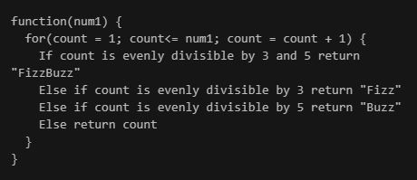

## 自从我开始学习JavaScript和Ruby已有一年了。

现在，我是一名技术作家。 我阅读代码的频率要高于编写代码的频率。 当我写的时候，通常是一个特定目的的小片段。 我通常不会像开发投资组合时那样构建整个应用程序。

但是现在，我使用代码来解决问题。 我完全知道我要编写的每一行代码要完成的工作。 当我卡在某个东西上时，我会对其进行伪编码，直到找到一个有意义的解决方案为止。

我每天继续学习。 尽管我将大部分精力集中在技术写作上，但我有信心这些认识将有助于我成长为一名开发人员。
# 3.伪代码有助于算法思考

我过去经常在试错模式下花费大量时间。 如果某件事不起作用，我只是尝试了多种方法，直到（a）它终于以某种方式起作用，或者（b）它不起作用，最后我遇到了Stack Overflow。

我一直以为这是我对所用语言的不了解。 回想起来，这实际上是算法思维的问题。 我想从Y获得X并将其放入Z。我编写了从任何地方获得Z并尝试将其放入X的代码。

我意识到伪代码是一种快速启动算法思维过程的好方法。 Brayden Copley的FizzBuzz解决方案提供了可靠的伪代码示例。


第一次尝试FizzBuzz时，我坐在那儿是在考虑Ruby的语法，然后才考虑如何对最终编写的语句进行排序。 我用Google搜索了“如何在Ruby中编写条件语句”和“可以被Ruby整除”之类的内容，但我专注于真正无关紧要的部分。 DID重要的部分是如何以一种有效的方式从A点到达B点。

FizzBuzz很容易。 现实世界中的许多问题并非如此。

伪编码是一种思考复杂问题的好方法，而不必担心您使用的语言。

我最初无法通过算法思考的问题很容易克服。 我不再关注接下来要学习哪种语言，而是开始关注如何思考解决问题的方法。
# 2.我们编写代码来解决问题

当然，在编写说明性教程时很难学习。 您没有解决真正的问题。 您正在遵循一组说明，如果正确遵循这些说明，将会产生一定的结果。 通过设计。

非开发人员可以遵循编写良好的教程并制作一个简单的应用程序，但是如果您要解决尚未解决的问题，则没有任何要遵循的说明。

您可能正在做一些有趣的事情。 希望您会创建需要解决的问题。 但是，如果您只是在进行指导性教程，并且不确定如何将这些练习应用于实际问题，那将需要花费一些时间才能发展。

您所学的技能应该可以转移。 如果您无法将正在练习的相同技能应用到不同的情况下，那么进行本教程就毫无意义。

因此，以上所有示例均应包含单词“因为”。
+ X到Y，因为…
+ 从…获得X，因为……
+ 从Y获得X，然后将其放入Z，因为……
+ 在Y中创建X，因为…
+ 在Y中创建X，并使其成为Z，因为…

假设您学会了制作待办事项清单应用。 我做了一次。 我学到了什么？ 我学习了如何制作待办事项清单应用程序。 我没有学习如何使用相同的概念来使应用以相似的方式运行。
# 1.编程并不是真的要告诉计算机去做X

当我开始学习时，这是一个很大的误解。 在我看来，我只需要编写一个命令（如do X），一切都会顺利进行。

当然，这不是我们的方法。

相反，我需要：
+ 从X到Y
+ 从Y获得X
+ 从Y获得X，然后将其放入Z
+ 在Y中创建X
+ 在Y中创建X，然后使其成为Z

… 等等。

直到我开始使用代码解决实际问题时，我才意识到这一点。

示例：我从BigQuery中提取了一堆数据并将其连接到Data Studio。 我用这些数据制作了一个漂亮的条形图。 现在，我需要对X轴上的参数进行自定义排序，这些参数与BigQuery中的尺寸相关。 我可以通过单击按钮来进行升序或降序排序，但这不适合我的用例。 我需要用我的方式编写代码。

我在想：x轴上的排序顺序：A，D，E，B，C，F。

然后，我对自己想……这还不够。 这些X轴值代表什么，它们来自何处？ 假设它们来自table001上的位置维度。

我想出了类似的东西：
```
SELECT *,CASE  WHEN location = 'A' then 1  WHEN location = 'D' then 2  WHEN location = 'E' then 3  WHEN location = 'B' then 4  WHEN location = 'C' then 5  WHEN location = 'F' then 6 ELSE 0 END as SortOrderFROM `table001`
```

现在，我可以按定义的SortOrder进行排序，而不是按升序或降序排序。

除了最初的CASE和END外，这条SQL正是我的大脑所想象的。 但这并不像这样简单：ADEBCF。 像这样排序吗？ 哪个尺寸？ 哪张桌子

我的第一个JavaScript项目帮助我实现了类似的实现。 我从PokéAPI中获取了关于Pokémon的统计信息。 太好了-我得到了统计数据。 怎么办？ 它们没有出现在控制台中的任何地方。 明显。 因为我没有把它们放在我以为我在放置它们的地方。 我只编程了我打算编程的一半。

这听起来像是常识，但只有在您完全了解要完成的工作时，才是常识。 如果您是编程的新手，可能需要一段时间才能从概念上了解要解决的问题。
# 使我成为更好的程序员的3种认识
## 这不是一夜之间发生的

> Photo by eberhard grossgasteiger on Unsplash


我小时候就对编程产生了兴趣-在我不知道编程真正是什么之前。 我从小就学习HTML，并建立了最典型的90年代网站。 我在IT部门从事暑期工作时，从小就学习SQL。 上了很多次大学和研究生后，工作了几年之后，我去了编码训练营，学习了一些JavaScript和Ruby。

我花了几个月的时间来概念化我所学到的东西。 我花了一年多的时间才能独立构建事物。

在此过程中，我有一些有益的认识。
```
(本文翻译自Keri Savoca的文章《The 3 Realizations That Made Me a Better Programmer》，参考：https://medium.com/better-programming/the-3-realizations-that-made-me-a-better-programmer-af7d1bcab4d3)
```
