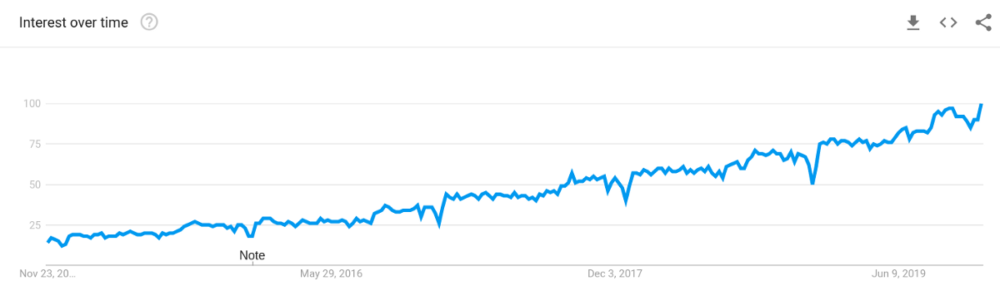
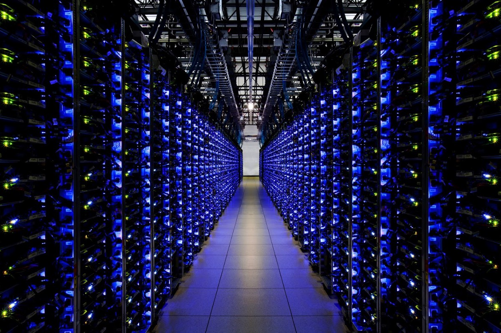

数据科学作为一个整体正在增长。 随着其功能的增强，它已嵌入到技术和非技术的每个行业，以及大大小小的每个业务。

随着该领域的长期发展，看到它大规模民主化并不奇怪，它在我们的软件工具箱中被越来越多的人使用。
# 2020年数据科学的四大最热门趋势
## 对于所有数据科学而言，2019年都是重要的一年。

世界各地各行各业的公司都在经历着人们所说的数字化转型。 也就是说，企业正在采用传统的业务流程，例如招聘，营销，定价和策略，并使用数字技术使其质量提高10倍。

数据科学已成为这些转变的组成部分。 使用数据科学，组织不再需要根据预感，最好的猜测或小型调查做出重要决策。 取而代之的是，他们正在分析大量真实数据，以根据数据驱动的真实事实做出决策。 这就是数据科学的全部意义所在-通过数据创造价值。

根据Google搜索趋势，将数据集成到核心业务流程中的趋势已经显着增长，在过去5年中，兴趣增长了四倍多。 数据为公司提供了超越竞争对手的巨大优势。 有了更多的数据和更好的数据科学家来使用它，公司可以获取其竞争对手甚至可能不知道的市场信息。 它成为数据游戏或灭亡。

> Google search popularity of “Data Science” over the past 5 years. Generated by Google Trends.


在当今不断发展的数字世界中，要在竞争中保持领先地位需要不断的创新。 专利已经过时，而敏捷方法论和快速捕捉新趋势非常重要。

组织不再能够依靠其坚如磐石的旧方法。 如果出现诸如数据科学，人工智能或区块链之类的新趋势，则需要预先进行预测并迅速适应。

以下是2020年最热门的4种数据科学趋势。这些趋势今年引起了越来越多的兴趣，并将在2020年继续增长。
# （1）自动化数据科学

即使在当今的数字时代，数据科学仍然需要大量的手工工作。 存储数据，清洁数据，可视化和探索数据，最后对数据建模以获得一些实际结果。 手动工作只是乞求自动化，因此是自动化数据科学和机器学习的兴起。

数据科学流程的几乎每个步骤都已经或正在变得自动化。

在过去的几年中，对自动数据清理进行了广泛的研究。 清理大数据通常会占用数据科学家的大部分宝贵时间。 初创公司和大型公司（例如IBM）都提供用于数据清理的自动化和工具。

称为要素工程的数据科学的另一大部分已遭受重大破坏。 Featuretools提供了自动特征工程的解决方案。 最重要的是，诸如卷积和递归神经网络之类的现代深度学习技术无需手动特征设计即可学习其自身的特征。

也许最重要的自动化发生在机器学习领域。 Data Robot和H2O都通过提供端到端机器学习平台而在行业中建立了自己的地位，这使Data Scientists可以非常轻松地处理数据管理和模型构建。 AutoML是一种用于自动模型设计和训练的方法，在2019年也蓬勃发展，因为这些自动模型已经超越了最新技术。 尤其是Google，正在Cloud AutoML上进行大量投资。

总的来说，公司在建立和购买用于自动化数据科学的工具和服务上投入了大量资金。 使该过程更便宜，更容易的任何方法。 同时，这种自动化还适合规模较小和技术含量较低的组织，这些组织可以利用这些工具和服务来访问数据科学，而无需建立自己的团队。
# （2）数据隐私与安全

隐私和安全始终是技术中的敏感话题。 所有公司都希望快速发展和创新，但是失去客户对隐私或安全问题的信任可能是致命的。 因此，他们被迫将其作为优先事项，至少要做到不泄漏私人数据。

在过去的一年中，数据隐私和安全性已成为一个令人难以置信的热门话题，因为巨大的公共黑客事件使这一问题更加严重。 就在最近的2019年11月22日，在Google Cloud上发现了一个没有安全性的公开服务器。 该服务器包含12亿独特人员的个人信息，包括姓名，电子邮件地址，电话号码以及LinkedIn和Facebook个人资料信息。 甚至联邦调查局也介入调查。 这是有史以来最大的数据泄露事件之一。

数据如何到达那里？ 它属于谁？ 谁负责该数据的安全性？ 它是在任何人都可以创建的Google Cloud服务器上。

现在，我们可以放心，全世界在阅读新闻之后不会删除他们的LinkedIn和Facebook帐户，但确实引起了人们的注意。 消费者越来越注意将电子邮件地址和电话号码提供给谁。

一家可以保证客户数据隐私和安全的公司会发现，他们说服客户（通过继续使用其产品和服务）向他们提供更多数据的时间要短得多。 它还确保，如果他们的政府制定了任何要求为客户数据提供安全协议的法律，则他们已经做好了充分的准备。 许多公司选择SOC 2合规性来证明其安全强度。

整个数据科学过程都受到数据的推动，但其中大多数不是匿名的。 如果使用不当，这些数据可能会助长全球灾难，并扰乱每天人们的隐私和生计。 数据不仅仅是原始数字，它代表并描述了真实的人和真实的事物。

随着数据科学的发展，我们还将看到围绕数据的隐私和安全协议的转变。 这包括流程，法律以及建立和维护数据安全性，安全性和完整性的不同方法。 如果网络安全成为当年的新流行语，也就不足为奇了。
# （3）云中的超大型数据科学

多年以来，数据科学已经从一个小众市场发展到了自己的全方位领域，可用于分析的数据也呈爆炸式增长。 组织正在收集和存储比以往更多的数据。

一家典型的财富500强公司可能需要分析的数据量已经远远超出了个人计算机可以处理的数据量。 一台像样的PC可能具有64GB的RAM，8核CPU和4TB的存储空间。 这对于个人项目来说效果很好，但是当您为一家拥有数百万客户数据的跨国公司（例如银行或零售商）工作时，效果就不那么理想。

那就是云计算进入领域的地方。 云计算使任何地方的任何人都可以访问几乎无限的处理能力。 诸如Amazon Web Services（AWS）之类的云供应商为服务器提供了多达96个虚拟CPU内核和高达768 GB的RAM。 可以将这些服务器设置在一个自动扩展组中，在其中可以启动或停止数百个服务器而不会产生太多延迟-按需计算能力。

> A Google Cloud data center


除了计算之外，云计算公司还为数据分析提供了完善的平台。 Google Cloud提供了一个称为BigQuery的平台，这是一个无服务器且可扩展的数据仓库，使Data Scientists能够在单个平台上存储和分析PB的数据。 BigQuery也可以连接到其他用于Data Science的GCP服务。 使用Cloud Dataflow创建数据流传输管道，使用Cloud DataProc在数据上运行Hadoop或Apache Spark，或使用BigQuery ML在庞大的数据集上构建机器学习模型。

从数据到处理能力的一切都在增长。 随着数据科学的成熟，由于数据量巨大，我们最终可能会完全在云上完成数据科学。
# （4）自然语言处理

在深度学习研究领域取得巨大突破之后，自然语言处理（NLP）已牢固地进入数据科学领域。

数据科学最初是对纯原始数据的分析，因为这是处理数据并将其收集在电子表格中的最简单方法。 如果您需要处理任何类型的文本，通常都需要将其分类或以某种方式转换为数字。

但是，将一段文本压缩为一个数字是非常困难的。 自然语言和文本包含了如此丰富的数据和信息，因为我们缺乏将这些信息表示为数字的能力，因此我们常常会错过这些信息。

通过深度学习在NLP中取得的巨大进步推动了NLP与常规数据分析的全面集成。 现在，神经网络可以快速地从大量文本中提取信息。 他们能够将文本分类为不同的类别，确定关于文本的情感，并对文本数据的相似性进行分析。 最后，所有这些信息都可以存储在单个数字特征向量中。

结果，NLP成为数据科学中的强大工具。 巨大的文本数据库，不仅是一个单词的答案，而且还有完整的段落，都可以转换为数值数据以进行标准分析。 现在，我们可以探索更为复杂的数据集。

例如，假设有一个新闻网站想要查看哪些主题正在获得更多的观看次数。 如果没有高级的NLP，那么所有关键词都将失去作用，或者只是一个预感，为什么一个特定的标题相对于另一个标题效果很好。 使用当今的NLP，我们可以量化网站上的文本，比较整个文本甚至是网页的各个段落，以获得更全面的见解。

有关过去几年NLP最重要进展的技术概述，您可以查看Victor Sanh的指南。
```
(本文翻译自George Seif的文章《The 4 Hottest Trends in Data Science for 2020》，参考：https://towardsdatascience.com/the-4-hottest-trends-in-data-science-for-2020-3956cd9fc182)
```
