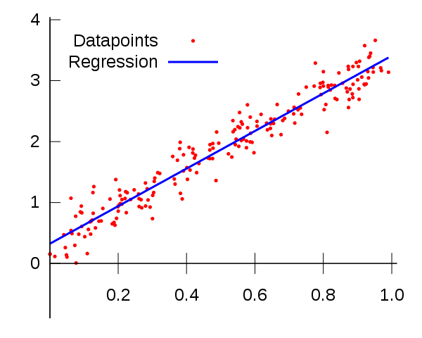
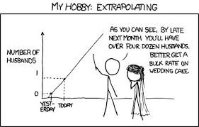
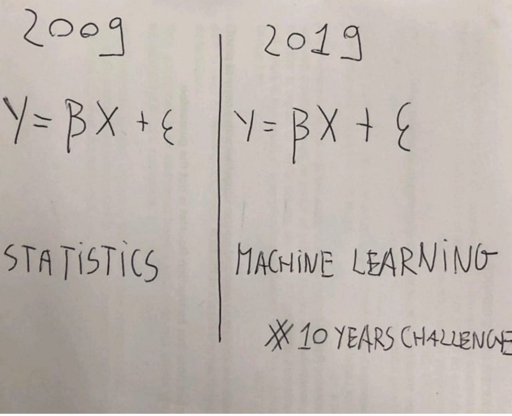
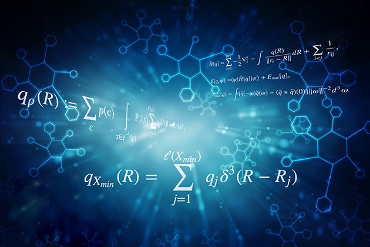

## ECE 543：统计学习理论（2018春季）
### 统计学习理论是在概率，统计，计算机……的交叉点上蓬勃发展的研究领域。
## 9.520 / 6.860，2018秋季
### 本课程从统计学习的角度介绍了机器学习的基础和最新进展。
## 那么哪个更好呢？

这实际上是一个愚蠢的问题。 在统计与机器学习之间，没有统计就不会存在机器学习，但是由于信息爆炸以来人类拥有大量数据，因此机器学习在现代非常有用。

比较机器学习和统计模型要困难一些。 您使用哪种取决于您的目的。 如果您只想创建一种可以高精度预测房价的算法，或者使用数据确定某人是否可能感染某些类型的疾病，那么机器学习可能是更好的方法。 如果您试图证明变量之间的关系或根据数据进行推断，则统计模型可能是更好的方法。

> Source: StackExchange


如果您没有统计方面的扎实背景，您仍然可以学习机器学习并加以利用，机器学习库提供的抽象特性使得将它们作为非专家使用起来非常容易，但是您仍然需要一些了解 基本的统计思想，以防止模型过度拟合并提供虚假推论。
## 在哪里可以了解更多？

如果您有兴趣深入研究统计学习理论，则有很多关于该主题的书籍和大学课程。 这是我推荐的一些讲座课程：
## 9.520 / 6.860，2018秋季
### 本课程从统计学习的角度介绍了机器学习的基础和最新进展。
## ECE 543：统计学习理论（2018春季）
### 统计学习理论是在概率，统计，计算机……的交叉点上蓬勃发展的研究领域。

如果您有兴趣深入研究概率空间，那么我会提前警告您，它在数学上非常繁重，通常只在研究生统计课程中涉及。 以下是有关该主题的一些好资料：

http://users.jyu.fi/~miparvia/Opetus/Stokastiikka/introduction-probability.pdf

https://people.smp.uq.edu.au/DirkKroese/asitp.pdf

感谢您的阅读！

例子

以线性回归的简单情况为例。 在传统意义上，我们试图使某些数据之间的误差最小化，以便找到可用于描述数据的函数。 在这种情况下，我们通常使用均方误差。 我们对它求平方，以使正误差和负误差不会互相抵消。 然后，我们可以以封闭形式求解回归系数。

碰巧的是，如果我们将损失函数作为均方误差，并按照统计学习理论的要求进行经验风险最小化，则最终结果与传统线性回归分析相同。

这只是因为这两种情况是等效的，以相同的方式对同一数据执行最大似然法也将获得相同的结果。 最大似然具有实现同一目标的不同方法，但是没有人会说最大似然与线性回归相同。 最简单的情况显然无助于区分这些方法。

这里要说明的另一个重要点是，在传统的统计方法中，没有训练和测试集的概念，但是我们确实使用度量标准来帮助我们检查模型的性能。 因此，评估程序有所不同，但是两种方法都能够为我们提供统计上可靠的结果。

还有一点是，这里的传统统计方法为我们提供了最佳解决方案，因为该解决方案具有封闭形式。 它没有检验任何其他假设并收敛到一个解决方案。 然而，机器学习方法尝试了一堆不同的模型并收敛到最终假设，该假设与回归算法的结果一致。

如果我们使用其他损失函数，则结果将不会收敛。 例如，如果我们使用了铰链损耗（使用标准梯度下降是无法区分的，那么就需要其他技术（例如近端梯度下降）），结果将是不同的。

可以通过考虑模型的偏差进行最终比较。 可以要求机器学习算法来测试线性模型以及多项式模型，指数模型等，以在给定先验损失函数的情况下查看这些假设是否更适合数据。 这类似于增加相关的假设空间。 在传统的统计意义上，我们选择一个模型并可以评估其准确性，但不能自动使其从100个不同模型中选择最佳模型。 显然，由于算法的最初选择，模型中总是存在一些偏差。 这是必要的，因为找到对数据集最佳的任意函数是一个NP难题。

机器学习基于统计学习理论，而统计学学习理论仍基于概率空间的公理概念。 该理论于1960年代发展，并在传统统计基础上扩展。

机器学习有几种类别，因此，由于它最容易解释（尽管它深深地埋藏在数学中，因此在这里我仅关注有监督的学习）。

用于监督学习的统计学习理论告诉我们，我们有一组数据，我们将其表示为S = {（xᵢ，yᵢ）}。 这基本上就是说，我们有一个n个数据点的数据集，每个数据点都由其他一些我们称为特征的值来描述，这些值由x提供，并且这些特征通过某个函数进行映射以得到值y。

它说我们知道我们有此数据，我们的目标是找到将x值映射到y值的函数。 我们将可以描述这种映射的所有可能函数的集合称为假设空间。

要找到此功能，我们必须给算法某种方式“学习”解决问题的最佳方法。 这由称为损失函数的东西提供。 因此，对于我们拥有的每个假设（拟议功能），我们需要通过查看其在所有数据上的预期风险的值来评估该功能的执行情况。

预期风险实质上是损失函数的总和乘以数据的概率分布。 如果我们知道映射的联合概率分布，则很容易找到最佳函数。 但是，这通常是未知的，因此我们最好的选择是猜测最佳函数，然后凭经验确定损失函数是否更好。 我们称其为经验风险。

然后，我们可以比较不同的函数，并寻找给我们最小预期风险的假设，即给数据上所有假设的最小值（称为最小）的假设。

但是，该算法倾向于作弊，以通过过度拟合数据来最小化其损失函数。 这就是为什么在基于训练集数据学习功能后，在测试数据集（未出现在训练集中的数据）上验证该功能的原因。

我们刚刚定义机器学习的方式的性质引入了过度拟合的问题，并证明了在进行机器学习时需要训练和测试集的合理性。 这不是统计数据的固有特征，因为我们没有试图将经验风险降到最低。

选择将经验风险最小化的函数的学习算法称为经验风险最小化。

机器学习基于统计

在讨论统计学和机器学习的不同之处之前，让我们首先讨论它们的相似之处。 在前面的部分中，我们已经对此进行了一些探讨。

机器学习基于统计框架。 这很明显，因为机器学习涉及数据，并且必须使用统计框架来描述数据。 但是，统计力学也建立在统计框架上，该统计力学已扩展为针对大量粒子的热力学。 压力的概念实际上是一个统计量，而温度也是一个统计量。 如果您认为这听起来很荒谬，很公平，但实际上是事实。 这就是为什么您无法描述分子的温度或压力的原因，这是荒谬的。 温度是分子碰撞产生的平均能量的体现。 对于足够大量的分子，有意义的是我们可以描述房屋或室外物体的温度。

您是否承认热力学和统计学相同？ 不，热力学使用统计数据来帮助我们以传输现象的形式理解功与热的相互作用。

实际上，除了统计以外，热力学还建立在更多的项目上。 同样，机器学习还利用了数学和计算机科学的许多其他领域，例如：
+ 来自数学和统计学等领域的ML理论
+ 来自优化，矩阵代数，微积分等领域的ML算法
+ 来自计算机科学与工程概念的ML实现（例如内核技巧，功能哈希）

当人们开始使用Python进行编码并鞭打sklearn库并开始使用这些算法时，其中许多概念都被抽象化了，因此很难看到这些差异。 在这种情况下，这种抽象导致对机器学习实际涉及的内容一无所知。

统计学习理论—机器学习的统计基础

统计与机器学习之间的主要区别在于统计仅基于概率空间。 您可以从集合论中得出整个统计数据，集合论讨论了如何将数字分组到称为集合的类别中，然后对该集合施加度量以确保所有这些集合的总和为1。我们称之为概率 空间。

除了这些集合和测度的概念外，统计学对宇宙没有其他假设。 这就是为什么当我们用非常严格的数学术语指定概率空间时，我们指定了3件事。

像这样表示的概率空间（Ω，F，P）由三部分组成：
+ 样本空间Ω，它是所有可能结果的集合。
+ 一组事件F，其中每个事件都是一个包含零个或多个结果的集合。
+ 对事件的概率分配，P； 即从事件到概率的函数。
## 重点：统计与机器学习
### 统计数据从样本中得出总体推断，而机器学习则可以找到可概括的预测模式。 二…

统计模型与机器学习—线性回归示例


在我看来，统计建模和机器学习中使用的方法的相似性使人们认为它们是同一件事。 这是可以理解的，但事实并非如此。

最明显的例子是线性回归，这可能是造成这种误解的主要原因。 线性回归是一种统计方法，我们可以训练线性回归并获得与统计回归模型相同的结果，旨在最小化数据点之间的平方误差。

我们看到，在一种情况下，我们执行了一种称为“训练”模型的操作，其中涉及使用数据的一个子集，并且直到我们对不存在的其他数据“测试”此数据之前，我们不知道模型的性能如何 在训练期间，称为测试集。 在这种情况下，机器学习的目的是在测试集上获得最佳性能。

对于统计模型，我们假设一条数据线使所有数据的均方误差最小，假设该数据是线性回归变量，并且添加了一些随机噪声，这在本质上通常是高斯分布。 无需培训，也不需要测试集。 在许多情况下，尤其是在研究中（例如下面的传感器示例），我们模型的重点是表征数据与结果变量之间的关系，而不是对未来数据进行预测。 我们称此过程为统计推断，而不是预测。 但是，我们仍然可以使用此模型进行预测，这可能是您的主要目的，但是评估模型的方式将不涉及测试集，而将涉及评估模型参数的重要性和稳健性。

（监督）机器学习的目的是获得可以做出可重复预测的模型。 尽管我个人建议始终进行测试以确保模型预测确实有意义，但我们通常并不关心模型是否可以解释。 机器学习是关于结果的全部，它可能在一家公司的工作中，您的价值仅取决于您的表现。 而统计建模更多地是在寻找变量之间的关系以及这些关系的重要性，同时还要满足预测的需要。

为了给出这两个过程之间区别的具体示例，我将给出一个个人示例。 每天，我都是一名环境科学家，主要处理传感器数据。 如果我试图证明传感器能够对某种刺激（例如气体浓度）做出响应，那么我将使用统计模型来确定信号响应是否具有统计意义。 我将尝试理解这种关系并测试其可重复性，以便我可以准确地表征传感器的响应并根据此数据进行推断。 我可能要测试的一些事情是响应是否实际上是线性的，响应是否可以归因于气体浓度而不是传感器中的随机噪声等。

相比之下，我还可以获得20个不同传感器的阵列，并且可以使用它来尝试并预测我的新特性传感器的响应。 如果您对传感器不太了解，这似乎有些奇怪，但这是当前环境科学的重要领域。 具有20个不同变量来预测传感器结果的模型显然与预测有关，我不希望它具有特别的可解释性。 由于化学动力学产生的非线性以及物理变量与气体浓度之间的关系，该模型可能更像神经网络那样深奥。 我希望该模型有意义，但是只要我能做出准确的预测，我都会很高兴。

如果我试图证明我的数据变量之间的关系具有一定的统计意义，以便可以将其发布到科学论文中，那么我将使用统计模型而不是机器学习。 这是因为我更关心变量之间的关系，而不是进行预测。 进行预测可能仍然很重要，但是大多数机器学习算法缺乏解释性，因此很难证明数据之间的关系（这实际上是学术研究中的一个大问题，研究人员使用的算法无法理解和获取 虚假推断）。

> Source: Analytics Vidhya


应该清楚的是，尽管使用了类似的方法来实现这两种方法，但它们的目标是不同的。 机器学习算法的评估使用测试集来验证其准确性。 而对于统计模型，可以通过置信区间，显着性检验和其他检验对回归参数进行分析，以评估模型的合法性。 由于这些方法产生相同的结果，因此很容易理解为什么可能会假定它们相同。

统计与机器学习—线性回归示例

我认为，这种误解已很好地封装在表面上比较机智的十年挑战中，比较统计数据和机器学习。


但是，仅基于两个术语都使用相同的基本概率概念来混淆这两个术语是不合理的。 例如，如果我们基于这种事实作出这样的陈述：机器学习只是简单的统计数据，那么我们也可以做出以下陈述。

物理学只是光荣的数学。

动物学只是美化的集邮。

建筑只是荣耀的沙堡建筑。

这些语句（尤其是最后一个语句）非常荒谬，并且全部基于这种将基于相似思想的术语组合在一起的思想（用于体系结构示例的双关语）。

实际上，物理学是建立在数学之上的，它是数学的应用，可以理解现实中存在的物理现象。 物理学还包括统计学的各个方面，而现代的统计学形式通常是由一个由Zermelo-Frankel集理论与测度理论组成的框架构建的，以产生概率空间。 它们之所以有很多共同点，是因为它们来自相似的起源，并运用相似的思想得出合乎逻辑的结论。 同样，建筑和沙堡建筑可能有很多共同点-尽管我不是建筑师，所以我不能给出明智的解释-但它们显然是不同的。

为了让您更深入地讨论这场争论，实际上在《自然方法》上发表了一篇论文，概述了统计学和机器学习之间的区别。 这个想法看似可笑，但令人遗憾的是，这种程度的讨论是必要的。
## 重点：统计与机器学习
### 统计数据从样本中得出总体推断，而机器学习则可以找到可概括的预测模式。 二…

在继续进行之前，我将快速清除另外两个与机器学习和统计有关的常见误解。 这些是AI与机器学习不同，数据科学与统计不同。 这些都是无可争议的问题，因此将很快解决。

数据科学本质上是应用于数据的计算和统计方法，这些方法可以是小型或大型数据集。 这还可以包括探索性数据分析之类的内容，在该数据中进行检查和可视化以帮助科学家更好地理解数据并从中进行推断。 数据科学还包括数据整理和预处理之类的内容，因此涉及某种程度的计算机科学，因为它涉及编码，建立数据库，Web服务器之间的连接和管道。

您不一定需要使用计算机进行统计，但是如果没有计算机，就无法真正进行数据科学。 您可以再次看到，尽管数据科学使用统计数据，但是它们显然并不相同。

同样，机器学习与人工智能也不相同。 实际上，机器学习是AI的子集。 这很明显，因为我们正在教（训练）一台机器，以根据先前的数据对某种类型的数据进行一般化的推断。

争论

与普遍的看法相反，机器学习已经存在了几十年。 最初由于其庞大的计算需求和当时存在的计算能力的限制而被人们所避开。 但是，由于信息爆炸带来的大量数据，机器学习近年来得到了复兴。

因此，如果机器学习和统计是彼此的同义词，为什么我们没有看到每所大学中的每个统计部门都关闭或过渡为“机器学习”部门？ 因为他们不一样！

在这个主题上，我经常听到一些模糊的陈述，最常见的是遵循这些思路的陈述：

“机器学习和统计学之间的主要区别在于它们的目的。 机器学习模型旨在做出最准确的预测。 统计模型旨在推断变量之间的关系。”

尽管从技术上讲这是正确的，但它并未给出特别明确或令人满意的答案。 机器学习和统计学之间的主要区别确实是它们的目的。 然而，除非您精通这些概念，否则说机器学习就是关于准确的预测，而统计模型是为推理而设计的，这几乎是毫无意义的陈述。

首先，我们必须了解统计数据和统计模型并不相同。 统计是对数据的数学研究。 除非有数据，否则您无法进行统计。 统计模型是用于数据的模型，该模型可用于推断有关数据内关系的某些信息或用于创建能够预测未来值的模型。 通常，这两者是并驾齐驱的。

因此，实际上我们需要讨论两件事：首先，统计学与机器学习有何不同；其次，统计模型与机器学习有何不同。

为了使这一点更加明确，有许多统计模型可以做出预测，但是预测准确性并不是它们的优势。

同样，机器学习模型提供了不同程度的可解释性，从高度可解释的套索回归到难以理解的神经网络，但它们通常会牺牲可解释性来提高预测能力。

从高层的角度来看，这是一个很好的答案。 对大多数人来说足够好了。 但是，在某些情况下，这种解释使我们对机器学习和统计建模之间的差异产生了误解。 让我们看一下线性回归的例子。
# 统计与机器学习之间的实际差异
## 不，他们不一样。 如果说机器学习只是美化的统计数据，那么建筑就是美化的沙堡建筑。

老实说，我厌倦了听到这场辩论在社交媒体上以及我大学内部几乎每天都会重复。 通常，这会伴随一些含糊的陈述来解释这个问题。 双方都为此感到内gui。 我希望到本文结尾时，您将对这些模糊的术语有更全面的了解。

```
(本文翻译自Matthew Stewart, PhD Researcher的文章《The Actual Difference Between Statistics and Machine Learning》，参考：https://towardsdatascience.com/the-actual-difference-between-statistics-and-machine-learning-64b49f07ea3)
```
