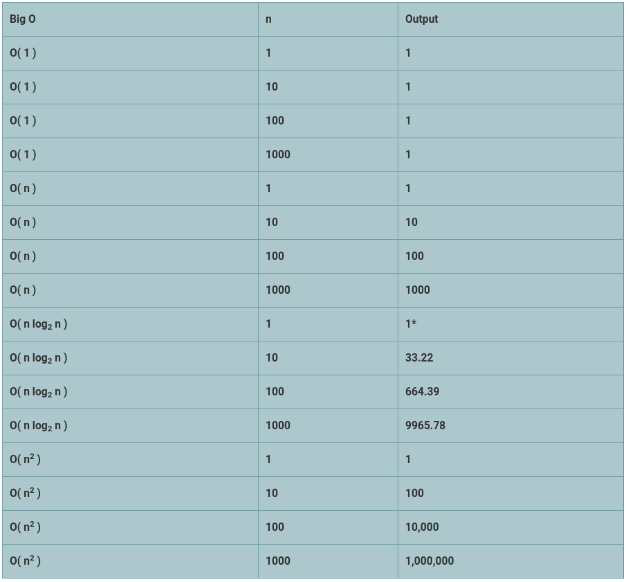

最初发布在https://somedudesays.com。
# 大O表示法的基础

> Featured image by Arek Socha from Pixabay


大O表示法表示算法如何相对于输入增长，并将输入外推到任意大甚至无限的东西。 这为我们提供了算法在最佳情况和最坏情况下要花费的时间。

这并不能告诉我们运行算法需要多长时间（出于某种原因，我们稍后会介绍），但是可以提供一种对算法进行整体排名和比较的方法，并且可以为您提供一个评估方法。 会很大。 在大多数系统上，大O表示法对一个小的数据集并不重要，但是对于大数据集（这是我们的输入）起作用。 让我们了解一下该符号的一些基础知识。
# 实际的大O符号

如果您已经看过O（n²）或O（nlog²n）之类的东西，那么您已经了解了Big O表示法的基本语言。 n定义了输入的大小。 如果传递任意n，则可以看到它的大小和速度。

我们将介绍3种常见的Big O分类。 O（1）具有恒定的时间，这意味着始终需要恒定的时间来运行。 我们的线性时间为O（n），这意味着运行时间与n直接成线性关系。 最后，我们有二次时间，它随着n呈指数增长。 这只是冰山一角，因为几乎所有可以用数学表示的东西都可以使用。

> A table detailing out the various common Big O notation options and a numerical representation.


我确实在n为1时将O（nlog²n）更改为1，因为实际上它实际上可以解决这个问题，但是从数学上来说应该为0。 看看我们的数字趋势正在发生什么。

恒定时间仅适用于对单个值或类似值的单个操作。 它根本没有考虑数据大小（因此，除非是最佳情况，否则实际上不会对我们的数据做任何事情）。 线性时间与我们的数据成正比。 与对数时间复合的线性时间的增长速度快于线性时间，但远不及二次时间。 二次时间标度这四个指标中最差的一个（但可能会更糟！）。
# 计算大O的大小

让我们大致介绍一下如何计算Big O符号的大小。 另外，请注意，对于这些示例，我们将不包括任何实际的错误处理。 假设所有数据之前都已检查过，除非另有说明，否则一切都有意义。

恒定时间仅表示每个数据集有固定数量的工作。 如下所示的函数在Lua中具有O（1）的Big O表示法：
```
function algorithm( array )	print( array[ 1 ] )end
```

无论数组有多大，我们都只对数据集执行固定数量的操作，而与数据集的大小无关。 我们还可以：
```
function algorithm1( array )	print( array[ 1 ] .. " + " .. array[ 2 ] .. " + " .. array[ 3 ] )end
```

因为成本实际上是固定的，所以它仍将是O（1）。 不过，这将在我们的下一部分中发挥更大作用。

线性时间意味着我们的复杂度与数据呈线性比例关系。 每个其他项目都是一个附加操作。 使用O（n）线性时间的函数的示例为：
```
function algorithm( array )	for i in pairs( array ) do		print( array[ i ] )	endend
```

此示例仅迭代数组中的每个项目并打印每个项目。 随着数组的增加，复杂性也随之增加，但是每个额外的项目都是一个额外的动作。

线性时间加上对数时间会比较困难。 请参阅我在quicksort上的文章，以了解一种算法，其平均情况使用O（nlog²n）。

二次时间（或多项式时间）基本上是常见算法类型中最差的时间（表示为O（n²））。 对于每个额外的点，您都有n个额外的步骤，如上表所示，这些步骤的累加速度很快。 例如：
```
function algorithm( array )	for i in pairs( array ) do		for j in pairs( array ) do			print( array[ i ] .. " " .. array[ j ] )		end	endend
```

二次时间的另一个示例是气泡排序方法。 冒泡排序确实有其用例，因为它理论上可以在O（n）时间内完成正确类型的数据。
# 最好的时光

大O表示法通常也被计算为算法的平均运行时间。 该算法如何应用于任意数据集？ 如果以某种方式对数据进行整形，则某些算法可能会非常有效，但是您通常想知道平均用例或最坏情况是什么。 除非另有说明，否则大O表示最坏的情况。 一个算法最多可以占用Big O表示法所说的时间，但是通常会花费较少的时间（由于四舍五入）。 您还可以使用像quicksort这样的算法，在最坏的情况下有几种可能性，但由于最坏的情况很少且有条件，因此通常运行得比预期的要好。

以下算法从技术上讲是O（n）：
```
function algorithm( array )	for i in pairs( array ) do		if array[ i ] == 3 then return i end	endend
```

如果第一个项目是3，我们会一直进行下去还是只是退出？ 最佳情况下的退出条件可以为O（1），但平均而言趋向于O（n / 2）（我们将其简化为O（n）），而在最坏的情况下恰好为O（n）。 根据最大的O表示法计算出最大的O表示法，以遍历任意数据集。
# 扔掉剩下的

大O符号专注于趋势，而不是精确地计算出所有内容。 对于任意大的集合，可以忽略任何添加的小数字或任何常量。 删除常数和尾随项，仅保留最大项。 因此，我们之前执行3次固定操作的函数仍然是O（1）而不是O（3）。 有些人会（错误地）将其写为O（k），但这不是Big O表示法的标准。

让我们以这个功能为例：
```
function algorithm( array )	for h in pairs( array ) do		print( array[ h ] .. " " .. array[ j ] )	end	for i in pairs( array ) do		for j in pairs( array ) do			print( array[ i ] .. " " .. array[ j ] )		end	endend
```

您可以说它对O（n²+ n）有效，但是Big O本身与小项无关。 如果使用1,000个元素，那么根据我们之前的图表，这将是1,001,000个运算，而不是1,000,000个运算，这在事物的总体方案中是舍入误差。 较小的子优化可能会轻易超过实际代码中的较小舍入误差，因此Big O表示法可保持最大的增长率，而将其余的排除在外。 如果我们在同一节中重复两次循环，则结果为O（2n²），但是常数再次不重要，因此被丢弃。
# 应用大O表示法

大O表示法是了解算法可扩展性的最佳工具之一。 即使您将硬件扔到问题上，也可以在无法跟上之前投入多少？ 小事情确实无关紧要，但是即使是很小的操作也会增加很多开销。 使用Big O表示法分析算法，看看它们是否有效。

例如，对大量数据使用冒泡排序是愚蠢的事，除非对其进行大量排序（这往往是最理想的情况）。 包含大多数已排序数据的快速排序可能与使用随机数据进行冒泡排序一样糟糕。 知道算法的特长，以及如何将其应用于Big O表示法，但不要忘记您正在使用该算法做什么。 此外，请记住，用15件物品完成的现代机器都不会产生太大的变化。

Big O表示法也不仅适用于运行时。 它可以应用于内存，IO等。例如，由于将整个数组加载到内存中进行排序，因此Quicksort的内存占用量将为O（n）。 如果您尝试在台式机上对8GB的数据块进行排序，除非您拥有一台功能强大的机器，否则这可能会成为一笔麻烦事。
# 最佳化

Big O表示法会排除常数和较小的项，这是有原因的。 与过分专注于使原理算法在规模上更有效相比，尝试过早优化可能会导致更糟糕的结果。 对于任意大的数据，O（n²+ 100n）将与O（n²）相同（这是Big O将其简化为）。 但是对于较小的数据集，这开始变得重要。

即使它实际上不适用于Big O表示法，也可能希望在初始优化阶段之后使用k或类似常数作为基准测试算法。 O（kn）的算法将比O（n）花费更长的时间。 这对于数学方面和趋势而言都无关紧要，但是用户将注意到O（n²）是否花费5秒，O（2n²）是否花费10。如果您可以将其简化为某种使用 O（n log 2 n），甚至更好，但是有时候你做不到。 那就是您开始劈头发的时候。

首先进行大规模优化，然后再进行较小的细分。 使与数据相关的各个部分更有效，并且使算法的规模更有效。 如果您知道数据集永远不会很大，或者常量变得足够大，那么值得深入研究，或者如果数据集足够小，则着眼于容易工作的数据。 如果您已经实施了快速排序，那么为什么要重新创建轮子以添加气泡排序，以便对数据进行排序（如果最多有20个条目，而且排序不会对用户体验产生任何影响），该数据总是会接近排序的？
# 结论

Big O表示法功能非常强大，但重要的是不要急于尝试，过早地进行优化。 使用Big O表示法可跟踪缩放级别的效率并从中进行优化。 大O表示法不仅限于运行时间。 根据您的操作，它可用于基准测试内存，IO等。 有时，值得针对嵌入式环境中的内存问题进行更糟糕的优化。

我们没有涉及更多类型的性能级别，但是列出的是标准算法中最常见的性能级别。 还有一些其他类型，例如阶乘时间（O（n！））和指数时间（O（kⁿ））很少见（但并不罕见）。

查看最佳和最差情况，平均情况以及要处理的数据类型。 对于您的用例不存在的一般情况通常对您没有用。 极为罕见的最佳案例也不值钱。 针对适合您的数据并适合您的工作目的的用例。 将Big O标记分析应用于您的编码将提高您的效率。 将该慢速算法抛弃掉，使它在数学上更加高效，并理解为什么要这样做。
```
(本文翻译自Some Dude Says的文章《The Basics of Big O Notation》，参考：https://medium.com/swlh/the-basics-of-big-o-notation-22b5f0d679cb)
```
