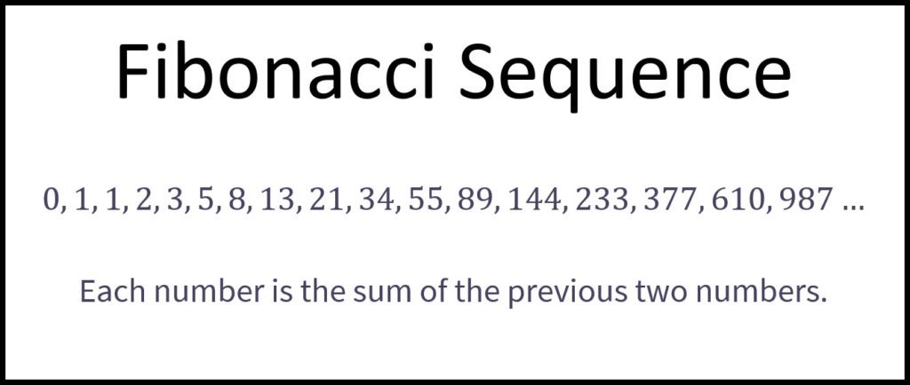
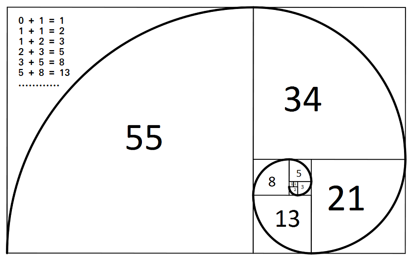
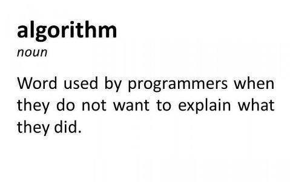
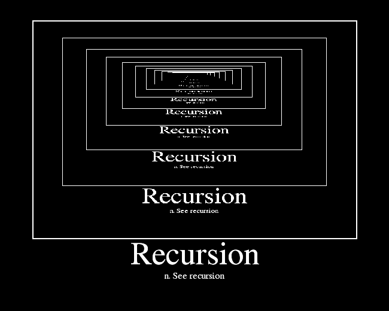

# 我们如何计算斐波那契数列，为什么知道它很重要？

对于那些不熟悉编程的人来说，它无疑会帮助您了解如何以及何时使用递归或迭代函数。

对于数学家来说，该序列可帮助他们从微分方程开始时更批判性地思考并发展其逻辑。
## 斐波那契的数学公式

斐波那契数列的工作方式是，序列中的每个数字都是其前两个数字的和。

对于n = 0，我们有F0 = 0，对于n = 1，我们有F1 = 1。 记住，我们总是有序列的前两个值。 我们的工作是弄清楚序列的其余部分是如何生成的以及我们要检查的n值的结果是什么。 所以我们总是从n> 1开始。

斐波那契数列的计算公式如下：

F0 = 0，F1 = 1

Fn = Fn-1 + Fn-2（n> 1时）


计算n = 6的斐波那契的步骤：

n = 0 => F0 = 0

n = 1 => F1 = 1

n = 2，而n> 1 => F2 = F2-1 + F2-2 = F1 + F0 = 1 + 0 = 1

n = 3 => F3 = F3-1 + F3-2 = F2 + F1 = 1 + 1 = 2

n = 4 => F4 = F4-1 + F4-2 = F3 + F2 = 2 + 1 = 3

n = 5 => F5 = F4 + F3 = 3 + 2 = 5

n = 6 => F6 = F5 + F4 = 5 + 3 = 8依此类推n> 1

那么，如果对斐波那契数进行平方会发生什么呢？

1，1，4，9，25，65，169，441，…

1 +1 + 4 = 6 = 2 x 3

1 +1 + 4 + 9 = 15 = 3 x 5

1 +1 +4 + 9 + 25 = 40 = 5 x 8

1 +1 +4 + 9 + 25 + 64 = 104 = 8 x 13…

结果不是斐波那契数，但它们被我们汇总在一起的值所掩盖。 这让我们开始思考：实际上，几乎每个和都是斐波那契数列的一部分。

让我们检查一下金色矩形，看看斐波那契数字是如何工作的。


我们都知道 ：

矩形的面积= b x h => b底和h高度

那么，如果我们将上述平方数相加会发生什么？

矩形的面积=1²+1²+2²+3²+5²+8²+13²= 273 = 13x21

再一次，我们有一些斐波那契数。

如果我们按顺序将较大的数字除以较小的数字，例如：

13/8 = 1.625,21 / 13 = 1.615,34 / 21 = 1.619，

55/34 = 1.6176,89 / 55 = 1.61818…

这也称为黄金分割率或1.618022。 所划分的数字越大，我们越接近黄金分割率的值。

这是一个计算斐波纳契数列的JavaScript代码。 时间复杂度是线性的，因为循环从2到n。 它运行时间为O（n）。
```
function fibonacci(n) {    var fibonacciNumbers = [],    firstNumber = 0,     secondNumber = 1;    if (n <= 0) {    return fibonacciNumbers;    }    if (n === 1) {        return fibonacciNumbers.push(firstNumber);    }    fibonacciNumbers[0] = firstNumber;    fibonacciNumbers[1] = secondNumber;    for (var i = 2; i <= n; i++) {       fibonacciNumbers[i] = fibonacciNumbers[(i — 1)] +           fibonacciNumbers[(i — 2)];   }     return fibonacciNumbers;}var result = fibonacci(3);     if(result){     for (var i = 0; i < result.length; i++) {          console.log(result[i]);    }}
```
# 那么究竟什么是算法？


首先，算法是解决问题需要遵循的一组任务。 算法的运行时间是完成这些任务所需的总步数（否则称为CS中的BigO表示法，它描述算法的性能）。

那么什么是递归，递归函数如何工作？

> Image by TORLEY on Flickr


递归是指某事在调用自己或将其描述为自引用之前，直到条件为真并停止。

递归函数是在执行过程中调用自身的函数，也称为直接递归。 与此相反的是，当两个函数相互调用时-称为间接递归。
# 斐波那契数列之美
## 基本但美观的算法

> Image by Gerd Altmann on Pixabay


在研究和进行有关数据处理，计算以及其他相关计算机或数学运算的研究时，我们遇到了很多算法。 即使有时候我们不太喜欢数学，但我们肯定还是被一些自然而然地整理出来的东西所包围，甚至都不知道。

最有趣的事情之一是弄清楚斐波那契数列如何工作。 这些序列在日常生活中经常出现：花朵上的花瓣数，向日葵上的螺旋数等。

> Image by Pxfuel


编码时，我们将使用许多不同的算法。 尽管有大量的递归，分而治之，随机化和蛮力算法，但最有用的算法之一就是递归算法。
