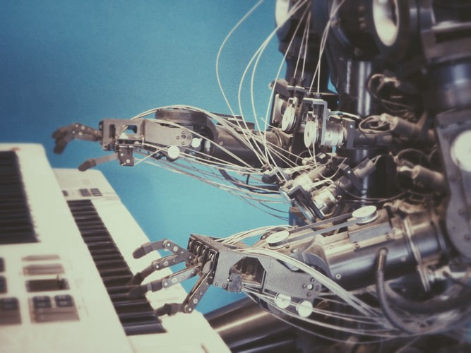

# AI，深度学习，机器学习和NLP之间的差异
## 简要介绍当今四种最重要的技术

> Image Source: UnSplash

随着人类技术的不断发展，人工智能，深度学习，机器学习和NLP都是受欢迎的搜索词。

但是这些先进技术是什么，它们又有何不同？
# 人工智能

> Image Source: UnSplash

人工智能是一种旨在模拟人类大脑思维的技术或计算机系统。

该术语是计算机科学的一个主要领域，涵盖了广泛的类别，包括自然语言处理，机器学习，深度学习，神经网络，内容抽象，决策等。

它最早是由达特茅斯大学的科学家约翰·麦卡锡（John McCarthy）于1956年创造的。

重要的是要记住，人工智能实际上是由数据馈送的算法组成的，其产生的结果或建议完全取决于数据输入。

数据偏差越大，输出偏差也越大。 反之亦然。 例如，亚马逊使用AI进行招聘的失败实验，由于其培训数据中的男性简历数量众多，因此产生的结果对女性有偏见。

或者，麻省理工学院（MIT）的诺曼（Norman）实验创建了一个玩世不恭的AI，该AI在从特定的redredit提要中获取数据后才“思考”死亡。
# 机器学习：

> Image Source: UnSplash

机器学习是AI的子集，它涉及“训练”机器以从数据集中“学习”，从而使他们能够得出见解并做出预测性决策。 它可以自动执行任务并查找模式或异常，从中学习并为下次创建新规则。

Andreessen Horowitz的Benedict Evans在他的博客中写道：

“机器学习使我们能够解决计算机以前无法有效解决的问题，但是每个问题都将需要不同的实现，不同的数据，不同的市场途径以及通常是不同的公司。”

它使我们能够大规模地自动化特定任务-如果可能的话，以前需要很多人。
# 深度学习：

深度学习是当前机器学习的最高级子集，因此是AI的子集，它旨在使机器尽可能接近人类的思维水平。

根据《麻省理工学院技术评论》的说法，“该软件通过创建人工神经网络，以非常真实的意义学习识别声音，图像和其他数据的数字表示形式中的模式”。

图像识别和语音识别技术属于深度学习。
# 自然语言处理（NLP）：

> Image Source: UnSplash

自然语言处理（NLP）是深度学习的一个元素，涉及翻译文本或人类的说话方式，以便计算机能够对其进行分类和理解。

NLP是数据丰富化的一个示例。 AI可以使用这项技术从一条数据中提取元素，例如，公司名称，日期，事件（例如，收购），链接和情感。

它还使AI能够分析其他形式的非结构化数据-从视频到搜索。

结合语义分析，NLP AI还可以查看上下文以确定句子或数据点的含义。

NLP的创新正在帮助我们以一种更类似于人类思维方式的语言来改进搜索。 结果，它有助于改善预测性搜索，在文本和电子邮件中建议单词或句子，实现语音识别，增强翻译功能等等。

AI Revolution正式在这里。 为了在我们进一步发展技术时保持竞争力，至关重要的是，每家公司都必须接受这项新技术并从上到下实施变革。

随着技术的不断发展，那些能够理解和谈论这些术语的人将发现自己处于优势。
