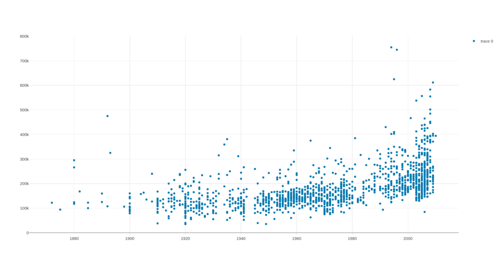
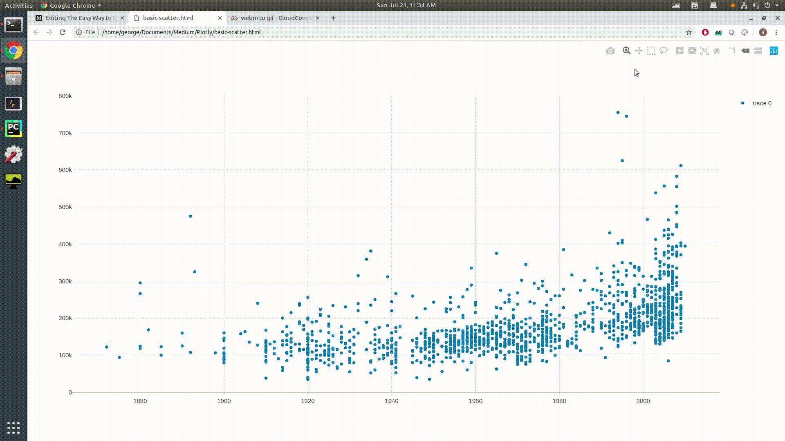
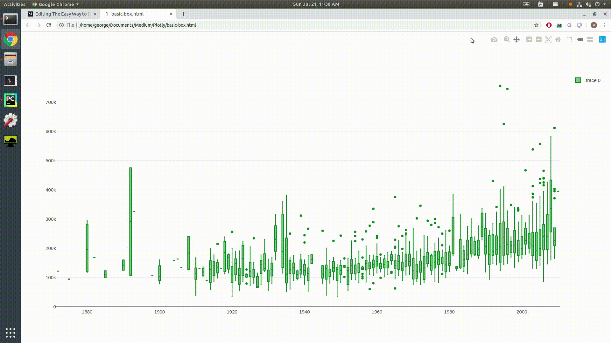
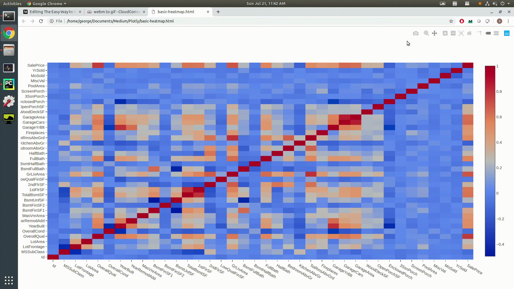

# 喜欢学习吗？

在Twitter上关注我，在其中发布有关最新，最出色的AI，技术和科学的所有信息！ 也在LinkedIn上与我联系！
# 推荐读物

想更多地了解数据科学？ 《 Python数据科学手册》一书是学习如何使用Python进行真正的数据科学的最佳资源！

提醒一下，我支持此博客，其中包含指向优秀书籍的亚马逊会员链接，因为共享优秀书籍对所有人都有帮助！ 作为亚马逊合作伙伴，我从符合条件的购买中赚钱。
# 为数据科学家提供高级数据可视化的简便方法

> Show off your data’s true colors!


创建有效的数据可视化是数据科学家可以拥有的最有价值的技能之一。

可视化不只是制作精美的图表，还使人们易于理解的方式传达数据集信息。 通过良好的可视化，可以最清楚地看到通常隐藏在数据中的模式和信息。

在项目的早期阶段，您通常会进行探索性数据分析（EDA），以获得对数据的一些见解。 创建可视化效果将帮助您加快分析速度。

在项目快要结束时，重要的是要以清晰，简洁，令人信服的方式呈现最终结果，以使听众（通常是非技术利益相关者）能够理解。

毫无疑问：将您的可视化效果提升到一个新的水平将使您的分析工作更加充实，并帮助您将下一个演示文稿带出公园。

本文将是有关如何轻松创建精美的高级数据可视化的教程！ 我们将使用plotly（一个Python库）来创建交互式可视化！
# 情节介绍

Plotly是用于Python的交互式，开源和基于浏览器的图形库！ 它建立在D3.js之上，使其可视化功能比标准Matplotlib更加广泛和灵活。

与其他能够进行绘图的Python库（例如Matplotlib，Seaborn和Pandas）相比，使用Plotly有2个主要优点。 这些是：

（1）易于使用-只需几行之遥即可创建交互式绘图，3D绘图和其他复杂图形。 在其他绘图库中做同样的事情需要做很多工作。

（2）更多功能-由于Plotly是从D3.js构建的，因此其绘图功能比其他绘图库要强大得多。 使用Plotly可以实现朝阳图，烛台图，地图等。 在此处查看完整列表。

我们可以使用一个pip命令安装Plotly：
```
pip install plotly==4.0.0
```

在本教程的其余部分，我们将创建可视化的房价数据集，您可以从Kaggle那里获取。
# 使用Plotly制作花式图

我们可以使用Plotly创建一些漂亮的情节！

首先，让我们导入plotly及其内部图形对象组件。 我们还将导入熊猫以加载数据集
```
import plotlyimport plotly.graph_objs as goimport pandas as pd
```

当然，在我们的数据集中阅读只是熊猫的一线话：
```
data = pd.read_csv('train.csv')
```
# 散点图

在本练习中，我们将在散点图中绘制销售价格与建造年份的关系。 为此，我们将创建一个散点图散点图对象，并将其放入跟踪中。
```
trace = go.Scatter(    x = data['YearBuilt'],    y = data['SalePrice'],    mode = 'markers',    showlegend = True)plot_data = [trace]
```

然后，绘图仅需一行！
```
plotly.offline.plot(plot_data, filename='basic-scatter')
```

上面的命令将在您的浏览器中打开一个带有图表的新选项卡。


还没有幻想...。 但是等你！

图形交互功能是Plotly自动内置的。 看看下面的gif图片，看看它能做什么！ 所有命令都在浏览器的右上方：
+ 将鼠标悬停在每个点上会显示该点的x-y坐标
+ 您可以放大数据的特定框
+ 您可以使用方框或套索选择并突出显示某些点
+ 您可以平移整个情节以更好地了解事物
+ 您可以将绘图作为图像文件下载！

# 箱形图

这次，我们将进行箱形图绘制。

过程大致相同。 我们将创建一个图形对象，将其放入轨迹中，然后在浏览器中进行绘制：
```
import plotlyimport plotly.graph_objs as goimport pandas as pddata = pd.read_csv('train.csv')trace = go.Box(    x = data['YearBuilt'],    y = data['SalePrice'],    marker = {'color': 'green'},    showlegend = True,)plot_data = [trace]plotly.offline.plot(plot_data, filename='basic-box')
```

查看下面的gif，以查看一些带有箱形图的精美Plotly功能！

默认情况下，我们获得相同的平移，缩放和点选择。 由于我们现在有一个箱形图，将鼠标悬停在每个箱形上将显示：
+ 中位数
+ 第一和第三四分位数
+ 数据范围的最小值和最大值
+ 上围栏和/或下围栏（如果有异常值）

# 热图

热图是任何出色的数据科学家工具箱中的另一个强大工具。 它们对于在一张图中显示多个要素变量之间的关系以及每种关系的相对重要性特别有效。

为了真正展示如何通过使用Plotly来增强您的热图，我们将绘制房屋数据集的相关矩阵作为热图。 绘制数据集的相关矩阵是一种快速简便的方法，可以概述特征变量如何影响目标。

对于plotly，我们将x和y设置为列的名称，将z设置为矩阵中的值。

在浏览器中绘制所有内容，再次是在公园散步。
```
import plotlyimport plotly.graph_objs as goimport pandas as pddata = pd.read_csv('train.csv')corrmat = data.corr()trace = go.Heatmap(z=corrmat, x=corrmat.columns.tolist(), y=corrmat.columns.tolist())plot_data = [trace]plotly.offline.plot(plot_data, filename='basic-heatmap')
```

Matplotlib中的热图可能有点棘手，因为您看不到每个单元格的确切值-您只能从颜色中分辨出某种类型。 您可以编写代码使其具有交互性，但这在Matplotlib中颇为麻烦。

Plotly提供了开箱即用的交互性，因此当我们绘制热图时，我们会得到一个很好的直观概览，但是如果需要，还可以选择检查确切的值。 Plotly的全景和缩放功能也非常干净，从视觉的角度来看，这是一种进行更详细探索的简便方法！

```
(本文翻译自George Seif的文章《The Easy Way to Do Advanced Data Visualisation for Data Scientists》，参考：https://towardsdatascience.com/the-easy-way-to-do-advanced-data-visualisation-for-data-scientists-bbc852e26fb6)
```
