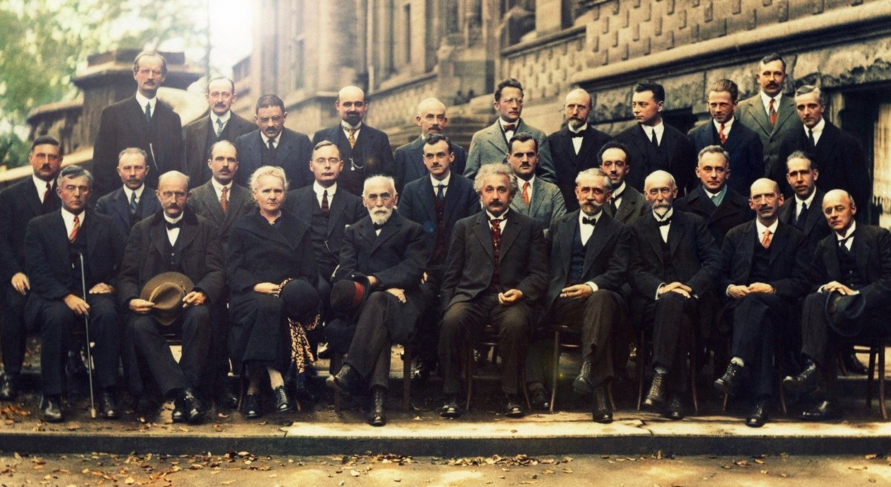
> The remarkable group photograph from the Fifth Solvay International Conference on Electrons and Photons in 1927 (Colorized by Marina Amaral)

## 量子理论史
# 量子物理学的黄金时代
## 第五届索尔维国际电子和光子会议（1927）

有时被称为“有史以来最聪明的照片”是在1927年在比利时布鲁塞尔举行的第五届索尔维国际电子和光子会议上拍摄的。 这张照片之所以著名，是因为它是在量子物理学的不确定性本质下被称为“世纪之争”的中段而拍摄的。 出席会议的是著名的许多人，他们在设计理论时起了重要作用，这些理论现在被认为是现代物理学的核心。

在目前的辩论中，有一方面是新引入的量子力学范式的创始者，包括沃纳·海森堡本人，还有他的合作者沃尔夫冈·波利，麦克斯·伯恩，亨德里克·克拉默斯，埃米尔·德布罗意，埃米尔·德布罗意，尼尔斯·玻尔和保罗·狄拉克 。 另一方面，古典，确定性范式的支持者也出席了会议，其中以阿尔伯特·爱因斯坦本人，马克斯·普朗克，保罗·埃伦费斯特和欧文·施罗丁格最为突出。 在这次会议的29位参加者中，有17位已经或将继续获得诺贝尔物理学或化学奖。 其中还包括已经获得两项冠军的居里夫人。
```
Nobel Laureates in PhysicsHendrik Lorentz (1902) Marie Curie (1903) Lawrence Bragg (1915) Max Planck (1918) Albert Einstein (1921) Niels Bohr (1922) Arthur Compton (1927) C.T.R. Wilson (1927) Owen Richardson (1928) Louis de Broglie (1929) Werner Heisenberg (1932) Paul Dirac (1933) Erwin Schrödinger (1933) Wolfgang Pauli (1945)Max Born (1954)Nobel Laureates in ChemistryMarie Curie (1911)Irving Langmuir (1932)Peter Debye (1936)
```
# 第五届索尔维国际会议（1927）

第五届苏威国际电子和光子会议于1927年10月在比利时布鲁塞尔举行。 自1911年成功举行就职大会以来，索尔维聚会一直致力于解决物理领域杰出的杰出开放问题，大约每三年举行一次。 从1913年到1961年，每一次聚会都是围绕量子理论中的开放性问题展开的。

会议由亨德里克·洛伦兹（Hendrik Lorentz）主持，于1927年举行，会议的正式主题是“光子和电子”。 实际上，1927年的会议围绕着两个新兴的物理学流派之间日益增长的争议展开讨论：被海森堡引入的新量子力学所迷住和迷住的，以及仍然坚持被取代的确定性范式的那些。 前者由尼尔斯·波尔（Niels Bohr）领导，后者由阿尔伯特·爱因斯坦（Albert Einstein）领导。

本文通过上面这张引人注目的照片的镜头叙述了所谓的“量子物理学的黄金时代”的起源，突出了其在1927年第五届索尔维会议期间最有影响力的主角及其观点。预计阅读时间为17 分钟。
# 后排
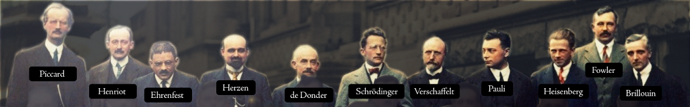
> Left to Right: Auguste Piccard, Émile Henriot, Paul Ehrenfest, Édouard Herzen, Théophile de Donder, Erwin Schrödinger, J. E. Verschaffelt, Wolfgang Pauli, Werner Heisenberg, Ralph Fowler, Léon Brillouin


从后排的左侧开始，除了一些鲜为人知的面孔外，我们还看到了一些熟悉的面孔。 例如，奥古斯特·皮卡德（Auguste Piccard，1884–1962年），我们以瑞士物理学家，发明家和探险家而闻名，他以大胆，破纪录的充氦气球飞行以及发明了第一艘深水船而闻名，他曾经进行无人潜水 最早是在1948年探索海洋的深处。埃里·亨里欧（ÉmileHenriot，1885-1961年）是玛丽·居里（Marie Curie）的学生，是法国的化学家，首先发现钾和rub是天然放射性物质。 爱因斯坦的著名亲密私人朋友，荷兰-奥地利物理学家保罗·埃伦费斯特（Paul Ehrenfest，1880–1933年），其博士生是路德维希·博尔兹曼（Ludwig Boltzmann），他对统计力学及其与量子力学的关系（包括量子力学）做出了重要贡献。 相变。

继续往右走，我们发现比利时化学家ÉdouardHerzen（1877–1936）与工业家Ernest Solvay合作，后者于1911年开始了该会议。Jules-ÉmileVerschaffelt（1870-1955）和de Donder（1872-1957）都是比利时人物理学家，后者以牛顿化学亲和力概念与吉布斯自由能概念之间的相关性发展而闻名。拉尔夫·福勒（Ralph Fowler，1889–1944年）是来自剑桥的英国物理学家和天文学家，也许最著名的是与狄拉克（Dirac）监督和合作研究白矮星的统计力学，并将狄拉克（Dirac）引入量子理论并使狄拉克（Dirac）和海森堡（Heisenberg）与通过Niels Bohr彼此交流（所有三个人也出席了会议）。里昂·布里渊（Leon Brillouin，1889–1969年）是法国物理学家，他在论文发表前发表了关于固体量子理论的论文，并在会议的前一年与格雷戈尔·温策尔（Gregor Wentzel，1898–1978年）和亨德里克·克拉默斯（Hendrik Kramers，1894–1952年）独立发展了作为Wentzel-Kramers-Brillouin近似，用于找到具有空间变化系数的线性微分方程的解。

除了这些才华横溢的人，就我们的故事而言，后排还列出了三个姓氏：
+ 维尔纳·海森堡（1901-1976年）
+ 沃尔夫冈·保利（Wolfgang Pauli，1900-1958年）
+ 埃德温·薛定er（1887–1961）
## 维尔纳·海森堡

现年26岁的德国物理学家维尔纳·海森堡（Werner Heisenberg）就是他在1925年突破性论文《量子力学和机械关系的量子理论重新解释》（Uber dequantumenoretische Umdeutung kinematischer und mechanischer Beziehungen）奠定了矩阵力学的基础，这是第一个概念上自主的 以及量子力学在逻辑上一致的表述。

据报道，海森堡与沃尔夫冈·波利（Wolfgang Pauli）的往来书信一直在花粉病恢复期间进行研究。 本文的目的是尝试通过诸如量子跃迁的跃迁概率之类的可观察参数来描述一维非谐振荡器的能级（Segrè，1980）。 海森堡于1925年7月将该论文发送给了马克斯·伯恩（Max Born），以进行审查并决定是否应将其提交发表。 他于1925年8月这样做，该论文于同年9月在ZeitschriftfürPhysik上发表。

> Left: Werner Heisenberg (1901–1976). Right: Heisenberg’s 1927 paper Über den anschaulichen Inhalt der quantentheoretischen Kinematik und Mechanik (“On the Descriptive Content of Quantum Kinematics and Mechanics”) where he introduced the now famous Heisenberg Uncertainty Principle.


两年后的2月，海森堡发表了他的下一篇革命性论文《量子运动学和力学的描述性内容》，在那里以草稿形式介绍了海森堡不确定性原理。 据报道，他向尼尔斯·玻尔（Niels Bohr）询问是否将其转发给爱因斯坦（美国物理研究所，1998）进行审查，玻尔也这样做了。

“即使从原则上讲，我们也无法完全了解现在。 因此，观察到的一切都是从众多可能性和对未来可能性的限制中选择的……。 确定的位置越精确，在此刻就知道的动量就越少，反之亦然。” —海森堡（1927年）

海森堡的不确定性原理主要由数学上的不等式组成，这些不等式著名地断言，对某些特定物理对粒子的精确性存在根本的限制。 结合他对矩阵力学的介绍，该出版物帮助海森堡获得了1932年诺贝尔物理学奖。

“量子力学的创造” —诺贝尔委员会（1932年）
## 沃尔夫冈·波利

在海森堡（Heisenberg）于1925年发表介绍现代量子力学矩阵论的论文之后不久，他的合作者，出生于奥地利的沃尔夫冈·保利（Wolfgang Pauli）在他的论文Überdas Wasserstoffspektktrum vom Standpunkt der neuen Quantenmechanik（“ 从新的量子力学的角度看氢谱”，因此为海森堡理论提供了第一个验证。 正如Pauli在论文摘要中解释的那样：

“证明了具有单个电子的原子的巴尔默项可以通过新的量子力学正确产生，并且旧理论中出现的困难……在新理论中消失了。”

> Left: Wolfgang Pauli (1900–1958). Right: Pauli’s 1926 paper Über das Wasserstoffspektrum vom Standpunkt der neuen Quantenmechanik (“On the Hydrogen Spectrum from the Standpoint of the new Quantum Mechanics”) where he used Heisenberg’s matrix theory of quantum mechanics to derive the observed spectrum of the hydrogen atom


关于这项工作，马克斯·伯恩（Max Born）稍后会说，从保利的计算发表之时起，“物理学家对理论（指量子力学）的正确性不再有任何疑问”（Born，1956年）。
## 欧文·薛定er

到1927年会议召开时，传奇的奥地利物理学家ErwinSchrödinger已有40岁，并已成为正式教授六年，首先是弗罗茨瓦夫大学，然后是苏黎世大学。 会议召开时，他最近接替了马克斯·普朗克（Max Planck）柏林弗里德里希·威廉大学（Friedrich Wilhelm University）的职位。

现在，薛定er这个名字也许是最著名的，因为他后来提出了流行的量子力学思想实验“薛定ding的猫”。 然而，他对物理学的最重要贡献是在1926年发表了他的论文Quantisierung als Eigenwertproblem（“量化为特征值问题”），其中Schrödinger引入了所谓的Schrödinger方程，该方程描述了量子力学系统的波函数。 ，从而为后来的波动力学奠定了基础。

> Time-dependent Schrödinger equation where i is the imaginary unit, ħ is the reduced Planck constant, Ψ is the state vector of the quantum system, t is time and H is the Hamiltonian operator


Schrödinger将与Paul Dirac一起获得“ 1933年诺贝尔物理学奖”，以表彰他们“发现了原子理论的新生产形式”。
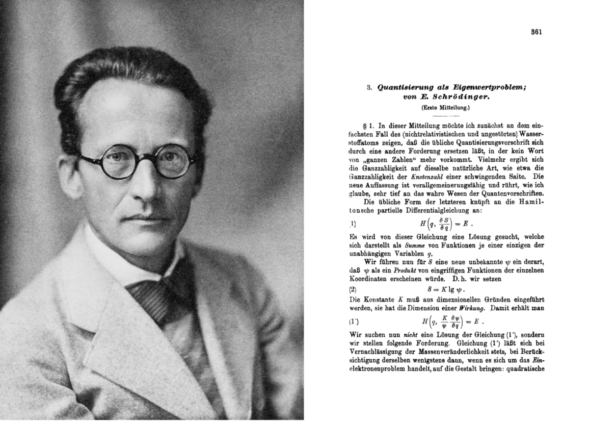
> Left: Erwin Schrödinger (1887–1961). Right: Schrödinger’s 1926 paper Quantisierung als Eigenwertproblem (“Quantization as an Eigenvalue Problem”) where he presented what is now known as the Schrödinger equation


著名的是，尽管薛定mechanic在量子力学的基础上发挥了重要作用，但他对它的含义从未完全感到满意，后来写道：“我不喜欢它，对不起，我与它有任何关系”。 他对薛定ding的猫的主张实际上是在嘲笑他所帮助创造的物理学的非确定性观点的含义。
# 中排
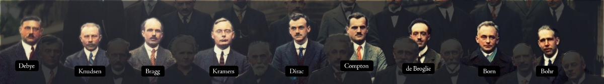
> Left to Right: Peter Debye, Martin Knudsen, William Lawrence Bragg, Hendrik Anthony Kramers, Paul Dirac, Arthur Compton, Louis de Broglie, Max Born, Niels Bohr


继续到中间行，再从左边我们可以看到另一位诺贝尔奖获得者，荷兰化学家彼得·德拜（Peter Debye，1884–1966），他因将偶极矩概念应用于不对称分子的电荷分布而闻名。在他的左手边，我们看到以研究分子气体流动和Knudsen细胞的发展而闻名的丹麦物理学家Martin Knudsen（1871-1949）和英国物理学家Lawrence Bragg（1890-1971）率先开发x-射线晶体学家和1915年诺贝尔奖获得者。美国物理学家亚瑟·康普顿（1892–1962），也是狄拉克旁边的1927年诺贝尔奖获得者，他因发现康普顿效应（证明电磁辐射的粒子性质）以及后来对曼哈顿计划的贡献而闻名。保罗·兰格文（Paul Langevin）（前排）的学生路易斯·德布罗意（Louis de Broglie，1892-1987年）也在那里。德布罗意（de Broglie）是第一个（在他的1924年博士学位论文中）假设电子的波性质并暗示所有物质都具有波性质的人。现在被称为“德布罗意假设”，这是德布罗意的想法，薛定ding将其用于波浪力学的表述。戴维森-杰默（Davisson-Germer）实验于1927年进行了实验验证后，德布罗意（De Broglie）于1929年获得了诺贝尔物理学奖。

除了这些才华横溢的人之外，我们再次将注意力集中在少数几个在早期量子理论的阐述中特别杰出的人。 其中
+ 尼尔斯·玻尔（Niels Bohr，1885-1962年）
+ 亨德里克·克莱默斯（1894–1952）
+ 马克斯·伯恩（1882–1970）
+ 保罗·狄拉克（Paul Dirac）（1902–1984）
## 尼尔斯·波尔（Niels Bohr）

尼尔斯·玻尔（Niels Bohr）在会议时享年42岁，他当然是丹麦物理学家，以他（和欧内斯特·卢瑟福（Ernest Rutherford's））于1913年提出的原子玻尔模型的提出而闻名，该模型提出电子的能级是离散的，并且 电子在原子核周围以稳定的轨道旋转，但可以从一个能级（轨道）跳到另一个能级。 该模型赢得了玻尔1922年的诺贝尔物理学奖。在30年代，他在帮助难民逃脱纳粹主义方面发挥了重要作用。 丹麦被德国人占领之后，他亲自游说海森堡（当时是德国核武器计划的负责人），以谈论核战争的影响（对话的确切内容各不相同）。 他还是英国对曼哈顿项目的访问的一部分，后来参与了在日内瓦建立欧洲核子研究组织的工作。
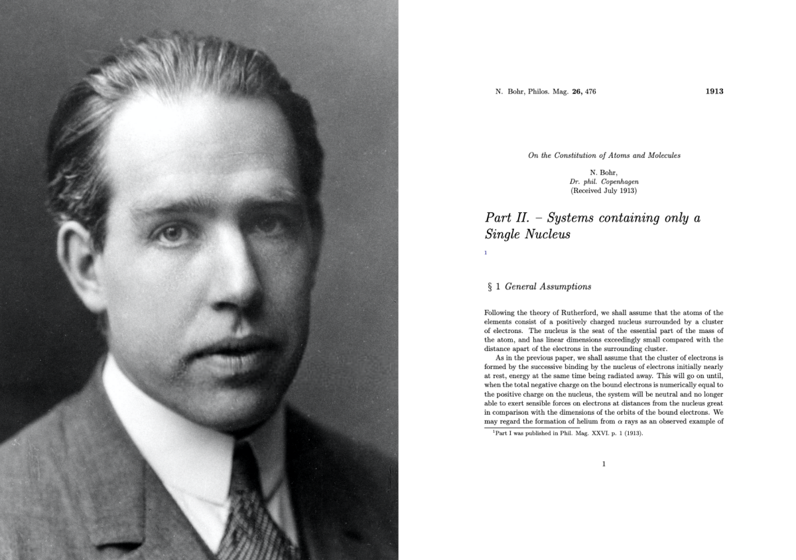
> Left: Niels Bohr (1885–1962). Right: Bohr’s 1913 paper On the Constitution of Atoms and Molecules, Part II Systems Containing Only a Single Nucleus, where Bohr introduced what is now known as the Bohr model of the atom.


会议之前，海森堡一直在哥本哈根大学玻尔理论物理研究所担任讲师。 玻尔已将海森堡的论文介绍给爱因斯坦介绍不确定性原理。 在会议期间，玻尔领导辩护，通过对爱因斯坦的批评来捍卫海森堡的工作含义，爱因斯坦通过现在著名的“狭缝实验”说明了他的批评：
```
Thought Experiment: The Slit ExperimentConsider a particle passing through a slit of width d. The slit introduces uncertainty in momentum of approximately h/d because the particle passes through the wall. But, let us determine the momentum of the particle by measuring the recoil of the wall. In doing so, we find the momentum of the particle to arbitrary accuracy by conservation of momentum.
```

玻尔的优雅反应很简单：他辩称，光子穿过的壁确实也是量子力学系统。 因此，为了将壁的反冲力测量到Δp的精度，还必须在粒子通过之前以该精度知道壁的动量。 暗示是，在这种精确度下，壁的位置实际上也不确定，就像通过它的粒子一样。 因此，狭缝的位置等于h /Δp，如果根据海森堡的不确定性原理，精确知道墙的动量足以测量后坐力，则狭缝的位置将具有足够的不确定性以至于无法测量其位置。

玻尔在辩论中的胜利以及他与哥本哈根大学海森堡的密切关系导致以海森堡，玻尔，博恩等人为首的非确定性观点被口头命名为量子物理学的“哥本哈根解释”。
## 亨德里克·克拉默斯

居中排的还有荷兰物理学家亨德里克·克莱默斯（Hendrik Kramers，1894-1952年），他曾在哥本哈根的玻尔（Bohr）担任博士学位。 候选人，后来在莱顿的埃伦费斯特。 在海森堡在1925年提出量子力学之前，克雷默斯与他一起研究了所谓的克雷默斯-海森堡色散公式，该公式表示电子散射光子的横截面，这对于建立海森堡1926年的结果至关重要 。
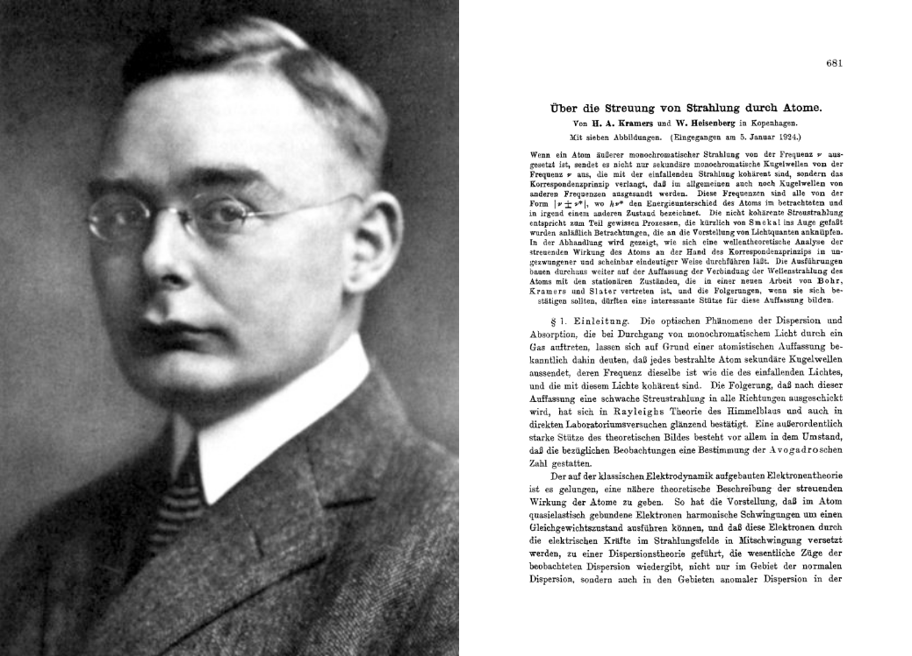
> Left: Hendrik “Hans” A. Kramers (1894–1952). Right: Kramers’ 1925 co-authored paper with Heisenberg Über die Streuung von Strahlung durch Atome (“On the Scattering of Radiation by Atoms”) which introduces the Kramers-Heisenberg dispersion formula

## 保罗·狄拉克

到目前为止，其中一位知名物理学家是保罗·狄拉克（Paul Dirac），当时25岁，是剑桥大学拉尔夫·福勒（Ralph Fowler）（后排）的研究员。 前一年，他以有关海森堡量子力学的第一篇论文完成了博士学位。
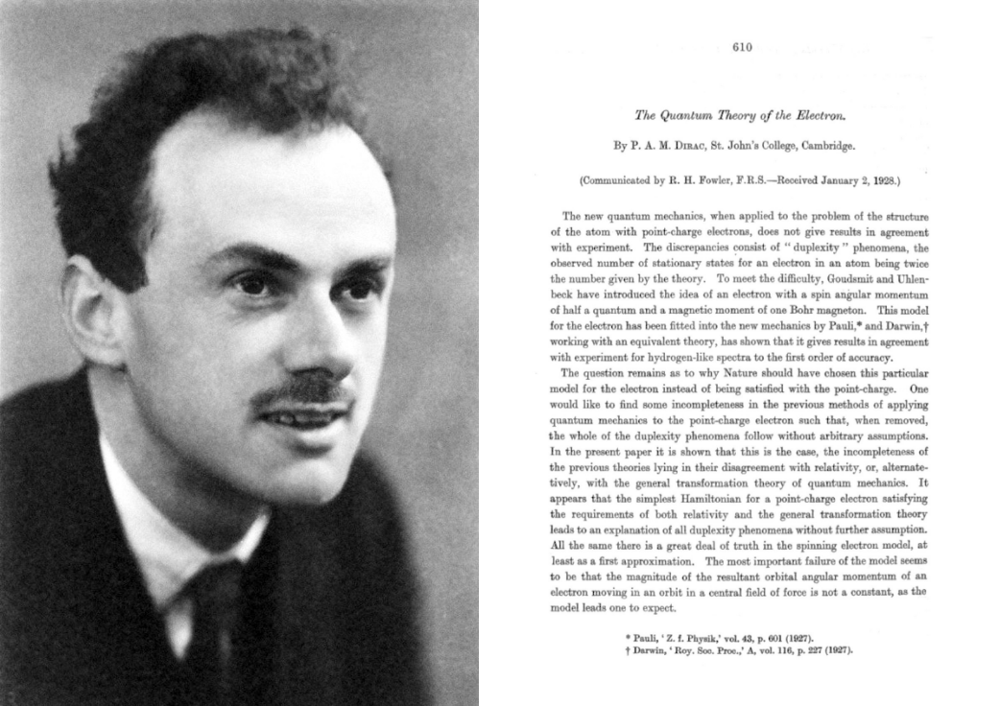
> Left: Paul Dirac (1902–1984). Right: Dirac’s 1928 paper The Quantum Theory of the Electron in which he introduced the Dirac equation as a relativistic equation of motion for the wave function of the electron


Dirac的贡献使他获得了博士学位。发生在1925年。他的上司（Fowler）收到了海森堡论文的证明副本，他在其中首次介绍了矩阵力学，并将其交给狄拉克供他检查。狄拉克注意到了一种奇怪的数学关系，他后来意识到与经典的粒子运动动力学中的泊松括号具有相同的结构。这种认识导致他引入了基于非交换动态变量的量子理论，这使他获得了新颖而有启发性的量化规则（从经典的物理学理解为量子理解的过程），即所谓的规范量化程序。他的规则结合了海森堡矩阵力学和薛定ding波浪力学的思想，并表明它们实际上是等效的。正如他的仰慕者和剑桥大学卢卡斯数学系资深教授一样，斯蒂芬·霍金（Stephen Hawking）后来写道：“在现代量子力学的三位创始人中，海森堡和薛定claim可以声称对理论有了初见。但这是狄拉克（Dirac）将它们放在一起并揭示出整个图景。”

索尔维会议召开一年后，狄拉克（Dirac）独立于保利（Pauli），发现了现在称为狄拉克方程（Dirac equation），该方程描述了所有奇偶性都是对称的自旋½质量粒子，例如电子和夸克。 该发现是第一个暗示存在反物质的发现，仅在几年后通过实验证实了这一点。 狄拉克将继续与Schrödinger分享1933年诺贝尔物理学奖，“以发现原子理论的新生产形式”。
## 马克斯·伯恩

最后，在中间一排，我们还发现了德国物理学家和数学家马克斯·伯恩（Max Born，1882-1970年），尽管他不像海森堡那样出名，但在矩阵力学的发展以及后来使用的概率密度函数的制定方面发挥了重要作用 由ErwinSchrödinger在Schrödinger方程中得出。

会议的前一年，正是鲍恩在回应海森堡1925年的出版物时提出，量子力学最好由概率来理解。 现在简单地称为“伯恩法则”（Born Rule），给出了量子系统上的测量将产生给定结果的可能性。 它是Born于1926年在Zur Quantenmechanik derStoßvorgänge（“碰撞的量子力学”）中首次提出的。 在本文中，Born解决了散射问题的Schrödinger方程（假设一年前）。 现在，该规则被认为是量子力学的基本定律。
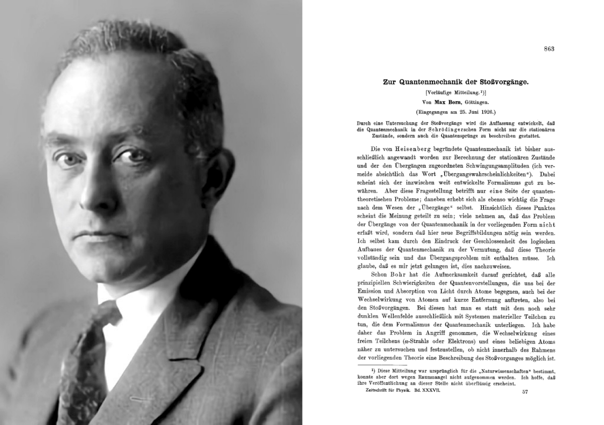
> Left: Max Born (1882–1970). Right: Born’s 1926 paper Zur Quantenmechanik der Stoßvorgänge (“On the Quantum Mechanics of Collisions”) where he defines what is now known as the Born rule.


到1927年10月的会议召开时，博恩和海森堡对他们的结果非常有信心，以至于他们宣称量子力学“是完整且不可撤销的”：
```
While we consider.. a quantum mechanical treatment of the electromagnetic field.. as not yet finished, we consider quantum mechanics to be a closed theory, whose fundamental physical and mathematical assumptions are no longer susceptible of any modification.. On the question of the 'validity of the law of causality' we have this opinion: as long as one takes into account only experiments that lie in the domain of our currently acquired physical and quantum mechanical experience, the assumption of indeterminism in principle, here taken as fundamental, agrees with experience.- Born & Heisenberg (1927). "Quantum Mechanics". Proceedings of the Fifth Solvay Congress
```
# 前排
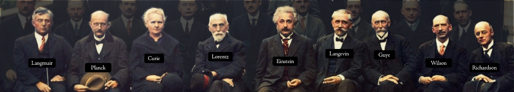
> Left to Right: Irving Langmuir, Max Planck, Marie Curie, Hendrik Lorentz, Albert Einstein, Paul Langevin, Charles-Eugène Guye, C. T. R. Wilson, Owen Richardson


最后，照片的前排主要由（当时）年龄较大的物理学家控制，其中一些人从事量子物理学工作，而有些人则没有。

居里夫人玛丽（1896-1934）是会议上唯一一位在物理学（1903年）和化学（1911年）上均获得诺贝尔奖的人，从未从事过量子理论研究。 相反，她在放射性的性质和特性以及发现镭和po元素以及成功地隔离和研究前者的特性方面做了巨大的工作。 同样，会议主席亨德里克·洛伦兹（Hendrik Lorentz，1853年至1928年），尽管他在1926年曾在康奈尔大学（Cornell University）进行过有关量子物理学的系列讲座，但他本人从未发表过有关该主题的研究。

欧文·兰格缪尔（Irving Langmuir，1881-1957年）是美国化学家兼物理学家，他因在表面化学领域的研究而获得1932年诺贝尔奖。现在，法国物理学家保罗·兰格文（Paul Langevin）（1872-1946）以其兰格文动力学和兰格文方程的发展以及路易斯·德布罗意（Louis de Broglie）和莱昂·布里渊（LéonBrillouin）的主管而闻名。瑞士物理学家查尔斯·尤金·居伊（Charles-EugéneGuye，1866–1942年）在他的左边，是爱因斯坦在苏黎世联邦理工学院（ETH ETH）的老师之一，他的实验结果是第一个支持洛伦兹和爱因斯坦关于狭义相对论的预测的人之一。苏格兰的查尔斯·汤姆森·里斯·威尔逊（Charles Thomson Rees Wilson，1869年至1959年）是物理学家和气象学家，他因获得了当年的诺贝尔奖而获奖，他发明了所谓的云室，这是一种用于可视化电离通道的粒子探测器。辐射。次年，诺贝尔奖授予威尔逊左翼的人欧文·理查森（Owen Richardson，1879-1959年），他是英国物理学家，以在热电子发射和理查森定律的推导方面的工作而闻名。

但是，在我们的辩论中，最重要的是，最前面的是两名年长的男人：
+ 马克斯·普朗克（1858–1947）
+ 阿尔伯特·爱因斯坦（1879–1955）
## 马克斯·普朗克

较老的普朗克在建立量子物理学中起着至关重要的早期作用，他于1900年提出了著名的普朗克黑体辐射定律或简称普朗克定律。 爱因斯坦（Einstein）和薛定er（Schrödinger）后来在其诺贝尔奖获奖论文中使用了普朗克定律，描述了黑体在热平衡状态下发出的电磁辐射的光谱密度。
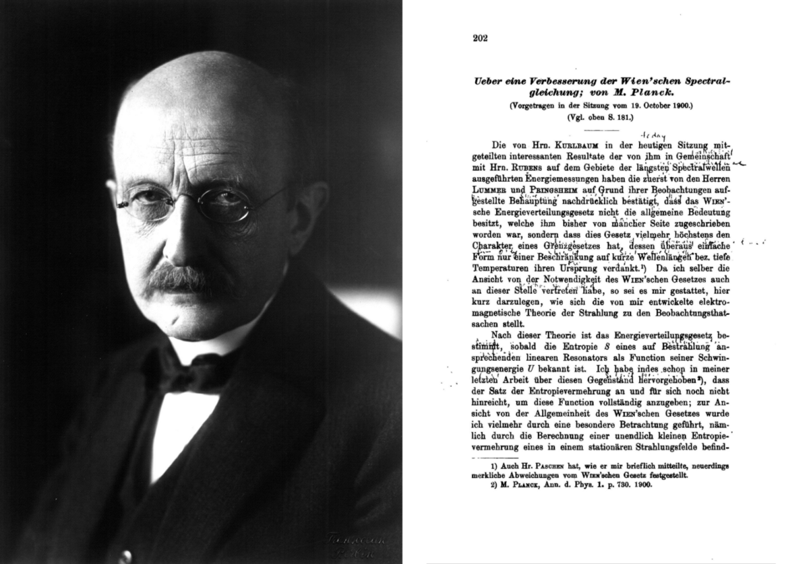
> Left: Max Planck (1858–1947). Right: The first of two papers by Planck in 1900, Über eine Verbesserung der Wienschen Spektralgleichung (“On an Improvement of Wien’s Equation of the Spectrum”) in which he first proposed Planck’s law of black-body radiation


普朗克因其在量子理论上的早期工作而获得了1918年诺贝尔物理学奖，但他拒绝了海森堡和伯恩的量子力学，并期望薛定er的波动力学很快会使量子力学变得不必要。
```
"He was, by nature, a conservative mind; he had nothing of the revolutionary and was thoroughly skeptical about speculations. Yet his belief in the compelling force of logical reasoning from facts was so strong that he did not flinch from announcing the most revolutionary idea which ever has shaken physics."- Max Born about Planck
```
## 艾尔伯特爱因斯坦

最后，当然，在前面坐着爱因斯坦（1879–1955）。 在这一年48岁的时候，爱因斯坦通过引入特别和广义相对论，质量能等价物以及光电效应的性质等方法，对物理学进行了多次革命。 他早在1921年就已经获得诺贝尔奖，但是在海森堡（Heisenberg）在1925年发表的介绍矩阵力学的论文之后，就对现代物理学的发展方向感到不满。 坚定的决定论者，他的名言

无论如何，我深信他不玩骰子。 —爱因斯坦

是在苏威会议期间与玻尔对峙时制作的。 两人对该主题的著名和公开辩论一直持续到1935年发表了所谓的《爱因斯坦-波多尔斯基-罗森》（Einstein-Podolsky-Rosen）论文，题为《对物理现实的量子力学描述》可以被认为是完整的吗？

> Left: Albert Einstein (1879–1955). Right: Einstein’s 1905 paper Über einen die Erzeugung und Verwandlung des Lichtes betreffenden heuristischen Gesichttspunkt (“On a Heuristic Viewpoint Concerning the Production and Transformation of Light”) which first proposed the idea of energy quanta


会议一年后，尽管有分歧，但爱因斯坦还是提名海森堡和博恩获得诺贝尔奖。 后来他还提名沃尔夫冈·保利（Wolfgang Pauli）（1945年）。 爱因斯坦秘书海伦·杜卡斯（Helen Dukas）后来表示，尽管他们很少见面或交流非常频繁，但爱因斯坦和玻尔仍然相互钦佩。

“他们热烈而深爱着彼此”
# 视频

令人难以置信的是，有1 Irving Langmuir的助手拍摄的1927年索尔维会议的视频，以下是Nancy Thorndike Greenspan的评论。 在近3分钟的无声电影中，可以看到会议的29位参与者中有21位在会议过程中进行了交谈。 评论文字记录如下。
```
Transcript of Langmuir film from the 1927 Solvay Conference[00:06] The film opens with quick shots of Erwin Schrödinger and Niels Bohr. August Piccard at the University of Brussels follows, and then the camera refocuses on Schrödinger and Bohr.[00:18] Erwin Schrödinger and Niels Bohr followed by Piccard. Schrödinger who developed wave mechanics never agreed with Bohr and quantum mechanics, nor with Werner Heisenberg's uncertainty principle. Solvay gave Heisenberg an opportunity to discuss his new theory.[00:35] Here's French physicist Léon Brillouin, Hendrik Kramers (Bohr's former assistant) and Paul Dirac talking with Max Born whose statistical interpretation of the wave function ended determinism in the atomic world. These men (Bohr, Heisenberg, Kramers, Dirac and Born) together with Wolfgang Pauli represent the founding fathers of quantum mechanics. On the other hand is Louis de Broglie, who wrote his dissertation on the wave nature of matter which Schrödinger used as the basis for wave mechanics.[01:09] The owner of the camera, Irving Langmuir is seen chatting with briefly with Bohr. At Solvay, Bohr refined his thoughts on complementarity and sparred with Einstein over the implications. Here he is with Paul Ehrenfest. Kramers' work in Copenhagen on dispersion theory was essential to the development of quantum mechanics. Langmuir, an American chemist at the GE Lab in Schenectady (hence the camera) had recently broken his leg and appears to explain to Ehrenfest how he gets around. [01:42] By 1927, Dirac (in the middle) had independently developed quantum mechanics and made other significant contributions, as had Wolfgang Pauli who formulated the exclusion principle. A lively Madame Curie. Born and Pauli working out a problem. [02:06] Note the changed demeanor as the participants exit from the meeting. Except for the smiling William Lawrence Bragg and Peter Debye. Arthur Holly Compton, Owen Richardson, Max Born, Madame Curie, Hendrik Kramers, H.A. Lorentz, Paul Langevin. Albert Einstein, whose famous response to Born and the statistical interpretation of the wave function was "God does not play dice". [02:37] Bohr, Planck, Pauli and Belgian soldiers. A pretentious conclusion.
```

鼓励那些有兴趣阅读更多关于爱因斯坦与玻尔之间的“世纪辩论”的人阅读《玻尔-爱因斯坦辩论》一文。
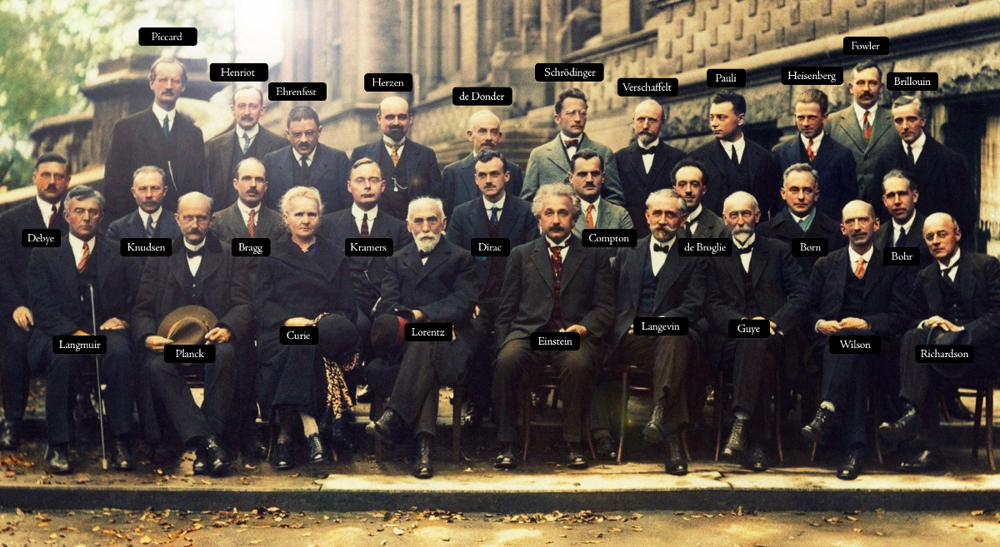

本文是每周发表在Cantor’s Paradise上的一系列与数学相关的故事的一部分。 感谢您的阅读！
```
(本文翻译自Jørgen Veisdal的文章《The Golden Age of Quantum Physics》，参考：https://medium.com/cantors-paradise/the-golden-age-of-quantum-physics-9a3ddac68413)
```
