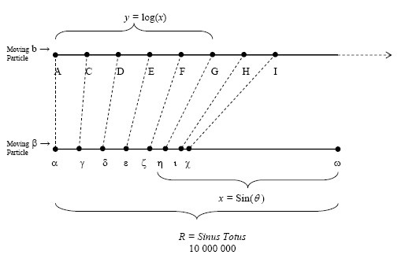

# 欧拉数的历史（e）
## 从纳皮尔表（Napier Table）到伯努利（Bernoulli）的复利


在数学中，有一些横贯所有分支的精选魔术常数。 在我们的集体历史中不断发现的这些常数为我们的日常生活提供了数字基础。 像周期表中的化学元素一样，数学中的特殊常数也是基础。 仅举几例，我们有零（0），圆周亲爱的pi（〜3.142），负一的平方根（i），当然还有指数国王，欧拉常数“ e”（〜2.718）。

正如标题所明确指出的那样，本文的重点是深入研究“欧拉数”（也称为“纳皮尔数”），或更常见的词是e。 对于初学者来说，数字e处于指数关系的关键，特别是与任何具有持续增长的事物有关。

就像每个数字都可以视为1（基本单位）的缩放版本和每个圆都可以视为单位圆（半径1）的缩放版本一样，每个增长率都可以视为e（单位增长）的缩放版本。 ，非常复杂）。 E是所有持续增长的过程所共享的基本增长率； 每当系统以指数形式连续增长时，它就会显示出来：人口，放射性衰变，利息计算等。E表示所有持续增长的系统都是同等利率的按比例缩放版本。

下面，我们将探访促成该发现的三个人：约翰·纳皮尔，雅各布·伯努利和伦纳德·欧拉。
# 纳皮尔的对数

发现e的第一步始于一个苏格兰多数学家：John Napier。 纳皮尔的发明远胜于理论上的探索，其贡献并非来自纯粹的核心数学，而是来自于实际需要：乘以非常大的数字时的计算捷径。

天文学家们经常观察到他的新发现，这是他这个时代的常见问题，但是他们却因庞大的计算量而困扰，这些计算量导致结果的准确性或完全放弃。 就像乘法是加法的捷径和指数是乘法的捷径一样，Napier寻求下一个计算捷径：指数的捷径。

对数要实现的基本思想很简单：将两个数相乘的繁琐任务替换为将两个数相加的简单任务。 每个数字都有一个关联，Napier首先将其称为“人工数字”，然后将其称为“对数”（他用希腊语单词创造的一个术语），其属性是两个对数的和 将两个原始数字相乘的结果可以恢复。

纳皮尔（Napier）对数的原始讨论出现在他的Mirifici Logarithmorum Canonis Descriptio（1614年出版）中。 与今天使用的对数不同，纳皮尔（Napier）的原始对数以1 / e为底并且包含一个常数（10⁷）。 纳皮尔将对数定义为几何形式中两个距离的比值，这与当前对数的指数定义不同。 虽然不是我们今天使用的对数，但下面将介绍Napier的对数。

纳皮尔在运动学框架中确立了对数的概念。 他想象着两个粒子沿着两条平行的线传播。 第一行是无限长，第二行是固定长度。 纳皮尔（Napier）想象这两个粒子以相同的速度从相同（水平）位置同时开始。 他使第一个粒子在无限长的线上匀速运动，以使其在相等的时间内覆盖相等的距离。 他使第二个粒子在有限的线段上运动，以使其速度与从粒子到线段的固定终点的距离成比例。

> Napier’s Parallel Lines w/ Moving Particles — Landmarks of Science Series


更具体地说，在任何时候，第二（有限）行上尚未覆盖的距离为正弦，而第一（无限）行上的遍历距离为正弦的对数。 其结果是，随着罪孽的减少，纳皮尔的对数增加。 此外，正弦在几何比例上减小，而对数在算术比例上增加。 ：

𝐴𝐶=log𝑛𝑎𝑝（𝛾𝜔）其中where = Sin𝜃1

𝐴𝐷=log𝑛𝑎𝑝（𝛿𝜔）其中where = Sin𝜃2

更一般地：𝑥= Sin（𝜃）＆𝑦=log𝑛𝑎𝑝（𝑥）

> Continued Two-Particle Early Log


Napier为体现这种关系的表生成了数字条目。 他通过每分钟增加弧度𝜃分钟，然后列出弧度每一分钟的正弦值，然后列出其对应的对数，来安排表格。 例如，他将通过以下关系式将计算出的值显示在表1的第一栏中：


> Napier’s logarithms


第一列中的值对应于第三列中提取的弧的分钟的正弦值，以及它们对应的对数放在第二列的中间。 回到纳皮尔的原始作品，可以在下面表格的前六行中看到上面相同的表格值。

为了完成他现在著名的对数表，纳皮尔本人计算了近一千万个条目，从中选择了适当的值。 历史证据支持纳皮尔投入了至少二十年的时间来累积创建下表：

> Landmarks of Science Series, NewsBank-Readex


同样，值得重复的是，纳皮尔（Napier）的原始对数表示形式与后来普遍采用的形式明显不同。 主要地，大多数费力的计算的从业者通常都是在三角学的背景下进行计算的。 因此，在发展对数关系的同时，纳皮尔将其设置在三角关系中，以使其更加相关-它与指数增长的联系不会出现几十年。

尽管如此，事实仍然是，世界上很少有数学发明像纳皮尔的对数那样意外地爆发。 尽管各种不同的分支（通过加法进行乘法的想法，比较算术和几何级数的想法，使用运动的概念）都在某个阶段浮出水面，纳皮尔（Napier）的工作受到的热情表明 认为这是一项新颖的发明，并且满足了迫切的需求。 同样，尽管将对数定义为指数的可能性，但直到Bernoulli＆Euler出现时才被认可。
# 伯努利的问题

足够适当的是，雅各布·伯努利（Jacob Bernoulli）对e的发现做出了很大的贡献，这是出于经济上的好奇心。 在最初的思想实验中，他考虑了在交替的时间段内以相同的速度复合增长如何改变主要产出。 接下来的一系列示例均使用标准的年度增长公式：


伯努利的逻辑很简单-假设有一个银行帐户A的示例，该帐户以$ 1.00开始，每年支付100％的利息（是的，这是不现实的，但它为我们提供了简单的数学方法）。 年底的本金值很简单：$ 2.00（（1+（1/1））¹。但是现在，不是将全部100％复合一次，而是以50％的增长率复合两次（半年一次） 每个时期—最终的数字现在是$ 2.25（（（1 +（。5））²）更高。如果我们以33.33％的增长率复合三倍，收益率原理是更高的$ 2.37（（（（1+（。 33））³）。最后，如果我们计算按季度复利计算的最终原理呢？我们将在年底收到$ 2.44（（（（1 +（。25））⁴）。

正如伯努利（及希望您）所注意到的那样，增加复利期的频率，但保持相同的增长率，则增加了我们的产出原则。 但是，输出原理却以减少的速度增加。 例如，每半年复利导致12.5％的增长（从$ 2.00起），每四个月复利导致18.5％的增长，每季度复利导致22％的增长。 每次增加复利期的试验都会导致产出原则的增加，但是，这种增加是以递减的速度增长的。

在足够长的时间线上出现收敛的提示使我们了解到，我们正在处理一个无限序列，因此我们转向方便的演算工具来寻找极限。 正如伯努利本人所思考的那样，当我们以更快的频率复利时，如果每周（2.69美元）或什至每天（2.72美元）复利，我们的原则会发生什么？ 很明显，更频繁地进行复利会增加银行的资金，因此自然而然地问一问，当利息在每个时刻（即连续）复利时会发生什么？

使用n作为复利区间的数量，每个区间的利率为100％，Bernoulli设置了一个极限函数，Euler将在之后的约40年内恢复：


伯努利（Bernoulli）首次写下了e，因为他确实通过上述练习手动接近e（2.718281）的值； 直到Euler，e的意义才真正被释放，并被插入到日常的数学术语中。
# 欧拉的答案

令人震惊的是，伦纳德·欧拉（Leonard Euler）除了附上令人难忘的名字外，与数字e几乎没有关系。 他的一项真正的技术贡献来自于证明e是不合理的，方法是将e重写为收敛的无限级数阶乘：


他的第二个贡献，就是常量以其首字母开头的核心原因，仅仅是因为他在给同事的一封信中著名地使用了常量，并在历史上将其声明为e。 巧合的是，“ e”是指数的第一个字母，但是，对于是否有意以自己的名字命名，尚无定论。 事实可能更平淡无奇：欧拉在其他一些数学著作中使用字母a，而下一个元音是e。

无论出于什么原因，符号e首次出现在欧拉在1731年写给戈德巴赫的信中。在随后的几年里，他对e进行了各种发现，但是直到1748年欧拉在无穷大的Analysin infinitorum上发表了介绍。 围绕e的想法的处理。

> Courtesy of A Personal Hero — Numberphile/Youtube

# 收盘时

像π一样，e是可导数，但仍保持其神秘的吸引力。 花一点时间真正地理解以上内容—如果我们绘制等式y = e ^ x，我们会发现：
+ 该曲线在任何给定点的斜率也是e ^ x
+ 从负无穷大到x的曲线下面积也是e ^ x

E和e ^ x的函数是所有数学中唯一一个常数，上面的两点都成立。 这很重要，因为它再次展示了e与持续增长的关系如何紧密地交织在一起。 就像在我们共同的现实中反复出现的其他美丽，完美的常数一样，继续挖掘我们的结构以进行进一步的理解是非常有趣和有益的。 谁知道还有多少其他特殊数字？ 我们的宇宙是无限的，因此我们几乎不可能发现所有结构关键常数。 也许，从现在开始的一个世纪后，pi＆e只会是许多神秘数字之一。
```
(本文翻译自Jesus Najera的文章《The History of Euler’s Number (e)》，参考：https://medium.com/cantors-paradise/the-history-of-eulers-number-e-8c982994a39b)
```
