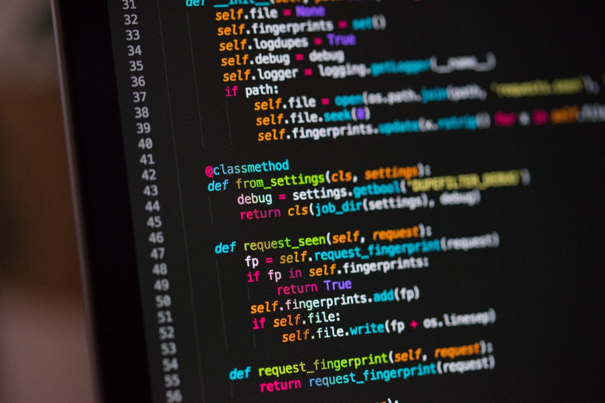
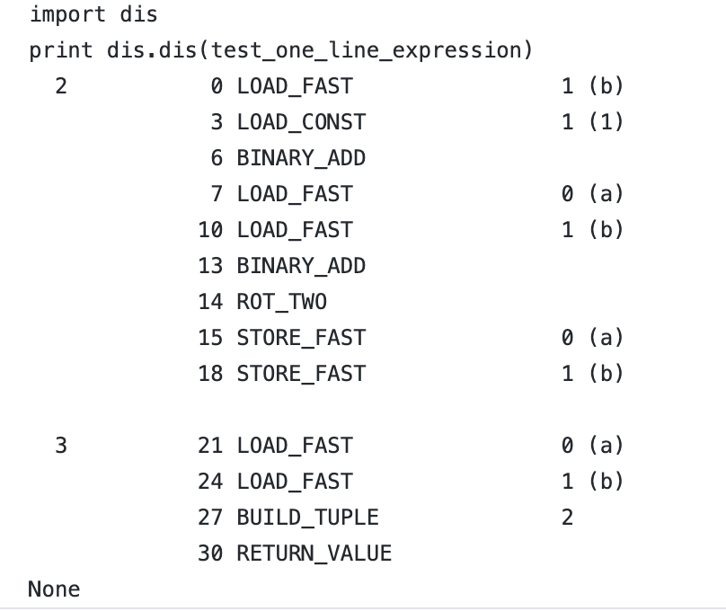

# Python中单行表达式背后的魔力
## 关于人类可读代码如何作为操作码执行的介绍。

> Photo by Chris Ried on Unsplash


前几天，我正在解决编码问题，检查“这是否是一个好的数组”。 经过一个小时的工作，我提交了解决方案以检查结果。 尽管正确，但与提交的其他解决方案相比，我的代码的性能却排在最后20％。 为了提高解决问题的能力，我在论坛上通读了有关同行如何解决问题的信息。 解决方案之一的简单性让我震惊！ 在解决方案中（示例代码1），在第7行中，作者使用了单行表达式来很好地使代码简洁易读。 尽管我使用Python编写代码已有四年多了，但将这种语言放在这种用例中的能力令我敬畏。

撰写本文的目的是深入了解并理解单行表达式在python的调用堆栈中的工作方式，并向读者介绍操作码在下面的工作方式。
```
# This is not my solution, the snippet is copied from the link below.
# https://leetcode.com/problems/check-if-it-is-a-good-array/discuss/419368/JavaC%2B%2BPython-Chinese-Remainder-Theorem
def isGoodArray(self, A):
  gcd = A[0]
  for a in A:
    while a:
      gcd, a = a, gcd % a
  return gcd == 1
```
# Python中一行表达式的解释
```
>>> def test_one_line_expression(a,b):
...   a,b = b+1, a+b
...   return a,b

>>> test_one_line_expression(5,6)
(7, 11)


```

示例代码2中的代码段在第2行中使用了一行表达式。假定我们在纸上的第2行中计算了一行表达式； 如果我们决定先计算b + 1，存储结果，然后计算a + b，则第3行的输出为6、12。如果选择反转顺序，则第5行的输出为12、11 幸运的是，python解释器没有这种奢侈。

在python中，总是首先评估右边的表达式，即，首先对'='的所有权利进行评估。 当我们在表达式中使用逗号（，）时，我们要求python创建一个元组。 计算完成后，将在右侧评估的值解包到左侧的变量中。
```
>>> def test_one_line_expression(a,b):
...   a,b = a+b, b+1
...   return a,b
... 
>>> print test_one_line_expression(5,6)
(11, 7)

```

在这里，可能会出现一个问题，即“ =”右侧的两个表达式按什么顺序排序？ 在示例代码2和示例代码3中，python如何计算具有原始值5和6的值a + b和b + 1。一旦计算出a或b，它就不应该使用更新后的值吗？ 让我们看一下要理解的操作码。
# 反汇编和分析操作码

> Call-stack diagram for example code 2


在左侧，我正在使用dis python模块来分解示例代码2中的代码，并分析python字节码以了解其工作方式。

第一列-代表函数中的行号。 [这里是示例代码2中的代码。]

第二列_0、3、6 ..是字节码中与字节索引相对应的地址。

第三列— LOAD_FAST，LOAD_CONST ..表示指令名称或操作名称。

第四栏-Python在内部用于管理堆栈，跳转到特定指令，获取变量等。

第五列—这是人类可读的参数形式。
# 了解操作码

在调用堆栈图中，前三行或多或少是不言自明的。 LOAD_FAST将变量'b'压入堆栈，LOAD_CONS按此顺序将常数1压入堆栈，然后BINARY_ADD删除堆栈顶部（TOS）的内容为1，其次于顶部（TOS1）的内容为b = 6 ，进行二进制加法并将结果存储到堆栈的顶部。 因此，此操作后的堆栈内容为[7]。

然后使用LOAD_FAST将'b'和'a'压入堆栈。 注意，堆栈内容现在为[7，5，6]。 另一个BINARY_ADD，添加TOS和TOS1的内容并将其推入TOS，因此堆栈看起来像[7，11]。 ROT_TWO交换TOS和TOS1的内容，因此堆栈看起来像[11，7]。 这两个STORE_FAST将值存储在堆栈中，并按该顺序将它们存储在分配左侧的名称中。 因此，我们最终存储了a = 7和b =11。第3行的操作码只是加载a＆b的值，创建一个元组并返回输出。

我希望这有助于介绍python操作码如何解决表达式。 可以使用类似的方法来反汇编和理解用python编写的任何代码。 一个很好的跟进可能是对示例代码3中的代码进行类似的练习。
# 参考文献
+ https://docs.python.org/3/library/dis.html
+ https://stackoverflow.com/questions/21047524/how-does-swapping-of-members-in-the-python-tuples-a-b-b-a-work-internally
