# GAN（生成对抗网络）背后的数学
## 详细了解原始GAN背后的数学原理及其局限性
# 1.简介

生成对抗网络（GAN）包含两个模型：生成模型G和区分模型D。可以将生成模型视为伪造者，该伪造者试图生成假货币并在不被捕获的情况下使用它，而区分模型是 类似于警察，试图抓住假币。 这场竞争一直持续到造假者变得足够聪明以成功欺骗警察为止。
![Figure 1: Representation of the generator and discriminator as a counterfeiter and police, respectively. Figure from [1].](1*GVn3FkfSWT2gcEH3oYs6Uw.png)
> Figure 1: Representation of the generator and discriminator as a counterfeiter and police, respectively. Figure from [1].


换一种说法，

鉴别器：作用是区分实际数据和生成的（伪）数据。

生成器（Generator）：其作用是创建数据，使欺骗者无法使用。
# 2.一些参数和变量

在推导之前，我们先介绍一些参数和变量。
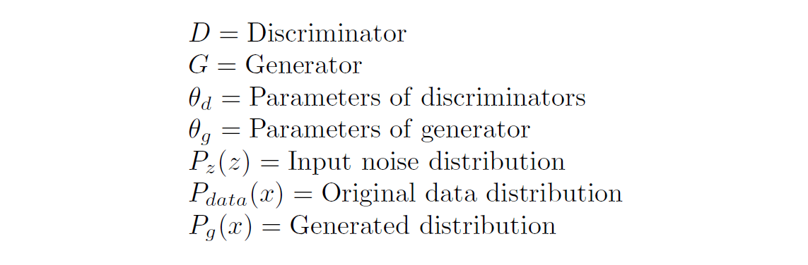
# 3.损失函数的推导

Ian Goodfellow等人在原始论文中描述了损失函数。 可以从二进制交叉熵损失的公式得出。 二进制交叉熵损失可以写成：
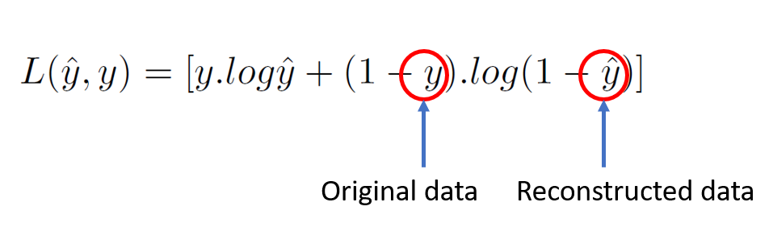
## 3.1鉴别器损失
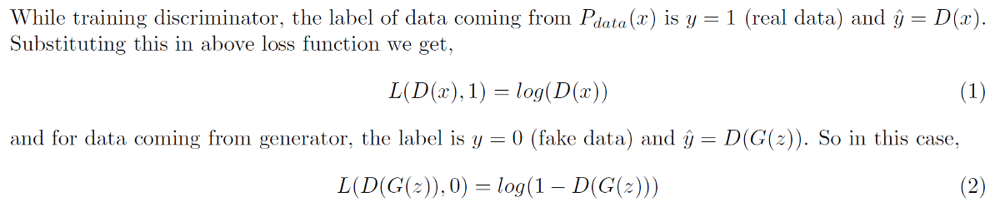

现在，鉴别器的目的是正确分类假数据和真实数据集。 为此，应将等式（1）和（2）最大化，鉴别器的最终损失函数可以表示为：
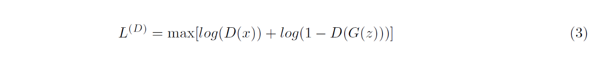
## 3.2发电机损耗

在这里，生成器正在与鉴别器竞争。 因此，它将尝试使方程式（3）最小化，损失函数为
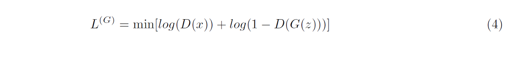
## 3.3组合损失函数

我们可以将等式（3）和（4）组合起来，写成
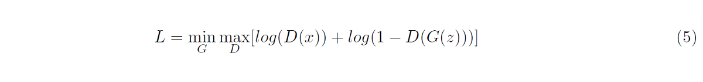

请记住，上述损失函数仅对单个数据点有效，要考虑整个数据集，我们需要将上述等式的期望作为
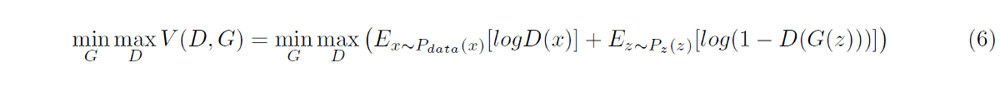

该方程与Goodfellow等人在原始论文中描述的方程相同。
# 4.算法
![Figure 2: Algorithm described in the original paper by Goodfellow et al. Figure from [2].](1*i9Zti7ooRBCDpl3XgvBGUA.png)
> Figure 2: Algorithm described in the original paper by Goodfellow et al. Figure from [2].


从上述算法可以看出，生成器和鉴别器是分开训练的。 在第一部分中，将真实数据和伪数据插入带有正确标签的鉴别器中，并进行训练。 传播梯度以保持生成器固定。 同样，我们通过增加随机梯度来更新鉴别器，因为对于鉴别器，我们要最大化方程（6）中给出的损失函数。

另一方面，我们通过保持鉴别器固定并使用假标签传递假数据来欺骗鉴别器来更新生成器。 在此，我们通过降低其随机梯度来更新生成器，因为对于生成器，我们要最小化公式（6）中给出的损耗函数。
# 5. Pg = Pdata的全局最优性

任何给定生成器G的最优判别器D都可以通过对损失函数（方程（6））求导来求出，
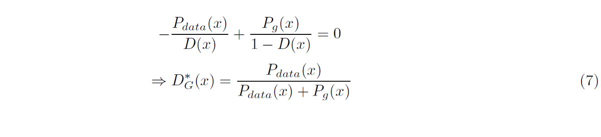

上面的方程在数学上非常重要，但是实际上，由于Pdata（x）未知，您无法计算出最佳D。 现在，通过将等式（7）代入损失函数，可以得到当我们有最优D时G的损失，
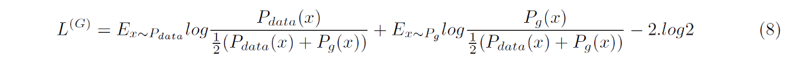

现在，Kullback-Leibler（KL）和Jensen-Shannon（JS）的散度由下式给出：
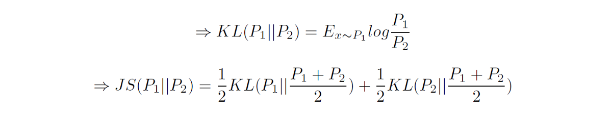

因此，
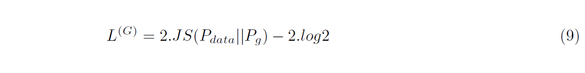

当Pg接近Pdata时，由于发散变为零，上述方程式简化为-2log2。
# 6.局限性

导出的损失函数（方程式（9））有一些限制，这些限制在本节中进行介绍。
## 6.1消失梯度

公式（9）的优化目标是将Pg朝Pdata或Pr移动以获得最佳D。如果Pr和Pg之间没有重叠，则JS散度保持恒定（图3）。 可以看出，当距离大于5时，JS散度是恒定的并且其斜率接近于0，这表示训练过程对G没有任何影响（图4）。 仅当Pg和Pr具有明显的重叠时，梯度才为非零，这意味着当D接近最佳值时，G将面临消失的梯度问题。
![Figure 3: Illustration of training progress for a GAN. Two normal distributions are used here for visualization. Given an optimal D, the objective of GANs is to update G in order to move the generated distribution Pg (red) towards the real distribution Pr (blue) (G is updated from left to right in this figure. Left: initial state, middle: during training, right: training converging). However, JS divergence for the left two figures are both 0.693 and the figure on the right is 0.336, indicating that JS divergence does not provide sufficient gradient at the initial state. Figure from [3].](1*0_nNc7_9bSR0jTTtG1wKng.png)
> Figure 3: Illustration of training progress for a GAN. Two normal distributions are used here for visualization. Given an optimal D, the objective of GANs is to update G in order to move the generated distribution Pg (red) towards the real distribution Pr (blue) (G is updated from left to right in this figure. Left: initial state, middle: during training, right: training converging). However, JS divergence for the left two figures are both 0.693 and the figure on the right is 0.336, indicating that JS divergence does not provide sufficient gradient at the initial state. Figure from [3].

![Figure 4: JS divergence and gradient change with the distance between Pr and Pg. The distance is the difference between the two distribution means. Figure from [3].](1*T3ymSEy4IvFW3Uc_k_29Ag.png)
> Figure 4: JS divergence and gradient change with the distance between Pr and Pg. The distance is the difference between the two distribution means. Figure from [3].


可以通过修改G的原始损失函数来解决此问题，
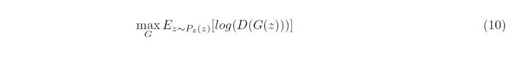
## 6.2模式崩溃

在训练过程中，发电机可能会卡在总是产生相同输出的设置中。 这称为模式崩溃。 发生这种情况是因为G的主要目的是愚弄D而不产生多样化的输出。 这背后的数学运算涉及到一点，将在以后的文章中进行讨论。

顺便说一句，这是我的第一个故事，希望您喜欢它。
# 7.参考

1] Atienza，罗维尔。 使用Keras进行高级深度学习：应用深度学习技术，自动编码器，GAN，变体自动编码器，深度强化学习，策略梯度等。 Packt Publishing Ltd，2018年。

2] Goodfellow，Ian等人。 “生成对抗网络。”神经信息处理系统的进步。 2014。

3]王正伟，齐社和Tomas E. Ward。 “生成式对抗网络：概览和分类法”。arXiv预印本arXiv：1906.01529（2019）。
```
(本文翻译自Mayank Vadsola的文章《The math behind GANs (Generative Adversarial Networks)》，参考：https://towardsdatascience.com/the-math-behind-gans-generative-adversarial-networks-3828f3469d9c)
```
