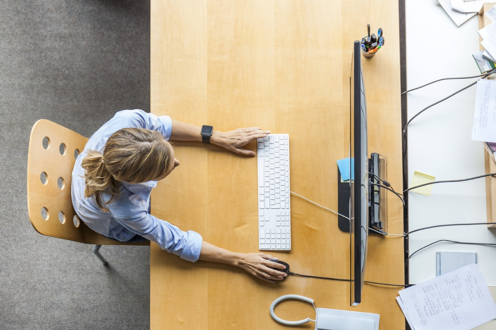

# 最被低估的生产力技术也是最简单的
## 只有两个步骤

> Credit: Westend61/Getty Images

阅读现有的每条生产力建议都不是人类可能的事，但我想我已经接近了。 在某一点上，无论是多么令人不愉快，我都为自己尝试了大部分建议。 曾经有一段时间我洗冷水是因为我听说它可以帮助我对抗拖延症。 （它没有。）

最终，有一瞬间，我意识到研究所有这些时间管理技巧和日历系统以及多步骤策略只会使我无法真正完成工作。 我已经知道最强大的生产力技术。 这只是使用它的问题。

只有两个步骤：
+ 身体上处于您的工作位置。
+ 做一件小事。

而已。 这就是全部。

很简单，但并不容易。 通常，我们会竭尽所能避免第一步。 我们再拿一杯咖啡，散步，看书，办事。 在写这篇文章之前，我仔细地重新整理了我的书架。 我试图逃跑。 我内心的声音告诉我打开Netflix。

但是，我却坐在办公桌旁。 我收起电话并关闭了互联网浏览器。 然后，我开始着手计划当天要做的一件小事。 然后，就像魔术一样，我正在工作。

该技术的真正秘密在于，您必须在明天，第二天和第二天再做一次。 建立动力并保持动力。 作家威尔·杜兰特（Will Durant）写道：“我们是我们一再做的事情。 因此，卓越不是一种行为而是一种习惯。”

这是“非零日”的原则：每天只需做一件事，就能帮助您朝自己的目标迈进。 正如Reddit用户ryans01在激励该运动的帖子中所写的那样：“整个他妈的一天都没做任何事情，现在是晚上11:58？ 写一句话。 一推。 阅读该章的一页。 一。 因为一非零。”

我们可以整日谈论最新的生产力系统，但是这样做无法完成真正的工作。 在某个时候，您必须坐在椅子上并开始使用。
