一如既往，我欢迎反馈和建设性的批评。 可以通过Twitter @koehrsen_will与我联系。
# 高级图

现在，我们将介绍一些您可能不会经常使用的图表，但它们会给人留下深刻的印象。 我们将使用plotly fig_factory，甚至将这些难以置信的情节保持在一行上。
## 散点矩阵

当我们要探索许多变量之间的关系时，散点图（也称为splom）是一个不错的选择：
```
import plotly.figure_factory as fffigure = ff.create_scatterplotmatrix(    df[['claps', 'publication', 'views',              'read_ratio','word_count']],    diag='histogram',    index='publication')
```
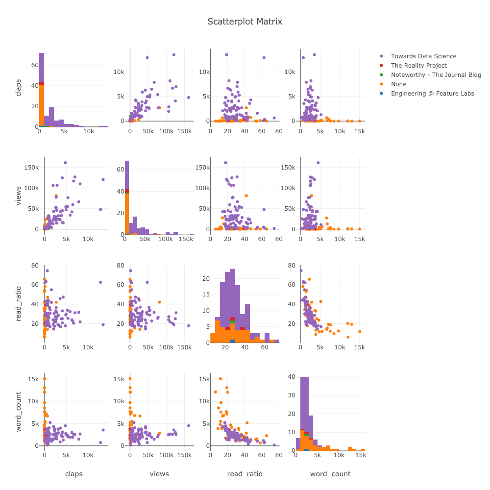

即使该图是完全互动的，也允许我们探索数据。
## 关联热图

为了可视化数值变量之间的相关性，我们计算相关性，然后制作带注释的热图：
```
corrs = df.corr()figure = ff.create_annotated_heatmap(    z=corrs.values,    x=list(corrs.columns),    y=list(corrs.index),    annotation_text=corrs.round(2).values,    showscale=True)
```
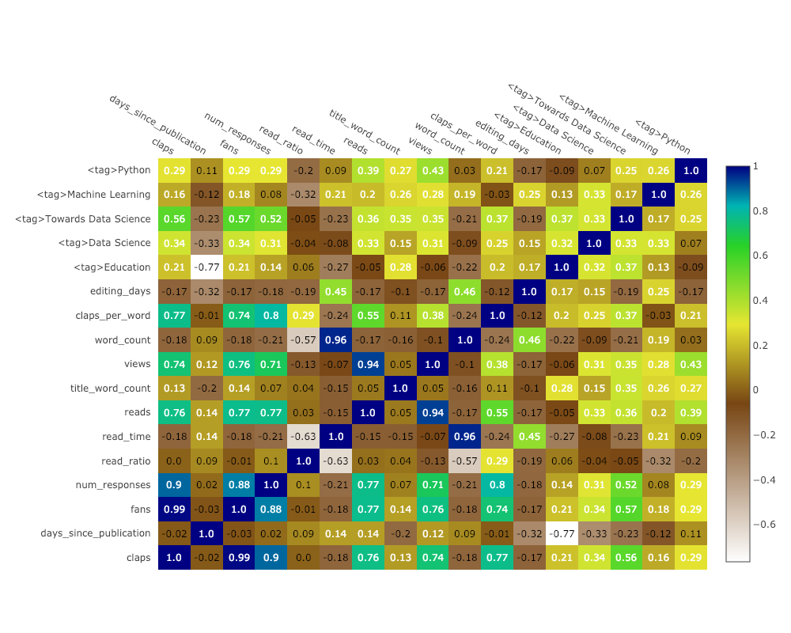

情节清单不胜枚举。 袖扣还具有几个主题，我们可以轻松使用它们来获得完全不同的样式。 例如，下面我们在“ space”主题中有一个比率图，在“ ggplot”中有一个展布图：
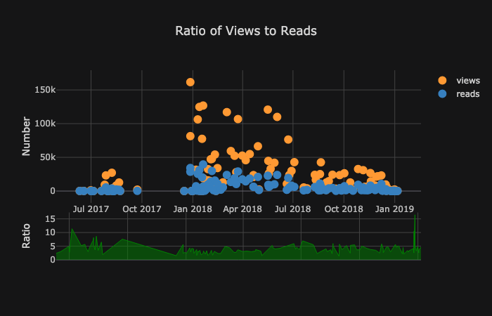
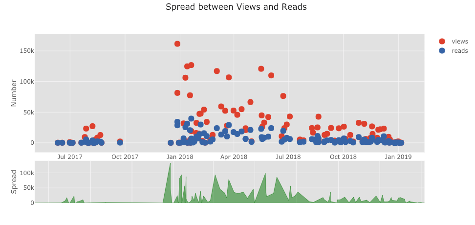

我们还获得了3D图（表面和气泡）：
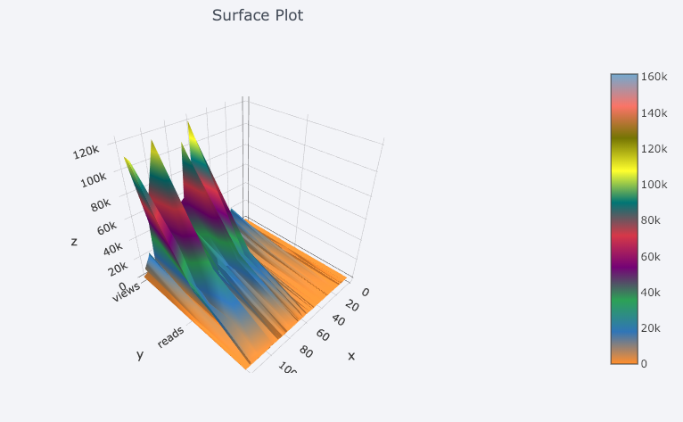
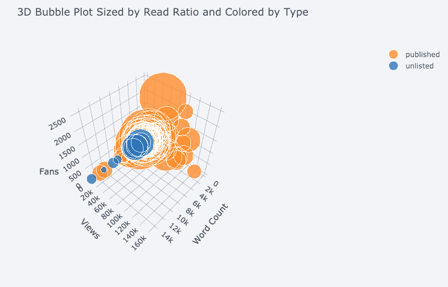

对于那些喜欢的人，您甚至可以制作饼图：
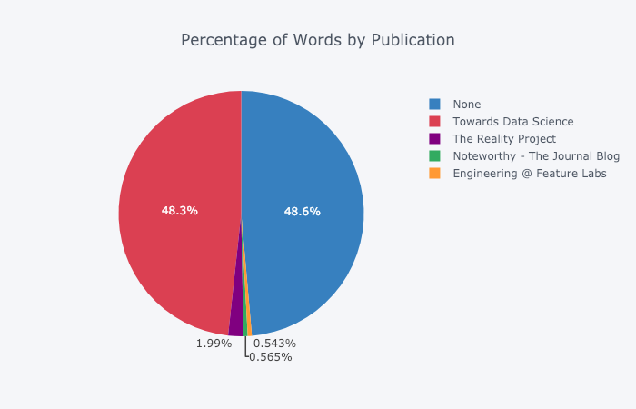
## 在Plotly Chart Studio中进行编辑

在笔记本上绘制这些图时，您会在图形的右下方看到一个小链接，上面显示“导出到图.ly”。 如果单击该链接，那么您将被带到制图工作室，在这里您可以对绘图进行修饰以进行最终演示。 您可以添加注释，指定颜色，并通常将所有内容清理干净，以获得一个不错的形象。 然后，您可以在线发布图形，以便任何人都可以通过链接找到它。

以下是我在Chart Studio中修改过的两个图表：
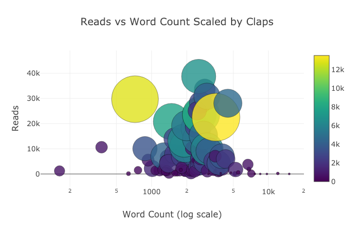
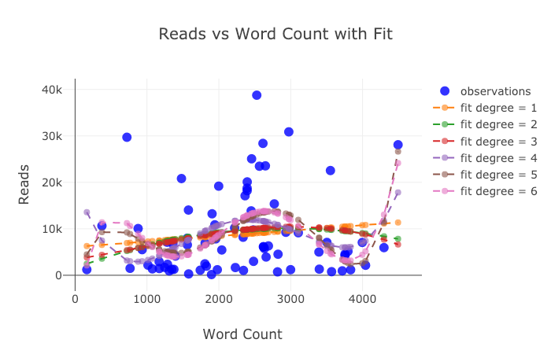

对于这里提到的所有内容，我们仍然没有探索库的全部功能！ 我建议您同时查看plotly和袖扣文档，以获取更多令人难以置信的图形。
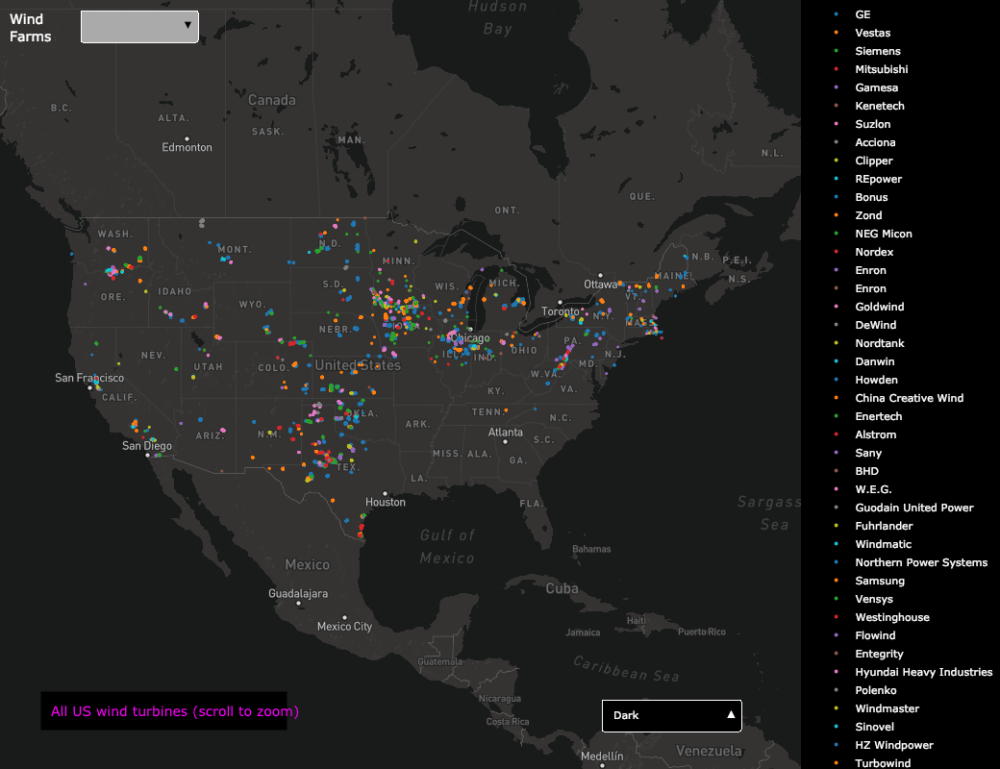
> Plotly interactive graphics of wind farms in United States (Source)

# 结论

关于沉没成本谬误的最糟糕的部分是，您只会意识到自己退出这项工作后浪费了多少时间。 幸运的是，由于我犯了长时间使用matploblib的错误，您不必这样做！

在考虑绘制库时，我们需要做一些事情：
+ 一线图表快速探索
+ 子集/调查数据的交互元素
+ 可选择根据需要深入研究细节
+ 轻松定制以进行最终演示

截至目前，在Python中完成所有这些操作的最佳选择是密谋。 通过Plotly，我们可以快速进行可视化，并通过交互性帮助我们更好地了解数据。 另外，让我们承认，绘图应该是数据科学中最令人愉快的部分之一！ 在其他图书馆中，密谋变成了一项繁琐的工作，但在密谋中，再次成为一个伟大的人物就很高兴！
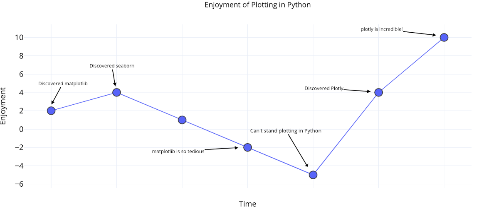
> A plot of my enjoyment with plotting in Python over time


现在已经到了2019年，是时候升级Python绘图库了，以便在数据科学可视化中实现更高的效率，功能和美观性。
# 散点图

散点图是大多数分析的核心。 它使我们能够看到变量随时间的变化或两个（或多个）变量之间的关系。
## 时间序列

现实世界中相当一部分数据具有时间元素。 幸运的是，plotly +袖扣的设计考虑了时间序列的可视化。 让我们为我的TDS文章制作一个数据框，然后看看趋势如何变化。
```
 Create a dataframe of Towards Data Science Articlestds = df[df['publication'] == 'Towards Data Science'].\         set_index('published_date')# Plot read time as a time seriestds[['claps', 'fans', 'title']].iplot(    y='claps', mode='lines+markers', secondary_y = 'fans',    secondary_y_title='Fans', xTitle='Date', yTitle='Claps',    text='title', title='Fans and Claps over Time')
```
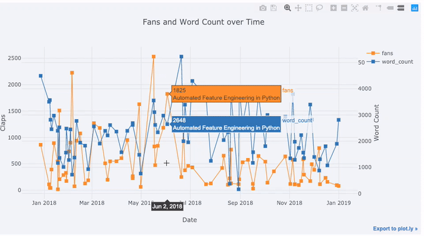

在这里，我们正在一行中做很多不同的事情：
+ 自动获取格式正确的时序X轴
+ 添加辅助y轴，因为我们的变量具有不同的范围
+ 添加文章标题作为悬停信息

有关更多信息，我们还可以轻松添加文本注释：
```
tds_monthly_totals.iplot(    mode='lines+markers+text',    text=text,    y='word_count',    opacity=0.8,    xTitle='Date',    yTitle='Word Count',    title='Total Word Count by Month')
```
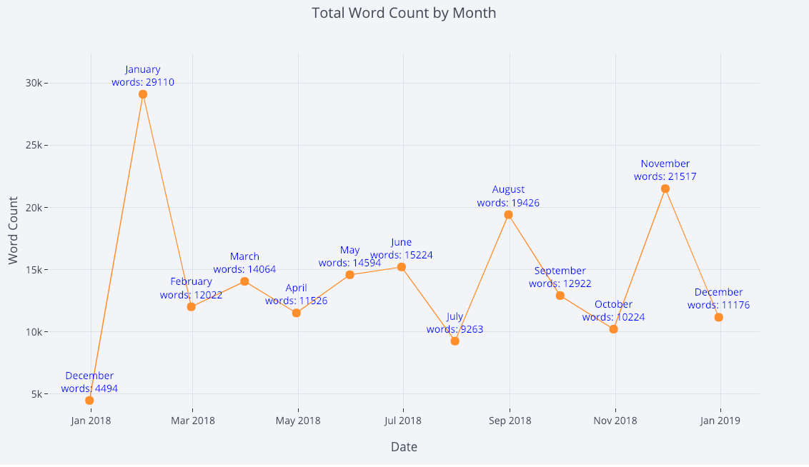
> Scatterplot with annotations


对于由第三个类别变量着色的两变量散点图，我们使用：
```
df.iplot(    x='read_time',    y='read_ratio',    # Specify the category    categories='publication',    xTitle='Read Time',    yTitle='Reading Percent',    title='Reading Percent vs Read Ratio by Publication')
```
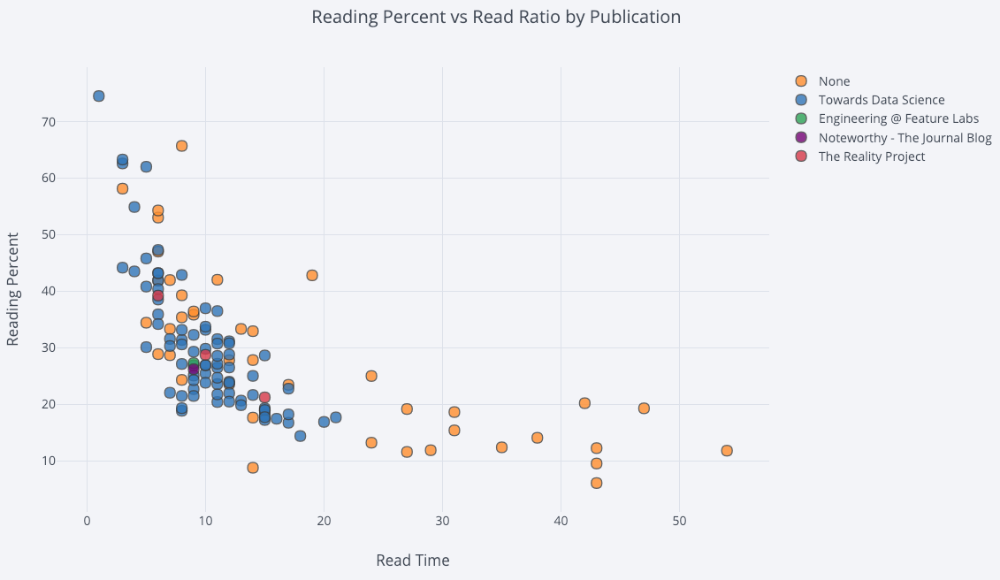

通过使用指定为打印布局的对数轴（请参见Plotly文档以获取布局详细信息），并使用数值变量来调整气泡大小，让我们更加复杂一些：
```
tds.iplot(    x='word_count',    y='reads',    size='read_ratio',    text=text,    mode='markers',    # Log xaxis    layout=dict(        xaxis=dict(type='log', title='Word Count'),        yaxis=dict(title='Reads'),        title='Reads vs Log Word Count Sized by Read Ratio'))
```
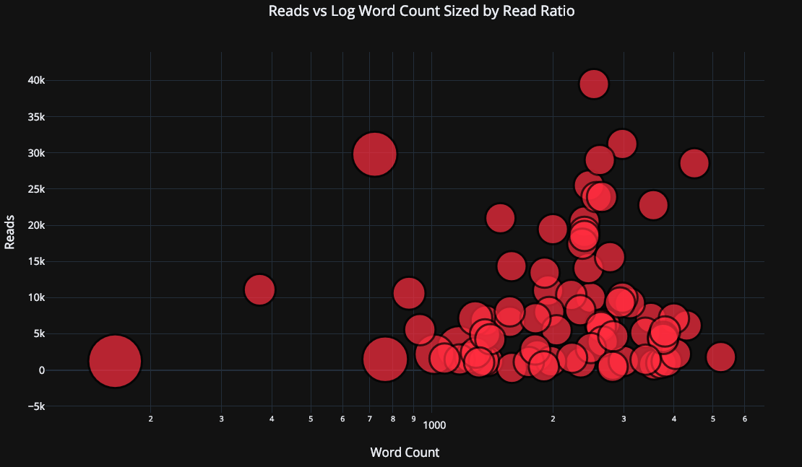

通过做更多的工作（有关详细信息，请参阅笔记本），我们甚至可以在一个图表上放置四个变量（不建议这样做）！
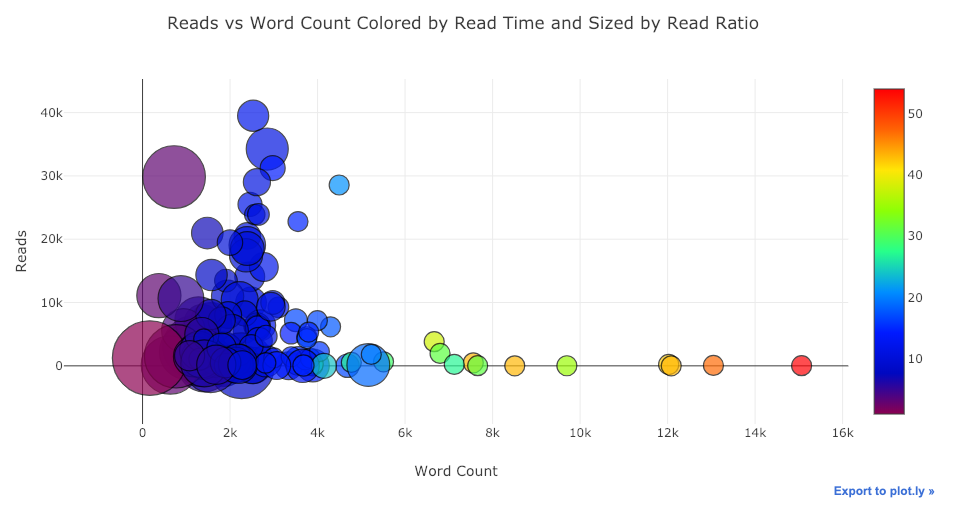

和以前一样，我们可以将Pandas与plotly + cufflinks结合使用，以获得有用的地块
```
df.pivot_table(    values='views', index='published_date',    columns='publication').cumsum().iplot(        mode='markers+lines',        size=8,        symbol=[1, 2, 3, 4, 5],        layout=dict(            xaxis=dict(title='Date'),            yaxis=dict(type='log', title='Total Views'),            title='Total Views over Time by Publication'))
```
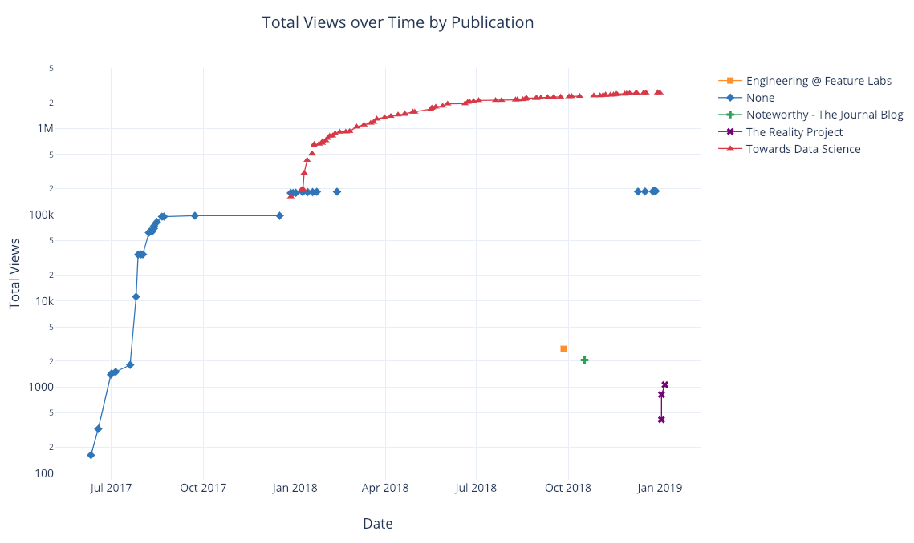

有关更多功能的更多示例，请参见笔记本或文档。 我们可以使用一行代码，并且仍然具有所有交互功能，将文本注释，参考线和最佳拟合线添加到绘图中。
# 单变量分布：直方图和箱线图

单变量（单变量）图是开始分析的标准方法，直方图是用于绘制分布图的首选图（尽管有一些问题）。 在这里，使用我的中型文章统计信息（您可以在此处查看如何获得自己的统计信息或在此处使用我的统计信息），让我们制作文章拍手数量的交互式直方图（df是标准的Pandas数据框）：
```
df['claps'].iplot(kind='hist', xTitle='claps',                  yTitle='count', title='Claps Distribution')
```
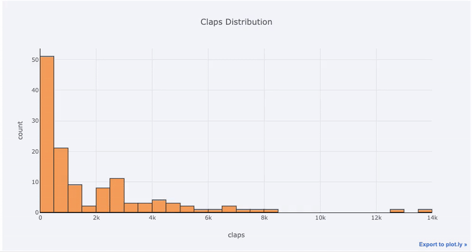
> Interactive histogram made with plotly+cufflinks


对于那些习惯于使用matplotlib的用户，我们所要做的就是再添加一个字母（用iplot代替plot），我们将获得一个外观更好，更具交互性的图表！ 我们可以单击数据以获取更多详细信息，将其放大到绘图的各个部分，然后如稍后所见，选择不同的类别以突出显示。

如果我们想绘制重叠的直方图，那很简单：
```
df[['time_started', 'time_published']].iplot(    kind='hist',    histnorm='percent',    barmode='overlay',    xTitle='Time of Day',    yTitle='(%) of Articles',    title='Time Started and Time Published')
```
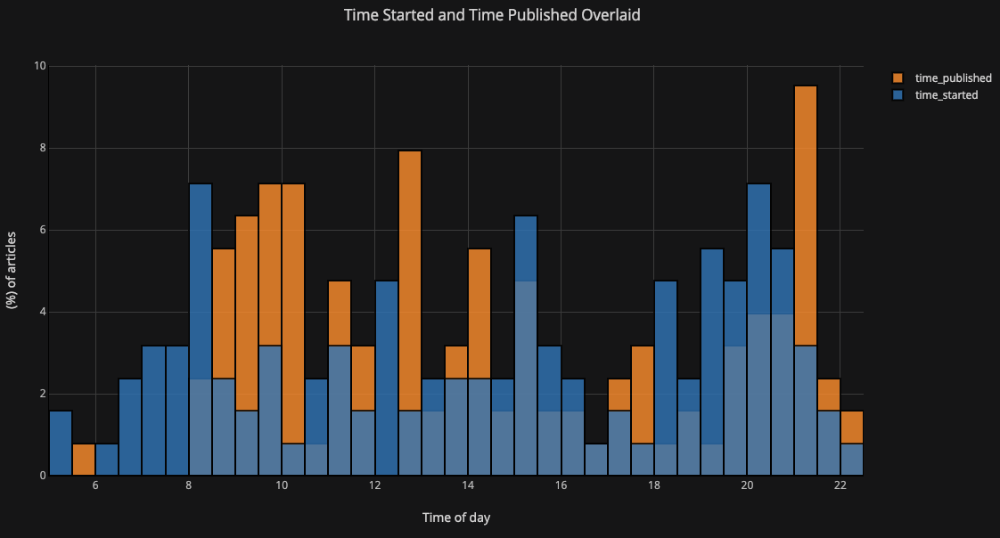

借助一些熊猫操作，我们可以绘制一个小图：
```
# Resample to monthly frequency and plot df2 = df[['view','reads','published_date']].\         set_index('published_date').\         resample('M').mean()df2.iplot(kind='bar', xTitle='Date', yTitle='Average',    title='Monthly Average Views and Reads')
```
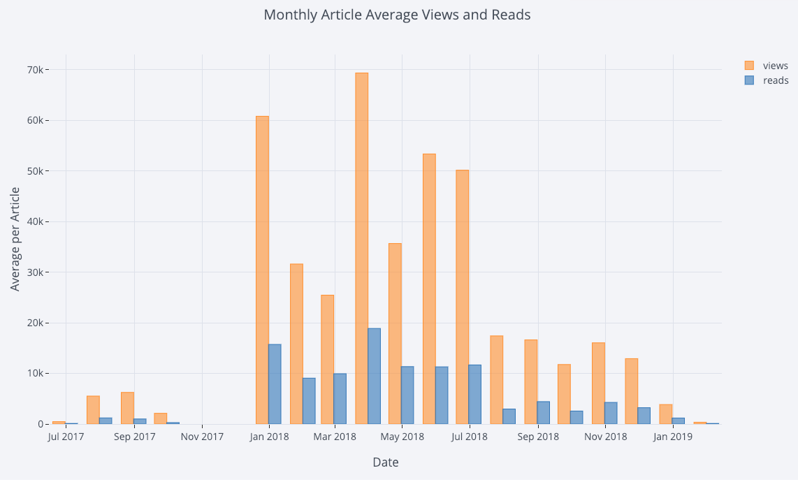

如我们所见，我们可以将熊猫的力量与情节+袖扣结合起来。 对于每个故事按出版物发布的粉丝的箱线图，我们使用枢轴，然后绘制：
```
df.pivot(columns='publication', values='fans').iplot(        kind='box',        yTitle='fans',        title='Fans Distribution by Publication')
```
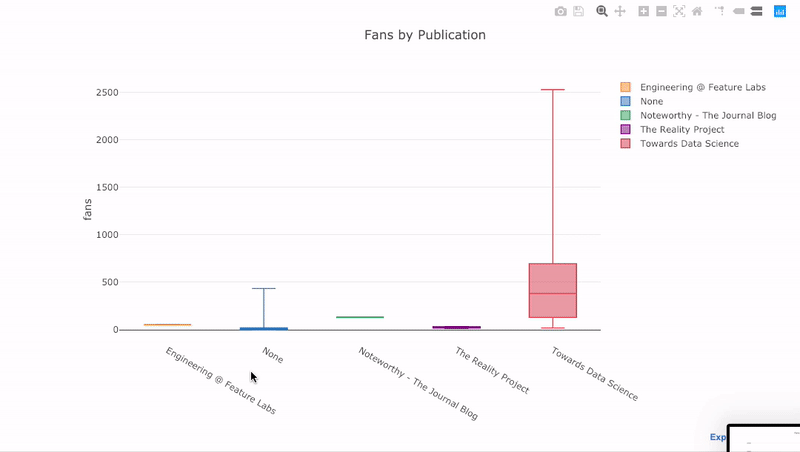

交互的好处是我们可以根据需要浏览和子集数据。 箱形图中有很多信息，并且如果无法查看数字，我们将错过大多数信息！

> (Source)

# Python中数据可视化的新层次
## 如何使用单行Python制作美观，完全交互的图

沉没成本的谬论是人类沦为猎物的许多有害认知偏见之一。 它是指我们倾向于继续将时间和资源用于失败的事业，因为我们已经花了很多时间去沉没。 沉没成本的谬误适用于比我们应该更长的时间呆在糟糕的工作上，即使很显然它行不通，也将项目拒之门外，是的，当效率更高时，继续使用乏味，过时的绘图库-matplotlib 存在交互性和外观更好的替代方案。

在过去的几个月中，我意识到使用Matplotlib的唯一原因是我花了数百个小时来学习复杂的语法。 这种复杂性导致StackOverflow数小时的挫败感，弄清了如何格式化日期或添加第二个y轴。 幸运的是，这是进行Python绘图的绝佳时机，在探索了各种选择之后，就其易用性，文档和功能而言，明显的赢家是可开发的Python库。 在本文中，我们将深入研究绘图，学习如何在更短的时间内制作更好的绘图-通常只需一行代码。

GitHub上提供了本文的所有代码。 这些图表都是交互式的，可以在NBViewer上查看。
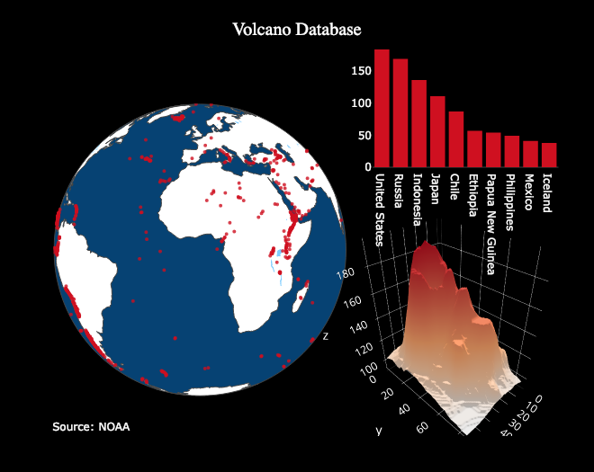
> Example of plotly figures (source)

## 简要概述

plotly Python软件包是一个基于plotly.js的开源库，该库又基于d3.js。 我们将在设计用于Pandas数据帧的称为袖扣的袖扣上使用包装器。 因此，我们的整个堆栈都是袖扣> plotly> plotly.js> d3.js，这意味着我们通过d3令人难以置信的交互式图形功能获得了Python编码的效率。

（Plotly本身是一家图形公司，提供多种产品和开源工具。Python库是免费使用的，我们可以在离线模式下制作无限制的图表，而在线模式下最多可以制作25个图表以与世界共享。）

本文中的所有工作都是在Jupyter Notebook中完成的，并且在离线模式下运行有绘图+袖扣。 使用pip安装plotly和袖扣后，以袖珍方式导入以下内容以在Jupyter中运行：
```
# Standard plotly importsimport plotly.plotly as pyimport plotly.graph_objs as gofrom plotly.offline import iplot, init_notebook_mode# Using plotly + cufflinks in offline modeimport cufflinkscufflinks.go_offline(connected=True)init_notebook_mode(connected=True)
```
