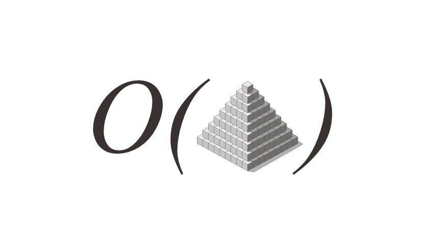
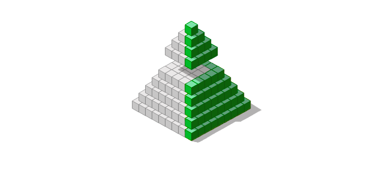
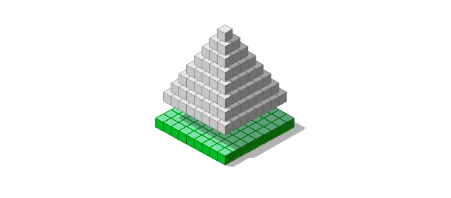

了解工具-编程语言，库和框架非常重要。 它有助于在游戏中获得最佳分数。 而且重要的是要知道算法-这有助于找到具有规则的游戏，使我们容易获得最佳成绩。
## 移动按钮需要两个星期
### 一个从小到大的项目的玩具故事
# 算法的力量

算法问题是软件工程面试的实际标准：Google，Facebook和许多其他公司都在使用它。 很难说这是否是进行技术面试的最佳方法，但是算法思维对于软件工程师来说是一项宝贵的技能。 这是一个众所周知的事实，但总要对事物有直觉总是很高兴的，而不仅仅是对事实的了解。


在有关玩具金字塔的故事中，有一个有趣的时刻，在这个时刻，主角要承担组装尽可能高的金字塔的任务。
## 移动按钮需要两个星期
### 一个从小到大的项目的玩具故事

主角的做法很简单：从一个方块开始，然后在第一个方块之外再放置三个方块，再在上面放置一个方块，然后以类似的方式继续添加新的关卡。

我们使用一个循环公式来计算达到一个新级别需要多少块/需要多少时间：
```
N(level) = level * 2 + 1 + N(level-1)
```

该公式基本上遵循构建过程，执行该计算的代码如下所示：
```
func countBlocks(level int) int {
  if (level == 0) {
    return 1;
  }
  return level * 2 + 1 + countBlocks(level-1)
}
```

琐碎的递归函数。 但是，此代码不是最佳的：每个新方法调用在调用堆栈中都需要一个新条目，这会占用一些空间。 在我们的例子中，我们有一个递归，但这是一种特殊的情况，称为“尾递归”，可以用for循环代替。 如果有人想计算出1,000,000的值，那么基于循环的代码就可以做到这一点（除非int可能会溢出），而基于递归的版本可能会耗尽内存。 重构后的代码如下所示：
```
func countBlocks(finalLevel int) int {
  seconds := 1 // starting with MVP
  for l := 0; l < finalLevel; l++ {
    seconds += (finalLevel-l)*2+1
  }
  return seconds
}
```

我们从级别0开始，计算该级别所需的块数，然后转到下一个级别，直到达到最后一个级别。 这是很合理的。 但是，该解决方案也不是最佳的。

如果我们再看一下我们的问题，我们可能会获得最佳解决方案。 我们要做什么？ 我们需要计算需要为金字塔增加一个级别的多少个块。 到目前为止，我们已经开发出一种方法，可以计算放置在金字塔顶部的块数，从而为金字塔增加一个级别。


但是，如果我们不是在金字塔的顶部添加块，而是在构建新的地面层，该怎么办？


然后，计算所需的块数变得不那么容易了：底数是一个正方形，一个正方形的正方形是正方形边的正方形！ 因此，最佳的解决方案是：
```
func countBlocks(level int) int {
  side := level+1 // Since we start with level 0
  return side*side
}
```

此解决方案是帕累托最优的：它更简洁，更高效，更不易出现错误。 我们的第一个优化是好的，但是要获得最佳解决方案，我们必须评估如何获得答案，而不是如何最佳地优化现有方法。

为了获得最佳解决方案，我们首先提出了问题，然后以某种方式获得了埃里克·埃文斯（Eric Evans）所说的突破-一种在解决方案很简单的情况下查看所述问题的方法。 是的，我们可以通过计算应添加到现有级别的所有块来获得答案，但是当我们仅计算建立下一个底层级别所需的块数时，此解决方案不必要地复杂。

到达突破性时刻比艺术更重要的是艺术，但是了解计算机科学已经发现的内容可能会非常有帮助。 幸运的是，最好的大学提供的在线课程中包含以下材料：
+ Tim Roughgarden（斯坦福大学）的算法专业知识—一门很好的深入课程，完全着重于具有挑战性分配的算法（使用任何编程语言来完成分配）
+ 罗伯特·塞奇威克（普林斯顿大学）的算法第1部分和第2部分-也是一门深入的课程，涉及艰巨的任务，但重点在于算法及其在Java中的实现。
```
(本文翻译自Yan Babitski的文章《The power of algorithms》，参考：https://medium.com/@yan.babitski/the-power-of-algorithms-de30e40c00fa)
```
