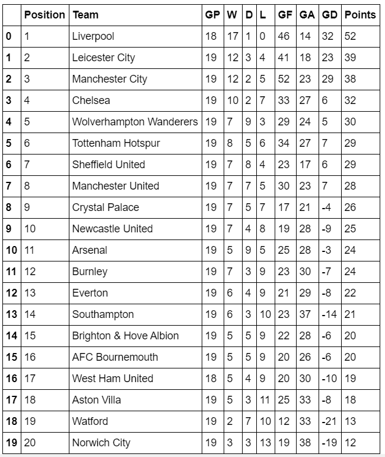
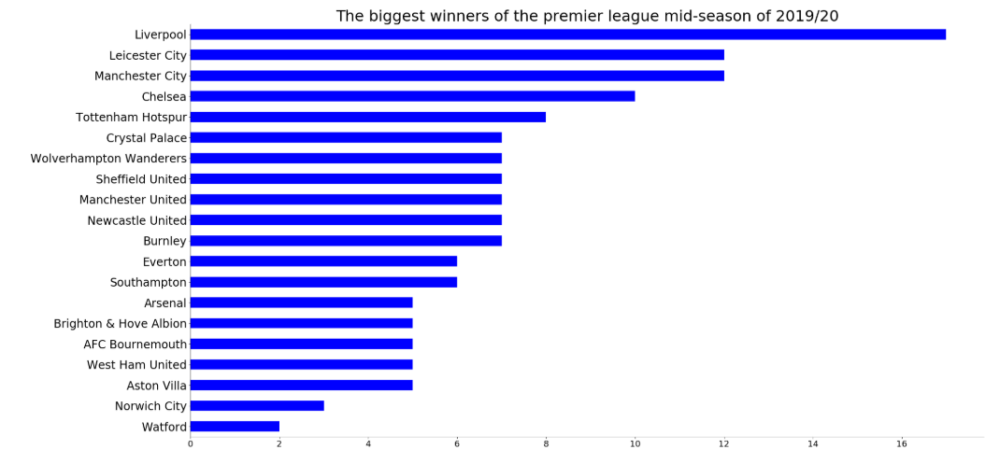
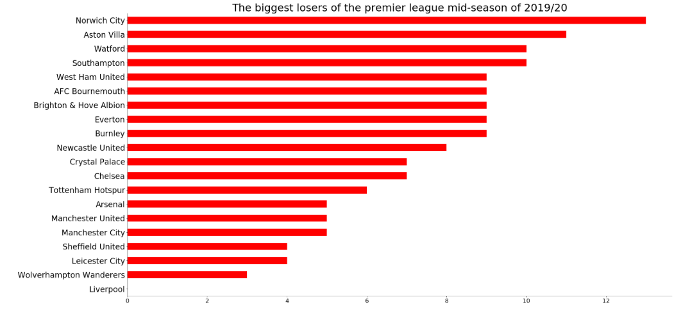
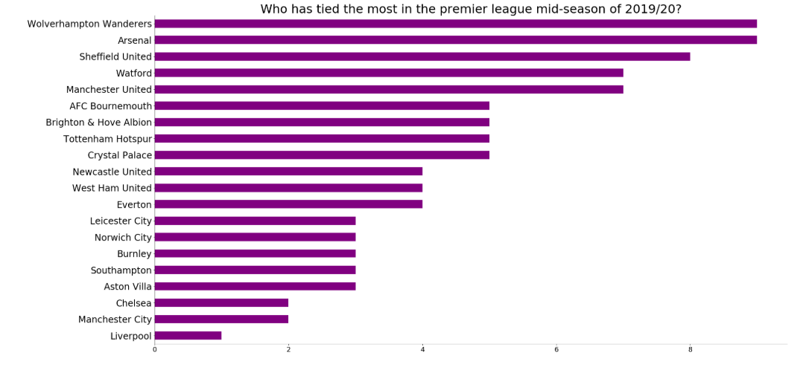
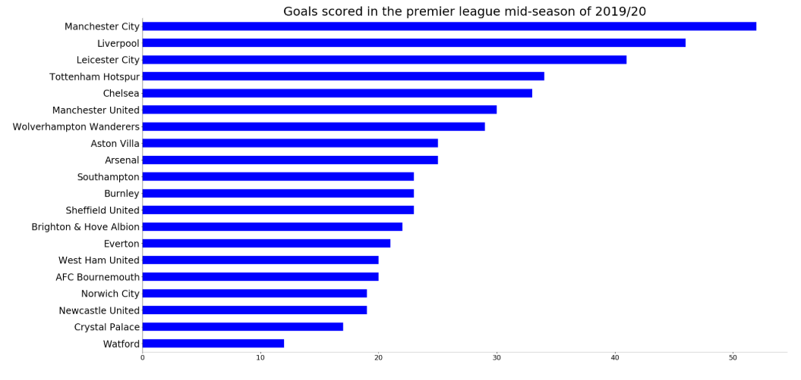
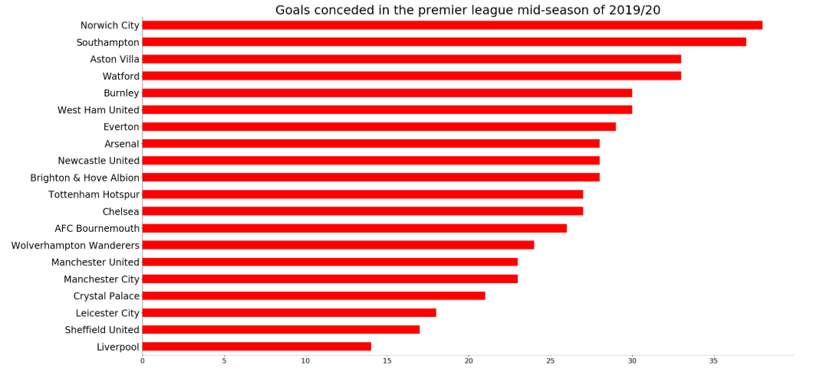
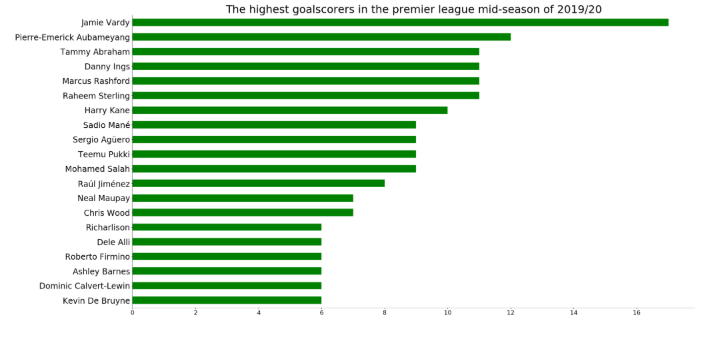
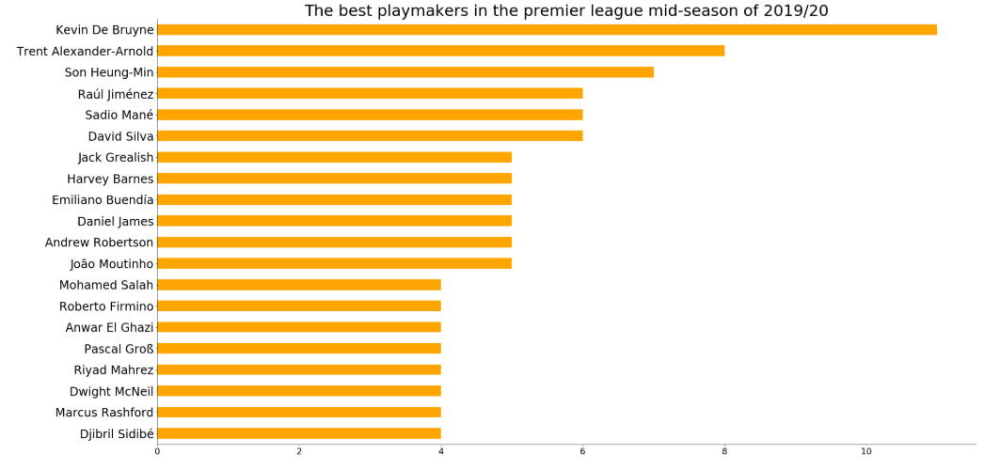
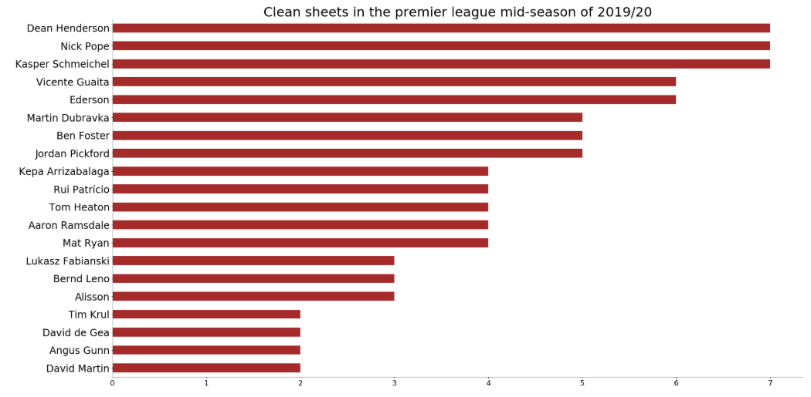

> Photo credit: https://www.stickpng.com/img/sports/soccer-football/premier-league-logo

# 迄今为止的英超联赛
## 对世界上最有趣的足球联赛的赛季中分析

杰米·瓦迪（Jamie Vardy）射门得分，他的状态非常好。 由于球队经历了一段时间以来最糟糕的赛季，阿森纳球迷会在ArsenalFanTv上展示他们最好的歇斯底里形式。 切尔西出人意料地蓬勃发展，尽管他们无法在转会窗口签名任何人。

曼城一直在为一支被认为是冠军的球队表现良好。 像阿森纳一样，曼联的表现还不是很好。 不过，他们在大型游戏中的表现不错，只是在小型游戏中陷入困境。

托特纳姆热刺队在确定如何正常运转方面遇到了一些问题，但穆里尼奥已经出手救援，并且有改善的迹象。 令我惊讶的是谢菲尔德联。 尽管获得了晋升，他们还是设法保持了前7名的表现。

最重要的是，利物浦通过提供卓越的性能一直走在成功之路上。 于尔根·克洛普（Jurgen Klopp）为此小队创建了王朝。 无论面对谁，他们总是赢。 Van Dijk的后卫看上去很稳固。 中场轻松地为进攻三人提供惊人的传球，从而带入重要的进球。

目前是赛季中期，已经对球队的赛季中表现进行了分析。
# 英超联赛中期分析

收集数据用于分析球队的赛季中期表现。 通过英超联赛的网站，可以通过此链接获得最近的表格。

> The Premier League mid-season table of 2019/20.


不出所料，利物浦首先拥有一场比赛。 莱斯特城排名第二，这要归功于杰米·瓦迪（Jamie Vardy）的高产表现以及布伦丹·罗杰斯（Brendan Rodgers）担任总经理。 曼彻斯特城不是最好的，排名第三。 切尔西令人惊讶地排名第四。 事实证明，狼队是顶级球队，排名第五。 托特纳姆热刺，第六。 曼联和阿森纳分别排名第八和第十一位。 后三名分别是阿斯顿维拉，沃特福德和诺里奇市，分别为第十八，第十九和第二十名。
## 最大赢家vs最大输家


> The graph on the left shows which teams have won the most games. The graph on the right shows which team has lost the most games.


利物浦赢得了18场比赛中的17场，成为最大赢家。 排在第二位的莱斯特城排名第二，曼城以12胜排名第二。 切尔西取得10胜，排名第四。 托特纳姆热刺队排名第五。

诺里奇城排在最后一位，毫不奇怪，它输掉了最多的13场比赛。 也在降级区的阿斯顿维拉排名第二，已经输了11场比赛。 沃特福德和南安普敦以10赔率并列第三。 西汉姆联，伯恩茅斯，布里滕和霍夫·阿尔比恩，埃弗顿和伯恩利都输了9场，排名第五。
## 谁最喜欢分享积分？

> A graph showing which teams share points the most in the premier league mid-season of 2019/20


事实证明，狼队和阿森纳队非常愿意在面对对手时给点意见。 他们俩都打了9场比赛。 谢菲尔德联（Sheffield United）位居第二，他参加了8场比赛。 沃特福德和曼联以7平局排名第四。
## 进球数与入球数


> The graph on the left shows how many goals the teams have scored. The graph on the right shows how many goals the teams have conceded.


曼城拥有强大的进攻力量，到目前为止已经打入52球，并且是赛季中进球数最多的。 利物浦以46个进球排名第二。 莱切斯特城已经打进41球，排名第三。 托特纳姆热刺和切尔西分别打进34和33球，分别位列第四和第五。

对于诺威奇市来说，处于最底层必须是艰难的。 他们已经成功打入38球，这是他们最大的失球篮。 南安普敦以莱斯特城9-0的比分排名第二，总共失球37球。 阿斯顿维拉（Aston Villa）和沃特福德（Watford）都承认了33个进球，这使他们俩都排名第三。 伯恩利和西汉姆联分别失球30球，排名第五。
# 玩家分析

使用此链接从英超联赛网站上收集了有关球员表现的信息。
## 进球数最高的人-聊天S ***被撞！

> The highest goal scorers of the premier league mid-season of 2019/20


杰米·瓦迪（Jamie Vardy）。 真是野兽！ 他本赛季一直是致命的，已经记录了17个进球，这使他成为射手得分最高的球员。 阿森纳的奥巴梅扬以12个进球排名第二。 塔米·亚伯拉罕（Tammy Abraham），丹尼·英格斯（Danny Ings），马库斯·拉什福德（Marcus Rashford）和拉希姆·斯特林（Raheem Sterling）都十次找到篮网，他们都排在第三位。
## 顶尖游戏制作人-我将如何协助您？

> The best playmakers in the premier league mid-season of 2019/20


游戏界之王凯文·德·布鲁因（Kevin De Bruyne）拥有11次助攻，这使他成为首个亮点。 第二名是特恩特·亚历山大·阿诺德（Trent Alexander Arnold），他获得了8次助攻。 儿子以7次助攻排名第三。 鬃毛，大卫席尔瓦和劳尔·希门尼斯以6次助攻排名第四。
## 干净的床单—谁最节省一天？

> Clean sheets in the premier league mid-season of 2019–20


谢菲尔德联队的Dean Henderson，伯恩利的Nick Pope和莱斯特城的Kasper Schmeichel分别以7张干净的床单位居最干净的床位榜首。 Vincent Gualta和Ederson在录制6张干净的床单之后排名第四。 上个赛季的冠军阿里森（Allison）到目前为止有3张干净的床单。
# 结论

没有人知道本赛季余下的时间。 英超联赛是一个充满娱乐性的联赛，对此有很多悬念。 悬念的一部分来自前四名的比赛以及保级区战役，这场战斗可以持续到最后一场比赛日。
## 有趣的事实：

这是我的第19篇文章，我正在分析英超联赛赛季的前19场比赛。

可以在此处查看用于执行该项目的代码的完整版本。
```
(本文翻译自Mubarak Ganiyu的文章《The Premier League so far》，参考：https://towardsdatascience.com/the-premier-league-so-far-5bf1d95afbc8)
```
