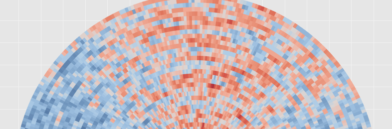
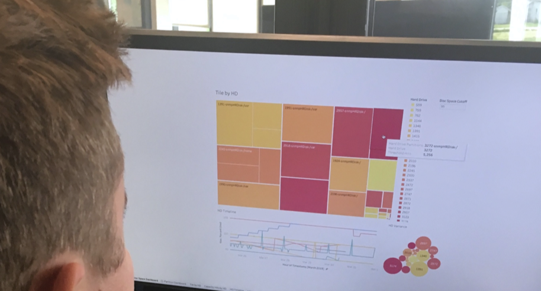
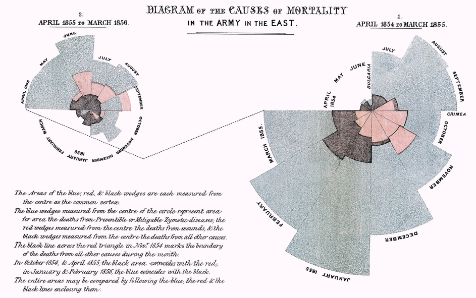
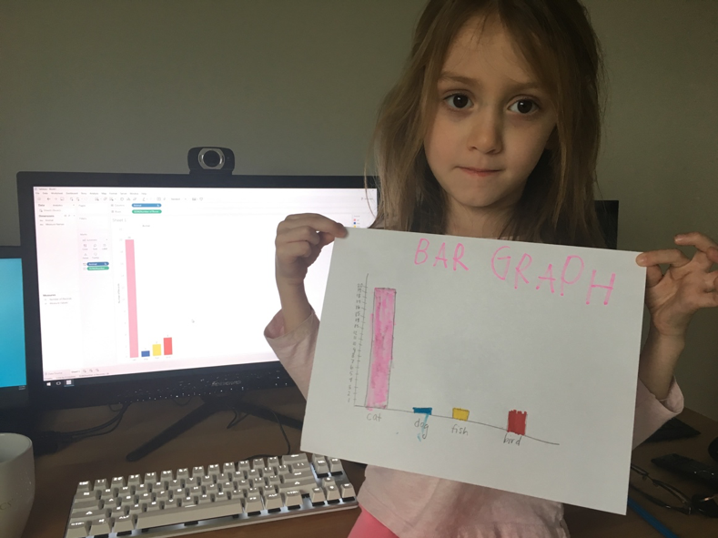

# 数据可视化竞赛：Tableau的魔力是什么？

比赛刚刚开始。 Google在6月6日宣布，他们将收购数据查询和探索工具Looker。 考虑到Looker与Google的Data Studio有一些重叠，这是一个有趣的购买。 （但是，当我回想起Google Next大会时，我不会回想起Data Studio。）当然，收购Looker的目的是缩小Google Cloud在大型市场上落后于Amazon Web Services和Microsoft的差距。 数据和业务分析解决方案。 根据IDC的数据，到2022年，这个市场可能达到2600亿美元。

尽管这对Google来说是一个重大举措，但更大的消息来自Salesforce，该公司宣布了他们计划以157亿美元收购Tableau的计划！ 这对Salesforce意味着什么？ 我有两个想法。

首先，Tableau将大大扩展Salesforce的客户群。 Tableau非常适合Salesforce平台和诸如Einstein之类的技术，以提供易于使用的企业标准可视化工具。 这就是为什么现在不是Salesforce客户的许多人和公司会成为原因的原因之一，首先是现有的Tableau用户，他们很可能会将Salesforce纳入其技术库。 小型公司，独立承包商或只是数据可视化爱好者将很快成为Salesforce每月经常性收入的一部分。 （尽管并非所有Tableau客户都满意。Salesforce承诺维持Tableau的多平台方法和与多个数据集的连接性，但仍需要说服许多现有Tableau用户。他们是与Salesforce当前所使用的用户完全不同的用户组。 ， 毕竟。）

其次，这使Salesforce进一步与Google和Microsoft竞争。 两家技术巨头已经分别提供了数据探索工具Data Studio（和Looker）和Power BI。 这些软件解决方案虽然不错，但我认为没有人会说它们与Tableau处于同一水平。 实际上，Tableau似乎具有一定的魔力。 人们不仅喜欢使用它，而且当谈论它时，他们真的会感到兴奋。 没有多少应用程序可以声称这一点。 那么，Tableau为何会这样？
# 完美的平衡

现在，对于完全不同的东西，Python。 在过去的十年中，Python迅速崛起。 它已经从某些人认为是玩具语言的语言变成了不仅是计算机科学家，而且是一般科学家的通用语言。 无论您是天文学家还是化学家，如果您完全编程，都可能使用Python。 许多人将此成功归功于Python既简单又强大的平衡。 Python中的Hello world是一种简单的衬纸，印刷品（“ Hello World”）。 这需要Java中的三行或C语言中的六行（取决于您格式化代码的方式）。 加上易于编码，也带来了不错的处理速度。 是的，Python的速度不如Fortran快，但是对于来自Excel的人来说，这是闪电。

Tableau似乎也找到了“恰好”的Goldilocks区。 它具有非常柔和的学习曲线，为探索数据提供了很高的可修复性。 数据可视化的赞助人爱德华·塔夫特总结得很好。 “图形上的卓越之处在于可以在最短的时间内为观众提供最多的创意……”。

这似乎是Tableau的核心设计理念。 使用户能够以最少的培训快速浏览数据。 当然，需要进行权衡。 Tableau是否可以像R的ggplot2包一样可自定义，否。 它是否可以像D3.js一样无缝地集成到网页中？ 但是，与其他两个表相比，Tableau的学习曲线要容易得多。 您可以与一个从未使用过Tableau的人坐在一起，然后在几分钟之内他们将自己尝试和探索数据。 Tableau并入了这些其他选项的一些最佳功能。 它利用了ggplot使用的图形语法，并结合了D3的交互功能。 是的，您失去了一些灵活性，但是您获得的速度在大多数情况下是值得的。
# 美很难获得

任何试图从头开始设计图表或图形的人都充分意识到需要选择的大量因素。 颜色，背景色，刻度线，行不透明度，比例，字体大小等。这是一项艰巨的任务。 最终，您进入了进行编辑的过程，甚至不确定是否是一个积极的改变。 如果您想了解选择颜色的难度，请观看YouTube上有关matplotlib重新设计其默认颜色图的过程的讨论。

幸运的是，Tableau可以为您提供大量的设计选择，十分之九的外观看起来很棒。 我问了一个同事他为什么喜欢Tableau，他说：“它使您的数据看起来很漂亮，您甚至不必尝试”。 pretty的价值不容小under。

在图表中，美丽通常是没有干扰的。 如果颜色不亮或刻度线过多，则会分散观众对数据消息的注意力。 佛罗伦萨·南丁格尔就是一个很好的例子。 她使用了极地区域图，该极地图简单易行，分散了注意力，使听众可以专注于数据所讲述的故事（这是Tableau工作簿的链接，可以复制夜莺的著名图表）。

可悲的是，其他可视化工具仍在该领域落后。

Tableau的这种开箱即用的美感，加上其平衡的方法来简化用户的操作，使其成为数据探索和可视化的事实上的工具。 Tableau用户遍及各个行业，涉及任何职务。 实际上，也许唯一比Tableau更普及的数据工具就是Excel。
# Tableau颂歌

我一直非常喜欢Tableau。 这是一款出色的产品，可提供出色的服务。 当我听到他们被收购的消息时，我首先想到的是我为他们感到高兴。 几乎就像我在听一个老朋友做得很好一样。 我仍然记得我的第一本Tableau工作簿。 我在训练营期间完成了我的硕士课程。 它着眼于IMDb的电影评论与烂番茄（我将再次讨论的话题）有何不同。 自那时以来，我大概制作了一百多本Tableau工作簿。 我已经用了太多了，以至于开始侵蚀我的女儿。 在我在家工作的时候，她走进我的办公室，向我展示了她用彩色标记手工绘制的图形。 这是一张条形图，显示了她有多爱各种动物，其中第一位是猫。 我接受了它，并在Tableau中对其进行了重新创建，以向她展示她的工作水平。

Tableau在帮助我建立投资组合方面也至关重要。 甚至我以静态图像结束的数据可视化，也都是通过Tableau工作簿探索数据而开始的。 无论是显示我在研究生院写了多少行代码，还是在Taco Bell上吃饭了几次，Tableau都是帮助我讲述故事的工具。

我的个人资料显示“我是数据科学家，数据插图画家和作家”。 我可能从尼古拉斯·费尔顿（Nicholas Felton）和蒂芙尼·法兰特（Tiffany Farrant-Gonzalez）等艺术家那里获得了灵感，但是Tableau协助我实现了这一中间角色。 它为我提供了艺术上的出路，也为我的日常工作赋予了美感。

祝贺Salesforce收购了一家出色的公司。 我希望Tableau的下一个阶段对公司和使用它的人以及首次发现它的人带来最大的好处。
