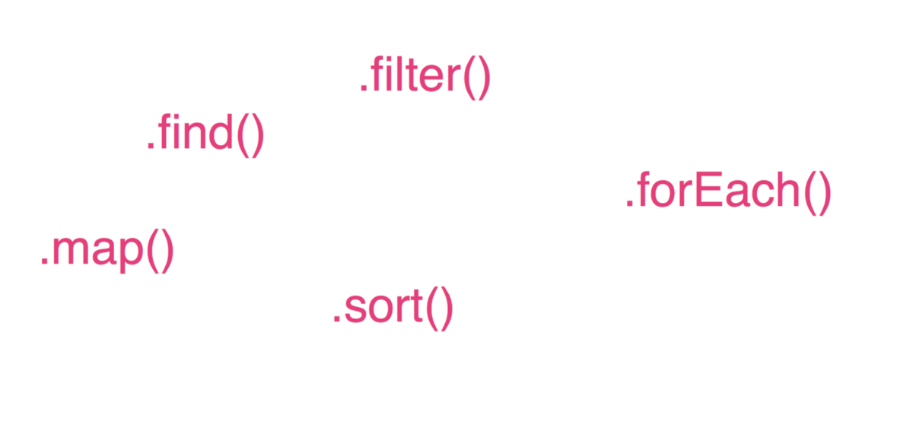

也许您是初学者甚至是经验丰富的开发人员都犯了这些错误-我知道我不止一次。 也许您曾经做过它们，并且熟悉这些陷阱以及如何避免这些陷阱。

无论您的经验水平如何，我希望通过阅读这三个示例，您已经被介绍或刷新了可能导致常见错误或效率低下的各种编码模式。 学习最适合您的编程风格是编写快速，智能代码的好方法。 但这也可能导致您对某些模式或解决方案过于固守，从而使您无法思考这些模式或解决方案之外的问题，从而无法学习或实施更好，更有效的解决方案。
# 初学者最常见的迹象
## 检查编程中的自满情绪，以便您可以避免

> Photo by Valeriy Khan on Unsplash

学习新手艺可能是一个令人困惑的过程。 特别是作为开发人员，您可能熟悉困扰初学者的一个常见问题：找到有效的模式并坚持使用这些模式，却以学习解决问题的新方法和更好的方法为代价。

从我的经验中，我发现，初学者开发人员面临的最常见陷阱通常是在他们的学术或职业生涯的早期就确定了某些模式和过程，然后坚持学习而没有其他选择。

因此，我缩小了在模式/过程中由于这种“可替代性”而引起的三个最常见的陷阱，并提供了一些实际的例子来说明它们。 希望阅读这些内容可以使您反思自己的编程习惯，并能够批判性地考虑编码的其他方面，这些方面可能是您根本不习惯的老模式。 在示例中使用JavaScript编写本文时，以下内容适用于任何语言或框架。
# 1.嫁给单一方法

很多时候，初学者会熟悉一种方法，然后扩展其功能，以使其能够解决用另一种方法可以更简单（或实际上正确地）解决的问题。

例如，假设一个初学者通过学习或实践经验，使用JavaScript .forEach数组方法获得了熟悉。 他们可能倾向于在.map或.filter方法更合适的解决方案中使用.forEach方法。

假设您有一个数字数组，并想创建一个包含这些数字乘以2的新数组。 某些不太喜欢使用.forEach方法的人可能会倾向于执行类似创建新的空数组并将原始数组乘以2的每个成员推入空数组的操作。

但是，在这种情况下，使用.map方法不仅可以用更少的代码行完成这项工作，而且还可以提高计算效率。 尽管第一个示例可以工作，但后者显示了对该语言的更深刻理解。
# 2.分配太多变量

与上面的示例不同，创建新变量（将新元素放入其中的空数组）并不总是处理事情的最佳或最节省内存的方法。 这是我在初学者程序员中观察到的另一个非常常见的陷阱，特别是那些在职业生涯早期学习算法解决方案的程序员。 许多针对初学者的算法解决方案通常包含初始化变量，然后由算法对其进行操作以返回所需的结果。

例如，新手程序员通常会熟悉编写算法函数的过程，这些函数要求函数在函数的开头初始化一个空数组，一个空字符串或一个空对象。 解决这类问题的实践虽然无疑会有所帮助，但可以通过在开始时初始化变量来创建一种解决所有问题的误导性模式。

但是，在优先考虑内存效率的专业环境中，将变量分配为问题的理想解决方案可能不是解决问题的最佳方法。 相反，请问自己是否想要的结果绝对需要初始化变量。 通常，您可以操纵现有对象或利用现有方法/函数的返回值构建内存，这将大大提高内存效率。
# 3.在功能上做太多

我在许多新手开发人员中都看到过一种常见的编码模式，是一种“思维方式，即写即用”的方法，通常会导致函数和类重载。 这是因为开发人员在解决问题时正在编写代码，而不是重新访问代码以进行重构和分解。 这导致内部具有许多不同过程和方法的功能。

在所有语言中，这都是不利的做法，尤其是JavaScript之类的功能语言，其中的“大思想”是编写简洁的，单一用途的函数，然后可以将其四处移动以重新应用于不同目的。

查看您的代码，并始终问自己：“此函数在做什么？”如果该问题的答案包含“和”，“然后”，“也”或任何此类副词，则可能您的函数只是在试图 做得太多，可以分解为多种功能。 这样做不仅会为您和其他开发人员观察您的代码创建易于使用的代码，而且由于数据和对象不会因为大笔费用而丢失，将来还会减少错误和错误。 重载功能。
