你做到了！ 恭喜！！！

谢谢阅读！ 如果您觉得需要包含任何内容，请告诉我。 随时在下方发表评论，或随时在LinkedIn或Twitter上与他人联系。 如果您想阅读更多我的教程，请在Medium：Anne Bonner❤️上浏览我的个人资料。

> Photo by Asya Cusima from Pexels


在某些时候，您将需要将阵列保存到磁盘并重新加载它们，而不必重新运行代码。 幸运的是，有几种使用Numpy保存和加载对象的方法。 可以使用处理普通文本文件的loadtxt和savetxt函数，使用.npy文件扩展名处理NumPy二进制文件的load和save函数以及使用以下命令处理NumPy文件的savez函数将ndarray对象保存到磁盘文件和从磁盘文件加载。 .npz文件扩展。

.npy和.npz文件存储数据，形状，dtype和其他信息，以使ndarray能够正确检索数组的方式重建ndarray，即使该文件位于另一台具有不同体系结构的计算机上也是如此。

如果要存储单个ndarray对象，请使用np.save将其存储为.npy文件。 如果要在一个文件中存储多个ndarray对象，请使用np.savez将其保存为.npz文件。 您还可以使用np.savez_compressed将多个数组以npz压缩格式保存到单个文件中。

使用np.save（）保存，加载和排列数组很容易。 只需确保指定要保存的阵列和文件名即可。 例如，如果创建此数组：
```
a = np.array([1, 2, 3, 4, 5, 6])
```

您可以将其另存为“ filename.npy”
```
np.save('filename',a)
```

您可以使用np.load（）重建数组。
```
b = np.load('filename.npy')
```

如果要检查阵列，可以运行：

输入：
```
print(b)
```

输出：
```
[1 2 3 4 5 6]
```

您可以使用Np.savetxt将NumPy数组另存为纯文本文件（如.csv或.txt文件）。

例如，如果创建此数组：
```
csv_arr = np.array([1, 2, 3, 4, 5, 6, 7, 8])
```

您可以轻松地将其另存为.csv文件，名称为“ new_file.csv”，如下所示：
```
np.savetxt('new_file.csv', csv_arr)
```

您可以使用loadtxt（）快速轻松地加载保存的文本文件：

输入：
```
np.loadtxt('new_file.csv')
```

输出：
```
array([1., 2., 3., 4., 5., 6., 7., 8.])
```

savetxt（）和loadtxt（）函数接受其他可选参数，例如页眉，页脚和定界符。 尽管文本文件更易于共享，但.npy和.npz文件的检索速度更快。 如果需要对文本文件进行更复杂的处理（例如，如果需要处理包含缺少值的行），则需要使用genfromtxt函数。

使用savetxt，您可以指定页眉，页脚，注释等。 在这里阅读更多关于savetxt的信息。

您可以在这里阅读更多关于保存的信息，在这里阅读savez，并在这里加载。 您可以在此处阅读更多有关savetxt的信息，并在此处阅读有关loadtxt的信息。

在此处了解有关输入和输出例程的更多信息。

请注意，使用np.load（）加载包含对象数组的文件时，会使用pickle模块，该模块对于错误或恶意构建的数据并不安全。 考虑传递allow_pickle = False来加载已知不包含对象数组的数据，以便更安全地处理不受信任的源。
# 导入和导出CSV

读取包含现有信息的CSV很简单。 最好，最简单的方法就是使用熊猫。
```
import pandas as pd# If all of your columns are the same type:x = pd.read_csv('music.csv').values# You can also simply select the columns you need:x = pd.read_csv('music.csv', columns=['float_colname_1', ...]).values
```


使用Pandas导出数组也很简单。 如果您不熟悉NumPy，则可能要根据数组中的值创建Pandas数据框，然后使用Pandas将数据框写入CSV文件。

如果您创建此数组“ a”
```
[[-2.58289208,  0.43014843, -1.24082018,  1.59572603],[ 0.99027828,  1.17150989,  0.94125714, -0.14692469],[ 0.76989341,  0.81299683, -0.95068423,  0.11769564],[ 0.20484034,  0.34784527,  1.96979195,  0.51992837]]
```

您可以创建一个熊猫数据框
```
df = pd.DataFrame(a)print(df)
```
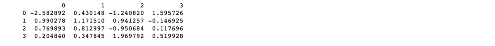

您可以轻松地保存您的数据框
```
df.to_csv('pd.csv')
```

并阅读您的CSV
```
pd.read_csv('pd.csv')
```
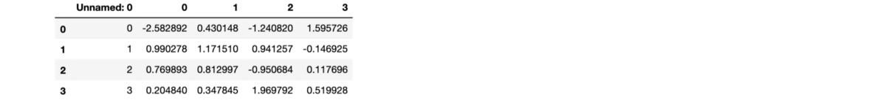

您也可以使用NumPy的“ savetxt”方法保存数组。
```
np.savetxt('np.csv', a, fmt='%.2f', delimiter=',', header=" 1,  2,  3,  4")
```

随时使用以下命令读取保存的CSV

输入：
```
cat np.csv
```

输出：
```
#  1,  2,  3,  4-2.58,0.43,-1.24,1.600.99,1.17,0.94,-0.150.77,0.81,-0.95,0.120.20,0.35,1.97,0.52
```

如果您想了解有关熊猫的更多信息，请访问熊猫官方网站。 通过官方的Pandas安装信息了解如何安装Pandas。
# 用Matplotlib绘制数组

如果您需要为自己的值生成图表，则使用Matplotlib非常简单。

例如，您可能有一个像这样的数组：
```
A = np.array([2, 1, 5, 7, 4, 6, 8, 14, 10, 9, 18, 20, 22])
```

如果您已经安装了Matplotlib，则可以使用
```
import matplotlib.pyplot as plt# If you're using Jupyter Notebook, you may also want to run the following line of code to display your code in the notebook%matplotlib inline
```

您要做的所有绘制值的工作都在运行

输入：
```
plt.plot(A)plt.show()
```

输出：
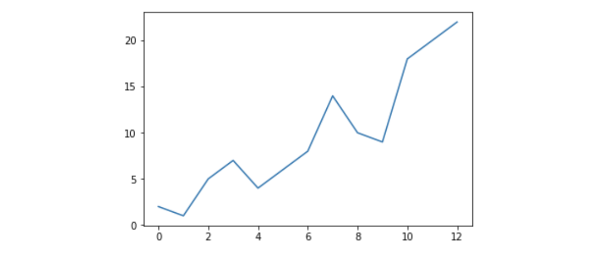

例如，您可以绘制一维数组，如下所示：

输入：
```
x = np.linspace(0, 5, 20)y = np.linspace(0, 10, 20)plt.plot(x, y, 'purple') # lineplt.plot(x, y, 'o')      # dots
```
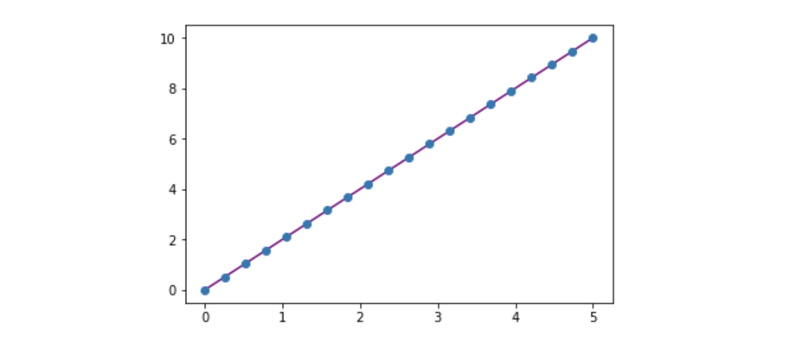

使用Matplotlib，您可以访问大量的可视化选项。
```
from mpl_toolkits.mplot3d import Axes3Dfig = plt.figure()ax = Axes3D(fig)X = np.arange(-5, 5, 0.15)Y = np.arange(-5, 5, 0.15)X, Y = np.meshgrid(X, Y)R = np.sqrt(X**2 + Y**2)Z = np.sin(R)ax.plot_surface(X, Y, Z, rstride=1, cstride=1, cmap='viridis')plt.colorbar()
```
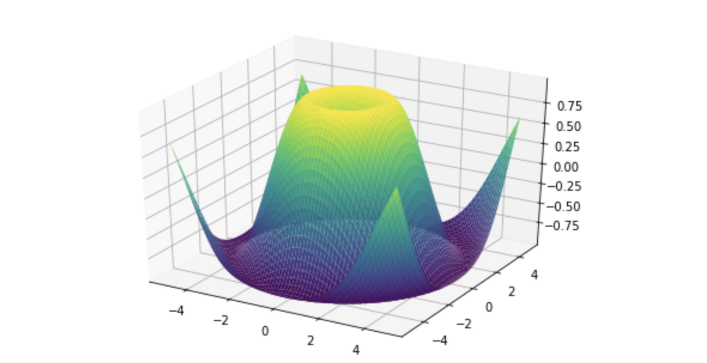

要阅读有关Matplotlib及其功能的更多信息，请查看官方文档。 有关安装Matplotlib的说明，请参见官方安装部分。

当涉及到数据科学生态系统时，Python和NumPy是在考虑用户的基础上构建的。 最好的例子之一是对文档的内置访问。 每个对象都包含对字符串的引用，该字符串称为docstring。 在大多数情况下，此文档字符串包含该对象及其使用方式的简要概述。 Python具有内置的help（）函数，可以帮助您访问此信息。 这意味着几乎在任何时候您需要更多信息，都可以使用help（）快速找到所需的信息。

例如，
```
help(max)
```

将返回
```
Help on built-in function max in module builtins:max(...)    max(iterable, *[, default=obj, key=func]) -> value    max(arg1, arg2, *args, *[, key=func]) -> value    With a single iterable argument, return its biggest item. The    default keyword-only argument specifies an object to return if    the provided iterable is empty.    With two or more arguments, return the largest argument.
```

由于获取其他信息非常有用，因此IPython使用？。 字符作为访问此文档以及其他相关信息的简写。

例如，
```
max?
```

将返回
```
Docstring:max(iterable, *[, default=obj, key=func]) -> valuemax(arg1, arg2, *args, *[, key=func]) -> valueWith a single iterable argument, return its biggest item. Thedefault keyword-only argument specifies an object to return ifthe provided iterable is empty.With two or more arguments, return the largest argument.Type:      builtin_function_or_method
```

您甚至可以将此表示法用于对象方法和对象本身。

假设您创建了以下数组：
```
a = np.array([1, 2, 3, 4, 5, 6])
```

跑步
```
a?
```

将返回很多有用的信息。
```
Type:            ndarrayString form:     [1 2 3 4 5 6]Length:          6File:            ~/anaconda3/lib/python3.7/site-packages/numpy/__init__.pyDocstring:       <no docstring>Class docstring:ndarray(shape, dtype=float, buffer=None, offset=0,        strides=None, order=None)An array object represents a multidimensional, homogeneous arrayof fixed-size items.  An associated data-type object describes theformat of each element in the array (its byte-order, how many bytes itoccupies in memory, whether it is an integer, a floating point number,or something else, etc.)Arrays should be constructed using `array`, `zeros` or `empty` (referto the See Also section below).  The parameters given here refer toa low-level method (`ndarray(...)`) for instantiating an array.For more information, refer to the `numpy` module and examine themethods and attributes of an array.Parameters----------(for the __new__ method; see Notes below)shape : tuple of ints    Shape of created array.dtype : data-type, optional    Any object that can be interpreted as a numpy data type.buffer : object exposing buffer interface, optional    Used to fill the array with data.offset : int, optional    Offset of array data in buffer.strides : tuple of ints, optional    Strides of data in memory.order : {'C', 'F'}, optional    Row-major (C-style) or column-major (Fortran-style) order.Attributes----------T : ndarray    Transpose of the array.data : buffer    The array's elements, in memory.dtype : dtype object    Describes the format of the elements in the array.flags : dict    Dictionary containing information related to memory use, e.g.,    'C_CONTIGUOUS', 'OWNDATA', 'WRITEABLE', etc.flat : numpy.flatiter object    Flattened version of the array as an iterator.  The iterator    allows assignments, e.g., ``x.flat = 3`` (See `ndarray.flat` for    assignment examples; TODO).imag : ndarray    Imaginary part of the array.real : ndarray    Real part of the array.size : int    Number of elements in the array.itemsize : int    The memory use of each array element in bytes.nbytes : int    The total number of bytes required to store the array data,    i.e., ``itemsize * size``.ndim : int    The array's number of dimensions.shape : tuple of ints    Shape of the array.strides : tuple of ints    The step-size required to move from one element to the next in    memory. For example, a contiguous ``(3, 4)`` array of type    ``int16`` in C-order has strides ``(8, 2)``.  This implies that    to move from element to element in memory requires jumps of 2 bytes.    To move from row-to-row, one needs to jump 8 bytes at a time    (``2 * 4``).ctypes : ctypes object    Class containing properties of the array needed for interaction    with ctypes.base : ndarray    If the array is a view into another array, that array is its `base`    (unless that array is also a view).  The `base` array is where the    array data is actually stored.See Also--------array : Construct an array.zeros : Create an array, each element of which is zero.empty : Create an array, but leave its allocated memory unchanged (i.e.,        it contains "garbage").dtype : Create a data-type.Notes-----There are two modes of creating an array using ``__new__``:1. If `buffer` is None, then only `shape`, `dtype`, and `order`   are used.2. If `buffer` is an object exposing the buffer interface, then   all keywords are interpreted.No ``__init__`` method is needed because the array is fully initializedafter the ``__new__`` method.Examples--------These examples illustrate the low-level `ndarray` constructor.  Referto the `See Also` section above for easier ways of constructing anndarray.First mode, `buffer` is None:>>> np.ndarray(shape=(2,2), dtype=float, order='F')array([[ -1.13698227e+002,   4.25087011e-303],       [  2.88528414e-306,   3.27025015e-309]])         #randomSecond mode:>>> np.ndarray((2,), buffer=np.array([1,2,3]),...            offset=np.int_().itemsize,...            dtype=int) # offset = 1*itemsize, i.e. skip first elementarray([2, 3])
```

这也适用于您创建的函数和其他对象。 只需记住在函数中使用字符串文字即可包含文档字符串（文档周围为““””或“”）。

例如，如果您创建此功能：
```
def double(a):  '''Return a * 2'''  return a * 2
```

您可以运行：
```
double?
```

哪个会返回：
```
Signature: double(a)Docstring: Return a * 2File:      ~/Desktop/<ipython-input-23-b5adf20be596>Type:      function
```

您可以通过阅读感兴趣的对象的源代码来获得更高级别的信息。使用双问号（??）可以访问源代码。

例如，运行：
```
double??
```

将返回：
```
Signature: double(a)Source:def double(a):    '''Return a * 2'''    return a * 2File:      ~/Desktop/<ipython-input-23-b5adf20be596>Type:      function
```

如果有问题的对象是用Python以外的语言编译的，请使用??。 将返回与？相同的信息。 您会发现许多内置对象和类型，例如：
```
len?
```

输出：
```
Signature: len(obj, /)Docstring: Return the number of items in a container.Type:      builtin_function_or_method
```

和
```
len??
```

输出：
```
​Signature: len(obj, /)Docstring: Return the number of items in a container.Type:      builtin_function_or_method
```

具有相同的输出，因为它们是用Python以外的其他编程语言编译的。
# 使用数学公式

实现对数组起作用的数学公式是使NumPy在科学Python社区中受到如此高度重视的事情之一。

例如，这是均方误差公式（在处理回归的监督式机器学习模型中使用的中央公式）：
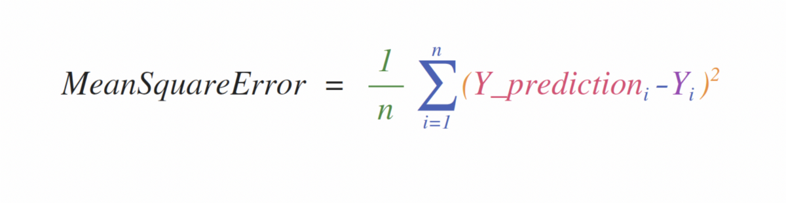

在NumPy中，实现此公式非常简单：
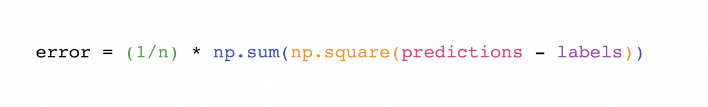

使这项工作如此出色的原因是预测和标签可以包含一个或一千个值。 它们只需要大小相同即可。

您可以通过以下方式对其进行可视化：
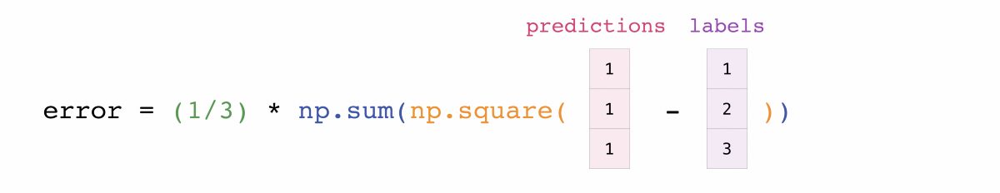

在此示例中，预测向量和标签向量都包含三个值，这意味着n的值为三个。 在执行减法后，向量中的值将平方。 然后NumPy将这些值相加，结果就是该预测的误差值和模型质量的分数。
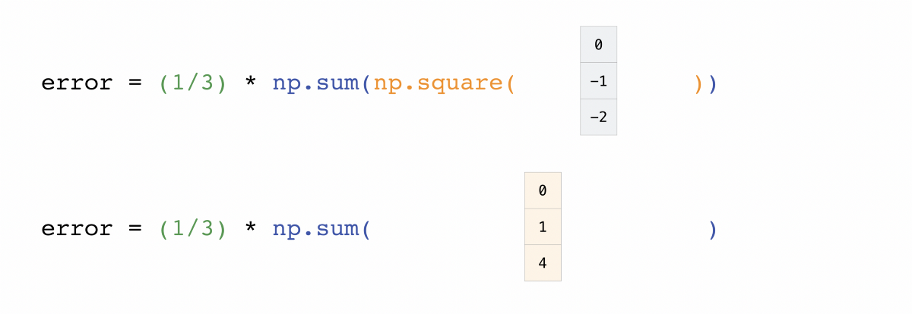

# 如何保存和加载NumPy对象
```
np.save()np.savez()np.savetxt()np.load()np.loadtxt()
```

NumPy的np.flip（）函数使您可以沿轴翻转或反转数组的内容。 使用np.flip时，指定要反转的数组和轴。 如果未指定轴，则NumPy会沿输入数组的所有轴反转内容。

反转一维数组

如果从这样的一维数组开始：
```
arr = np.array([1, 2, 3, 4, 5, 6, 7, 8])
```

您可以使用以下方法将其反转：
```
reversed_arr = np.flip(arr)
```

如果要打印反向阵列，可以运行：

输入：
```
print('Reversed Array: ', reversed_arr)
```

输出：
```
Reversed Array:  [8 7 6 5 4 3 2 1]
```

反转2D阵列

2D阵列的工作方式大致相同。

如果从此数组开始：

输入：
```
arr2D = np.array([[1 , 2, 3, 4], [5, 6, 7, 8], [9, 10, 11, 12]])
```

您可以使用以下方法反转所有行和所有列中的内容：

输入：
```
reversed_arr = np.flip(arr2D)print('Reversed Array: ')print(reversed_arr)
```

输出：
```
Reversed Array:[[12 11 10  9] [ 8  7  6  5] [ 4  3  2  1]]
```

您可以使用以下方法轻松地仅反转行：

输入：
```
reversed_arr_rows = np.flip(arr2D, axis=0)print('Reversed Array: ')print(reversed_arr_rows)
```

输出：
```
Reversed Array:[[ 9 10 11 12] [ 5  6  7  8] [ 1  2  3  4]]
```

或仅反转具有以下内容的列：

输入：
```
reversed_arr_columns = np.flip(arr2D, axis=1)print('Reversed Array columns: ')print(reversed_arr_columns)
```

输出：
```
Reversed Array columns:[[ 4  3  2  1] [ 8  7  6  5] [12 11 10  9]]
```

您也可以只反转一列或一行的内容。 例如，您可以反转索引位置1（第二行）的行的内容：

输入：
```
arr2D[1] = np.flip(arr2D[1])print('Reversed Array: ')print(arr2D)
```

输出：
```
Reversed Array:[[ 1  2  3  4] [ 5  6  7  8] [ 9 10 11 12]]
```

您还可以在索引位置1（第二列）处反转该列：

输入：
```
arr2D[:,1] = np.flip(arr2D[:,1])print('Reversed Array: ')print(arr2D)
```

输出：
```
Reversed Array:[[ 1 10  3  4] [ 5  6  7  8] [ 9  2 11 12]]
```

在此处阅读更多有关反转阵列的信息。
# 重塑和展平多维数组
```
.flatten().ravel()
```

扁平化数组有两种流行的方法：.flatten（）和.ravel（）。 两者之间的主要区别在于，使用ravel（）创建的新数组实际上是对父数组的引用。 这意味着对新数组的任何更改也会影响父数组。 由于ravel不会创建副本，因此可以提高存储效率。

如果从此数组开始：
```
array = np.array([[1 , 2, 3, 4], [5, 6, 7, 8], [9, 10, 11, 12]])
```

您可以使用flatten将数组展平为一维数组。

输入：
```
array.flatten()
```

输出：
```
array([ 1,  2,  3,  4,  5,  6,  7,  8,  9, 10, 11, 12])
```

使用展平时，对新阵列的更改不会更改父阵列。

例如：

输入：
```
a1 = array.flatten()a1[0] = 100print('Original array: ')print(array)print('New array: ')print(a1)
```

输出：
```
Original array:[[ 1  2  3  4] [ 5  6  7  8] [ 9 10 11 12]]New array:[100   2   3   4   5   6   7   8   9  10  11  12]
```

但是，当您使用等级时，对新数组所做的更改将影响父数组。

例如：

输入：
```
a2 = array.ravel()a2[0] = 101print('Original array: ')print(array)print('New array: ')print(a2)
```

输出：
```
Original array:[[101   2   3   4] [  5   6   7   8] [  9  10  11  12]]New array:[101   2   3   4   5   6   7   8   9  10  11  12]
```

在此处阅读更多有关扁平化和浏览的信息。
# 如何访问文档字符串以获取更多信息
```
help()???
```

通常需要旋转矩阵。 NumPy数组具有属性T，可让您转置矩阵。


您可能还需要切换矩阵的尺寸。 例如，当您有一个模型期望某个输入形状与数据集不同时，就会发生这种情况。 这是整形方法可能有用的地方。 您只需要传入矩阵所需的新尺寸即可。
```
data.reshape(2,3)data.reshape(3,2)
```
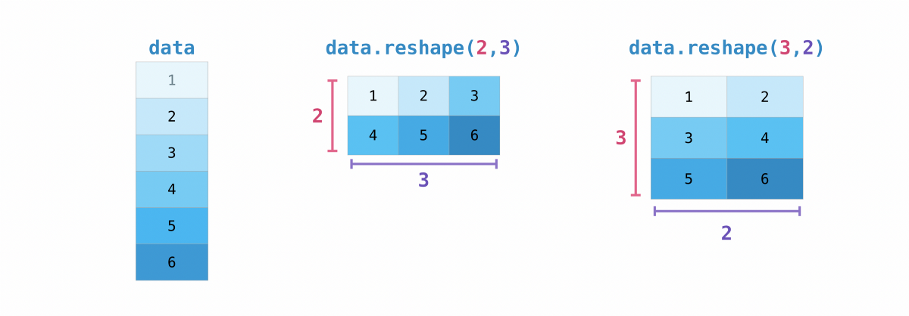

您还可以使用np.transpose根据指定的值反转或更改数组的轴。

如果从此数组开始：
```
arr = np.arange(6).reshape((2,3))arr
```

输出：
```
array([[0, 1, 2],      [3, 4, 5]])
```

您可以使用np.transpose（）转置数组。

输入：
```
np.transpose(arr)
```

输出：
```
array([[0, 3],     [1, 4],     [2, 5]])
```

在此处了解有关转置矩阵和在此处重塑矩阵的更多信息。
# 如何反转数组
```
np.flip
```

您可以使用np.unique轻松找到数组中的唯一元素。

例如，如果您从以下数组开始：

输入：
```
a = np.array([11, 11, 12, 13, 14, 15, 16, 17, 12, 13, 11, 14, 18, 19, 20])
```

你可以使用np.unique

输入：
```
unique_values = np.unique(a)print(unique_values)
```

输出：
```
[11 12 13 14 15 16 17 18 19 20]
```

要获取NumPy数组（数组中唯一值的第一个索引位置的数组）中唯一值的索引，只需在np.unique（）中以及数组中传递return_index参数。

输入：
```
indices_list = np.unique(a, return_index=True)print(indices_list)
```

输出：
```
[ 0  2  3  4  5  6  7 12 13 14]
```

您可以在数组np.unique（）中传递return_counts参数，以获取NumPy数组中唯一值的频率计数。

输入：
```
unique_values, occurrence_count = np.unique(a, return_counts=True)print(occurrence_count)
```

输出：
```
[3 2 2 2 1 1 1 1 1 1]
```

这也适用于2D阵列。 如果从此数组开始：
```
a2D = np.array([[1, 2, 3, 4] ,[5, 6, 7, 8] , [9, 10, 11, 12],  [1, 2, 3, 4]])
```

您可以通过以下方式找到唯一值：

输入：
```
unique_values = np.unique(a2D)print(unique_values)
```

输出：
```
[ 1  2  3  4  5  6  7  8  9 10 11 12]
```

如果未传递axis参数，则2D数组将被展平。

要获取唯一的行或列，请确保传递axis参数。 要查找唯一行，请指定axis = 0，对于列，请指定axis = 1。

输入：
```
unique_rows = np.unique(a2D, axis=0)print(unique_rows)
```

输出：
```
[[ 1  2  3  4] [ 5  6  7  8] [ 9 10 11 12]]
```

要获得唯一的行，出现次数和索引位置，可以使用：

输入：
```
unique_rows, occurence_count, indices = np.unique(a2D, axis=0, return_counts=True, return_index=True)print('Unique Rows: ', '\n', unique_rows)print('Occurrence Count:', '\n', occurence_count)print('Indices: ', '\n', indices)
```

输出：
```
Unique Rows: [[ 1  2  3  4] [ 5  6  7  8] [ 9 10 11 12]]Occurrence Count: [0 1 2]Indices: [2 1 1]
```

在此处了解有关在数组中查找唯一元素的更多信息。
# 转置和重塑矩阵
```
np.reshape()np.transpose()np.T()
```

您可以随时使用ndarray.shape获取NumPy数组的尺寸。 NumPy将以数组的形式返回数组的尺寸。

例如，如果创建此数组：

输入：
```
np_arr = np.array([[1 , 2, 3, 4], [5, 6, 7, 8], [9, 10, 11, 12]])
```

您可以使用np.shape查找数组的形状。

输入：
```
np_arr.shape
```

输出：
```
(3, 4)
```

此输出告诉您数组具有三行四列。

您可以通过指定[0]仅找到行数：

输入：
```
num_of_rows = np_arr.shape[0]print('Number of Rows : ', num_of_rows)
```

输出：
```
Number of Rows :  3
```

或者通过指定[1]仅显示列数：

输入：
```
num_of_columns = np_arr.shape[1]print('Number of Columns : ', num_of_columns)
```

输出：
```
Number of Columns :  4
```

查找数组中的元素总数也很容易：

输入：
```
print(np_arr.shape[0] * np_arr.shape[1])
```

输出：
```
12
```

您也可以将np.shape（）与一维数组一起使用。 如果创建此数组：

输入：
```
arr = np.array([1, 2, 3, 4, 5, 6, 7, 8])
```

您可以打印阵列的形状和长度。
```
print('Shape of 1D array: ', arr.shape)print('Length of 1D array: ', arr.shape[0])
```

输出：
```
Shape of 1D array:  (8,)Length of 1D array:  8
```

您可以使用np.size（）获得数组的尺寸。

输入：
```
# get number of rows in arraynum_of_rows2 = np.size(np_arr, 0)# get number of columns in 2D numpy arraynum_of_columns2 = np.size(np_arr, 1)print('Number of Rows : ', num_of_rows2)print('Number of Columns : ', num_of_columns2)
```

输出：
```
Number of Rows :  3Number of Columns: 4
```

您还可以打印元素总数：

输入：
```
print('Total number of elements in  array : ', np.size(np_arr))
```

输出：
```
Total number of elements in  array :  12
```

这也适用于3D阵列：

输入：
```
arr3D = np.array([ [[1, 1, 1, 1], [2, 2, 2, 2], [3, 3, 3, 3]],               [[4, 4, 4, 4], [5, 5, 5, 5], [6, 6, 6, 6]] ])
```

您可以轻松打印轴的大小：

输入：
```
print('Axis 0 size : ', np.size(arr3D, 0))print('Axis 1 size : ', np.size(arr3D, 1))print('Axis 2 size : ', np.size(arr3D, 2))
```

输出：
```
Axis 0 size :  2Axis 1 size :  3Axis 2 size :  4
```

您可以打印元素总数：

输入：
```
print(np.size(arr3D))
```

输出：
```
24
```

您还可以将np.size（）与一维数组一起使用：

输入：
```
# Create a 1D arrayarr = np.array([1, 2, 3, 4, 5, 6, 7, 8])# Determine the lengthprint('Length of 1D numpy array : ', np.size(arr))
```

输出：
```
Length of 1D numpy array :  8
```

请记住，如果检查数组的大小并且等于0，则数组为空。

在此处了解有关查找数组大小和数组形状的更多信息。
# 创建矩阵

您可以传递列表的Python列表以创建一个矩阵，以NumPy表示它们。
```
np.array([[1,2],[3,4]])
```


在处理矩阵时，索引和切片操作非常有用：
```
data[0,1]data[1:3]data[0:2,0]
```
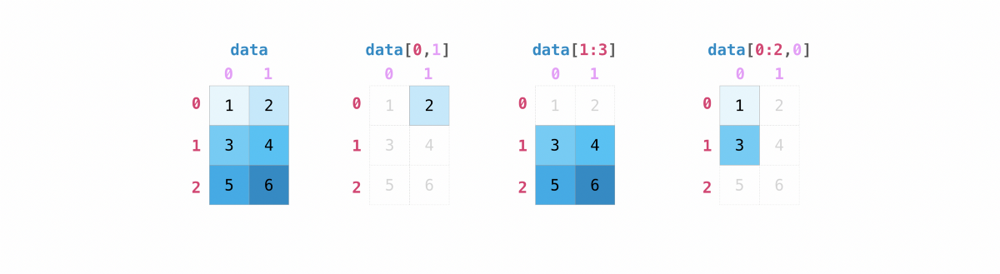

您可以使用与汇总向量相同的方式来汇总矩阵：
```
data.max()data.min()data.sum()
```
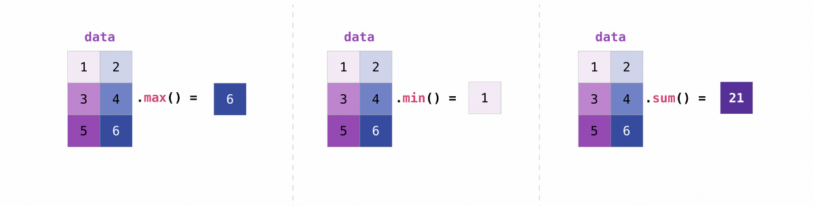

您可以汇总矩阵中的所有值，也可以使用axis参数跨列或行汇总它们：
```
data.max(axis=0)data.max(axis=1)
```
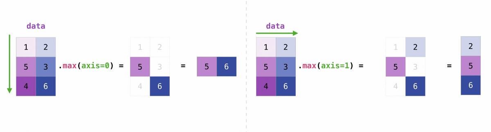

创建矩阵后，如果您拥有两个大小相同的矩阵，则可以使用算术运算符对其进行加法和乘法运算。
```
data + ones
```


您可以对不同大小的矩阵执行这些算术运算，但前提是一个矩阵只有一列或一行。 在这种情况下，NumPy将使用其广播规则进行操作。
```
data + ones_row
```
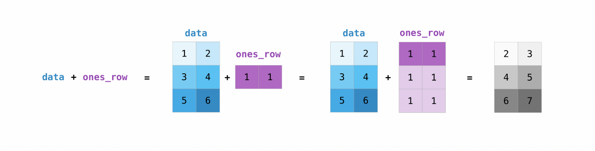

请注意，当NumPy打印N维数组时，最后一个轴的循环最快，而第一个轴的循环最慢。 这意味着：

输入：
```
np.ones((4,3,2))
```

将像这样打印出来：

输出：
```
array([[[1., 1.],      [1., 1.],      [1., 1.]],     [[1., 1.],      [1., 1.],      [1., 1.]],     [[1., 1.],      [1., 1.],      [1., 1.]],     [[1., 1.],      [1., 1.],      [1., 1.]]])
```

在很多情况下，我们希望NumPy初始化数组的值。 NumPy为这些实例提供了诸如ones（），zeros（）和random.random（）之类的方法。 您需要做的就是传递要生成的元素数量。
```
np.ones(3)mp.zeros(3)np.random.random((3)
```
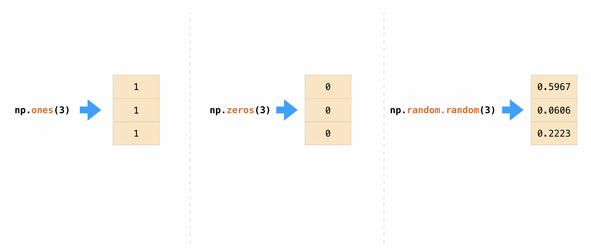

在这里阅读更多有关初始化数组的值的信息，此处初始化为零，此处初始化为零，此处初始化为空数组。
# 产生随机数

随机数生成的使用是机器学习算法的配置和评估的重要组成部分。 无论您是需要在人工神经网络中随机初始化权重，将数据拆分为随机集还是随机地对数据集进行随机整理，能够生成随机数（实际上是可重复的伪随机数）都是至关重要的。

使用NumPy生成随机数时，您有很多选择。 NumPy取代了Random Generator，成为RandomState的替代品。 它们之间的主要区别在于Generator依赖于附加的BitGenerator来管理状态并生成随机位，这些随机位被转换为随机值。

使用Generator.integers，您可以生成从低（请记住，NumPy包含）到高（不包括）的随机整数。 您可以设置endpoint = True来使高数包含在内。

您可以使用以下命令生成2到4个0到4之间的随机整数数组

输入：
```
rng.integers(5, size=(2, 4))
```

输出：
```
array([[4, 0, 2, 1],     [3, 2, 2, 0]])
```

如果给它们一个描述矩阵尺寸的元组，则还可以使用ones（），zeros（）和random（）方法来创建数组。
```
np.ones(3,2)mp.zeros(3,2)np.random.random((3,2)
```
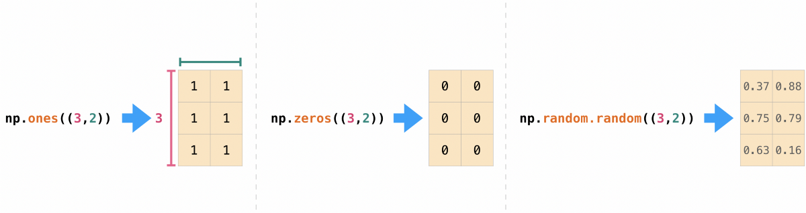

在这里阅读更多关于随机发生器的信息。
# 如何获得独特的物品和数量
```
np.unique()
```

创建阵列后，就可以开始使用它们了。 举例来说，假设您创建了两个数组，一个数组称为“数据”，另一个数组称为“一个”


您可以将数组与加号一起添加。
```
data + ones
```


当然，您可以做的不仅仅是添加！
```
data - onesdata * datadata / data
```
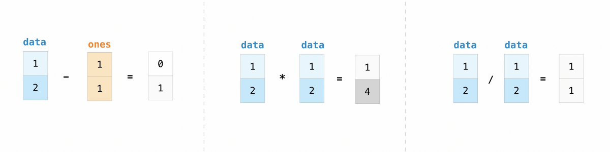

使用NumPy，基本操作很简单。 如果要查找数组中元素的总和，请使用sum（）。 这适用于1D阵列，2D阵列和较大尺寸的阵列。

输入：
```
a = np.array([1, 2, 3, 4])# Add all of the elements in the arraya.sum()
```

输出：
```
10
```

要在2D数组中添加行或列，您需要指定轴。

如果从此数组开始：

输入：
```
b = np.array([[1, 1], [2, 2]])
```

您可以使用以下方法对行求和：

输入：
```
b.sum(axis=0)
```

输出：
```
array([3, 3])
```

您可以对列进行求和：

输入：
```
b.sum(axis=1)
```

输出：
```
array([2, 4])
```

在此处了解有关基本操作的更多信息。
# 广播

有时您可能想在数组和单个数字之间进行运算（也称为向量和标量之间的运算），或者在两种不同大小的数组之间进行运算。 例如，您的数组（我们称其为“数据”）可能包含有关距离的信息（以英里为单位），但您希望将其转换为公里。 您可以执行以下操作：
```
data * 1.6
```
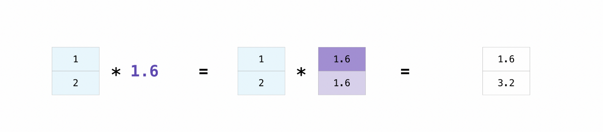

NumPy知道乘法应该发生在每个单元格上。 这个概念称为广播。 广播是一种机制，它允许NumPy对不同形状的数组执行操作。 数组的尺寸必须兼容，例如，当两个数组的尺寸相等或其中一个等于1时。如果尺寸不兼容，则会出现值错误。

在此处了解有关广播的更多信息。
# 更有用的阵列操作
```
Maximum, minimum, sum, mean, product, standard deviation, and more
```

NumPy还执行聚合功能。 除了min，max和sum，您还可以轻松地运行mean以获得平均值，prod获得将元素相乘的结果，std获得标准偏差，等等。
```
data.max()data.min()data.sum()
```
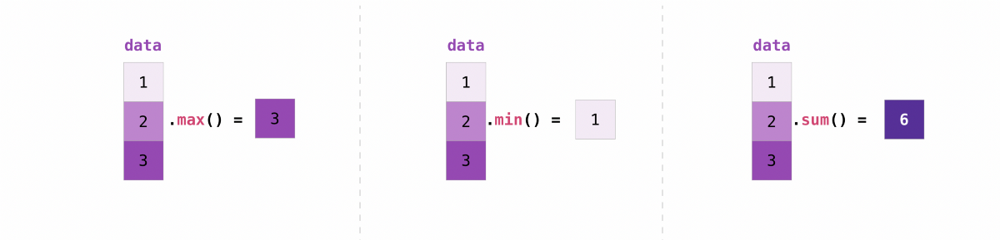

让我们从称为“ A”的数组开始
```
[[0.45053314 0.17296777 0.34376245 0.5510652][0.54627315 0.05093587 0.40067661 0.55645993][0.12697628 0.82485143 0.26590556 0.56917101]]
```

沿行或列进行聚合是很常见的。 默认情况下，每个NumPy聚合函数都会返回整个数组的聚合。 要查找数组中元素的总和或最小值，请运行：

输入：
```
A.sum()
```

要么
```
A.min()
```

输出：
```
# Sum4.8595783866706# Minimum0.050935870838424435
```

您可以指定要在哪个轴上计算聚合函数。 例如，您可以通过指定axis = 0在每一列中找到最小值。

输入：
```
A.min(axis=0)
```

输出：
```
array([0.12697628, 0.05093587, 0.26590556, 0.5510652 ])
```

上面列出的四个值对应于数组中的列数。 使用四列数组，您将得到四个值作为结果。

在此处阅读有关功能和计算的更多信息。
# 如何检查NumPy数组的大小和形状
```
np.shape()np.size()
```

您可以轻松地使用现有阵列的一部分创建新阵列。 假设您有以下数组：
```
array([ 1,  2,  3,  4,  5,  6,  7,  8,  9, 10])
```

您可以随时通过指定要在何处切片的阵列来从阵列的某个部分创建新阵列。

输入：
```
arr1 = array[3:8]arr1
```

输出：
```
array([4, 5, 6, 7, 8])
```

在这里，您从索引位置3到索引位置8抓取了数组的一部分。

您还可以堆叠两个现有的垂直和水平阵列。 假设您有两个数组：

a_1：
```
array([[1, 1],     [2, 2]])
```

和a_2：
```
array([[3, 3],     [4, 4]])
```

您可以使用vstack垂直堆叠它们：

输入：
```
np.vstack((a_1, a_2))
```

输出：
```
array([[1, 1],     [2, 2],     [3, 3],     [4, 4]])
```

或者使用hstack将它们水平堆叠：

输入：
```
np.hstack((a_1, a_2))
```

输出：
```
array([[1, 1, 3, 3],     [2, 2, 4, 4]])
```

您可以使用hsplit将数组拆分为几个较小的数组。 您可以指定要返回的均等形状的数组数，也可以指定应在其后进行划分的列。

假设您有以下数组：
```
array([[ 1,  2,  3,  4,  5,  6,  7,  8,  9, 10, 11, 12],     [13, 14, 15, 16, 17, 18, 19, 20, 21, 22, 23, 24]])
```

如果要将这个数组分成三个形状相同的数组，则可以运行：

输入：
```
np.hsplit(array,3)
```

输出：
```
[array([[ 1,  2,  3,  4],      [13, 14, 15, 16]]), array([[ 5,  6,  7,  8],      [17, 18, 19, 20]]), array([[ 9, 10, 11, 12],      [21, 22, 23, 24]])]
```

如果要在第三列和第四列之后拆分数组，请运行：

输入：
```
np.hsplit(array,(3,4))
```

输出：
```
[array([[ 1,  2,  3],      [13, 14, 15]]), array([[ 4],      [16]]), array([[ 5,  6,  7,  8,  9, 10, 11, 12],      [17, 18, 19, 20, 21, 22, 23, 24]])]
```

在此处了解有关堆栈和拆分数组的更多信息。

您可以使用view方法创建一个新的数组对象，该对象看起来与原始数组的数据相同（浅表副本）

假设您创建了以下数组：

输入：
```
a = np.array([[1 , 2, 3, 4], [5, 6, 7, 8], [9, 10, 11, 12]])
```

您可以使用以下方法创建一个查看相同数据的新数组对象：

输入：
```
b = a.view()
```

使用copy方法将对数组及其数据进行完整复制（深层复制）。 要在您的阵列上使用它，可以运行：

输入：
```
c = a.copy()
```

在此处了解有关副本和视图的更多信息。
# 基本阵列操作
```
Addition, subtraction, multiplication, division, and more!
```

您可以使用np.newaxis和np.expand_dims来增加现有数组的尺寸。

使用np.newaxis一次使用将使数组的尺寸增加一维。 这意味着1D阵列将变为2D阵列，2D阵列将变为3D阵列，依此类推。

例如，如果您从以下数组开始：
```
a = np.array([1, 2, 3, 4, 5, 6])a.shape
```

输出：
```
(6,)
```

您可以使用np.newaxis添加新轴：

输入：
```
a2 = a[np.newaxis]a2.shape
```

输出：
```
(1, 6)
```

您可以使用np.newaxis使用行向量或列向量显式转换1D数组。 例如，您可以通过沿第一维插入轴来将一维数组转换为行向量：

输入：
```
row_vector = a[np.newaxis, :]row_vector.shape
```

输出：
```
(1, 6)
```

或者，对于列向量，可以沿第二维插入轴：

输入：
```
col_vector = a[:, np.newaxis]col_vector.shape
```

输出：
```
(6, 1)
```

您还可以通过使用np.expand_dims在指定位置插入新轴来扩展数组。

例如，如果您从以下数组开始：

输入：
```
a = np.array([1, 2, 3, 4, 5, 6])a.shape
```

输出：
```
(6,)
```

您可以使用np.expand_dims在索引位置1添加轴，方法是：

输入：
```
b = np.expand_dims(a, axis=1)b.shape
```

输出：
```
(6, 1)
```

您可以使用以下方法在索引位置0处添加轴：

输入：
```
c = np.expand_dims(a, axis=0)c.shape
```

输出：
```
(1, 6)
```

在此处找到有关newaxis的更多信息，并在此处找到expand_dims。

> Photo by mentatdgt from Pexels

# 索引和切片

您可以采用与切片Python列表相同的方式对NumPy数组进行索引和切片。

输入：
```
data = np.array([1,2,3])print(data[0])print(data[1])print(data[0:2])print(data[1:])print(data[-2:])
```

输出：
```
12[1 2][2 3]
```

您可以通过以下方式对其进行可视化：
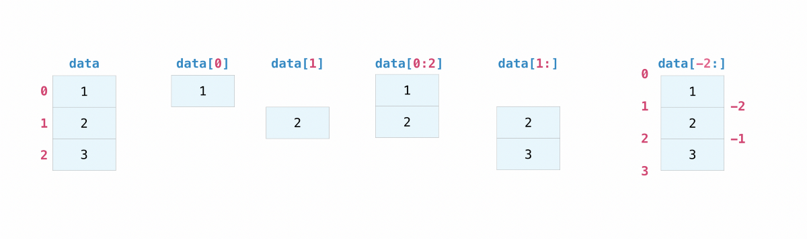

您可能需要将阵列或特定阵列元素的一部分用于进一步的分析或其他操作。 为此，您需要对数组进行子集化，切片化和/或索引化。

如果要从数组中选择满足特定条件的值，使用NumPy可以很简单。

例如，如果您从以下数组开始：
```
a = np.array([[1 , 2, 3, 4], [5, 6, 7, 8], [9, 10, 11, 12]])
```

您可以轻松打印数组中所有小于5的值。

输入：
```
print(a[a<5])
```

输出：
```
[1 2 3 4]
```

例如，您还可以选择等于或大于5的数字，并使用该条件为数组建立索引。

输入：
```
five_up = (a >= 5)print(a[five_up])
```

输出：
```
[ 5  6  7  8  9 10 11 12]
```

您可以选择可被2整除的元素：

输入：
```
divisible_by_2 = a[a%2==0]print(divisible_by_2)
```

输出：
```
[ 2  4  6  8 10 12]
```

或者，您可以使用＆和|选择满足两个条件的元素。 运营商：

输入：
```
c = a[(a > 2) & (a < 11)]print(c)
```

输出：
```
[ 3  4  5  6  7  8  9 10]
```

尽管此数组的效率非常低，但您也可以使用逻辑运算符＆和| |。 为了返回布尔值，这些布尔值指定数组中的值是否满足特定条件。 这对于包含名称或其他类别值的数组很有用。

输入：
```
five_up = (array > 5) | (array == 5)print(five_up)
```

输出：
```
[[False False False False] [ True  True  True  True] [ True  True  True  True]]
```

您也可以使用np.where（）从数组中选择元素或索引。

从此数组开始：

输入：
```
a = np.array([[1 , 2, 3, 4], [5, 6, 7, 8], [9, 10, 11, 12]])
```

您可以使用np.where（）来打印例如小于5的元素的索引：

输入：
```
b = np.where(a<5)print(b)
```

输出：
```
(array([0, 0, 0, 0]), array([0, 1, 2, 3]))
```

在此示例中，返回了一个数组元组：每个维一个。 第一个数组代表找到这些值的行索引，第二个数组代表找到这些值的行索引。

如果要生成元素所在位置的坐标列表，可以压缩数组，遍历坐标列表，然后打印它们。 例如：

输入：
```
list_of_coordinates= list(zip(b[0], b[1]))for cord in list_of_coordinates:    print(cord)
```

输出：
```
(0, 0)(0, 1)(0, 2)(0, 3)
```

您还可以使用np.where（）来打印小于5的数组中的元素，方法是：

输入：
```
print(a[b])
```

输出：
```
[1 2 3 4]
```

如果您要查找的元素不存在于数组中，则返回的索引数组将为空。 例如：

输入：
```
not_there = np.where(a == 42)print(not_there)
```

输出：
```
(array([], dtype=int64), array([], dtype=int64))
```

在此处和此处了解有关建立索引和切片的更多信息。

在此处阅读有关使用where函数的更多信息。

> Photo by Dazzle Jam from Pexels

# 如何从现有数据创建数组
```
slicing and indexingnp.vstack()np.hstack()np.hsplit().view().copy()
```

是!

使用np.reshape（）将在不更改数据的情况下为数组赋予新的形状。 只需记住，当您使用reshape方法时，要生成的数组需要具有与原始数组相同数量的元素。 如果您从一个包含12个元素的数组开始，则需要确保新数组也总共包含12个元素。

如果从此数组开始：
```
a = np.arange(6)print(a)
```

输出：
```
[0 1 2 3 4 5]
```

您可以使用reshape（）重塑数组。 例如，您可以将此数组重塑为具有三行两列的数组：

输入：
```
b = a.reshape(3,2)print(b)
```

输出：
```
[[0 1] [2 3] [4 5]]
```

使用np.reshape，可以指定一些可选参数：

输入：
```
numpy.reshape(a, newshape, order)
```

a是要重塑的数组。

newshape是您想要的新形状。 您可以指定一个整数或整数元组。 如果指定整数，则结果将是该长度的数组。 形状应与原始形状兼容。

order：'C'表示使用类似C的索引顺序读取/写入元素，'F'表示使用类似于Fortran的索引顺序读取/写入元素，'A'表示以类似于Fortran的方式读取/写入元素 如果a在内存中是连续的，则索引顺序为，否则为C顺序。 （这是一个可选参数，不需要指定。）

在此处了解有关形状处理的更多信息。
# 如何将一维数组转换为二维数组（如何向数组添加新轴）
```
np.newaxisnp.expand_dims
```

ndarray.ndim将告诉您数组的轴数或维数。

ndarray.size将告诉您数组元素的总数。 这是阵列形状元素的乘积。

ndarray.shape将显示一个整数元组，该整数元组指示沿数组每个维度存储的元素数。 例如，如果您有一个2行3列的2D数组，则数组的形状为（2,3）。

例如，如果创建此数组：
```
array_example = np.array([[[0, 1, 2, 3]                           [4, 5, 6, 7]],                           [[0, 1, 2, 3]                            [4, 5, 6, 7]],                            [0 ,1 ,2, 3]                            [4, 5, 6, 7]]])
```

要查找数组的维数，请运行：

输入：
```
array_example.ndim
```

输出：
```
3
```

要查找数组中元素的总数，请运行：

输入：
```
array_example.size
```

输出：
```
24
```

并找到数组的形状，运行：

输入：
```
array_example.shape
```

输出：
```
(3,2,4)
```

在此处详细了解尺寸，此处尺寸和形状。
# 您可以重塑数组吗？
```
np.reshape()
```

如果从此数组开始：
```
arr = np.array([1, 2, 3, 4, 5, 6, 7, 8])
```

您可以随时使用np.append（）将元素添加到数组中。 确保指定数组和要包括的元素。

输入：
```
np.append(arr, [1,2])
```

输出：
```
array([1, 2, 3, 4, 5, 6, 7, 8, 1, 2])
```

您可以使用np.delete（）删除元素。 如果要删除数组位置1的元素，可以运行：

输入：
```
np.delete(arr, 1)
```

输出：
```
array([1, 3, 4, 5, 6, 7, 8])
```

在此处阅读有关添加数组和在此处删除元素的更多信息。

使用np.sort（）对元素进行排序很简单。 您可以在调用函数时指定轴，种类和顺序。 在此处阅读有关对数组进行排序的更多信息。

如果从此数组开始：
```
arr = np.array([2, 1, 5, 3, 7, 4, 6, 8])
```

您可以使用以下命令快速按升序对数字进行排序：

输入：
```
np.sort(arr)
```

输出：
```
array([1, 2, 3, 4, 5, 6, 7, 8])
```

除了可以返回数组的排序副本的sort之外，还可以使用：argsort，它是沿指定轴的间接排序，lexsort，它是对多个键的间接稳定排序，searchsorted可以在数组中找到元素。 排序数组和分区，这是部分排序。
# 您如何知道数组的形状和大小？
```
ndarray.ndim()ndarray.size()ndarray.shape()
```

若要创建NumPy数组，可以使用函数np.array（）。

创建一个简单数组所需要做的就是将一个列表传递给它。 如果选择，还可以在列表中指定数据类型。 您可以在此处找到有关数据类型的更多信息。
```
import numpy as npa = np.array([1, 2, 3])
```

您可以通过以下方式可视化数组：


除了根据一系列元素创建数组之外，您还可以轻松创建一个填充0的数组：

输入：
```
np.zeros(2)
```

输出：
```
array([0., 0.])
```

或填充1的数组：

输入：
```
np.ones(2)
```

输出：
```
array([1., 1.])
```

甚至是一个空数组！ 函数empty创建一个数组，其初始内容是随机的，并取决于内存的状态。

输入：
```
# Create an empty array with 2 elementsnp.empty(2)
```

您可以创建一个包含一系列元素的数组：

输入：
```
np.arange(4)
```

输出：
```
array([0, 1, 2, 3])
```

甚至是包含一定范围的均匀间隔的数组。 为此，您将指定第一个数字，最后一个数字和步长。

输入：
```
np.arange(2,9,2)
```

输出：
```
array([2, 4, 6, 8])
```

您还可以使用np.linspace（）创建一个数组，该数组的值以指定的间隔线性间隔：

输入：
```
np.linspace(0,10,5)
```

输出：
```
array([ 0. ,  2.5,  5. ,  7.5, 10. ])
```

指定数据类型

当默认数据类型为浮点（float64）时，您可以使用dtype显式指定要使用的数据类型。

输入：
```
array = np.ones(2, dtype=int)array
```

输出：
```
array([1, 1])
```

在此处了解有关创建数组的更多信息。

> Photo by Godisable Jacob from Pexels

# 添加，删除和排序元素
```
np.append()np.delete()np.sort()
```

您可能偶尔会听到一个称为“ ndarray”的数组，它是“ N维数组”的简写。N维数组只是具有任意数量维的数组。 您可能还会听到一维或一维数组，二维或二维数组等。 NumPy ndarray类用于表示矩阵和向量。 向量是具有单列的数组，而矩阵是指具有多列的数组。

数组的属性是什么？

数组通常是具有相同类型和大小的项目的固定大小的容器。 数组中的维数和项目数由其形状定义。 数组的形状是一个非负整数的元组，用于指定每个维度的大小。

在NumPy中，尺寸称为轴。 这意味着，如果您有一个二维数组，如下所示：
```
[[0., 0., 0.], [1., 1., 1.]]
```

您的数组有2个轴。 第一轴的长度为2，第二轴的长度为3。

就像在其他Python容器对象中一样，可以通过对数组进行索引或切片来访问和修改数组的内容。 不同的阵列可以共享相同的数据，因此在一个阵列上所做的更改可能在另一个阵列中可见。

数组属性反映了数组本身固有的信息。 如果您需要获取甚至设置数组的属性而不创建新数组，则通常可以通过其属性访问数组。

在此处阅读有关数组属性的更多信息，并在此处了解数组对象。
# 如何创建基本数组
```
np.array()np.zeros()np.ones()np.empty()np.arange()np.linspace()dtype
```
## 如何在Mac上成功安装Anaconda（并使其实际工作）
### 快速，轻松的指南，用于正确安装Anaconda并修复可怕的“找不到conda命令”错误
# 绝对入门的NumPy指南
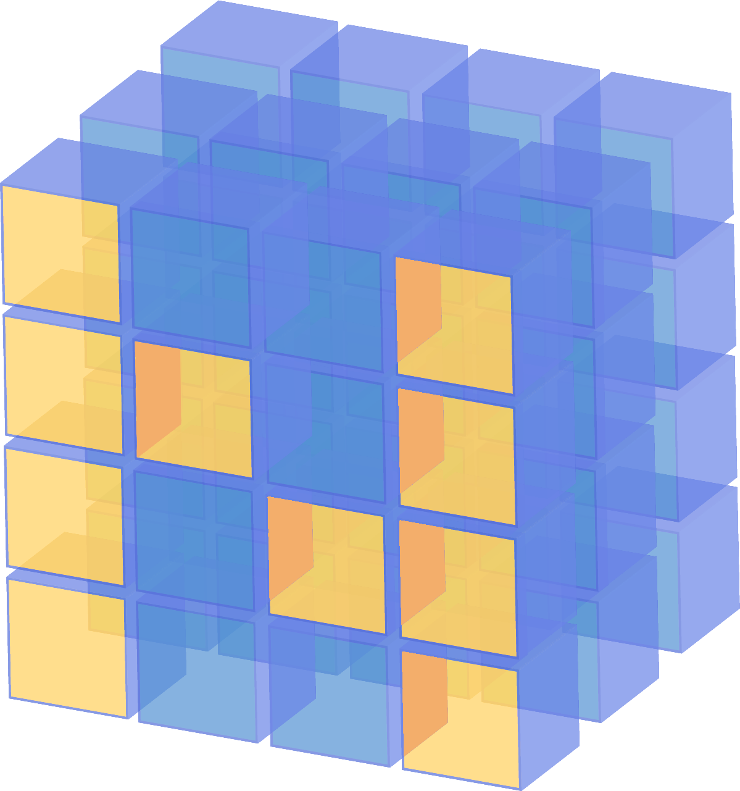
## 欢迎来到NumPy！

NumPy（Numerical Python）是一个开放源代码的Python库，几乎在科学和工程学的每个领域中都使用。 这是在Python中处理数字数据的通用标准，并且是科学的Python和PyData生态系统的核心。 NumPy的用户包括从初级编码人员到经验丰富的研究人员，他们都在从事最新的科学和工业研究与开发。 NumPy API已在Pandas，SciPy，Matplotlib，scikit-learn，scikit-image和大多数其他数据科学和科学Python软件包中广泛使用。

NumPy库包含多维数组和矩阵数据结构（您将在后面的部分中找到有关此信息的更多信息）。 它为ndarray（一个均匀的n维数组对象）提供了对其进行有效操作的方法。 NumPy可用于对数组执行各种数学运算。 它向Python添加了强大的数据结构，以确保使用数组和矩阵进行高效的计算，并且提供了可在这些数组和矩阵上运行的庞大的高级数学函数库。

在这里了解更多有关NumPy的信息！
# 安装NumPy

要安装NumPy，我强烈建议您使用科学的Python发行版。 如果您正在寻找有关在操作系统上安装NumPy的完整说明，则可以在此处找到所有详细信息。

如果您已经拥有Python，则可以使用以下命令安装NumPy：
```
conda install numpy
```

要么
```
pip install numpy
```

如果您还没有Python，则可以考虑使用Anaconda。 这是最简单的入门方法。 获得这种分布的好处是，您不必担心单独安装NumPy或将用于数据分析的任何主要软件包，如熊猫，Scikit-Learn等。

如果需要有关安装的更多详细信息，可以在scipy.org中找到所有安装信息。

> Photo by Adrienn from Pexels


如果您在安装Anaconda时遇到问题，不妨看一下这篇文章：
## 如何在Mac上成功安装Anaconda（并使其实际工作）
### 快速，轻松的指南，用于正确安装Anaconda并修复可怕的“找不到conda命令”错误
# 如何导入NumPy

每当您想在代码中使用包或库时，首先需要使其可访问。

为了开始使用NumPy和NumPy中的所有可用功能，您需要将其导入。 使用以下导入语句可以轻松完成此操作：
```
import numpy as np
```

（为了节省时间并保持代码标准化，我们将“ numpy”缩短为“ np”，以便使用您的代码的任何人都可以轻松理解和运行它。）
# Python列表和NumPy数组有什么区别？

NumPy为您提供了众多快速，有效的数字相关选项。 虽然Python列表可以在一个列表中包含不同的数据类型，但是NumPy数组中的所有元素都应该是同质的。 如果阵列不是同质的，则不可能对阵列执行数学运算。

为什么要使用NumPy？

> Photo by Pixabay from Pexels


NumPy数组比Python列表更快，更紧凑。 阵列消耗更少的内存，使用起来更加方便。 NumPy使用更少的内存来存储数据，并且提供了一种指定数据类型的机制，从而可以进一步优化代码。
# 什么是数组？

数组是NumPy库的中央数据结构。 它是一个值网格，其中包含有关原始数据，如何定位元素以及如何解释元素的信息。 它具有可以以各种方式建立索引的元素网格。 元素都是相同的类型，称为数组dtype（数据类型）。

一个数组可以由非负整数的元组，布尔值，另一个数组或整数来索引。 数组的等级是维数。 数组的形状是一个整数元组，给出沿每个维度的数组大小。

初始化NumPy数组的一种方法是来自嵌套的Python列表。
```
a = np.array([[1 , 2, 3, 4], [5, 6, 7, 8], [9, 10, 11, 12]])
```

我们可以使用方括号访问数组中的元素。 访问元素时，请记住，NumPy中的索引从0开始。这意味着，如果要访问数组中的第一个元素，则将访问元素“ 0”。
```
print(a[0])
```

输出：
```
[1 2 3 4]
```
# 有关数组的更多信息
```
1D array, 2D array, ndarray, vector, matrix
```
# NumPy终极入门指南
## NumPy入门所需的一切

> Photo by Skitterphoto from Pexels


世界以数据为基础，每个人都应该知道如何使用数据。

很难想象没有以某种形式使用数据分析，数据科学，机器学习或人工智能的现代，技术娴熟的企业。 NumPy是所有这些领域的核心。

虽然无法确切知道有多少人正在学习分析和使用数据，但可以肯定地说，成千上万（如果不是数百万）的人需要了解NumPy及其使用方法。 因此，我花了最后三个月的时间整理了我希望是NumPy最好的入门指南！ 如果您想在本教程中看到任何内容，请在评论中留下注释或随时联系！

如果您是数据分析的新手，那么这个适合您。

> Photo by Lucas Pezeta from Pexels

