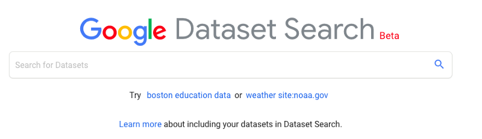

# 这就是您将数据放入数据科学的方式！
## 数据科学已经发展。 这2000万个数据集就是证明。

> (Er, wrong Data search tool.)


我最近最喜欢的Google搜索系列产品之一是数据集搜索。 是的，你听到的是对的。 您可以像搜索图像一样搜索数据集！

您现在可以像搜索图像一样搜索数据集！

> You can play with Dataset Search here.

## 数据集搜索如何评价公众的数据素养

如果没有人使用Google的垂直搜索引擎（如Google Images或Google Scholar），它们将不会持续很长时间，因此它们的种类告诉您人们倾向于在互联网上寻找什么的一些信息。 图片，视频和新闻不足为奇。 但是数据集？ 您的提示是，不仅要为遥远的冰屋中的三位孤立的教授使用数据集。 好大 …而且越来越大。

有什么收获？ 没有一个。 这实际上与使用Google图片或Google学术搜索进行搜索相同，只是针对数据集。 当前已建立索引并可以使用超过2000万（！）数据集……并且该索引正在快速增长。

今天，您可以轻松触及2000万个数据集……明天还会有更多。

现在您已经知道它的存在，您可以在这里试用它，也可以继续讨论“数据集搜索”的工作原理以及它对数据科学专业和整个人类的意义。

> A screenshot from my most recent Dataset Search session. Back when I was in grad school I would have groveled shamelessly for clues about where to beg for access to data like these. (That’s literally what we had to do to get it: write long emails begging other laboratories to cough it up, usually to no avail. Give me a moment while I get misty-eyed over how easy the new way is.)

## 加速分析的一场革命

Analytics（分析）是资料科学的一部分，旨在迅速激发灵感。 与统计或机器学习不同，分析的最高优点是速度。 （为安全起见，优秀的分析人员可避免在得出新数据之前就得出结论。）

更快地访问数据可为您提供更强大的分析功能。

您知道容易找到数据集时会得到什么吗？ 更快的分析！ 数据集搜索代表了您所有专业分析师和数据科学家的不可思议的速度提升。 （但是，如果您有认真对待灵感的危险，请务必谨慎地采用统计方法进行跟进。）
## 是的，但是真正的收获是什么？

如果您是在一个数据集非常稀有，珍贵并且经常由教授或数据提供者策划的世界中长大的，就像我们大多数人一样！ —您可能会出现一些无意识的偏见：您假设向谁提供数据的人应对数据质量负责（并且可能在某处藏了一两个博士学位）。 如果您主要是在学习或科学的背景下使用数据集，则可能会给人一种印象，即数据集在到达您之前就受到了精心的按摩。

现实生活中的数据科学是一个丛林，而不是您的教授策划的神圣空间。

暂时搁置这一偏见，然后考虑另一种偏见：外行人之间数据崇拜的毒性作用。 任何倾向于用大写“ D”表示数据的人都可能会认为，以结构化形式打包的所有信息都是有用且真实的。 嘿，这不是魔术。 不要相信您阅读的所有内容，也不要相信每个数据集。 在此处了解有关数据性质和数据崇拜的更多信息。

如果您过着大多数为您提供数据的人享有声誉的生活，并且/或者被教导您崇拜数据和科学，那么您将感到震惊。 你猜怎么了！ 数据集可能是一堆结构化的垃圾。 可能会坏掉。 它可以弥补。 可能是60亿个零。 可能什么都没有。 就像文字一样！

“如果是写在书上，那一定是真的……”

说到文字：“如果是写在书上，那一定是真的……”对吗？ 错误！ 更糟糕的是：“如果是在网上写的，那一定是真的……”我看到你刚刚拉过的脸，我很喜欢。 好。 您对此表示怀疑。 你应该。 现在，“如果它写在数据集中，那一定是真的……”

> A book! It must be true.


那里有很多垃圾，因为任何人都可以写他们想要的东西。 您比相信它更好。 相反，您需要花一点时间来考虑源。 很好，因为这种习惯也将使您在数据领域中保持安全。

如果您习惯于信任数据而不是书面数据，请当心。

如果您习惯于信任数据而不是书面数据，请当心。 您可能有这种习惯，而没有意识到。 不要将数据视为大写字母D的缩写。 重新定向您的街头网络习惯，即您在搜索Google图片或整个网络时经常使用的习惯。 您知道，当您问得好时，Google不会拥有或编辑这些猫图片或它提供的隐形药水配方。 （您知道那些隐形药水是行不通的，对吗？）您知道质量会有所不同，并且要由您来认真考虑一下来源，然后再相信所有阅读内容。 您知道互联网上有各种各样的东西，而且您已经很容易受到欺骗。 好吧，主要是。 即使是我们最好的人，也偶尔会点击那些“一个怪诞的把戏”链接或古怪的新闻报道。

如果您将惯常的街头互联网搜索怀疑度应用于数据集搜索，则不会有任何收获。


像对待任何其他Internet搜索结果一样对待Dataset Search结果。 该工具将帮助您筛选大海捞针，但您需要仔细检查猫所拖入物的质量。

但是，如果要在质量各异的巨大可搜索的聚宝盆猫图片和3张精美策划的猫图片的小相册之间进行选择，我会每天选择前者。 （嗯，我实际上会选择这两个，因为我很贪婪……您也可以。这些搜索工具没有一夫一妻制。）
## 互联网主要是垃圾邮件

并非所有事物都对您有好处。 也就是说，Google会竭尽全力打击垃圾邮件并优先考虑合法结果。 是的，人们会把垃圾数据集放到那里来吸引您的注意力，是的，我们将其排名以尝试为您提供优质的服务。 就像常规搜索一样。 但是您不应该期望这些东西是完美的。

要使您的数据集可搜索，只需将schema.org中的元数据添加到描述数据集的每个网页上。

要使您的数据集可搜索，只需将schema.org中的元数据添加到描述数据集的每个网页上。 任何人都可以做到，就像任何人都可以写博客文章一样。 可能是垃圾（也许此博客文章是……呃，哦），所以请认真考虑来源。

如果您要使用自由范围数据，则需要保持智慧。 不要相信您阅读的所有内容。
## 它是如何工作的，schema.org是什么？

schema.org的构想由一个由通常的嫌疑人组成的财团于2011年提出：Google，Bing，Yandex，Microsoft和Yahoo。 他们厌倦了猜测已刮取网页的内容，因此他们决定创建一个通用词汇表，供提供者用来告诉他们什么。 该词汇表已嵌入HTML中，以指示哪些位描述了事件，地址，配方等。 它是一个描述不同类型信息的小模式（因此得名！）。 当您选择将schema.org添加到页面并告诉它页面包含数据集时，该数据集将有资格显示在“数据集搜索”结果中。

数据提供商使用schema.org告诉我们他们的页面上有一个数据集，并描述了一些有关它的元数据。

这不是Google特有的魔法； 这是任何人都可以贡献的开放社区标准。 许多公司已经在后台使用了多年。 Google专有的功能是您可以使用“数据集搜索”搜索这些数据集的新功能。 我们让数据提供商使用schema.org告诉我们他们的页面上有一个数据集，并描述一些有关它的元数据。 数据集搜索与常规搜索非常相似，但是结果仅限于声称拥有数据集的页面。 简单实用。
## 如何参与共享数据

当数据仅来自负责精心策划每个人的少数大型提供商（例如政府和大学）时，较小的参与者就没有共享它们的途径。

想象一下这种情况：一群高中女生正在从事课外机器人项目。 他们正在收集大量数据，这些数据可能对具有相似爱好的人非常有用。 他们甚至愿意分享它（他们多么友好）。 他们已经在高中网站上添加了指向该网站的链接。 恰好它们的数据恰好是帮助您进行原型制作所需的。 现在怎么办？

> All-girls Afghan robotics team. Image: SOURCE.


如果他们的数据集不可搜索，那么您将永远找不到。 如果必须由策展人（如政府）托管他们的数据以便访问，则会被告知要排队……而且他们可能永远也不会出现在前列。 那些花费大量资源进行大量策展的提供者只有有限的时间和注意力集中在优先资源上。 结果如何？ 您永远不会知道错过了什么。

这就是为什么我觉得整个数据集搜索范式非常漂亮的原因。 共享数据（无需中间人告诉您迷路）意味着即使人们有小众口味，也可以找到并提供丰富的资源……或者使高中网站晦涩难懂。

参与共享可搜索数据：
+ 您需要数据。
+ 您需要通过schema.org指示您有数据。 （您可以自己执行此操作，也可以将其放入Zenodo这样的存储库中，为您执行此操作。）
## 其他抓住

希望同时满足这两个条件的意愿因地而异，这并不使您感到惊讶。 政府是率先索引其数据集的政府之一，因此，他们倾向于收集的数据集（天气数据，有人吗？）是您疯狂进食的最佳人选，而稀疏收集的专有数据将很少出现。 也就是说，每天都在添加更多数据，搜索为免费和付费数据提供了方便。 （有点像Google图片中带有水印的专有图片。）您可以根据自己的意愿选择要经过的门，以及收费是否值得。
## 人类的大局

诸如数据集搜索之类的庞大用户群是人类在数据科学和数据素养方面的发展的象征。 我们正在成长为一个物种，并且正在扩展我们部署感官的方式以及与信息进行交流的方式。

数据分析正在成为每个人的游戏。

过去，我们曾经在Internet上打开单个页面的能力给人留下了深刻的印象，然后在浏览器中打开50个选项卡（每个数据点一个）的能力给人留下了深刻的印象。 现在我们渴望更多。 我们希望数据集可以使用为这项工作而构建的代码工具（例如Python和R）快速定型和汇总。 精通数据的社区现在已达到临界规模。 我们中足够的人具有理解数据的技能，而我们不再满足于图片覆盖的书面页面。 （您现在正在凝视的那种。哈。）

> Image: SOURCE.

## 素养的演变

要使用当前正在阅读的资源（例如您正在阅读的资源）中的信息，您需要特殊的读写能力。 您的思维需要能够将自己包裹在文字周围。 这是您理所当然的技能。 如果只有很少的人掌握这项技术，那么此博客文章将不存在。 Google可能也不存在。

数据集搜索代表着数据素养民主化的上升趋势。

同样，数据集搜索代表着数据素养民主化的上升趋势。 如果说山峰和犹豫不决的话，那么整个开发过程就是一种攀登顶峰的方式，“处理数据不再是一种完全利基的技能！”它不再局限于少数抄写员将象形文字雕刻成粘土片。 （哦，等等，那是写作。尽管是相同的想法。）

在线数据集提供了一种新的自我表达工具，它遵循了与互联网其他部分相同的规则。

数据集搜索可帮助您在聊天中找到宝石。

数据集正在成为一种广泛的交流形式-一种美丽的新语言，我们许多人都能说流利，而且每天都有很多人在学习。 对于那些从小就开始讲数据的人来说，能够以我们的语言获得搜索结果真是令人欣慰。

这就是为什么我对数据集搜索的感受直截了当的原因：“最后！”


您娱乐的技术细节：
+ Google AI博客文章
+ Web Conference 2019论文

在bit.ly/dataset_search上尝试一下。
```
(本文翻译自Cassie Kozyrkov的文章《This is how you put the data in Data Science!》，参考：https://towardsdatascience.com/this-is-how-you-put-the-data-in-data-science-5411c8a45122)
```
