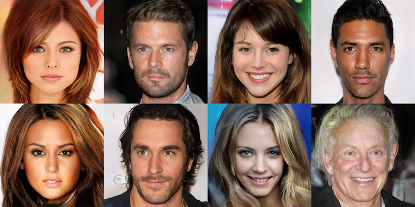

## ConorLazarou /中
### GAN学会产生螺旋时的可视化
# 这将改变您看待GAN的方式
## GAN学习和模式崩溃的实时可视化

> Illustration by Sian Molloy


对移动用户的警告：本文中包含一些大块的gif图像。
# 伪造者和侦探走进酒吧

除非您过去几年一直生活在一块岩石上，否则您肯定会听说过围绕生成对抗网络（GAN）的狂热。 特别是，它们创建新的逼真的图像的能力令人震惊。 考虑以下图像：

> Output from pg-GAN (source: NVIDIA)


以上人员均不存在。 这些“照片”是由NVIDIA对GAN技术的不断发展而创造的，仅是GAN发展中的一个例子。

GAN技术背后的基本前提很简单：两个网络，一个生成器和一个鉴别器，被串联训练。 鉴别器显示了来自训练数据的真实样本（例如照片）和生成器创建的假样本，并负责将真实物品与伪造品分开。 同时，生成器的任务是创建假样本，并欺骗鉴别器将其分类为真实样本。 生成器能够产生各种输出，因为它接受了随机噪声作为输入，通常以100个正态分布值的矢量形式出现。 因此，发生器可以看作是从某个潜在空间到样本空间的映射，而鉴别器可以看作是一种工具，用于测量发生器描述的样本空间中的分布与样本的真实分布之间的差异。 真实样本。

众所周知，GAN很难训练。 在模式崩溃，无法收敛，循环以及其他许多问题之间，GAN具有很多失败模式，并且众所周知。 GAN训练背后的中心思想是，生成器创建一个样本，鉴别器告诉生成器出了什么问题。 为了引导生成器，鉴别器必须能够将样本域中的每个点映射到该点是真实样本的概率。 这听起来似乎很简单，但是像深度学习中的大多数事情一样，它在后台是相当复杂的。 为了帮助说明GAN培训的复杂性，我为一个非常简单的问题的培训过程创建了可视化文件。
# 问题

> Figure 1: The input space (left) and corresponding output (right) of the target function. The input space will commonly be referred to as the latent space, and the output space is referred to as the sample space.


考虑一下图1中所示的映射。2D输入空间（[-1、1]，[-1、1]）被映射到一个螺旋，其中输入（潜）空间中的x位置决定了沿着螺旋的距离 该点是（在样本空间中），y位置确定该点在螺旋内的横向位置。 这是目标函数的可视化，它将随机输入转换为螺旋形：

> Figure 2: An animation of the target function applied to random input


因此，当前的任务是训练能够从这种螺旋分布生成点的GAN。 由于原始函数具有两个自由度，因此GAN将获得2D随机噪声作为输入。
# 解决方案？

我为GAN训练了600个训练步骤，并在每个步骤后将其可视化。 生成器和鉴别器都具有三个完全连接的层，具有泄漏的ReLU激活。 使用具有默认参数的Adam优化器，将生成器和鉴别器的学习率均设置为0.001。 培训过程如图3所示。 它正在进行很多工作，所以让我们逐面板进行研究。

> Figure 3: An animation of the GAN training process. Top left: the losses and accuracies of the generator and the discriminator. Top centre: the training step. Top right: real samples and generated samples. Bottom left: discriminator output of the latent space. Bottom right: discriminator output of the sample space.

## 左上：准确性和损失

在左上方的面板中，您可以看到每个训练步骤的生成器和鉴别器的损失（二进制交叉熵）和精度。 两种损失都在ln（0.5）= 0.69范围内徘徊，这表明判别器对其预测完全没有信心。 发生器精度（即，它有效地欺骗了鉴别器）通常为100％，在回弹至100％之前偶尔会降至0％。
## 右上方：真实和伪造样本

在每个训练步骤之后，绘制真实分布（蓝色）和生成的分布（红色）。 如您所见，在大多数步骤中，发生器的输出已减小到一个很小的区域，在该范围内波动。 特别要注意的是，红色的输出斑点会一直保持放置状态，直到发生器精度降低或损耗增加为止，此时它会飞到该范围的另一部分。
## 左下：潜在空间鉴别器输出

undefined
## 右下：样本空间鉴别器输出

该面板与左下方的面板非常相似，不同之处在于它使样品空间而不是潜在空间可视化。 此面板中的每个点都对应于示例空间中的2D点，颜色代表鉴别者对该点为真实的置信度。 换句话说，它是生成器相对于目标函数所产生的任何给定点的学习相对频率的可视化。
# 那么，这是怎么回事？

您在上面的gif图片中看到的是模式崩溃。 发生器的输出已经缩小到判别器认为可能是真实的样本的微小区域（图3，右上图）。 当鉴别者得知该区域中的大多数点都是伪造的时，生成器将简单地转移到鉴别者认为是真实的另一个区域。 从右下方的面板可以明显看出这一点； 蓝色区域是鉴别者认为更可能是真实的区域。 因此，驱动发生器驱动该区域中的样品。 尝试移动光标，使其始终位于右下面板的最蓝色区域； 您会发现您的光标和右上方面板中的红色blob在该范围内遵循相同的轨迹。

您可能建议生成器没有能力学习目标函数。 我认为可能是这种情况，但这是生成器的可视化视图，该生成器通过监督回归学习目标函数，类似于图3的右上图：

> Figure 4: An animation of the generator learning the target function through supervised regression


您可能还建议鉴别器没有能力学习目标功能。 我也认为可能是这种情况，但这是辨别器的可视化，了解目标函数和均匀噪声之间的决策边界，类似于图3的右下图：

> Figure 5: An animation of the discriminator learning the relative probabilities of a point being produced by the target function (blue) or merely uniform noise (red) through supervised classification.


最后，您可能建议GAN仅需要更多时间来收敛于解决方案。 不幸的是，即使经过数千步培训，GAN仍显示出与前600步完全相同的行为。 该过程非常类似于以下内容：

> Figure 6: a GAN in the throes of mode collapse (artist’s impression, source: Giphy)


这里的主要问题是对歧视者性质的误解。 在讨论GAN时，通常将辨别器描述为能够预测给定样本是真实的还是伪造的。 不是这种情况。 判别器实际上所做的是对给定样本是来自真实数据集还是由生成器创建进行分类。 区别很细微，但请考虑下图：

> Figure 7: the target distribution (blue, both) vs uniform noise (red, left) and generator output (red, right)


在左侧，我们看到两个类别：真实样本（蓝色）和随机噪声（红色）。确定每个类别在每个点的相对概率就可以提供信息丰富的鉴别器（实际上，这就是图5中鉴别器的训练方式）。在右侧，我们还看到两个类：真实样本（再次为蓝色）和发生器的输出（红色）。接受此数据训练的判别器没有用；它会得出结论，该红色小区域内的任何样本都可能由生成器生成，而该区域之外的任何东西都可能是真实样本。从此推断，鉴别器确定范围角上的偶数点也可能是真实样本，尽管事实是该区域从未见过样本。这鼓励生成器在那些极端区域中生成点。最终，鉴别者得知该新区域很可能都是伪造点，而没有学习到原始区域同样大部分是伪造的，因为在那里不再产生伪造点。
# 更好的解决方案

关于模式崩溃的问题，已经进行了很多研究，还没有办法将其全部整合到一篇文章中。 我们将应用一些常见的技巧来改进培训：降低生成器学习率和Adam优化器的β1参数。 在原始的培训过程中（图3），我对生成器使用的学习率为0.001。 我以0.0002的学习率并将β1从0.9降低到0.5来重复该过程：

> Figure 8: An animation of the GAN training process. As figure 3, but using better optimizer parameters


在这里，生成器在探索样本空间方面做得更好，这反过来又导致了更多信息的鉴别。 如果我们允许GAN训练60万步而不是600步，我们将看到以下结果：

> Figure 9: The result of training the GAN with a reduced learning rate for 600000 steps


正如您所看到的，在这种情况下，鉴别器（右下图）比图3中学习了更多有用的相对分布，这使得生成器更加有效（右上图）。 在左下方的面板中，我们看到在潜在空间中有两个区域，生成器无法映射到使鉴别器蒙蔽的样本，即深红色垂直线； 生成器将这些区域中的点映射到螺旋的负空间。 这些区域的原因说明如下：

> Figure 10: An animation of the trained generator mapping random input to the learned spiral distribution


动画清楚地表明，与图2中所示的平滑函数不同，在这两个区域上均切开了平滑的潜在空间。在潜在空间中靠近在一起但在直线的相对侧上的点最终在图2中彼此远离。 样本空间; 线上的点位于两者之间的某个位置，大部分位于目标分布之外。 尽管最简单的解决方案是使一个尺寸对应于沿螺旋的位置（长度），而另一个尺寸对应于沿螺旋的位置（宽度），但GAN却陷入了涉及极端轮廓的局部最小值中。 这是GAN的一个常见问题，我们认为相似的功能可能在潜在空间中彼此分离，反之亦然。
# 总结思想

GAN通常应用于高维图像数据，因此很容易错过树木的叶子。 甚至MNIST（生成模型的问候世界）也存在于784维空间中。 在一个简单的二维问题上训练GAN并将过程的各个方面可视化是获得对GAN整体的直观了解的有效方法。 与往常一样，如果您花时间可视化所有内容，您会惊讶于发现的结果。

可以在以下github回购中获得编写本文所使用的所有代码，包括GAN训练和可视化效果：
## ConorLazarou /中
### GAN学会产生螺旋时的可视化
```
(本文翻译自Conor Lazarou的文章《This Will Change the Way You Look at GANs》，参考：https://towardsdatascience.com/this-will-change-the-way-you-look-at-gans-9992af250454)
```
