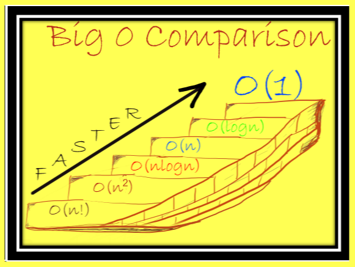
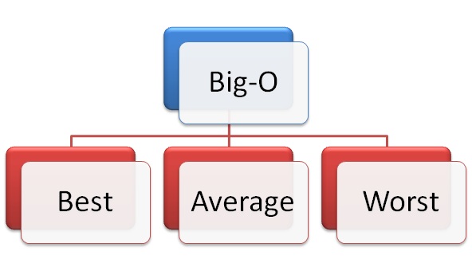

# Python数据结构的时间复杂性
## 数据科学项目中使用Python编程语言的每个人的重要文章

在Medium上，这个主题没有很好地介绍，因此我决定以一种易于理解的方式概述Python数据结构的时间复杂性。
# 为什么我们需要知道时间复杂性？

对于数据科学家程序员而言，为工作选择正确的数据结构至关重要。 特别是，如果算法需要大量计算，例如训练机器学习模型的算法或处理大量数据的算法，那么确保选择合适的数据结构时要特别小心。

选择正确的数据类型通常会被忽略，并且最终会严重影响应用程序的性能。
# 文章目的

本文介绍了CPython中数据结构的关键操作的Big-O表示法。 big-O表示法是一种衡量操作时间复杂度的方法。

请阅读免责声明。

# 1.让我们了解大O符号的含义是什么？

在算法中执行许多操作。 这些操作可能包括遍历集合，复制项目或整个集合，将项目追加到集合中，在集合的开始或结尾处插入项目，删除项目或更新集合中的项目。

Big-O衡量算法运算的时间复杂度。 它测量算法计算所需运算所需的时间。 尽管我们也可以测量空间复杂度（算法占用多少空间），但本文将重点介绍时间复杂度。

用最简单的术语来说，Big O表示法是一种基于输入大小（称为n）来衡量操作性能的方法。
# 2. Big O表示法有何不同？

我们需要熟悉许多常见的Big O符号。

让我们考虑n为输入集合的大小。 就时间复杂度而言：
+ O（1）：无论您的集合有多大，执行操作所花费的时间都是恒定的。 这是恒定的时间复杂度符号。 这些操作尽可能快。 例如，检查集合内部是否有任何项目的操作是O（1）操作。
+ O（log n）：当集合的大小增加时，执行操作所花费的时间对数增加。 这是对数时间复杂度表示法。 潜在优化的搜索算法为O（log n）。
+ O（n）：执行操作所需的时间与集合中的项目数成线性正比。 这是线性时间复杂度符号。 就性能而言，这介于两者之间或中等。 作为一个实例，如果我们想对一个集合中的所有项目求和，那么我们将不得不遍历该集合。 因此，集合的迭代是O（n）操作。
+ （n log n）：执行某项操作的性能是集合中项目数量的拟线性函数。 这称为准线性时间复杂度表示法。 优化排序算法的时间复杂度通常为n（log n）。
+ O（n平方）：执行操作所需的时间与集合中项目的平方成正比。 这称为二次时间复杂度表示法。
+ （n！）：当在操作中计算集合的每个单个排列时，因此执行操作所需的时间取决于集合中项目的大小。 这称为阶乘时间复杂度表示法。 非常慢。

该图像概述了Big-O符号。

O（1）很快。 O（n平方）很慢。 O（n！）非常慢。

大O符号是相对的。 大O表示法与机器无关，忽略常量，并且被包括数学家，技术人员，数据科学家等在内的广泛读者所理解。
# 最佳，平均，最差情况

当我们计算操作的时间复杂度时，我们可以根据最佳，平均或最坏情况产生复杂度。

+ 最佳情况方案：顾名思义，这是当数据结构和集合中的项目以及参数处于最佳状态时的方案。 例如，假设我们要在集合中找到一个项目。 如果该项目恰好是集合的第一项，那么这是该操作的最佳情况。
+ 平均情况是根据输入值的分布定义复杂度。
+ 最坏的情况是可能需要一种操作，该操作需要在大型集合（例如列表）中找到位于最后一个项目的项目，并且算法会从第一个项目开始对集合进行迭代。
# Python集合和时间复杂度

在本文的这一部分中，我将记录CPython中的常见集合，然后概述它们的时间复杂性。

我将特别关注平均情况。
# 1.清单

List是迄今为止Python中最重要的数据结构之一。 我们可以将列表用作堆栈（添加的最后一项是第一项）或队列（添加的第一项是第一项）。 列表是有序且可变的集合，因为我们可以随意更新项目。
# 让我们回顾一下常见列表操作及其Big-O表示法

1.插入：Big-O表示法是O（n）

2.获取项目：Big-O表示法为O（1）

3.删除项目：Big-O表示法是O（n）

4.迭代：Big-O表示法是O（n）

5.获得长度：Big-O表示法为O（1）

Joshua Sortino在Unsplash上拍摄的照片
# 2.设置

集合也是Python中使用最广泛的数据集合之一。 集合本质上是无序集合。 集合不允许重复，因此集合中的每个项目都是唯一的。 集合支持许多数学运算，例如联合，差，集合的交集等。
# 让我们回顾一下通用集操作

1.检查集合中的项目：Big-O表示法是O（1）

2.集合A与集合B的区别：大O表示法是O（A的长度）

3.集A和B的交集：大O表示法是O（A或B的长度的最小值）

4.集A和B的并集：相对于长度（A）+长度（B），它的Big-O表示法是O（N）

fabio在Unsplash上的照片
# 3.字典

最后，我想提供字典数据收集的概述。 字典是键值对集合。 键在字典中是唯一的，以防止项目冲突。 这是非常有用的数据收集。

字典由键索引，其中键可以是字符串，数字甚至是带有字符串，数字或元组的元组。

我们可以对字典执行许多操作，例如存储键的值，或基于键检索项目，或遍历项目等。
# 让我们回顾一下常见的词典时间复杂度：

在这里，我们认为该密钥用于获取，设置或删除项目。

1.获取项目：Big-O表示法为O（1）

2.设定项目：Big-O表示法是O（1）

3.删除项目：Big-O表示法是O（1）

4.遍历字典：Big-O表示法是O（n）

NASA在Unsplash上拍摄的照片
# 摘要

本文介绍了CPython中数据结构的关键操作的Big-O表示法。 big-o标记本质上是一种衡量操作时间复杂度的方法。 本文还说明了列表，集合和字典的许多常用操作。

为算法设计和选择正确的数据结构至关重要。

希望能帮助到你。
