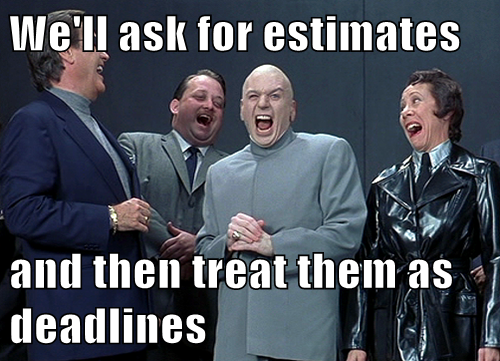

最初于2018年10月15日在anaxi.com上发布。
## 如何成为20倍的工程师（而不是10倍的工程师）
### 我们都听说过10倍工程师一词，不是吗？ 您知道原始的研究可以追溯到1960年代吗？
## 如何进行估算最终对开发人员有用
### 让任何开发人员估算他们完成一个项目需要多长时间。 您会看到他们的厌恶...
## 不要衡量开发人员-衡量项目
### 您是否听说过通过指标来管理团队，例如错误关闭率或每周生成的代码行？…
## GitHub可以成为强大的项目管理工具吗？
### 每个大公司都是一家软件公司-世界被软件吞噬了。 几乎所有的软件……
## 工程领导社区| Anaxi
### 由社区策划的高质量趋势文章，内容涉及工程领导力，生产力，团队规模以及…
# 破坏开发人员生产力的12大事情


很多文章讨论了技术主管和工程经理的角色。 我们经常遇到的一个常见主题是如何提高团队的生产力。 但是，在集中精力尝试提高生产力之前，您可能首先需要考虑破坏它的因素，以便为您提供可靠的基础。 不幸的是，即使Peopleware发布于30年前，我们仍然看到许多团队以某些（负面）显着的方式遭受巨大的生产力损失！

没有人期望程序员无需访问计算机就可以完成工作，但是有许多公司希望程序员无需理会它们就可以完成工作。 这同样是不现实的。

因此，让我们深入了解我们列出的12项阻止您的开发人员进入“区域”并提高工作效率的清单。 我将尝试从影响最大到影响最小的顺序排列此列表。 随时发表评论！

如果您想知道这一切是否值得投资，请考虑开发人员的薪水。 生产率甚至提高了10％！
# 1）中断与会议

在我看来，中断是开发人员的最高生产力杀手。 开发人员无法轻易地回到中断之前的位置。 他们需要进入开发的思维定势，然后慢慢追溯到他们离开的地方。 这很容易花费30多分钟。 而且中断次数越多，挫折感就越多，工作质量越差，漏洞越多，而且这种情况还会持续下去。

“在我尝试入门时，您绊倒我的次数越多，每次尝试之间的时间就越长。 如果您让我的早晨充满烦恼-当一天的工作效率低下时，请不要感到惊讶。” Reddit上的开发人员

会议呢？ 会议和中断之间的唯一区别是，会议是计划中的中断，这使情况变得更糟。 如果开发人员知道自己在执行任务时会受到干扰，那么他们就无法完成任务。 因此，如果他们在一两个小时内开会，他们将无法进行任何事情，因为大多数工程任务都需要花费更多时间。

就像保罗·格雷厄姆（Paul Graham）所说：“一次会议可以将整个下午分成两部分，整个下午都无法结束，每一次会议都太小了，很难做任何事情。”

如何避免这种情况？ 这部分有据可查； 你没有任何借口。 例如，在一天的开始或午餐前举行简短的状态会议，以避免不必要的干扰。
# 2）微观管理

在不同类型的经理中，就开发人员的生产力而言，微观经理可能是最差的。 当然，微观经理往往会举行更多会议，并计划外打扰。 不仅如此。 他们表现出缺乏信任，因此，您会感到他们不断破坏您的技能和完成工作的能力。 此时，开发人员在中断之间产生的任何动机都将消失。 影响不只是生产力。 微观经理可能是开发人员离开或至少改变团队的首要原因。
# 3）模糊性

有很多方法可以说明模糊性。 错误报告，如“它坏了，解决它！”，没有足够的信息供开发人员使用。 顺便说一句，在这种情况下，拥有一个错误报告模板可以为您提供帮助。

或对功能的规范不明确，在这种情况下，一旦经理更好地详细说明了预期的行为，开发人员将开始实施对他们而言合适的感觉，然后他们必须从头开始。

不清楚的优先级也属于此类别。 可以很容易地避免开发人员花时间思考他们是否在执行正确的任务。 而且，如果他们从经理那里得到评论，问他们为什么要从事这个特定任务（而未定义优先级）……那么，您就明白了-很沮丧……
# 4）海鸥管理

你听说过吗？ 当管理人员完全不参与工作时，就会发生这种情况，但是……他们只是不时地俯冲下来，把所有事情都搞砸了。 “这是错的，现在看起来很糟，”等，然后又飞走了。 我必须承认我喜欢这张照片，但是不幸的是，这种情况发生的次数比我们希望的要多。 这种行为使开发人员深感沮丧。 他们将在接下来的几个小时内无法返回该区域，有时甚至连几天都无法返回。
# 5）信用贪婪

您是否曾经有一位经理或其他开发人员将您过去几周所做的工作全部归功于您？ 开发商最看重能力。 为他人赢得荣誉就是为他人争取自己的能力，并将其从他或她身上删除。 这在我的清单上名列前茅，因为我觉得它造成了很大的压力，甚至在相当长的一段时间内破坏了整个开发人员的工作效率。
# 6）环境-噪音，运动，工作区设计…

对于非程序员来说，这似乎很奇怪，但是开发人员工作的环境对其活动有重要影响。 例如，发出一些白噪声（响亮的交流声，听见的汽车和卡车驶过）有助于他们更好地集中注意力。 这就是为什么我们很多人戴上耳机的原因！ 我实际上只是发现了RainyMood，真是太好了！

同样，如果工作区被设计为具有尽可能多的运动，那将无法帮助他们集中精力！ 或者将桌面计算机屏幕的方向设置为经理可以高度看到它们的方式……那么，这会产生一些额外的压力，甚至有更多的机会被打断。
# 7）范围蠕变

项目管理中的范围蠕变（也称为焦点蠕变，需求蠕变，特征蠕变，有时还包括厨房水槽综合症）是指项目范围内不受控制的更改。 如果未正确定义，记录或控制项目范围，则可能发生这种情况。

范围爬行将相对简单的请求变成了极其复杂且耗时的怪物！ 而且大部分时间都是在开发过程中发生的！ 例如，对于一个简单的功能：版本1（在实现之前）：功能为“显示位置地图”版本2（版本1即将完成时）：功能更改为“显示位置的3D地图”版本3 （版本2即将结束时）：功能再次更改为“显示用户可以飞过的位置的3D地图”
# 8）产品定义过程

因此，乍一看，这似乎很奇怪，但实际上很容易理解。 如果产品团队在没有验证（通过客户反馈或任何其他方式）相应功能的利益的情况下定义其团队的优先级，并且开发人员看到大多数功能最终都未被使用，他们将感到他们所做的工作无用且 会失去动力。 我们都希望感受到影响力，这对开发人员可能更重要！
# 9）缺乏对技术债务的考虑

技术债务是实施非最佳解决方案或编写非最佳代码以更快地发布软件的故意决定。 承担一些技术债务是不可避免的，并且可以在短期内提高软件开发的速度。 但是，从长远来看，它会增加系统的复杂性，从而降低开发人员的速度。 非程序员通常会低估生产力的损失，并倾向于始终前进，这成为一个问题。 但是，如果重构从来都不是优先事项，它将不仅影响生产率，而且还会影响产品质量。
# 10）工具多样性和硬件

开发人员每天使用许多工具来编程，推送和合并他们的代码。 自动化程度越高，效果越好。 不用说，如果您使用“古老”的工具，这将影响您的生产率。 同样，拥有大屏幕而不是只有一台笔记本电脑会产生影响。 考虑到硬件成本和开发人员的薪水，在这一点上，仅将5％的生产率提高绝对值得任何投资！ 只需提供开发人员团队喜欢的工具和硬件即可（对于硬件，单独地，但对于工具，则是一组）。
# 11）“如何”文档

在学习编码时，我们被告知要提早并经常发表评论。 想法是，评论太多而不是评论太多。 不幸的是，许多程序员错误地认为这意味着他们必须注释每一行代码，这就是为什么我们经常看到这样的代码的原因（摘自Jeff Atwood的“无注释编码”）

r = n / 2; //将r设置为n除以2

//当r —（n / r）大于t时循环（abs（r —（n / r））> t）{r = 0.5 *（r +（n / r））; //将r设置为r +（n / r）的一半

}

您知道这段代码的作用吗？ 我也不。 问题是，尽管有很多注释描述了代码的作用，但是却没有描述其原因的注释。 如果程序中有错误，而您偶然发现了这段代码，您将不知道从哪里开始。
# 12）截止日期不可能太紧

这最后一个与管理者倾向于要求开发人员提供估计，然后促使他们尽可能降低这些估计，然后魔术地将其视为截止日期的趋势有关！ 经理们甚至会认为，当开发人员自己“决定”估算时，他们会遵守截止日期，因此，截止日期应被视为足够有效，可以与高层管理人员共享。


不足为奇的是，开发人员认为这些截止日期是不合理的并且任意紧迫。 这会造成紧张感和无法专注。

这些东西对开发人员来说如何独特？ 如果您查看所有这12件事，它们实际上对于大多数其他基于项目的工作来说是很常见的。 只是对于开发人员来说，每一项的影响都更为重要，因为他们需要深入关注才能完成任务。

如果您认识到公司内部的上述几点，那么与您的开发人员联系可能会很有趣。 跟他们讲话; 找出这些是否是一个问题以及如何解决。 无论他们说什么，最重要的是信任他们的反馈和见解。 尽管今天的技术与30年前大不相同，但教训仍然是相同的。 考虑团队生产力时，您不能忽略人为因素。 与团队一起迭代您的流程，环境和工作习惯，并让他们指导您如何获得最高的生产力和影响力。
# 你走之前…

您觉得这篇文章有趣吗？ 请按住👏说“谢谢”并帮助其他人找到它！ 如果您对有关工程和产品领导力，生产力以及如何扩大团队规模的文章感兴趣，请订阅我们的新闻通讯！

或加入我们的工程领导社区。
## 工程领导社区| Anaxi
### 由社区策划的高质量趋势文章，内容涉及工程领导力，生产力，团队规模以及…

您还可以查看我的最新文章：
## GitHub可以成为强大的项目管理工具吗？
### 每个大公司都是一家软件公司-世界被软件吞噬了。 几乎所有的软件……
## 不要衡量开发人员-衡量项目
### 您是否听说过通过指标来管理团队，例如错误关闭率或每周生成的代码行？…
## 如何进行估算最终对开发人员有用
### 让任何开发人员估算他们完成一个项目需要多长时间。 您会看到他们的厌恶...
## 如何成为20倍的工程师（而不是10倍的工程师）
### 我们都听说过10倍工程师一词，不是吗？ 您知道原始的研究可以追溯到1960年代吗？

在Twitter上关注我以保持联系。 谢谢！
```
(本文翻译自John Lafleur的文章《Top 12 Things That Destroy Developer Productivity》，参考：https://medium.com/hackernoon/top-12-things-that-destroy-developer-productivity-2ddf0abc190)
```
