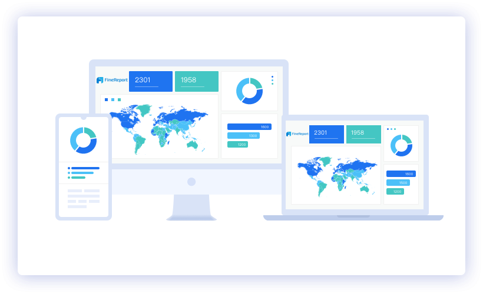

# 2019年数据可视化软件的7大趋势

数据提取和数据管理是公司在现代世界中面临的两个主要挑战。 从业务流程中的数据到信息的转换有助于实现业务目标。 其组织和分类是业务流程中的主要障碍。 诞生了一种数据可视化软件来克服这些障碍。

> Data visualization from FineReport


数据来自各种来源，并且在不同的时间或时段收集。 信息经纪人通过提供数据需求来帮助企业。 从不同时间范围收集的数据积累的问题是测试组织的数据管理技能的问题。 当前，该软件提供数据管理协助业务。
# 1.什么是数据可视化软件？

用于处理大量数据的软件还提供了数据可视化功能。 数据可视化是分组数据的图形表示，对用户制定有效和及时的决策很有用。 顶级数据可视化实践由标准化程序，数据可视化的清晰分组，数据概要分析和数据表示组成。 将来，预期的顶级数据可视化实践将是对数据的讲故事，这些数据将用于分析过程中。


数据可视化软件有助于为组织内部和外部收集的数据增加价值。 它帮助企业收集相关数据，制定策略和改进业务流程。 该软件还可以帮助销售部门通过创建其每日，每周，每月和每年销售的图形表示来监视销售信息。 这也可以为决策者生成报告。

根据Cision PR Newswire的预测，数据可视化市场的CARG预计将超过9％。 预计期限是从2019年到2024年。

公司必须了解其在数据管理和数据可视化方面的特定需求。 这有助于企业确定满足其独特需求的最佳数据可视化工具。

拥有大量数据的企业需要强大的数据可视化软件。 大数据可视化工具提供了多种功能，可为组织提供数百种好处和有效的帮助。


公司必须拥有具有竞争力的项目管理开发人员和系统，才能进行有效的数据可视化。 对于开发人员来说，最好的在线项目管理软件应该是可以帮助满足开发人员竞争和更新的技术需求的软件。 它应该能够帮助解决开发人员的问题，例如延迟，结果不佳以及预算过高。

因此，了解什么是云服务器及其对数据可视化的影响非常重要。 云服务器是基于计算机的服务器，可动用云计算技术。 它提供了高科技软硬件集成的可能性，可以有效地帮助用户进行日常操作。
# 2.数据可视化软件的重要功能

互联网上提供了多个数据可视化工具示例。 这些工具的价格，功能，功能和设计各不相同。

以下是数据可视化软件具有的重要功能。
## 2.1各种图形设计

数据可视化软件是有用的营销工具，配有附加的和更新的图形模板和设计。 这不仅将提供有效的数据分类和安排，而且还将为用户的创造力提供支持。


数据可视化软件中可用的常见图形为饼图，条形图和折线图。 还希望软件在图形上具有标签功能。
## 2.2准确的趋势跟踪

数据可视化软件应具有准确跟踪趋势的能力。 此功能有助于跟踪企业所属行业的最新趋势。
## 2.3强大的安全性

通过收集，整理和分类从数据处理中获取的信息的完整性对于准确的分析和决策很重要。

数据保护对于保护机密和来之不易的数据很重要。 如果软件中没有嵌入足够的安全措施，则会增加丢失数据的风险。 丢失的数据会导致其他现金流出以进行检索。
## 2.4简单的界面

用户喜欢用户友好的软件，以缩短学习时间。 它应该易于操作和学习。 在选择用于数据可视化的软件时，应考虑软件主要运营商的知识和技能。


还应该有易于理解的手册，以提供有关正确使用设备的基本技巧。 该手册还将使公司立即将软件集成到其系统中。
# 3.数据可视化软件的最新趋势

自从企业与计算机相互依赖以来，数据的复杂性一直是将数据可视化软件集成到业务流程中的主要原因。 数据可视化软件是由无数创作者开发的。 该软件的设计取决于市场的最新趋势。

以下是数据可视化软件的最新趋势。
## 3.1响应和交互式分析

响应用户命令的敏捷软件已成为当前市场上大多数数据可视化软件的重要功能。 这包括在创建仪表板和图形插图时拖放用户界面的实现。

> Drag-and-drop operation of FineReport


交互式仪表板支持软件网络内的主动通信。 交互式仪表板可帮助企业与员工，业务伙伴和公司客户进行有效的沟通。
## 3.2深入分析原始数据以便及时做出决定

各种规模的企业都希望将数据可视化软件的这种趋势与之相提并论，这些企业希望基于快速的原始数据分析及时制定决策。 能够使用SQL排列非结构化数据的软件展示了一个强大的情报平台。

通用数据建模语言的使用带来了令人印象深刻的可视化效果和流畅的数据整合活动。 即时报告生成也是该软件的众所周知的功能。
## 3.3将数据集成到一个平台以进行强大的数据分析

数据可视化软件的这种趋势允许安全地共享组织中所有不同部门的整个数据。 这也支持完整的注释和实时数据更新。

它还通过实施更具吸引力的图形工具和设计来提供有效的数据分析。 通过快速创建展示业务流程和职位描述的可视化文件，组织的团队合作者将更有效地开展日常工作。
## 3.4有用工具的可用性

许多公司正在购买的软件拥有各种工具，例如KPI小部件，数据透视表和表格视图组件。 这些是生成报表的有用工具。

这种类型的软件通过实现准确，完整和及时的报表创建和决策制定来支持团队协作。 这也允许在公司的网站，博客和应用程序中插入任何报告或仪表板。
## 3.5可通过台式计算机和移动设备访问

它可以链接，图形化和共享从台式计算机到移动设备的数据。 仪表板可以与团队成员共享，并可以通过台式机，笔记本电脑和/或智能手机和平板电脑等移动设备通过系统进行分析。
## 3.6社交合作

仪表板提供实时数据，以使动员该软件的团队成员更有效地进行协作。 它还具有多功能小部件，迷你图和趋势指示器，以帮助团队理解数据可视化。

数据可视化软件的用户到用户消息传递功能支持软件用户之间的有效通信。 此社交共享功能是成功在团队成员之间传递信息的有用因素。
## 3.7设置默认值并自定义数据连接器和模板


用于对公司收集的数据进行分类和整理的图形化可视化设计也为大多数软件购买者带来了趋势。 一些软件的自定义功能允许用户根据他们的需求来操纵数据连接器和图形模板。
# 4.数据可视化软件：变化迅速

单个数据可视化软件具有许多功能组合。 数据可视化软件的最新趋势集中在图形设计和模板的可用性，交互功能，快速的数据转换，数据分析帮助，有用的工具的可用性，设备可访问性（如台式机和移动设备的软件兼容性），团队通信支持和定制功能。 这些是数据可视化工具在全球市场中的最新趋势。 随着技术进步的迅速发展，它每年都在变化。

在本文的结尾，我列出了一些用于数据可视化的学习材料，希望对您有所帮助！

数据可视化集合：

9个您在2019年不容错过的数据可视化工具

初学者如何设计酷数据可视化？

什么是大屏幕数据可视化及其实现方法？

4个参数查询功能，使您的数据可视化具有交互性

仪表板教程：

制作销售仪表板的分步指南

初学者如何创建出色的仪表盘？

商业仪表盘初学者指南

KPI仪表板的完整指南

数据可视化中的图表类型：

数据可视化中排名前16位的图表类型

数据可视化中的十大地图类型

4数据映射在业务分析中的用途

动态图表：使您的数据移动

如何在不编写代码的情况下创建热图？

KPI仪表盘的前7种图表类型

我用Excel制作了动态飓风地图！
```
(本文翻译自Lewis Chou的文章《Top 7 Trends in Data Visualization Software for 2019》，参考：https://towardsdatascience.com/top-7-trends-in-data-visualization-software-for-2019-c4b13e783844)
```
