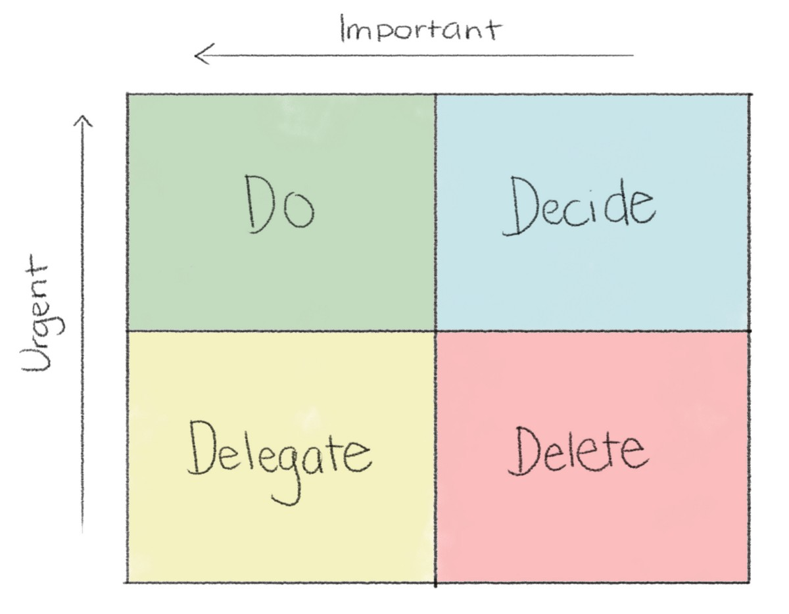

而已。 过去一年中，我从艰难的道路中学到了两个教训。 如果您有自己的经验教训，我很乐意听。
# 2.您无法告诉别人如何做某事。

或者更确切地说，您可以告诉人们如何做某事。 他们只是做得不好。 另外，他们可能会认为您是傻瓜。

如果您成为技术主管，则可能需要一点时间。 您可以在技术领域很好地解决问题，也可以在早午餐之前推出一些新的精美架构。

那很棒。 这就是为什么您是技术主管。 您在这里解决所有这些困难的技术问题。 这意味着第一次出现棘手的技术问题时，您应该争取最好的解决方法，对吗？ 我的意思是，这就是您在那里的原因。 企业为什么要付钱给擅长解决棘手的技术问题的人并期望他们坐下来？

归结为动机。 您可以用一百万种不同的方式坦白地说：人们想要自治，他们不想要微观管理者，如果他们被带到旅途中，他们会更好地工作，他们需要买入，他们想自己解决问题， 他们想要自由。 等等。 你明白了。

关键是，如果每个人都一起提出解决方案，您的团队将更有效率和更有动力。 我可能会谈论流行心理学，并就人性提出各种主张，但解释只需要一点内省即可。 您喜欢被告知该怎么做吗？ 就个人而言，我讨厌它。 糟透了 那么为什么您团队中的其他人会喜欢呢？

在两种情况下，我发现这特别重要。
## 技术会议

闭嘴最重要的地方是与您的团队举行技术会议。 无论您是设计一个全新功能的体系结构，还是只是决定如何实现用户故事，它都必须摆在您的脑海中。

在这种情况下，您的角色将成为自以为是的促进者。 保持协作氛围。 确保每个人都了解上下文，并且在理解上处于同一位置。 每个人都应感到安全，这一点很重要。

这意味着减弱您的直觉，以争取前进并尽快解决问题。 现在您已成为技术主管，不再只是获得正确答案的机会。 这是为了让每个人都买到正确的答案。 因此，请保持缓慢并保持良好的氛围。 在大多数情况下，团队都会比您自己提供更好的解决方案。 这不应该让您感到惊讶。 汇集具有不同经验和观点的人们可以创造更好的结果。

但是，有一个警告。 归根结底，您是技术的领导者。 这使您对团队设计的体系结构的质量负责。 这就是为什么在特别重要的架构会议上，花一些时间事先考虑一下您个人将要到达的架构的好主意。

通过这种方式，您可以在会议期间巧妙地指导团队朝这个方向发展。 这绝对是一门艺术。 太笨拙了，您会告诉别人怎么做。 太轻松了，会议可能会失去重点或达到您不同意的架构。

重要的是保持谦虚。 如果在会议期间，团队决定朝与您计划的方向不同的方向前进，请停下来考虑。 是否有真正的理由使您的体系结构更好？ 如果不是这样，最好将您决定的小组一起使用。
## 日常问题

在第二种情况下，经常犯此错误-团队遇到的那些日常小问题。 很好的例子是关于实现细节的错误或争议。

这些绝对更微妙，更容易出错。 当问题出现时，本能地跳到可能的原因并提出解决方案。 更糟糕的是，稍后再授权。

想象一下对这种常见情况的两种反应：一个神秘的错误出现在生产环境中并分配给您的团队。 根据说明，您已经很好地了解了问题所在。

在第一个假想的响应中，您需要花10分钟的时间查看问题，找出问题和最佳解决方案。 您向团队的最新成员介绍解决方案，并要求他们实施。 他们在一小时内就完成了。

在第二个假想答复中，您要求团队中的最新成员对此进行调查。 在偶尔对代码库领域有更多了解的队友的指导下，他们设法找出原因，对其进行分类，然后在三个小时内解决。

哪个结果最好？ 如果您要询问该错误的报告者，您的PM或任何外部利益相关者，那肯定是第一种方法。 花了三分之一的时间，解决方案是最佳的。

那么团队本身和最新成员呢？ 哪个学习潜力最大？ 是谁树立了信心并建立了团队在下一次出现类似错误时（如果您不在时）成功？

第二，当然。

在纸面上看似一个显而易见的选择，但是当您感到压力重重，而利益相关者希望现在而不是以后立即完成工作时，很容易决定解决方案而不是让团队参与。 但是，采取慢节奏的纪律对于帮助团队提高至关重要。

# 您作为技术主管的第一年将学到的两课

我已经担任技术主管约一年了，但还没有死。

在工作生涯的宏伟计划中，这不是很多时间，但是由于技术领先的年份就像狗年一样，所以我有一两次伤痕。 这些是他们教给我的一些教训。

以下几点是基于我的经验。 由于我仍然是新手，担任公司负责人的角色和职责因公司而异，因此您可能会不同意。 那很棒！ 对此发表评论。
# 1.拒绝是最难学的技能。 也是最重要的之一。

作为技术负责人，您可能会说很多话来担任这个角色。 当一个新的计划提出来时，您就跃跃欲试，驾车穿越了。 当利益相关者向团队提出问题时，您会花时间与他们坐下来，直到他们满意为止。 您谈到了工程标准问题，或自愿向其他公司做介绍。 不管是什么，答案都是肯定的。

那努力成为技术领先者。 但是成为技术主管？ 一直说是灾难的根源。

您以前自愿参加的活动现在已经成为您日常工作的一部分。 这意味着您的时间现在更加宝贵。 您是其他业务中遇到问题，问题和中断的更大目标。

您很快学到的一件事是，一切对某人来说都是紧迫的。 在给定的一天中，您可能会发现某人需要一个问题的答案，同时某人需要此报告的更新，某人发现了需要立即修复的错误，您需要查看某人的拉取请求，您的产品经理需要 该项目将尽早完成，并且不想浪费时间进行另一个利益相关者需要在那里进行的更改。 所有这一切都在您需要在10分钟之内开会的时候进行。然后，在您想弄清楚该怎么做之前，有人在您的办公桌旁闲坐着，显然他们现在需要进行对话 。

刚开始担任角色时，这可能会令人难以承受。 直到您学会了两个字母的魔术词，它才会永远存在：不。

不幸的是，现在这还不如抓住请愿者的脸，盯着他们死在眼睛里，低语“ Nooooo”那么简单。 您会巧妙地执行此操作。 但是说“不”从来没有像您想象的那么难。 唯一困难的事情是首先决定拒绝。

它要求您养成习惯，说出自己的习惯，束缚自己的直觉，以跳过帮助第一个提出要求的人，并阻止您参与听到的所有崭新计划。

由于技术领先者经常让人喜欢，所以这可能很难。 吸引人的任务很诱人，只是通过更多的工作来处理它们。 但这不仅仅是减少工作量。 这是关于有效地完成工作。

如果您或您的团队要执行自己遇到的任何随机任务，那么您可能正在做很多低优先级的工作。 而这是以高优先级工作的机会成本为代价的，这将使您的团队成功。 看到超级忙碌的人转动轮子，不断做事却没有太大影响的情况并不少见。
## 学习确定优先顺序

好的，我们现在很高兴地说不。 但是，我们实际上如何决定对不说什么呢？ 不幸的是，没有硬性规定。 每个人最终都需要自己弄清楚。 放弃个人贡献者的工作意味着在不确定的环境中进行操作，因此永远不会有明确的正确或错误答案。

我个人认为艾森豪威尔矩阵很有帮助。 看起来好像是来自一本古怪的商业教科书，但无论如何我都喜欢。 它源于德怀特·艾森豪威尔（Dwight Eisenhower）的一句话：“我有两种问题，紧迫的和重要的。 紧急不重要，重要不紧急。”

由于打赢纳粹的战争可能比交付一个为期三个月的软件项目更困难（可能无法确定），所以我愿意尝试。

> The Eisenhower Matrix

想法是按照问题的重要性和紧迫性对每个问题进行排名。 如果您遇到了既重要又紧急的事情（生产下降！），您显然应该这样做。 没脑子

但是，如果出现的问题很重要但并不紧迫，那么您无需放弃所有工作。 相反，请决定何时要执行此操作。 如果您需要时间编写体系结构文档，请在工作周内安排。 如果需要与利益相关者一起旅行，请安排他们的会议。 如果存在可以等待但仍应修复的错误，请将其放在Jira票证上并决定何时播放。

如果问题很紧急但不重要，则委托它。 我不太喜欢“委托”一词，因为技术负责人并不是权威。 您不能说（希望也不想）“詹森！ 立即解决问题并解决此错误！”。 相反，您要礼貌地问。

我个人认为这是最难的，因为我很自然地保护团队免受随机干扰。 如果某个错误出现在您团队的管辖范围内，那么当您四处寻找原因时，让他们继续深入研究似乎是显而易见的选择。 但是您的团队是团队。 每个人都对您生产的软件的质量和团队的成功负有共同责任，因此请分散这些干扰。 询问其他人是否可以研究这个问题。

最后一个象限是我的最爱。 如果您偶然发现了既不紧急也不重要的问题，那为什么还要浪费时间呢？ 对于这些问题，请给自己自由引导。

如果这意味着拒绝某人，这可能会很困难。 也许有人在游说您让团队做一些额外的工作，您认为这些工作对您的团队或企业来说都不重要。 在这种情况下拒绝回答是很困难的，既要摸索如何做到，又要使人感到不舒服。 当您告诉他们“对不起，目前这不是我们团队的优先任务”时，您的内部就会有些蠕动。 但是，当他们离开时，您可以自由地专注于真正重要的事情，您会感到自由。
