# 了解蒙特卡洛模拟
## 从头开始实施功能强大的统计工具

蒙特卡洛模拟是一个强大的工具，可以在难以推导精确分布时对其进行近似估算。 当将复杂的变换应用于随机变量（RV）（我们知道其分布）时，就会出现这种情况。 它具有多种应用。 从期权定价到缩小海岸警卫队搜救工作的地理范围。 但是它是如何工作的呢？
## 概率分布

每个RV的独特之处在于其分布。 对于连续RV，概率密度函数（PDF）显示给定值下连续RV的密度。 任何给定值出现的概率为零，因此您必须对一系列值进行积分才能找到RV落在指定范围内的概率。 对于离散的RV，此函数称为概率质量函数（PMF），它返回出现特定值的概率。 他们描述了观察随机变量的模式和频率。
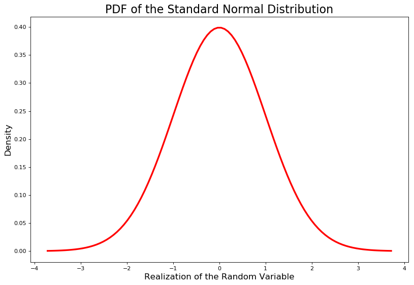
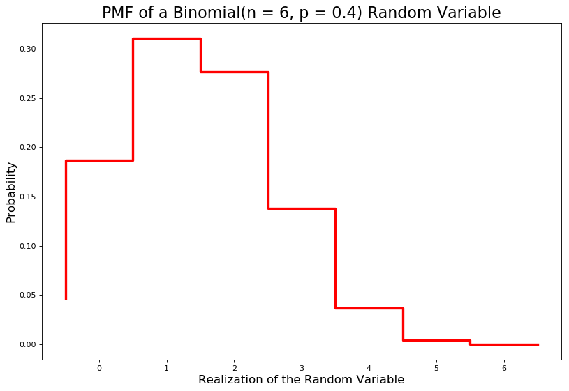

CDF只是PDF或PMF的累积值。 随机变量取小于或等于曲线/阶跃函数正下方的值的概率。 概率必须在0到1之间，因此CDF的范围在0到1之间。用F表示。
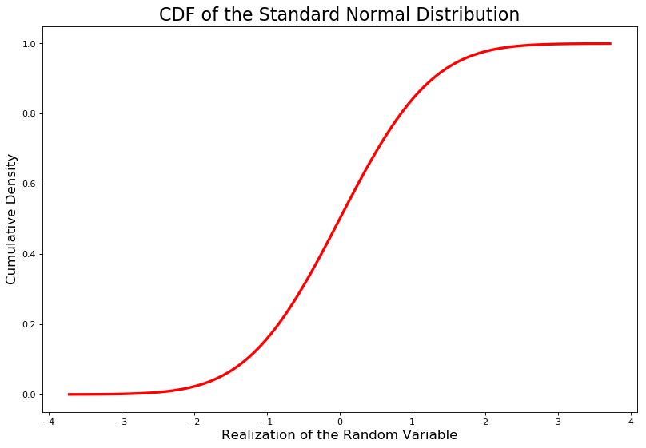
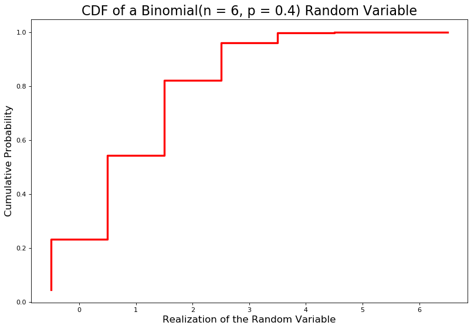
## 逆变换采样

除了是概率论的基础知识以外，它们还与蒙特卡洛模拟有什么关系？ 通过以下命题（注意：大写字母表示RV，小写字母表示RV的实现）。
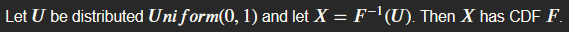

这意味着我们可以将均匀分布的最小值为0和最大值为1的随机变量馈入X的逆CDF中，以生成X的随机值。

让我们以指数分布的CDF为例。 在下面。
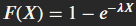
> CDF of an Exponential(lambda) Distribution


通过将U定义为F（X）并求解X，我们可以找到逆CDF。
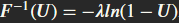
> Inverse CDF of an Exponential(lambda) Distribution


现在，我们可以将U〜Uniform（0，1）RV馈入此逆CDF，以根据指数分布生成随机抽取。 我选择1作为我的lambda参数。 我使用的代码如下。 （注意：它效率低下，可以通过矢量化加快速度，甚至可以使用scipy.stats模块更快。我这样做是为了清楚地展示逆变换采样工作原理的基础。）
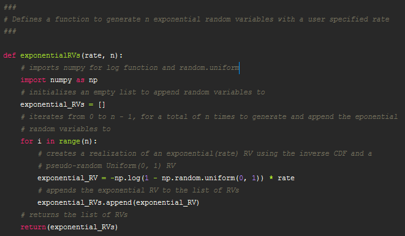
> The code used to generate Exponential(lambda) RVs


在10,000个模拟随机变量下，该模拟非常接近理论分布。
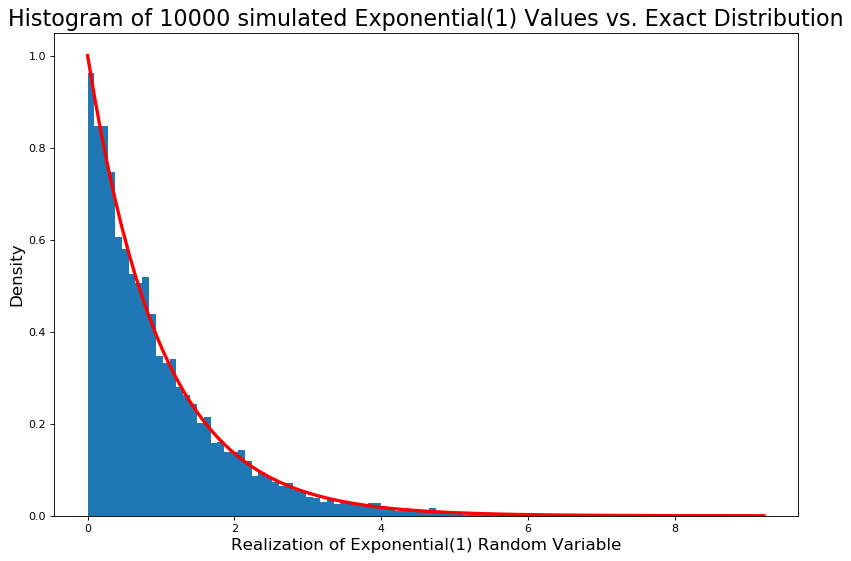

现在，让我们尝试一下转换。
## 近似于RV的变换

现在，我们生成平方标准普通随机变量。 这实际上是一个Chi-Square（1）RV，它使我们可以通过检查精确分布来轻松地检查近似值的好坏。
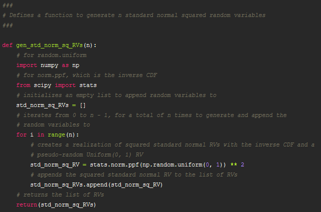
> The code used to generate Chi-Square(1) RVs by squaring standard normal RVs


如您所见，该近似值相当合理。
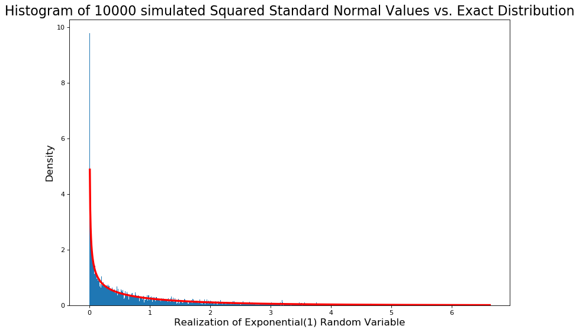

在绘制了这些RV之后，我计算出低于1的比例（近似概率）为0.6857。 然后，我通过使用评估为1的Chi-Square（1）CDF将其与确切概率进行比较。确切概率为0.6826894921370859。 在10,000次模拟中，这种近似效果非常好

现在，我们用它来近似估算RV的分布，而其确切分布将需要一些求解。
## 近似我的任意RV

我定义了一些任意的RV。 让我们将其称为A并在下面进行定义。
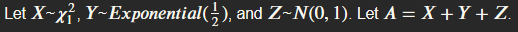

找到确切的发行版本需要一些工作，而我不喜欢工作。 幸运的是，我可以编写一个函数来近似A的分布。
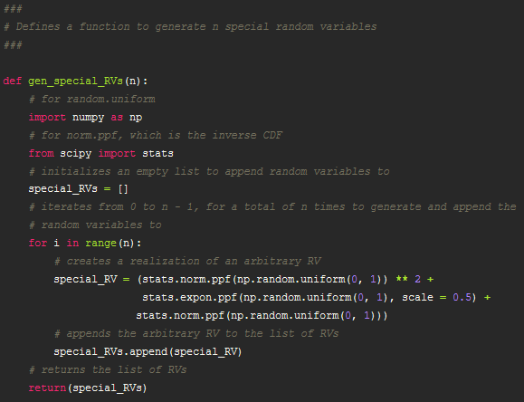

现在我们有了A的分布的近似值，并且可以找到用于推断目的的近似概率。
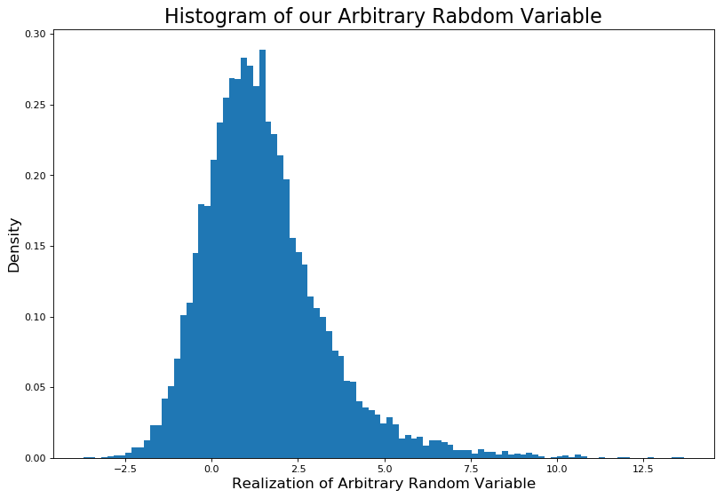

现在，我们已经完成了对任意RV的近似处理，让我们看一个假设的用例。
## 正回报的可能性

假设我们知道某些证券的收益是分布𝐿𝑎𝑝𝑙𝑎𝑐𝑒（0.05,0.07），而下一个周期的收益并不取决于该周期的收益（这是一个随机游动的例子）。 在第5期，我们的投资回报率是正的概率是多少？
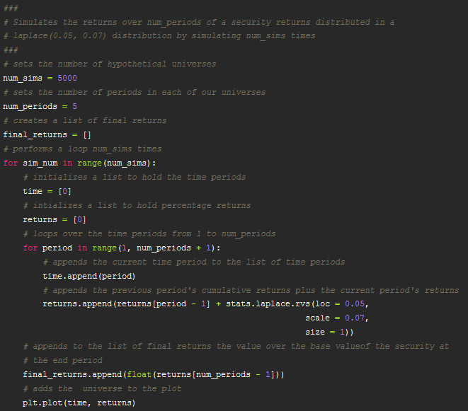
> The code I used to generate simulated returns and the spaghetti plot (make sure to load in stats from scipy)

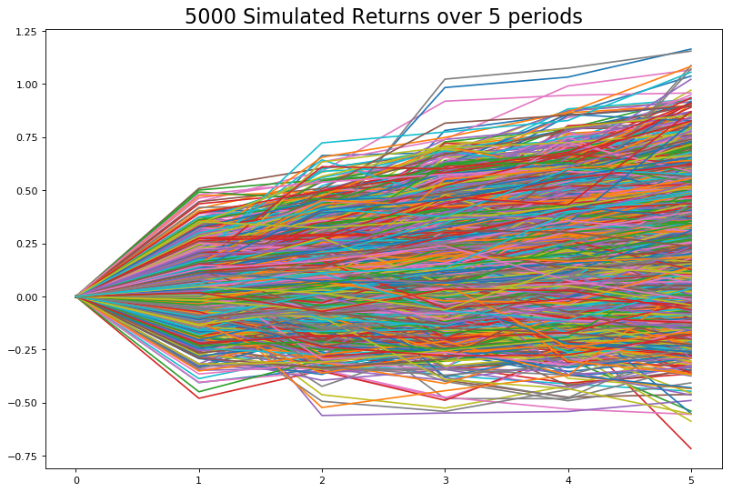
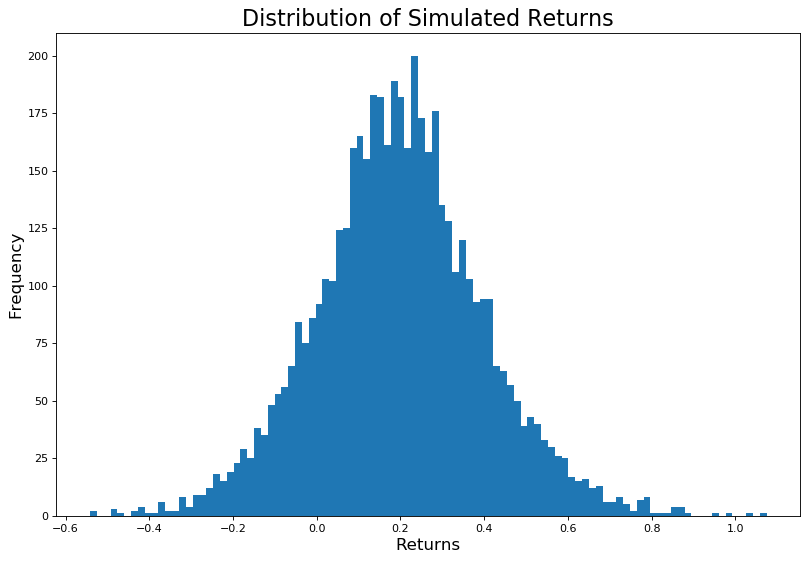
> 5000 Random Walks of our hypothetical security and the distribution of final returns


通过计算最终收益大于0的比例并除以模拟次数，我们发现在5个周期结束时证券价值增加的可能性约为0.85。 在构建投资组合时，这是有用的信息（尽管在现实生活中我们从来没有像这样干净的案例）。
## 奖金申请：蒙特卡洛积分

除了近似分布外，还可以使用蒙特卡洛模拟法对难以解析或无法解析的定积分进行数值近似。 这称为蒙特卡洛积分。 它是通过评估从𝑈𝑛𝑖𝑓𝑜𝑟𝑚（𝑎，𝑏）生成的随机变量实现时的函数来执行的，其中a是定积分的下限，b是上限。 然后将这些结果取平均值，然后乘以𝑏-𝑎即可得到从𝑎到𝑏的积分的近似值。

使用以下功能：
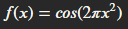

它的积分无法通过分析得出，因此让我们在0到1的区间内对其进行近似。
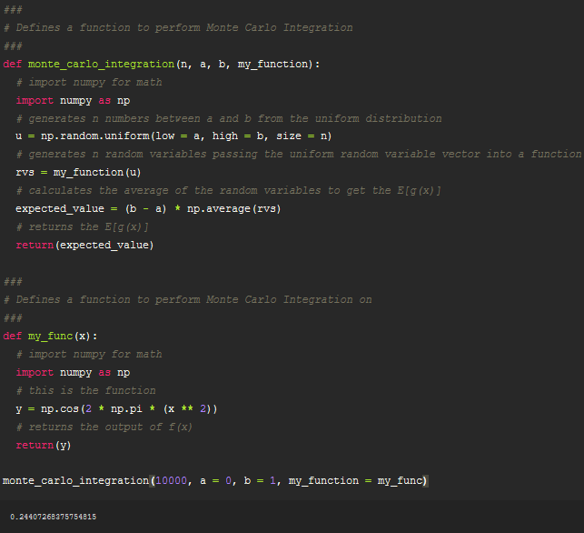

运行10,000次仿真得出的近似值约为0.244，这与Wolfram给出的近似值0.244十分接近，因此该函数按预期工作。
## 结论

如果您坚持了这么长时间，谢谢阅读。 我希望您能学到一些有关蒙特卡洛模拟如何在后台进行的知识。 希望这些知识将在您继续学习蒙特卡洛模拟的应用程序（例如Markov Chain Monte Carlo）时为您提供帮助。 再次提醒您使用scipy.stats中优化的.rvs（）方法进行采样，以获取感兴趣的分布。 它比重复追加到列表要快一个数量级。
```
(本文翻译自John Clements的文章《Understanding Monte Carlo Simulation》，参考：https://towardsdatascience.com/understanding-monte-carlo-simulation-eceb4c9cad4)
```
