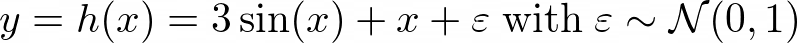
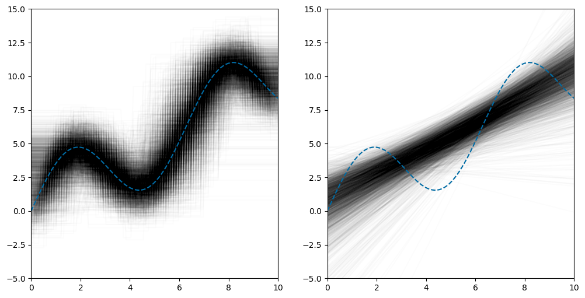

希望我能增进您的理解并教给您关于这些概念的新思维方式。

谢谢阅读！

如有任何疑问，请在LinkedIn上给我写信！

现在，让我们对随机森林进行相同的操作。 在这里，我们在不同样本子集上再次训练每个随机森林100棵决策树，并且仅随机使用两个给定特征之一！ 每个模型都在50个随机样本点上进行训练。

> Not only can we see the high values in the bottom right and the low values in the top left again, but the pictures look very similar. There is a nice and smooth gradient that looks similar in each picture.

# 结论

显而易见的是，当训练集更改时，高方差算法会快速更改其结果（模型）。 这很不好，因为即使模型的偏差为零，我们也无法知道具体模型与事实有多远。

但是我们学会了如何增加使用Bagging获得良好模型的机会。 我们还直觉了为什么Bagging降低方差而又保持偏差不变，并且在很多插图中都看到了这些结果。
# 参考文献

[1] G. Louppe，《理解随机森林-从理论到实践》（2014年），论文

[2] S. Shalev-Shwartz和S. Ben-David，《理解机器学习：从理论到算法》（2014年），剑桥大学出版社

[3] L. Breiman，《随机森林》（2001），机器学习45.1（2001）：5–32

[4] P. Geurts，D。Ernst和L. Wehenkel，极度随机树（2005），机器学习63.1（2006）：3-42

我使用LaTeX创建了所有公式。 对于其他图形，我将Python库matplotlib与numpy一起使用。 对于模型训练，我使用了scikit-learn。
# 致谢

我感谢Patrick Bormann博士进行校对，并为改进我的文章提供了许多有用的建议。 也感谢Andre Esser的帮助！
# 奖励：马赛克代码

当您开始使用“决策树”马赛克艺术来赚钱时，请想想我。 :)
```
import matplotlib.pyplot as pltfrom sklearn.tree import DecisionTreeRegressorimport numpy as np# Sample from the distribution with a true function f.def generate_data_2d(f, n_samples):    x1 = np.random.uniform(0, 10, n_samples)    x2 = np.random.uniform(0, 10, n_samples)    y = f(x1, x2) + np.random.randn(n_samples)    return np.vstack([x1, x2]).transpose(), y# Parameters to play round with.f = lambda x1, x2: 3 * np.sin(x1 + x2) + x1 - x2n_samples = 50n_rows = 3n_cols = 3# Increase numbers to remove white spaces in the pictures.n_points = 100size_points = 6# Prepare the plotting.fig = plt.figure(constrained_layout=True, figsize=(12, 12))all_points = np.array([(x1, x2) for x1 in np.linspace(0, 10, n_points) for x2 in np.linspace(0, 10, n_points)])# Start plotting.for i in range(1, n_rows * n_cols + 1):    # Get a random training set.    x, y = generate_data_2d(f, n_samples)# Train a Decision Tree.    dt = DecisionTreeRegressor()    dt.fit(x, y)    predictions = dt.predict(all_points)# Create one mosaic picture.    ax = fig.add_subplot(n_rows, n_cols, i)    ax.axis('off')    ax.scatter(all_points[:, 0], all_points[:, 1], c=predictions, s=size_points)
```

让我们首先从决策树开始。 我们使用9种不同的训练数据集来种植9种不同的树木。

> We see that each of these nine pictures differ quite a lot. The bottom right is always bright (indicating high values) and the top left is dark (indicating low values), but the size and shape of all the rectangles vary significantly.


看起来很熟悉？ ;）

让我们回到对决策树和线性回归的比较。 我们将使用以下运行示例：X = [0，10]和Y =ℝ，即要素空间的尺寸为1，并且一个要素可以采用0到10之间的实数值，而标签可以采用任何实数值。

在我们的示例中，我们定义分布D，其操作如下：特征x从0到10统一选择，标签y通过隐藏函数显式计算

> y is computed deterministically via 3sin(x)+x and then standard normally distributed noise is added.


> y without the noise.


函数h描述了标签的底层结构，这是我们要了解标签的事实。 我们将其称为隐藏的，因为我们不会将此信息提供给算法。 他们必须自己弄清楚。 :)

按照上述推理，如果我们每次对分布D进行三次查询，每次获取10个样本，则可能得到以下三个训练集：

> Sampling from the distribution three times yields 3 different results. Each time 10 training samples were generated.


现在让我们使用最右边的训练集，并在应用决策树和线性回归后绘制结果。

> We can see that the Decision Tree fits the training data perfectly, which is not a reason to celebrate, however. The problem is that the algorithm also captures the noise, which we do not want. We are only interested in capturing the underlying structure of the labels (namely 3sin(x)+x), instead.

## 决策树的偏差和方差与线性回归

让我们对3000个独立采样的训练集进行3000次相同的实验，每个训练集的大小再次为10。 在左侧，我们看到决策树的结果，在右侧，我们线性地堆叠了线性回归结果。

> Each trial gives one curve in transparent black. The more lines stack, the darker the intersections get. The dashed blue line is 3sin(x)+x again, the underlying truth.


在这里我们可以看到，决策树（左侧）平均而言非常适合数据。 人们也将此属性称为具有低偏差的决策树。 同时，对于右侧的线性回归，模型显然无法捕获基础标签结构的复杂模式。 我们说线性回归有很高的偏见，在这种情况下，它无法了解真相。

但是，如果考虑这些黑管的垂直宽度，则决策树产生的黑管比右侧的线性回归管要宽。 这意味着在对训练数据集进行重新采样时，决策树的预测比线性回归的预测更为剧烈地摆动，我们将其称为具有高方差的决策树和具有低方差的线性回归。

> Summary of the algorithm properties.


我们真正想要的是具有低偏差（平均命中率达到事实）和方差低（它们不会绕得太远摆动事实）的算法。 幸运的是，有许多降低偏差的方法（例如，使用一种称为Boosting的技术）以及其他降低方差的方法。 后者可以通过所谓的装袋来实现。 关于装袋的好处是，它也不会再次增加偏差，这将在下一节中激发。

这就是为什么将装袋与线性回归一起使用的效果很差的原因：您不能通过装袋来降低偏差，而要通过装袋来降低偏差。 有趣的是，事实证明，与Boosting一起选择决策树也很有用。 在这种情况下，将使用修剪程度也较低的决策树。
# 装袋

在本节中，我们将了解Bagging的功能，工作原理以及如何观察方差的减少。
## 一个简单的动机

假设我们可以使用标准正态分布，特别是观察值的平均值为0，方差为1。让我们假设我们喜欢看到0附近的值（就像我们喜欢看到3sin（ x）+ x）。 但是对于我们的口味，方差1太大（就像黑管的宽度一样），我们正在寻找一种方法来减小它。 一种简单的方法是从标准正态分布中采样更多值并取其平均值。 以下结果是众所周知的，并且易于验证：

> The average of standard normal random variables is also normally distributed. The new mean is just the sum of the means and the new variance can be computed with the Bienaymé Formula. ρ is a term that reflects the dependencies between random variables. If they are all independent, then ρ=0. If the covariances between the random variables are all less than a bound K, then ρ is also less than K.


因此，通过平均，如果ρ不太大，我们可以模拟具有相同均值但方差较小的另一个正态分布的图形。 这很棒，因为我们比以前更容易获得接近零的值！

例如，在独立随机变量（ρ= 0）和b = 100的特殊情况下，方差从1下降到0.01。 结果如下：

> The normal distribution is with a variance of 0.01 is much narrower than the standard normal distribution with a variance of 1. In the shaded regions, one can see where 99% of the probability of each distribution lies.


注意：如果所有随机变量X都与值1相关，则意味着ρ=（b-1）/ b，即平均值的方差将再次为1。 这对应于每个样本实际上是相同编号的情况。 平均许多相同的数字不会给我们提供任何新信息，因此这与绘制单个值一样好。

在最好的情况下，我们可以平均独立样本。 它们之间的关联度越高，它们在平均过程中就变得越无用。
## 套袋的核心思想

现在，有用的见解是我们可以对预测模型执行相同的操作。 在随机绘制的训练数据集上运行决策树算法可得到一个模型，该模型实质上是从分布中采样函数。 对这些模型进行平均可以为我们提供另一个具有相同偏差但方差较低的模型（例如随机森林）。 该集成模型平均比单个决策树更接近真相。

但是问题是：这些功能之间的关联程度如何？ 请考虑以下因素：如果遇到数据集，则可以在其上拟合单个决策树。 到目前为止，一切都很好。 但是，如果再次执行此操作，则决策树的结果（几乎）相同。 这意味着我们以这种方式采样的函数是高度相关的（ρ≈1），并且不会在单个决策树上得到改善。

它不一定是1，因为决策树算法有时必须打破联系，而这可以以随机的方式完成，但是由于这是唯一的随机性来源，因此它不会产生本质上彼此不同的树。

我们必须以某种方式对这些树进行解相关，我们将在下一部分中看到如何执行此操作。
## 走向随机森林

Leo Breiman [3]发明了随机森林。 这里的想法是以特殊的方式将大量决策树适合训练集，从而提供同样大量的树模型（=函数）。 之后，将这些树合并为一个模型，例如 通过对任何给定输入x求平均其输出，使其成为一种特殊的装袋方法。 这将导致具有较低方差的模型，类似于我们之前看到的具有正态分布随机变量的模型。

得到很多而不是最大相关树的背后思想是：
+ 对每棵树使用训练样本的随机子集。
+ 在生长每棵树的每个步骤中使用特征的随机子集。

与仅使用其中之一相比，拥有两个随机来源有助于减少不同树之间的相关性。 如果您碰巧要设计一种新的Bagging算法，请随意添加更多！ 还有多种其他方法可以组合单个决策树，例如Geurts等人的“极端随机树”。 [4]。
# 一维决策树与随机森林方差的比较

让我们再次从分布中抽取10个样本，并拟合决策树和包含100个决策树的随机森林。 我们重复此过程1000次，并得到以下图片：


我们看到，由随机森林形成的红色管的垂直宽度小于决策树的黑色管。 因此，正如预期的那样，随机森林的方差低于决策树。 此外，似乎两个管的平均值（中间）相同，这意味着求平均值的过程不会改变偏差。 我们仍然很好地击中了基础真实函数3sin（x）+ x。

请注意，由于我们使用的数据集只有每个决策树都必须使用的一个功能，因此随机森林算法在这里无法发挥其全部潜力。 因此，随机森林中的100个决策树只能在选择用来生长每棵树的训练样本之间有所不同。 在这种情况下，“随机森林”算法崩溃为一种更简单的“装袋”算法，该算法仅对每棵树使用不同的训练样本。

如果我们想扩大方差的差距，同时仍然能够直观地解释结果，则必须移至二维特征空间。 这允许随机森林算法在算法中的每个步骤中随机选择精确可用的两个功能之一。
# 二维决策树与随机森林方差的比较

让我们为训练数据定义一个分布，该分布类似于我们在一维情况下使用的分布。 我们选择X = [0，10]²和Y =ℝ，其中D从正方形中以（0，0），（0，10），（10，0）的顶点均匀地采样（x，x'） 和（10，10）和

> Similar to what we have seen before, y is computed deterministically via 3sin(x+x’)+x-x’ and then standard normally distributed noise is added.


包含50个点的随机数据集如下所示：

> 50 random points from the distribution. We can see that there are higher values in the bottom right corner and lower values in the top left corner. The diagonal region separating these two corners is filled with values around zero.


现在，让我们看看在这种情况下决策树和随机森林的方差表现。 享受结果！

通常，给我们固定数量的样本（学习集，训练样本），让我们的算法做一些魔术，并拟合所有必要的参数，最后，我们可以预测未见样本的值。 但是，这是一个非常僵化的观点。

在学习理论中，我们将训练集建模为来自空间X×Y上的分布D，其中X是特征空间，Y是输出空间。 我们从分布中采样大小为n的训练集L（以及验证和测试集）：

> n data samples from the distribution D. Here each of the x’s is a vector of some dimension d coming from the feature space X and the y’s are the corresponding labels from the output space Y.


想象一个发行版是一个带有按钮的黑匣子； 如果您单击一次按钮，则会从分布中获得随机样本（x₁，y₁）。 再次击中它，您将获得另一个样本（x 2，y 2），与之前的样本无关。 重复，直到您有足够的样本可以使用。

然后，我们可以使用L中的n个数据点来训练我们的模型。 这将为样本L中的所有（xᵢ，yᵢ）输出一个函数f，其中f（xᵢ）≈yᵢ（如果我们的模型是好的）。 这种方法可以确保模型在训练集上的表现良好。

但是现在想象一下，我们从分布D中查询n个新样本，并将它们用作训练集L'。 让我们称该训练为新集合g的模型。 对于L'中的所有（xᵢ'，yᵢ'），新模型g也将满足条件g（xᵢ'）≈yᵢ'。

现在，由于L’由不同的点（xᵢ’，yᵢ’）组成，因此新模型g的输出形状将不同于f。 模型f和g可能相差不大，这取决于L和L’的不同程度，模型的创建方式以及内部算法使用的随机性。

如果对于固定算法（例如“决策树”），针对不同训练集L和L'的模型往往相差很大，我们将此算法称为高变异算法。

当然，这不是精确的定义，但这对于本文来说也是不必要的。 在下文中，我们将使用图形来确定一种算法是否具有比另一种算法更高的方差。

如果您对数学感兴趣（欢呼！），我可以推荐论文Gilles Louppe [1]，以及Shai Shalev-Shwartz和Shai Ben-David [2]所著的书，该书很好地解释了机器学习的理论基础。 详情。

我尽力使数学水平易于理解，以使没有数学专业的人们可以继续学习，同时也给出一些高层次的思想和插图，使人们在数学上也可以享受。

尽管如此，我将不解释决策树，随机森林和所提到的所有其他模型如何详细工作，因为如上所述，它已经被覆盖了无数次。 我仅从决策树开始解释非常高级的想法。
# 决策树

免责声明：我只会在这里谈论香草决策树。 在本文的其余部分中，我们不考虑修剪。 树木可以长得很深。
## 输出说明

具有k个叶子的决策树是以下形式的模型


这意味着决策树是在特征空间的区域R中具有实数值w的分段常数函数。 这里x来自要素空间X，y是来自输出空间Y的相应标签。R的约束是

> Property 1 and 2 for a 2-dimensional feature space.

+ 它们是边界平行于要素空间的坐标轴的矩形
+ 所有矩形的集合是要素空间的一个分区，即，如果您采用两个矩形，则不相交，并且所有矩形的并集就是完整的要素空间。

现在，我们已经确定了，让我们检查为什么决策树被称为高方差算法，而例如线性回归被认为是低方差。
## 与线性回归比较

快速回顾一下，线性回归模型具有以下形式：


其中权重w是实数，d是样本的维数，即特征的数量。

为了比较这些模型的方差，我们必须退后一步，考虑一下实际的学习问题。
# 从视觉上了解装袋对方差和偏差的影响
## 直观了解Bagging算法为何真正起作用，并以简单易行的方式显示其效果

> © by my lovely wife Tinati Kübler


有大量很棒的文章描述了诸如Random Forests之类的Bagging方法如何在算法水平上工作以及为何Bagging是一件好事。 通常，本质如下：

“您在训练集的不同部分训练了很多决策树，并将它们的预测取平均值，以得出最终预测。 预测变得更好，因为与单个决策树的方差相比，随机森林的方差较小。 （dartboard.png）”

-一些文章

当然，我在这里释义。 文章包括精美的图片，代码和更多想法。 但是我经常想念的是一个很好的直觉，那就是为什么Bagging是一个好主意，以及如何使用真实的数据集来观察动作的方差减少。

因此，在本文中，我要解决这两个缺点，并给出直观的理由说明“随机森林”算法为何起作用以及如何以图形方式看到方差的改善。 您可以考虑这篇文章是对这两个主题的探索，它比关于偏差偏差难题的一般文章要深入，但不如成熟的研究论文那么深入。 尽管如此，我仍将提供指向我认为有用的资源的链接，以便您可以在需要时进一步深入。
```
(本文翻译自Dr. Robert Kübler的文章《Understanding the Effect of Bagging on Variance and Bias visually》，参考：https://towardsdatascience.com/understanding-the-effect-of-bagging-on-variance-and-bias-visually-6131e6ff1385)
```
