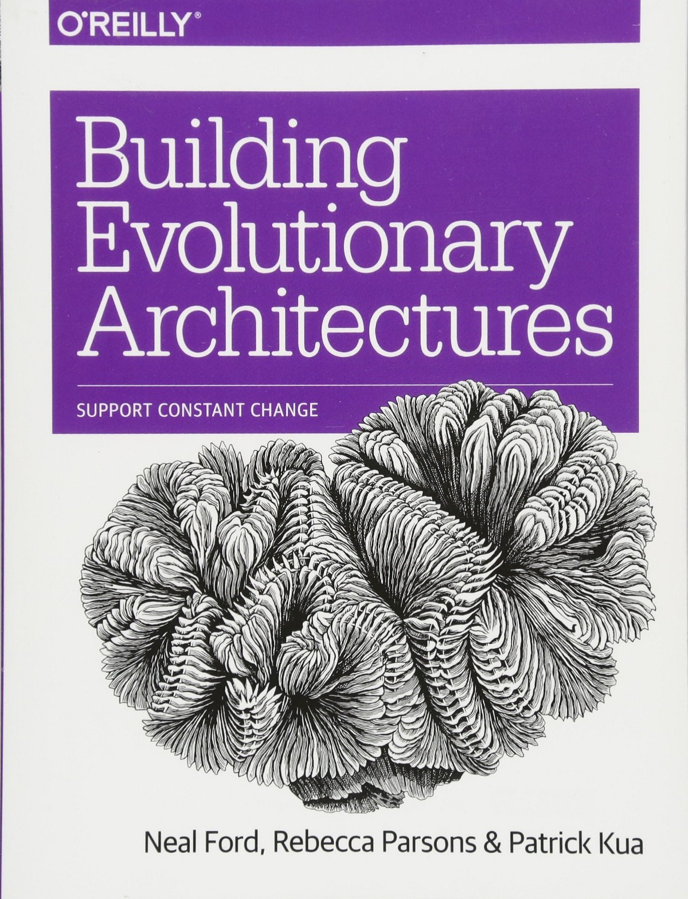
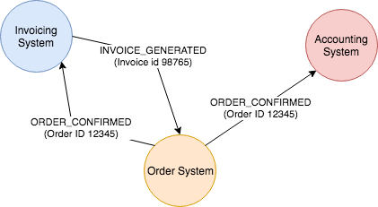
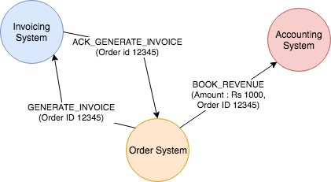

later稍后在日记中阅读此故事。

🗞每个星期天的早晨，您可以在收件箱中等待本周最值得关注的Tech故事，观点和新闻：获取值得关注的新闻通讯>
# 使用事件构建演化架构

演化体系结构是可以进行增量，连续和快速更改以提供新功能的软件体系结构。 虽然这在较低的软件工程水平上是常识（使用SOLID原理在代码级上实现类似的功能），但最近也可以使用容器化等各种策略在宏级别上实现相同的敏捷性 ，微服务和devops工具（例如CI / CD）。

今天，我想谈一谈如何使用事件来构建演化架构，以及事件在本质上如何代表开放式封闭原则（OCP），但是在架构规模上。
# 什么是活动

事件是软件系统广播的有关其边界内发生的事件的消息。 系统执行一项操作，并在该操作成功后告知整个世界（通常通过异步消息传递）该操作已发生。 该系统还将在事件中传递足够的数据，以使其对外部世界有意义。

例如 订单管理可以在每次确认订单时发布ORDER_CONFIRMATION事件，并在每次取消已订购商品时发布ITEM_CANCELLED事件。
# 事件与消息

尽管开发人员经常在两个系统之间建立异步通信来互换使用它们，但是事件和消息在本质上是不同的，并且在软件系统中引起了非常不同的行为。

事件是系统中发生的特定动作的记录，因此是用发布系统的语言定义的。 发布者根本不在乎谁在监听，而只是保证在特定的传输媒介上会发出特定的事件数据集。

另一方面，消息是对等结构。 消息的发布者将消息定向到特定的使用者系统，并且必须以使用者的语言定义内容。 这样的消息即使对其他人来说也不会有意义。从某种意义上说，系统A发送给系统B的消息是异步完成的API调用。
# 基于事件的架构

如果事件和消息都通过异步传输介质（例如Kafka，RabbitMQ）传输，那么哪个是哪个有什么关系？ 当我们考虑许多分布式系统之间的交互以及谁知道这样一个世界中的谁时，这很重要。

如果我们使用事件在整个分布式系统中传播信息，那么我们会想到一个非常松散耦合的体系结构，在这种体系结构中，彼此之间的知识很少。 所有系统要么广播与他们的世界中的活动相对应的事件，要么使用来自其他系统的事件来触发他们自己的世界中的工作流。 作为发布者，系统不知道谁将使用其事件。 作为消费者，系统不知道事件来自何处，只是它在收到此类事件时应该执行某些操作。

例如 订单系统可能会发出ORDER_CONFIRMED事件，此事件可能由开票系统和会计系统使用。 现在，发票系统将生成发票并发出INVOICE_GENERATED事件。 侦听INVOICE_GENERATED事件，订单系统可能会向客户发送电子邮件。 订单系统看到一个发布，一个消费，但是没有追踪两者之间的因果关系。

> Workflow in event driven systems

在微服务世界中，事件引起了构建工作流的编排风格。 本质上，这根本不是明确定义的工作流，而是将服务映射为响应特定事件集。 上述交互是一个示例。 无需描述就可以实现端到端工作流，因为我们能够通过独立的事件服务交互来构成它。 没有人需要知道完整的流程，因为它实际上并不存在。
# 基于消息的架构

在基于消息的体系结构中，定单系统将发出两个消息：GENERATE_INVOICE（发给发票服务）和BOOK_REVENUE（发给计费系统），以订单标识符为参考，然后等待（基于回调）发票系统响应。 发票系统在生成发票后，会发送回有关GENERATE_INVOICE消息的确认消息，订单系统收到该消息后，定单系统会向客户发送电子邮件。

> Workflows in a message-driven architecture

注意在此范例中系统如何相互了解。 由于使用异步消息传递，它们可能会在时间上解耦，但是它们在域切换边界处耦合。 但是，由于系统之间相互了解，因此我们可以围绕握手（在上述示例中，发票系统发送的确认就是这样的示例）和错误处理建立细微的体验，而在事件驱动的世界中这是不可能的。

在微服务世界中，消息引发了业务流程风格的工作流程。 服务或编排系统（通常是JBPM之类的worflow引擎，或Conductor和Cadence之类的更现代的化身）捕获了应调用一组服务以实现端到端输出并通过消息调用它们的顺序。 （或API（视情况而定））。 基于ESB的系统是消息传递体系结构的版本。
# 事件是OCP

现在应该更清楚为什么我将事件视为一种开放式原则。 OCP表示，我们的代码应允许扩展，但不能更改。 也就是说，任何想要为现有代码添加更多功能的人都应该能够从外部进行操作，而无需接触代码本身。 在基于事件的体系结构中，所有系统负责执行其功能并发出相应的事件。 它不知道哪些其他系统正在使用这些事件或如何使用这些事件。

因此，如果我们要更改当前发票系统的实现，或者为不同类型的订单构建不同的发票系统，或者不想为某些类型的发票发送通知，那么我们可以在不触及订单系统的情况下完成所有操作 本身。 可以在订单系统之外开发全新的产品，以丰富订单管理平台，而无需接触订单系统。 这是在建筑规模上工作的开闭原则。
# 演化基于事件的架构

让我们再谈谈如何根据事件发展架构。 我们已经了解了如何在不影响系统本身的情况下更改系统周围的所有内容。 现在，如果我们想更改此系统本身（上一个示例中的顺序系统），我们将怎么办？ 如何管理对其他系统的影响？

事实证明，没有影响/影响很小。 就所有其他系统而言，该系统不存在。 对于他们来说，事件流是生活中的事实，只要事件继续流进来，无论事件是来自同一系统，它的下一版本还是来自全新系统，事件对他们来说都不重要 系统。 即使我们构建了一个不遵守当前事件结构或语义的新系统，通常也仅是了解新事件数据并将其按摩成使用系统的语言的问题。

当我们想快速移动技术构架时，这种去耦功能非常强大。 构筑勒索模式是一种广泛使用的构建新软件版本的策略，您可以在其中逐步将功能从软件的一个版本迁移和部署到下一个版本，同时始终保持事件的结构不变。 只要我们使事件流向后兼容，就不需要知道某些事情正在改变。 这种模式通常用于从整体迁移到微服务。
# 多事的陷阱！

但是，这种程度的去耦是有代价的。 在采用事件驱动的体系结构时，必须牢记一些问题。

最重要的问题是跟踪业务工作流之一。 由于系统彼此之间不协作，而是与事件协作，因此很难跟踪任何业务流程的状态。 像订单处理这样的长管道很难跟踪和管理。 回答“定义订单履行的完整过程”可以使您遍及整个工程部门！

另一个较小的问题是错误处理。 如果一个系统出现故障并丢失了一些消息，则没有直接的方法可以重新生成/重放它们。 发布者不保证可以重新发布它们。 像Kafka这样的持久性消息传递系统在一定程度上有所帮助，但要保证它们的正常运行时间和弹性（甚至比核心服务还要重要），已成为整个公司的关键任务。

在某些情况下，我们可以接受一些耦合，以实现业务凝聚力和可调试性。 只需为系统启用事件流，就可以将您与所有其他您认为不是域核心的用例脱钩，同时保留在必要时注册消息驱动用例的自由。 当然，如何区分这些情况，将随用例的不同而不同。 与往常一样，关键是权衡。

仔细洒上多汁的建筑！
