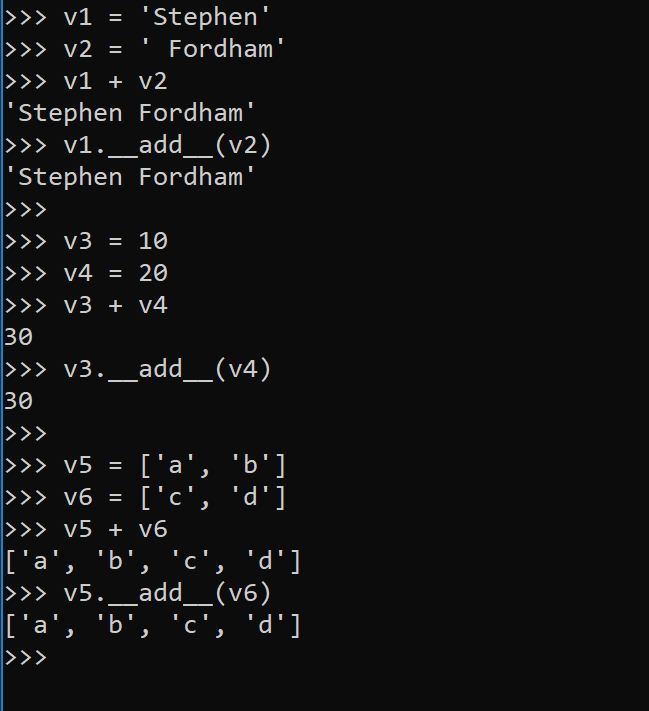
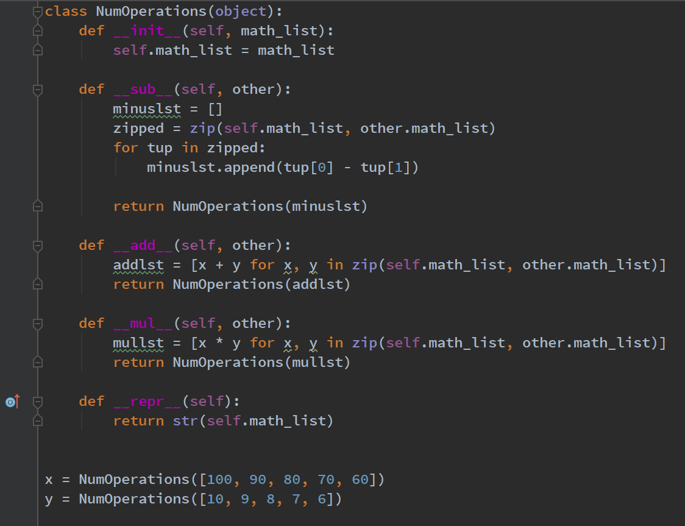
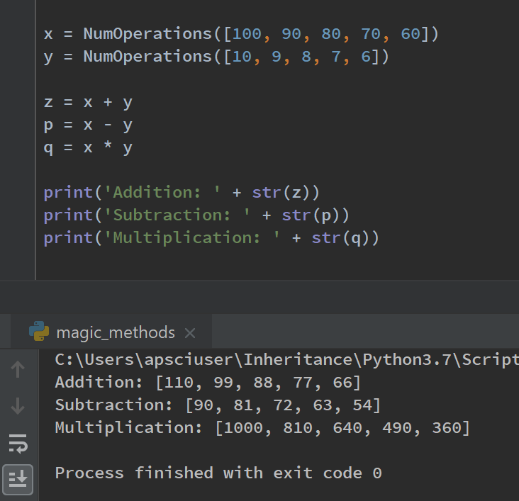
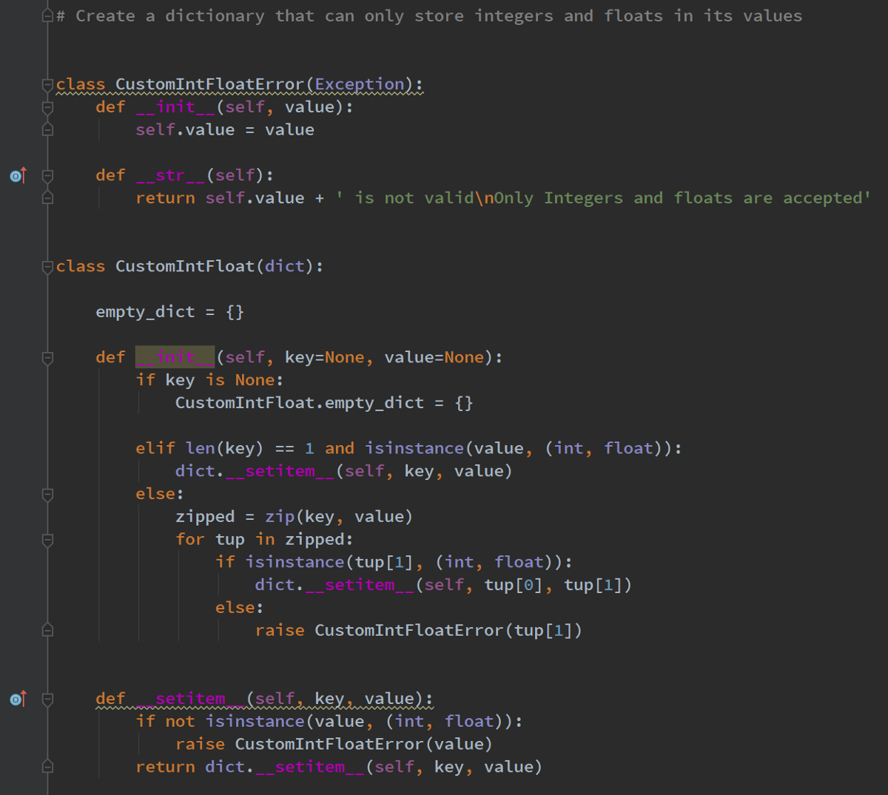
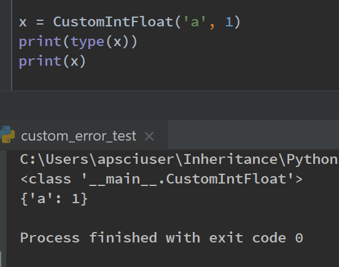
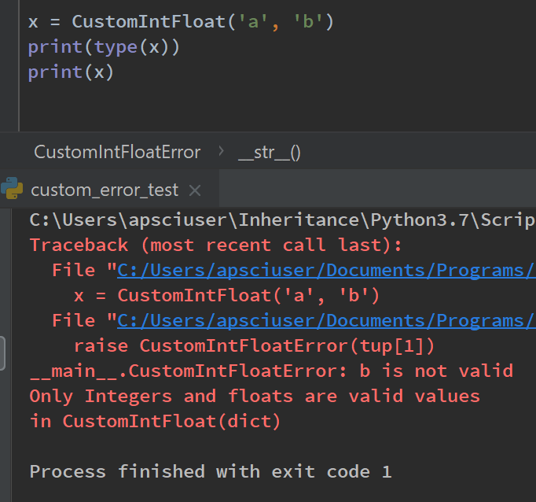
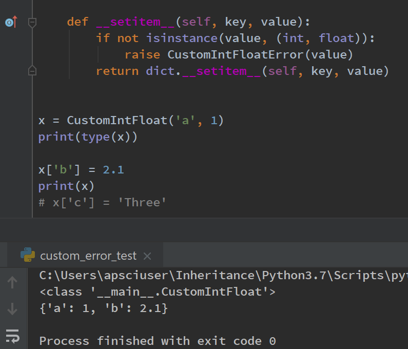
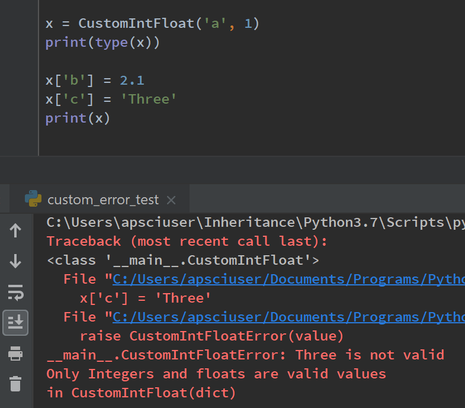

# 快速射击魔术方法
## 使用数学运算符的示例
## __sub __，__ add__和__mul __（带有自定义__repr__）

我们还可以通过魔术方法利用Python中的数学运算符。 让我们看看如何在自己创建的自定义对象中使用魔术方法，例如__add __，__ sub__和__mul__。

像+，-，/和*这样的运算符是多态方法。 如下面的Python提示符所示，加号（+）是多态的，可用于连接字符串，对整数求和并将列表组合在一起。 这是可能的，因为所有这些类型，str，list和int在各自的类中都有一个add方法。 Python只是将+符号转换为对调用它的对象的__add__方法调用（请参见下面的示例）。

这意味着，如果我们在类中包含__add__方法，则可以利用我们自己的对象中的+号。

## 我们班上的魔术方法算子方法

在这里，我们正在创建一个名为NumOperations的类。 此类创建NumOperations对象。 当此类的用户将列表传递到__init__的参数列表时，该列表将设置为NumOperations对象中的属性，并命名为.math_list。

构造NumOperations对象后，我们可以方便地利用魔术方法来处理这些自定义对象并广播数学运算。

为了说明这一点，魔术方法__sub__接受2个NumOperations对象，将它们的列表压缩在一起，并迭代其他对应的元组列表。 从第一个元组中减去第二个元素，并将该值附加到名为minuslst的新列表中，并将其作为参数传递给NumOperations构造函数。

现在，这将返回一个新的NumOperations对象。

正在使用__sub__方法执行此广播。 这意味着我们可以利用减号（-）运算符。

重新实现了魔术方法__repr__，以返回新对象中列表集的字符串表示形式。 对此进行了修改，以便当用户打印两个NumOperations对象的输出时，用户将看到他们可能期望的内容。

这是一个列表，其中的元素已被相互减去；

[90，81，72，63，54]。

__add__和__mul__都具有与__sub__类似的方法实现，但是使用列表推导来减少所需的代码行数。

> The subtraction, addition and multiplication magic methods have been defined in order to work with the custom NumOperation objects.


这种广播行为类似于数据分析包（例如Pandas和Numpy）中的广播行为。

__add__和__mul__方法也可以与两个NumOperations对象一起使用。 这意味着用户可以利用加号运算符+和乘法运算符*。 可以看出，在下面的示例中，q是x * y的结果，它返回一个新的NumOperations对象。 当我们打印q时，我们将boradcasting操作的字符串表示形式作为列表。


对于感兴趣的人士，可通过以下链接获得我的GitHub gist的源代码。
```python
class NumOperations(object):
    def __init__(self, math_list):
        self.math_list = math_list

    def __sub__(self, other):
        minuslst = []
        zipped = zip(self.math_list, other.math_list)
        for tup in zipped:
            minuslst.append(tup[0] - tup[1])

        return NumOperations(minuslst)

    def __add__(self, other):
        addlst = [x + y for x, y in zip(self.math_list, other.math_list)]
        return NumOperations(addlst)

    def __mul__(self, other):
        mullst = [x * y for x, y in zip(self.math_list, other.math_list)]
        return NumOperations(mullst)

    def __repr__(self):
        return str(self.math_list)


x = NumOperations([100, 90, 80, 70, 60])
y = NumOperations([10, 9, 8, 7, 6])

p = x - y
z = x + y
q = x * y

print('Subtraction: ' + str(p))
print('Addition: ' + str(z))
print('Multiplication: ' + str(q))

```
# 摘要

我们可以使自定义设计的对象与Python运算符一起使用，例如加号，减号和乘法符号。 这是非常强大的功能，部分功能来自能够非常轻松地传达对象的行为的能力。 用户不需要学习任何新方法，他们只需将NumOperations对象加，减或乘在一起，当他们打印结果对象时，他们将看到他们期望的输出。
# 在Python中使用魔术方法
## 魔术方法如何增强您的Python代码

> Image Courtesy of Vox.com

## 什么是魔术方法？

它们就是面向对象的Python中的一切。 您可以定义它们的特殊方法，以将“魔术”添加到您的课程中。 它们总是被双下划线包围，例如__init__。 它们也没有得到足够的记录。 Python的所有魔术方法都出现在Python文档的同一部分中，但它们分散且组织松散。 在该部分几乎找不到示例。

为了纠正人们认为缺乏魔术方法的文档，我整理了一些有关如何使用Python魔术方法的简单英语示例。
## 创建一个只接受整数和浮点数作为其值的dict对象

首先，让我们创建一个虚拟的用例。 在这种情况下，我想创建一个创建字典对象的类，该对象仅接受整数或浮点数作为它们的值。

例如是否有其他数据类型； 字符串，列表，元组作为值添加到我们的自定义字典对象中，将引发异常，向用户指定此自定义dict对象只能接受整数并以浮点数作为其值。

为了实现这一点，我们将使用以下魔术方法：
## __int __，__ setitem__和__str__

首先，我首先创建一个名为CustomIntFloat的自定义类，然后将dict传递到参数继承列表中。 这意味着，除了在我们选择有选择地修改此行为的地方之外，我们创建的对象的行为将完全像字典。

然后，我创建一个__init__方法来构造CustomIntFloat dict对象。 该对象的参数列表中包含键和值，默认情况下，我将其设置为“无”类型。 原因是，如果用户创建CustomIntFloat类的对象而没有传递键或值，则将创建一个空的dict。 我创建了一个简单的条件，该条件是：如果未传递键，则默认情况下会将键参数分配给参数None，并通过使用类属性empty_dict引用CustomIntFloat对象来创建一个空dict。

接下来，如果用户指定了长度为1的键以及作为int或float类实例的相应值，则将在对象中设置键和值。

最后，在else语句中，如果用户将多个键和值指定为一个可迭代对象，则这些可迭代对象将由zip函数压缩并为变量名指定zipper。 我遍历压缩后的值，并检查该值是int还是float类型。 如果不是，则会引发自定义CustomIntFloatError异常。

## CustomIntFloatError Exception类和__str__魔术方法

当我们引发CustomIntFloatError异常时，我们实际上是在创建CustomIntFloatError类的实例并同时打印它。

因此，此自定义错误类需要__init__和__str__魔术方法。 我们创建的实例采用传递的值，并将其设置为CustomIntFloatError类中的属性值。

这意味着，当出现错误消息时，可以将传递到CustomIntFloat的__init__的值设置为CustomIntFloatError类中的属性（self.value），并易于检查。


如果指定了无效输入，则会引发CustomIntFloatError异常，并且不会构造该对象。 一条有用的错误消息通知用户，只有整数和浮点数是有效值。


同样，当您尝试实例化具有多个键和值的对象z（已注释掉）时，将引发相同的异常，通知用户“三个”无效输入。
```python
# z = CustomIntFloat(key=['a', 'b', 'c'], value=[1, 2, 'three'])
z = CustomIntFloat(key=['a', 'b', 'c'], value=[1, 2, 3])
```
## __setitem__魔术方法

__setitem__是一种魔术方法，当我们在字典中设置键和值时会调用该方法。 一旦构造了CustomIntFloat对象，如果用户尝试添加非int或float类型的值，则将引发相同的CustomIntFloatError异常。 我在下面添加了一个代码段，该代码段显示了如何按预期设置键和值。
```python
x = CustomIntFloat('a', 1)
print(type(x))

x['b'] = 2.1
print(x)
# x['c'] = 'Three'
```


无效的输入会导致引发CustomIntFloatError异常，如下所示。


对于那些感兴趣的人，可以在我的GitHub页面上找到呈现的代码的源代码：
```python
class CustomIntFloatError(Exception):
    def __init__(self, value):
        self.value = value

    def __str__(self):
        return self.value + ' is not valid\nOnly Integers and floats are valid values \nin CustomIntFloat(dict) '


class CustomIntFloat(dict):

    empty_dict = {}

    def __init__(self, key=None, value=None):
        if key is None:
            CustomIntFloat.empty_dict = {}

        elif len(key) == 1 and isinstance(value, (int, float)):
            dict.__setitem__(self, key, value)
        else:
            zipped = zip(key, value)
            for tup in zipped:
                if isinstance(tup[1], (int, float)):
                    dict.__setitem__(self, tup[0], tup[1])
                else:
                    raise CustomIntFloatError(tup[1])

    def __setitem__(self, key, value):
        if not isinstance(value, (int, float)):
            raise CustomIntFloatError(value)
        return dict.__setitem__(self, key, value)

```
## CustomIntFloat类的摘要

通过像dict这样的内置类继承，我们可以通过重新实现魔术方法来自定义行为。 这有很多好处。

重要的是，用户不需要学习任何新语法。 当用户想要向CustomIntFloat dict对象添加键和值时，他们只是以通常的方式添加键和值。 唯一的区别是我们选择了只允许int和float类型的值。 如果用户指定了其他任何类型，则自定义错误消息会有效地指示他们哪里出错了，以及期望使用哪种类型的值。
```
(本文翻译自Stephen Fordham的文章《Using Magic Methods in Python》，参考：https://towardsdatascience.com/using-magic-methods-in-python-48f31685bc18)
```
