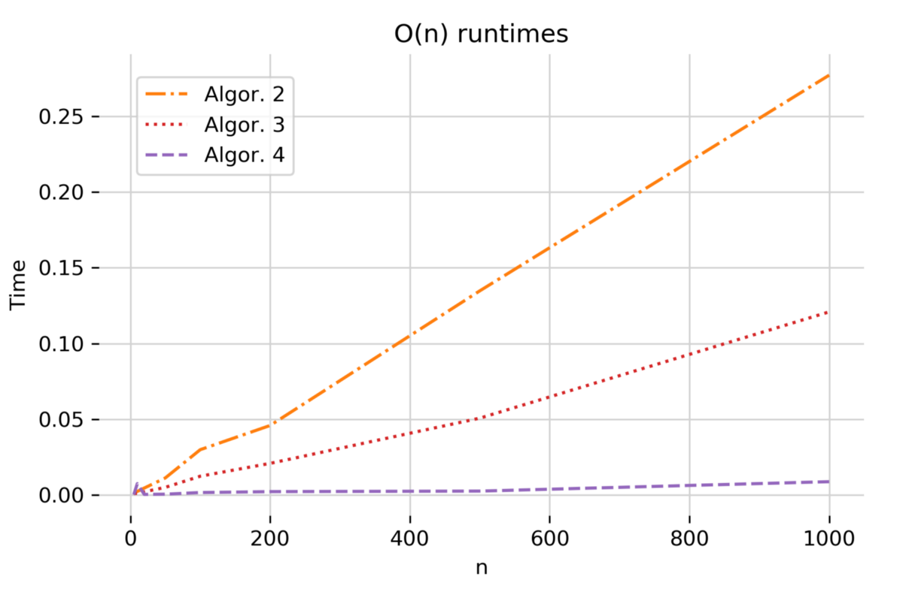
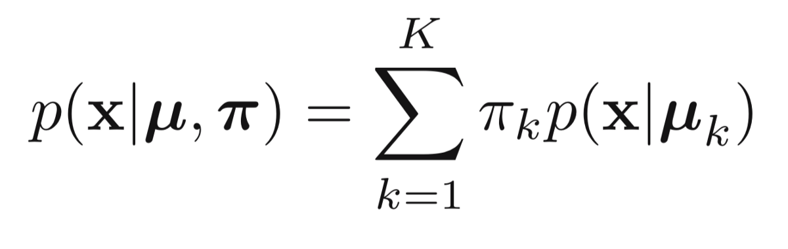
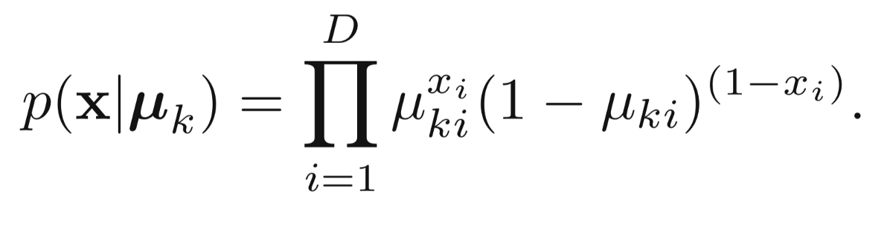
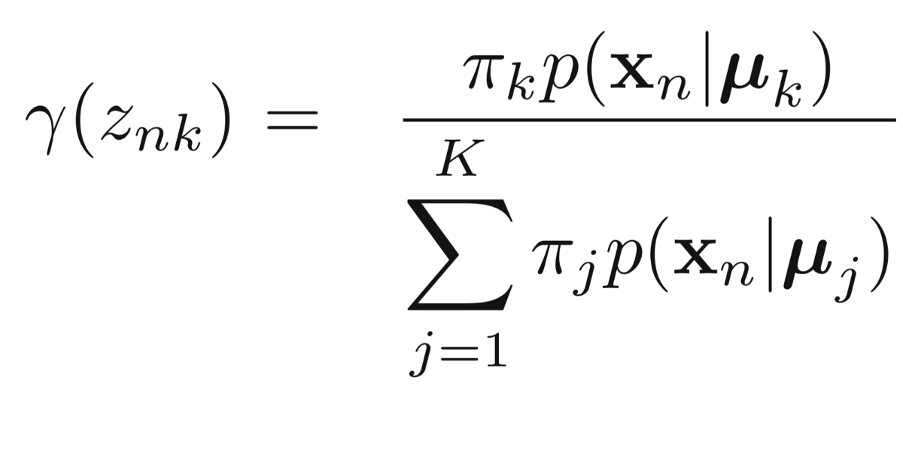
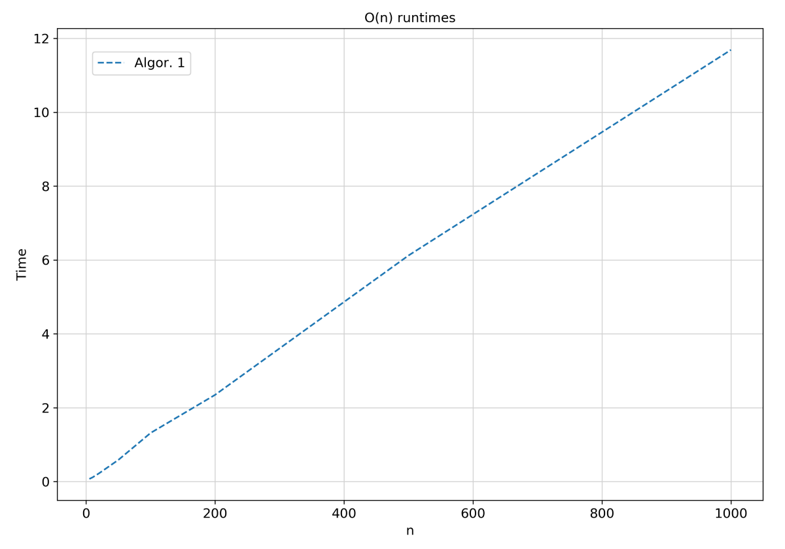
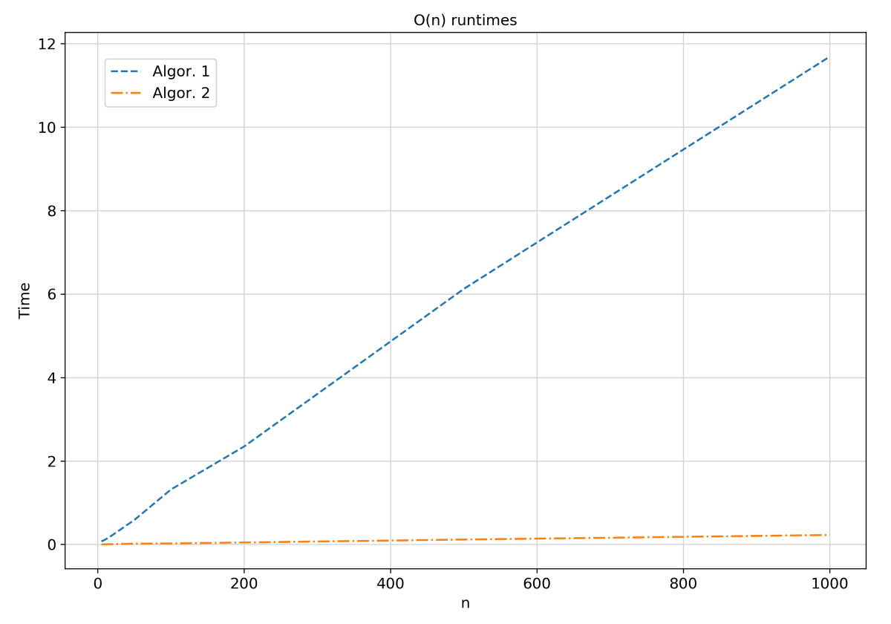
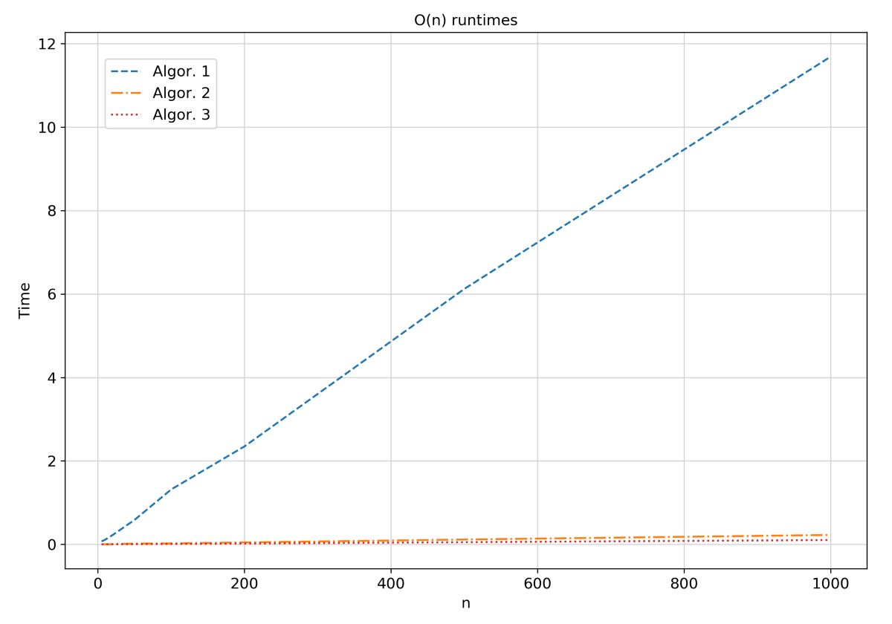
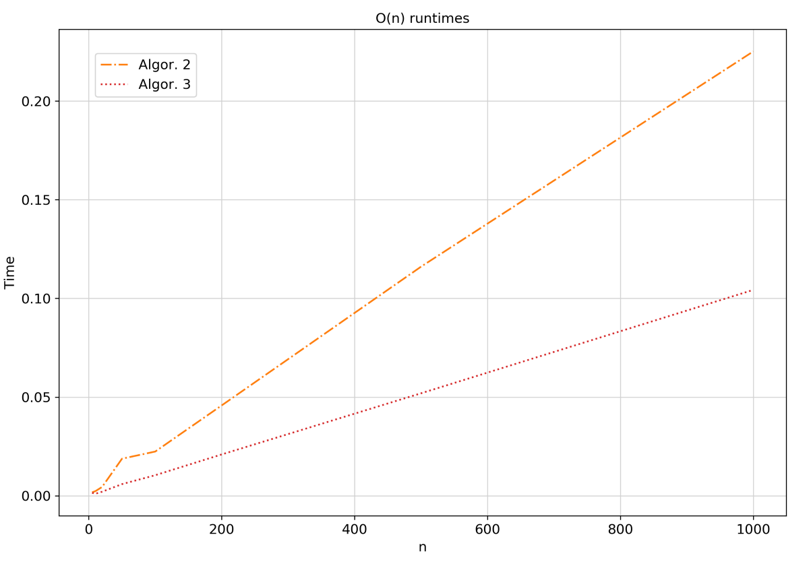
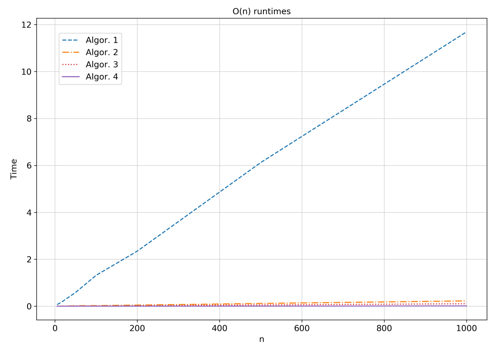
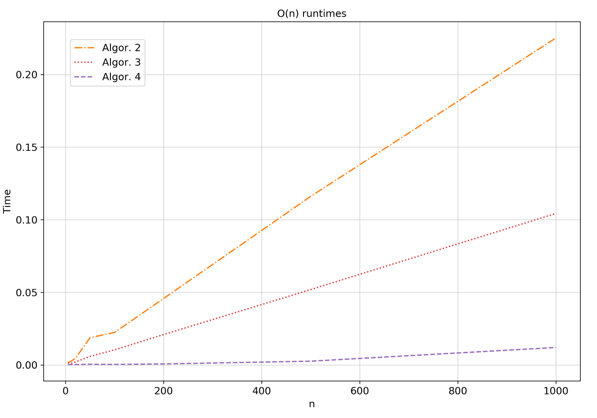

# 向量化：如何通过x78加快您的机器学习算法
## 给定一个方程式，我们将逐步了解如何才能不仅在速度上获得x78倍的效率更高的代码，而且仅使用3行代码！ 让我们开始吧……
# 介绍

作为一种解释型语言，Python for loop本质上比C语言慢。 这对于臭名昭著的编程语言是一个很大的瓶颈，因为深度学习和机器学习算法严重依赖于矩阵运算，而矩阵运算是通过for循环执行的。

这就是开发人员开发软件包的原因，例如numpy，他们在numpy数组上提供矢量化操作。 这意味着它将通常在Python中完成的for循环下推到C级，这要快得多。

Python + C级速度=天堂
# 问题

（如果您对EM算法有疑问，可以跳过解释部分）

我们想对无监督学习任务使用期望最大化（EM）算法（例如，在MNIST数据集中识别手写数字），并且我们的数据是二进制的（例如二进制图像）。 一种自然的方法是将我们的数据建模为伯努利混合模型。 伯努利分布的加权和，每个分布都有自己的标量权重π和自己的均值向量μ并表示数据的群集（例如，如果我们的数据是数字2、3和4的图像，并且我们使用3伯努利进行建模 它们中，一个伯努利将是数字2，另一个是数字4，依此类推）。 总的来说，这使得前者成为向量，而后者成为矩阵。

> Bernoulli mixture model (1)


> Distribution of one observation x given the cluster k (2)


令N =观测数，D =一个观测的维数，K =聚类数。 因为对于我们的问题很重要，所以我们拥有的随机变量的类型为：•X； 我们的数据是一个NxD矩阵（N个图像数量，D个维数→5张28 * 28的图像将形成5x784矩阵X）•π； 向量K，代表每个分布的权重的标量。（例如，三个伯努利可以具有π= [0.2，0.75，0.05]加权向量）•μ； 每个群集的平均KxD矩阵。（一个图像的维数为D = 28 * 28 = 784，其中每个图像代表一个像素值。取属于同一群集的图像的每个像素的平均值，例如数字2 ，我们得出的平均向量为784。因此，μ将是KxD的矩阵）

在E步中，我们对潜在变量后验的期望值或所谓的责任特别感兴趣。

> E-step of EM algorithm (3)


γ实际上返回属于聚类k的观测值（图像）n的期望值。 γ是NxK矩阵； 对于每个观察，我们分配属于每个聚类的概率。 具有最大值的一个就是我们分配给的那个。

为什么我要告诉所有这些？

“向量化中最重要的事情是了解变量的维度。”

责任的计算是我们要向量化的一项

总结：•X：NxD矩阵•π：1xK向量•μ：KxD矩阵•γ：NxK矩阵
# 管道

我们将创建一个函数E_step来运行计算上面的表达式并使用以下代码对其进行测试
```
observations = [5, 10, 20, 50, 100, 200, 500, 1000]for n in observations:    X_test = bin_train_data[:n]    D_test, K_test = X_test.shape[1], 10    mu_test = np.random.uniform(low=.25, high=.75,                                 size=(K_test,D_test))    pi_test = np.ones(K_test) / K_test    t0 = time.time()    gamma_test = E_step_1(X_test, mu_test, pi_test)    runtime = time.time() - t0    assert gamma_test.shape == (n, K_test)
```

随意先尝试一下！
# 尝试№1

第一次尝试时，我们将使用for循环编写所有内容； 在矢量/矩阵运算中，仅标量。

通过查看方程式，我们可以看到存在3个循环。 每个示例N一个，每个群集K一个，每个对象D每个维一个，我们将按此顺序循环。 因此，我们将一次用一个元素填充矩阵γ。
```
def E_step(X, mu, pi):    N, D = X.shape    K = pi.shape[0]    gamma = np.zeros((N, K))    for n in range(N):        for k in range(K):            m = 1            for i in range(D):                m *= mu[k][i]**X[n][i] * (1-mu[k][i])**(1-X[n][i])            gamma[n][k] = m * pi[k]        gamma[n] /= gamma[n].sum()    return gamma
```

下图显示了我们的结果。


我们肯定可以做得更好！
# 尝试№2

最好从内部循环开始，然后逐步发展到外部循环。 而这正是我们要做的！

我们要摆脱for循环D。 因此，每个依赖于D的项现在都应成为向量。 在此for循环中，我们有两个变量； μ和x（请参阅等式（2））。 因此x和μ→向量。 问题; 它是μ** x，是另一个矢量的幂的矢量，很难计算。 如果我们能解决这个问题……

有一个函数可以将幂运算转换为乘法。 是的，是对数！ 因此，让我们对表达式取对数，然后得出结果的指数！

首选对数概率运算，因为它们提供数值稳定性

即使在我们的情况下它没有任何影响，但是每次使用日志时，请在表达式内部使用常量epsilon以保持稳定性（使用-inf时不要为零）。

因此，我们将不得不逐元素矢量相乘。 简单 ;）
```
def E_step(X, mu, pi):    N, D = X.shape    K = pi.shape[0]    gamma = np.zeros((N, K))    for n in range(N):        for k in range(K):            log_gamma = np.log(pi[k]) + (X[n] * np.log(mu[k]) \                        + (1 - X[n])*np.log(1 - mu[k])).sum()            gamma[n][k] = np.exp(log_gamma)        gamma[n] /= gamma[n].sum()    return gamma
```

我们的结果是……


那是巨大的胜利！ 与Algor相比，x轴看起来更像。 1！ 但是，我们可以做得更好;）
# 尝试№3

一次循环一圈：K圈！

在矢量化过程中，我们正在朝以下方向发展：

标量→向量→矩阵

随着我们用numpy数组替换越来越多的循环，越来越多的代码将在C→更快更干净的代码上运行。

我们采用之前的实现，并且想要删除K for循环。 因此，每个依赖于K的标量都将变成一个向量，而每个向量都将变成一个矩阵。 这意味着X将保持不变，而μ将变成矩阵，而π和γ将成为向量。 注意最后一个； 随着γ字段的逐行传播，我们表达式的结果现在必须是向量！ 因此，μ和X的运算必须产生1xK向量，快速指示符是（i）它们必须与向量π相加，这也是1xK（ii）结果是矩阵γ的一行，也是1xK 向量。

得出的结果是：
```
def E_step(X, mu, pi):    N, D = X.shape    K = pi.shape[0]    gamma = np.zeros((N, K))    for n in range(N):        log_gamma = np.log(pi) + np.log(mu) @ X[n] \                    + np.log(1 - mu) @ (1 - X[n])        gamma[n] = np.exp(log_gamma)        gamma[n] /= gamma[n].sum()    return gamma
```

结果是：



惊人！ 在n = 1000的情况下，我们成功完成了一半的时间！ 与Algor确实没有可比性。 1。 但是，我们可以做得更好吗？
# 尝试№4

我们还有一个循环。 我们可以有一个无Python的计算循环吗？ N，你的时间到了！

在将矩阵*向量运算转换为矩阵@矩阵运算时，我们需要采用前者的传输矩阵（@是常规矩阵乘法）。 请记住，现在我们的输出必须是整个γ矩阵。 我认为到现在为止，您对它的运行方式有了想法；）。

所以我们的代码是
```
def E_step(X, mu, pi):    gamma = np.exp(np.log(pi) + X @ np.log(mu.T) \            + (1 - X) @ np.log(1 - mu.T))        gamma /= gamma.sum(axis=1)[:, np.newaxis]    return gamma
```

没有一个循环！ 该代码看起来很优雅，只有三行！ 现在要获得结果，鼓辊…



就是这样，再也无法得到任何改善！ 对于n = 1000，我们仅使用三行代码就从11.688→0.012的运行时开始运行！
# 摘要

因此，当您要对表达式进行向量化时，您需要做什么：

•了解矩阵的尺寸。•笔和纸：写下公式，从求和到求和，然后将其转换为等效的矩阵运算。 总是要考虑任何表达式必须返回的维数； 观察邻居求和操作，因为它们的维数相同•逐个循环，逐步：标量→向量→矩阵•取对数并确保引入归一化常数epsilon•对方法的向量化版本进行编码，并进行光泽：D
```
(本文翻译自Ioannis Gatopoulos的文章《Vectorization: How to speed up your Machine Learning algorithm by x78》，参考：https://towardsdatascience.com/vectorisation-how-to-speed-up-your-machine-learning-algorithm-by-x78-times-faster-e330df8c9b27)
```
