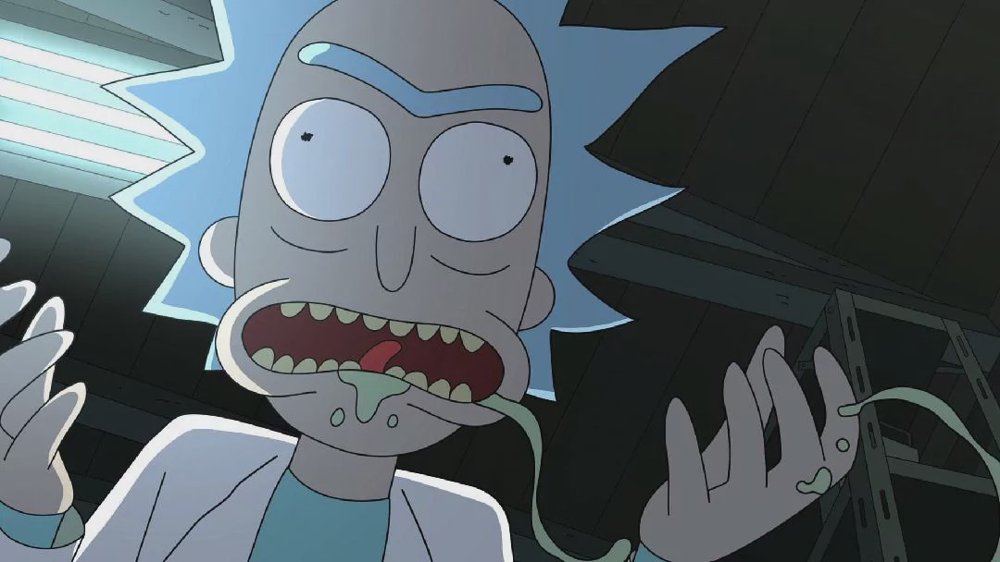
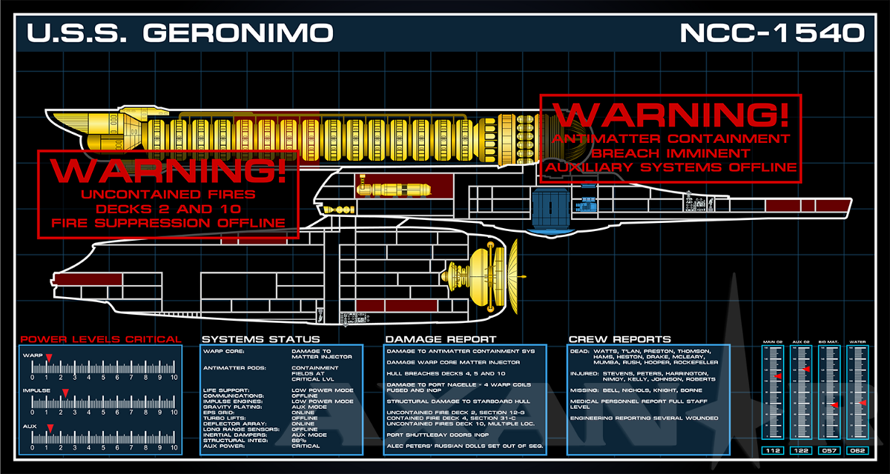
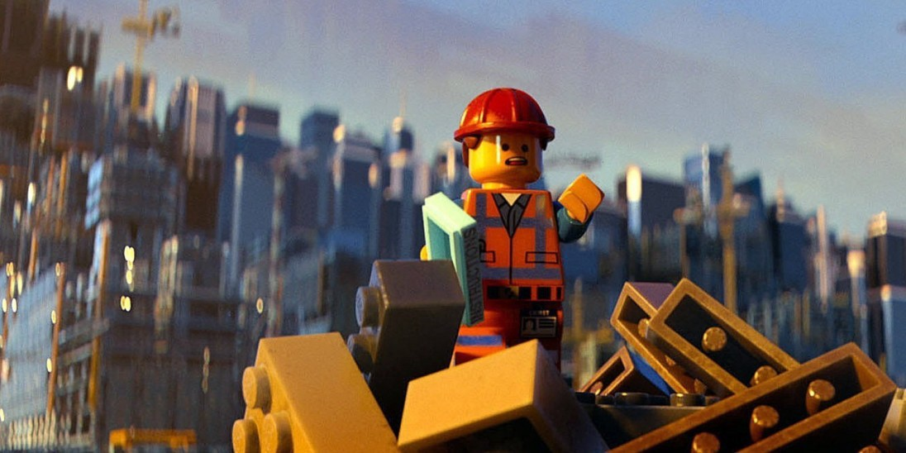

本文中描述的事件发生在很多年前，并不反映我当前雇主的观点或经验。

如果您有兴趣阅读更多内容，我已经发布了后续故事以及我们的经验教训！ 您可能也有兴趣阅读有关我在一家初创公司的第一份工作，而这恰好正在我周围崩溃。

您可以在这里或在Twitter @jhsolor上关注我，以获取更多更新。

注意：某些详细信息（例如名称）已更改。 我从未真正与任何叫Rick的人一起工作。

Jonathan领导企业软件开发和体系结构团队。

他获得了斯坦福大学的物理学学位，并且在信息系统体系结构，数据驱动的业务流程改进和组织领导方面工作了10多年。
# 我们解雇了我们的顶尖人才。 我们做出的最佳决定。

“您将永远无法理解我所创造的任何东西。 我是爱因斯坦（Albert F *** ing Einstein），你们都是猴子在泥泞中挣扎。”

因此，我们的常驻天才杰基尔博士爆炸式地完成了他向海德先生的转变。

他在产品设计团队，开发人员，管理人员和预发布客户面前宣布了这一点。 我们的一位项目发起人曾急切地问，何时会解决困扰我们产品的问题。

天才是善变的野兽。 有时，您有幸与一个疯狂的天才一起工作。 其他时候，您注定要疯狂地工作。 在某些情况下，很难分辨出差异。

这个故事是关于一个对我们产品的架构有深刻理解的极其有才华的团队成员的恩宠。 他具有预测未来需求的超乎寻常的能力，以及大量的特定领域知识。

他是我们的杰出贡献者。 他正在杀死我们的旗舰项目。

我们称这个人为“里克”。

> You don’t want this guy on your team. (image © Warner Bros.)


里克被公认为车队中的顶尖人才。 他是我们软件项目的首席开发人员和架构师。

每当有人对代码有疑问或在任务上需要帮助时，他们都会去Rick。 里克在他的办公室里安装了一块巨大的白板，仅用于此目的。 过去的讨论总是让人难以忘怀。

任何时候只要遇到特别具有挑战性的问题，Rick都会处理。 Rick的服务器与安装在办公桌上的生产服务器具有相同的规格。 他使用它来独立运行整个应用程序堆栈，并立即对每个层进行故障排除。

瑞克不需要其他人了。 里克更喜欢在自己的私人工作空间中独自工作。

瑞克不需要任何其他人建造的东西。 他从头开始构建了他需要的所有东西，因为它比纯粹的凡人提供的东西要好得多。

很快，里克停止参加会议。 瑞克再也没有时间开会，因为要编写的代码太多了。

里克关上了门。 他的白板休憩。 里克不再有时间训练任何人，因为他自己想解决的事情太多了。

里克（Rick）的背后积压。 他构建的旧工具中出现了错误。 他们使他的注意力没有兑现对新产品开发的承诺。

当然，这些错误的发生是因为用户错误地假设了。 当然，他的工作没有任何问题。 当然。

在我们的项目仪表板上，绿色标志变为黄色。 黄色变为红色。 红灯开始闪烁。 任务状态一一更改为“已提示”。每个人都在等待Rick。

> Don’t worry, Rick will handle it. All of it. (source)


项目经理从赞助商那里得到了六个月的延期。 六个月结束时，估计已经可以生产七个月了。 一年结束时，生产就绪时间已经过去了两年。

瑞克比以往更快地编写代码。 他每周工作7天，每天工作12个小时。

每个人都知道，只有瑞克可以使团队摆脱困境。 每个人屏住呼吸，等待里克发明创造奇迹的治愈方法，以治愈这个残缺不全的项目。

每天，里克变得更加好战和孤立。 面具掉了。 Jekyll即将成为海德。

在最初约定的发布日期之后约两年，我参加了与项目团队的第一次会议。 我知道这个项目已有一段时间了，因为它在我的组织中声名狼藉，但尚未分配给它。

我被送去看看我们是否可以保存它。

我关于该项目的第一次会议是上述的“爱因斯坦”会议。

嗯

我深入研究了源代码。 里克是对的：没有人可能理解里克创造的东西。 除了里克。 这反映了他自己的想法。 其中一些非常聪明，很多都是复制粘贴，都非常特质，并且完全没有记录在案。

我带着裁决去了我们的首席信息官。 只有Rick才能维护此产品。 另外，Rick在该项目上工作的每一天都将交货日期推迟了一周。 Rick销毁我们的产品的速度比其制造产品的速度快。

我们与里克（Rick）坐下来，就他在该项目中的角色进行了交谈。 我们审查了我们的担忧。 我们回避了他与爱因斯坦的自我比较。

我们解释了我们的新策略。 团队将合作从头开始构建新产品。

这项工作的范围非常有限，只会提供使我们投入生产的基本要素。 整个团队将做出贡献并能够提供支持。 没有更多的瓶颈。

里克对此有何反应？

里克唯一的办法。 里克爆炸了。

里克不想要这场闹剧。 如果我们不能欣赏他的天才，那是我们的错，不是他的错。 里克预言，几个月后，我们会爬回他身边，恳求他拯救我们。

里克尖叫说，当我们盯着我们的脸时，我们缺乏欣赏天才的基本心理能力。

可悲的是，此后，里克拒绝了领导层几个月的提议。 他拒绝请假或允许委派任何工作。 他拒绝反复尝试引入免费的开放源代码框架来替代他难以维护的定制工具。

他恢复了其他开发人员的代码更改（包括经过测试的错误修复）。 他断言自己不会为支持他人的工作负责。 他继续公开贬低他的同事。

我们解雇了瑞克。

尘埃落定大约花了一个星期。 失去了四面楚歌的大师后，这支震惊的球队花了一些时间才聚在一起。

然后我看到他们挤在白板上。

> Collaboration. Rick had never seen this before. (source)


他们合作了。 他们设计了替代产品。 这样会更简单。

它没有所有的风吹草动。 从产品路线图的五年来看，它也不会期望有任何需求。

Rick的产品支持具有一万五千多种排列的动态工作流程。 实际上，我们99％的用例遵循以下三种路径之一。 团队对工作流程进行了硬编码。 这删除了Rick超过30％的工作。

它不会为每个任务都提供自定义的手工编码组件。 他们剔除了可以购买而不是建造的所有定制依赖项。

这消除了瑞克数百小时的贡献。 但这也消除了数千小时的技术债务。

我们从项目发起人那里获得了一项协议，以关闭某些极端情况下的功能。

该服务仅服务于我们发布前的用户组的5％，约占产品复杂性的四分之一。

我们将产品重新发布给该组。 它由Rick原始代码的10％组成，非常稳定。 它还有数千行新代码来替换约15万行难以理解的混乱。

该团队在大约六个月的时间里替换了五年的工作。 在接下来的几个月中，我们从试用版扩展到了完整的客户发布版。

我们不仅更换了瑞克（Rick）所制造的东西，还迅速超越了他，并在不到一年的时间内就全面推出了该产品。 结果不到Rick所构建产品的大小和复杂性的五分之一。

尽管组装时间只有一小部分，并且服务的客户数量是原来的十倍，但它的速度也快了数百倍，而且几乎没有错误。

团队回到了Rick的其他产品。 他们也把他的旧密码丢掉了。

经过三个月的团队合作，他们经过三年的开发，重新发布了他的另一款产品。

团队中没有剩下Ricks。 我们没有疯狂的天才从头开始构建所有东西。 但是我们的生产力从未如此高。

里克是一个非常有才华的开发人员。 Rick可以解决复杂的业务逻辑问题并创建复杂的体系结构以支持他的崇高设计。 里克无法解决如何在团队中有效工作的问题。

> Master builders are cool, but skyscrapers are built by teams. (image © Warner Bros. Animation and The Lego Group)


里克（Rick）的到来在几个方面都具有破坏性。

首先，他创建了一种依赖崇拜。 任何问题最终都变成了里克问题，这是他鼓励的神话。 开发人员学会了停止尝试，只等Rick。

其次，他没有编写可维护的代码。 他从未记录或测试任何东西，因此尽管有自己的才智却失败了。 他对个人无误的信念胜过常识。

第三，他个人具有破坏性。 团队成员不想大声说出自己的想法，因为他总是为此而指责他们。 里克只尊敬里克，并竭尽全力让其他人感到渺小。

第四，他缺乏个人责任感。 没有失败是他的错。 他真诚地相信这一点，这使他无法从自己的错误中吸取教训。

我不相信里克是这样开始的。 我看到他处于最糟糕的状态。 这是经过多年加班工作之后，面对客户和同事越来越多的批评。

遗憾的是里克走了这么远。 他的经理分担这项责任。 实际上，最初的管理团队要承担责任：他们先被放开了。

不幸的是，瑞克已经走了很远，以至于他无法或不会被带回来。 没有多少教练，反馈，休假或分配给其他项目改变了他的有毒行为。

至此，整个团队都知道他具有破坏性。 但是对依赖的崇拜是如此强烈，以至于每个人都认为他是唯一的选择。

总有另一种选择。

您团队的实力与单个成员的才能无关。 这取决于他们的协作，坚韧和相互尊重。

专注于建立彼此珍视的团队，并努力将彼此的优势发挥到极致。

在一起，他们将能够解决比Rick难以想象的更大的挑战。
```
(本文翻译自Jonathan Solórzano-Hamilton的文章《We fired our top talent. Best decision we ever made.》，参考：https://medium.com/free-code-camp/we-fired-our-top-talent-best-decision-we-ever-made-4c0a99728fde)
```
