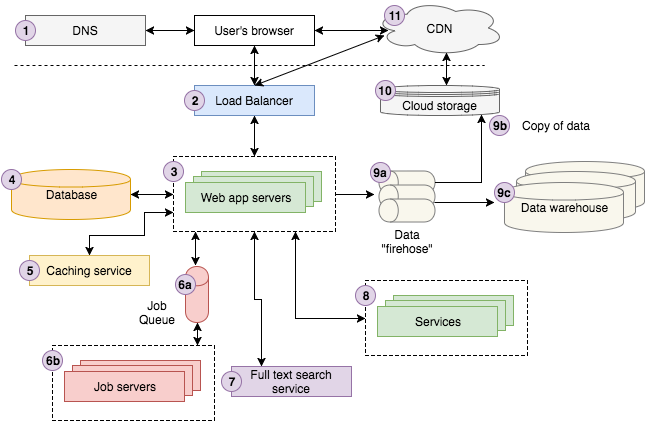

# 网页架构101
## 作为Web开发人员起步时，我希望知道的基本架构概念

> Modern web application architecture overview


上面的图很好地表示了Storyblocks上的体系结构。 如果您不是经验丰富的Web开发人员，则可能会觉得很复杂。 在我们深入研究每个组件的细节之前，下面的逐步操作应该使其更容易上手。

一位用户在Google上搜索“森林中强烈的美丽雾和阳光”。 第一个结果刚好来自Storyblocks，这是我们领先的照片和载体网站。 用户单击结果，将其浏览器重定向到图像详细信息页面。 用户浏览器在后台将请求发送到DNS服务器，以查找如何与Storyblocks联系的方式，然后发送请求。

该请求会到达我们的负载均衡器，该负载均衡器会随机选择我们当时正在运行该站点的10台左右的Web服务器之一来处理该请求。 Web服务器从我们的缓存服务中查找有关该图像的一些信息，并从数据库中获取有关该图像的剩余数据。 我们注意到尚未计算图像的颜色配置文件，因此我们将“颜色配置文件”作业发送到我们的作业队列，作业服务器将对其进行异步处理，并根据结果适当更新数据库。

接下来，我们尝试通过使用照片标题作为输入向我们的全文搜索服务发送请求来查找相似的照片。 该用户恰好以成员身份登录到Storyblocks，因此我们从帐户服务中查找其帐户信息。 最后，我们向数据流触发一个页面查看事件，以记录到我们的云存储系统中，并最终加载到我们的数据仓库中，分析人员用来帮助回答有关业务的问题。

现在，服务器将视图呈现为HTML，然后先通过负载平衡器将其发送回用户的浏览器。 该页面包含我们加载到与CDN连接的云存储系统中的Javascript和CSS资产，因此用户的浏览器会与CDN联系以检索内容。 最后，浏览器将页面可视化呈现给用户查看。

接下来，我将引导您完成每个组件，并为每个组件提供“ 101”介绍，这将为您提供一个很好的思维模式，以便您思考未来的网络体系结构。 我将继续阅读其他系列文章，这些文章根据我在Storyblocks所学的知识提供具体的实施建议。
# 1. DNS

DNS代表“域名系统”，它是使万维网成为可能的骨干技术。 在最基本的级别，DNS提供从域名（例如google.com）到IP地址（例如85.129.83.120）的键/值查找，这是您的计算机将请求路由到适当地址所必需的 服务器。 与电话号码类似，域名和IP地址之间的区别就是“致电John Doe”和“致电201-867-5309”之间的区别。就像您过去需要一本电话簿来查找John的电话号码一样， 您需要DNS来查找域的IP地址。 因此，您可以将DNS视为互联网的电话簿。

我们可以在这里进行更多详细介绍，但是我们跳过了一些细节，因为这对于我们的101级介绍并不重要。
# 2.负载均衡器

在深入研究负载平衡之前，我们需要退后一步来讨论水平与垂直应用程序扩展。 它们是什么，有什么区别？ 非常简单地放在此StackOverflow帖子中，水平扩展意味着您可以通过向资源池中添加更多计算机来进行扩展，而“垂直”扩展意味着可以通过向现有计算机中添加更多的功能（例如CPU，RAM）来进行扩展。

在Web开发中，您（几乎）总是想要水平缩放，因为为简单起见，东西会中断。 服务器随机崩溃。 网络退化。 整个数据中心有时会脱机。 具有多台服务器可以使您计划中断，以便应用程序继续运行。 换句话说，您的应用程序是“容错的”。其次，水平扩展允许您通过使它们各自在不同的服务器上运行，来最小化耦合应用程序后端的不同部分（Web服务器，数据库，服务X等）。 最后，您可能无法再进行垂直缩放。 世界上没有足够大的计算机来执行您所有应用程序的计算。 尽管这适用于规模较小的公司，但可以将Google的搜索平台视为一个典型的例子。 例如，Storyblocks在任何给定时间点运行150到400个AWS EC2实例。 通过垂直缩放来提供整个计算能力将是一个挑战。

好，回到负载平衡器。 它们是神奇的调味料，可以水平缩放。 它们将传入请求路由到通常是彼此克隆/镜像的许多应用程序服务器之一，并将响应从应用程序服务器发送回客户端。 它们中的任何一个都应该以相同的方式处理请求，因此只需将请求分布在服务器的集合上，这样就不会超载。

而已。 从概念上讲，负载均衡器相当简单。 在引擎盖下肯定有复杂之处，但无需深入了解我们的101版本。
# 3. Web应用程序服务器

在较高级别上，Web应用程序服务器的描述相对简单。 它们执行处理用户请求的核心业务逻辑，并将HTML发送回用户的浏览器。 为了完成工作，他们通常与各种后端基础架构进行通信，例如数据库，缓存层，作业队列，搜索服务，其他微服务，数据/日志记录队列等等。 如上所述，为了处理用户请求，通常将至少两个（通常是更多）插入负载平衡器。

您应该知道，应用服务器的实现需要选择一种特定的语言（Node.js，Ruby，PHP，Scala，Java，C＃.NET等）和该语言的Web MVC框架（Express for Node.js，Ruby on Rails） ，Scala播放，Laravel PHP播放等等）。 但是，深入探讨这些语言和框架的细节不在本文的讨论范围之内。
# 4.数据库服务器

每个现代的Web应用程序都利用一个或多个数据库来存储信息。 数据库提供了定义数据结构，插入新数据，查找现有数据，更新或删除现有数据，对数据进行计算等方法。 在大多数情况下，Web应用程序服务器与作业服务器直接进行通信。 此外，每个后端服务可能都有自己的数据库，该数据库与应用程序的其余部分隔离。

尽管我避免深入探讨每个体系结构组件的特定技术，但对您而言却无济于事，更不用说数据库的下一级细节了：SQL和NoSQL。

SQL代表“结构化查询语言”，并且是在1970年代发明的，旨在提供一种标准的查询关系数据集的方法，该方法可供广大读者访问。 SQL数据库将数据存储在通过通用ID（通常为整数）链接在一起的表中。 让我们来看一个为用户存储历史地址信息的简单示例。 您可能有两个表，用户和用户名，通过用户ID链接在一起。 参见下图以获取简化版本。 这些表被链接，因为user_addresses中的user_id列是users表中id列的“外键”。


如果您对SQL不太了解，我强烈建议您逐步学习一个教程，就像您可以在此处的Khan Academy上找到的那样。 它在网络开发中无处不在，因此您至少需要了解一些基础知识，以便正确地构建应用程序。

NoSQL代表“非SQL”，它是一组较新的数据库技术，可以处理大型Web应用程序可能产生的大量数据（大多数SQL变体不能很好地水平扩展，并且 只能垂直缩放到某个点）。 如果您对NoSQL一无所知，建议您从以下一些高级介绍开始：
+ https://www.w3resource.com/mongodb/nosql.php
+ http://www.kdnuggets.com/2016/07/seven-steps-understanding-nosql-databases.html
+ https://resources.mongodb.com/getting-started-with-mongodb/back-to-basics-1-introduction-to-nosql

我还要记住，整个行业甚至都将SQL用作NoSQL数据库的接口，因此，如果您不了解SQL，那么您真的应该学习SQL。 这些天，几乎没有办法避免这种情况。
# 5.缓存服务

缓存服务提供了一个简单的键/值数据存储，使您可以在接近O（1）的时间内保存和查找信息。 应用程序通常利用缓存服务来保存昂贵的计算结果，以便可以从缓存中检索结果，而无需在下次需要时重新计算结果。 应用程序可能会缓存数据库查询，对外部服务的调用，给定URL的HTML等结果。 这是真实应用程序中的一些示例：
+ Google会为“狗”或“泰勒·斯威夫特”之类的常见搜索查询缓存搜索结果，而不是每次都重新计算它们
+ Facebook会缓存您登录时看到的许多数据，例如帖子数据，朋友等。在此处阅读有关Facebook缓存技术的详细文章。
+ Storyblocks缓存来自服务器端React渲染，搜索结果，预输入结果等的HTML输出。

两种最广泛使用的缓存服务器技术是Redis和Memcache。 我将在另一篇文章中详细介绍。
# 6.作业队列和服务器

大多数网络应用程序需要在后台异步执行某些与响应用户请求没有直接关联的工作。 例如，Google需要对整个Internet进行爬网并编制索引，以便返回搜索结果。 并非每次搜索都这样做。 取而代之的是，它异步地爬网，并一路更新搜索索引。

尽管有多种架构可以完成异步工作，但最普遍的是我称之为“作业队列”架构。 它由两个部分组成：一个需要运行的“作业”队列和一个或多个运行该队列中作业的作业服务器（通常称为“工人”）。

作业队列存储需要异步运行的作业列表。 最简单的是先进先出（FIFO）队列，尽管大多数应用程序最终都需要某种优先级排队系统。 无论何时应用程序需要按某种常规时间表运行或由用户操作确定运行作业，它都会将适当的作业添加到队列中。

例如，Storyblocks利用工作队列来支持支持我们的市场所需的许多幕后工作。 我们运行作业以对视频和照片进行编码，处理CSV以进行元数据标记，汇总用户统计信息，发送密码重置电子邮件等。 我们从简单的FIFO队列开始，但我们已升级到优先级队列，以确保诸如发送密码重置电子邮件之类的时间敏感操作能尽快完成。

作业服务器处理作业。 他们轮询作业队列以确定是否有工作要做，如果有，他们将作业弹出队列并执行。 基本语言和框架的选择与网络服务器一样多，因此在本文中我将不做详细介绍。
# 7.全文检索服务

许多（如果不是大多数的话）Web应用程序都支持某种搜索功能，其中用户提供文本输入（通常称为“查询”），并且该应用程序返回最“相关”的结果。 支持此功能的技术通常称为“全文本搜索”，它利用反向索引快速查找包含查询关键字的文档。

> Example showing how three document titles are converted into an inverted index to facilitate fast lookup from a specific keyword to the documents with that keyword in the title. Note, common words such as “in”, “the”, “with”, etc. (called stop words), are typically not included in an inverted index.


虽然可以直接从某些数据库进行全文搜索（例如，MySQL支持全文搜索），但通常需要运行单独的“搜索服务”，该服务可以计算和存储倒排索引并提供查询界面。 尽管还有其他选择，例如Sphinx或Apache Solr，但当今最受欢迎的全文搜索平台是Elasticsearch。
# 8.服务

一旦应用达到一定规模，就有可能将某些“服务”分拆为单独的应用程序运行。 他们不会接触外部世界，但应用程序和其他服务会与他们互动。 例如，Storyblocks具有多项运营和计划服务：
+ 帐户服务可在我们所有站点上存储用户数据，这使我们能够轻松提供交叉销售机会并创建更统一的用户体验
+ 内容服务存储我们所有视频，音频和图像内容的元数据。 它还提供了用于下载内容和查看下载历史的界面。
+ 付款服务提供了用于为客户信用卡计费的接口。
+ HTML→PDF服务提供了一个简单的界面，该界面接受HTML并返回相应的PDF文档。
# 9.数据

如今，公司的生存和失败取决于他们如何利用数据。 现在，几乎每个应用程序一旦达到一定规模，就会利用数据管道来确保可以收集，存储和分析数据。 典型的管道具有三个主要阶段：
+ 该应用程序将数据（通常是有关用户交互的事件）发送到数据“ firehose”，该“ firehose”提供了流接口以提取和处理数据。 通常，原始数据会被转换或扩充并传递给另一个防火墙。 AWS Kinesis和Kafka是用于此目的的两种最常见的技术。
+ 原始数据以及最终的转换/增强数据都保存到云存储中。 AWS Kinesis提供了一个称为“ firehose”的设置，该设置使将原始数据保存到其云存储（S3）的过程非常容易配置。
+ 转换/增强的数据通常被加载到数据仓库中进行分析。 尽管大型公司通常会使用Oracle或其他专有仓库技术，但我们使用AWS Redshift以及启动领域中越来越大的一部分也是如此。 如果数据集足够大，则可能需要类似Hadoop的NoSQL MapReduce技术进行分析。

架构图中未显示的另一个步骤是：将数据从应用程序和服务的运营数据库加载到数据仓库中。 例如，在Storyblocks，我们每晚都会将VideoBlocks，AudioBlocks，Storyblocks，帐户服务和贡献者门户数据库加载到Redshift中。 通过将核心业务数据与我们的用户交互事件数据一起定位，可以为我们的分析师提供一个整体数据集。
# 10.云存储

根据AWS的说法，“云存储是一种通过Internet存储，访问和共享数据的简单且可扩展的方式”。 您可以使用它来存储或访问或多或少地存储在本地文件系统上的任何内容，其优点是可以通过HTTP上的RESTful API与之交互。 到目前为止，Amazon的S3产品是当今最受欢迎的云存储，我们在Storyblocks广泛依赖于此存储来存储我们的视频，照片和音频资产，CSS和Javascript，我们的用户事件数据等等。
# 11. CDN

CDN代表“内容交付网络”，该技术提供了一种在Web上为静态HTML，CSS，Javascript和图像等资产提供服务的方式，其速度比从单个原始服务器上提供资产的速度要快得多。 它的工作原理是将内容分布在世界各地的许多“边缘”服务器上，以便用户最终从“边缘”服务器而不是原始服务器下载资产。 例如，在下图中，西班牙的用户从具有纽约原始服务器的站点请求网页，但是该页面的静态资产是从英格兰的CDN“边缘”服务器加载的，从而避免了跨大西洋HTTP的缓慢运行 要求。

> Source


查看本文以获得更全面的介绍。 通常，Web应用程序应始终使用CDN来提供CSS，Javascript，图像，视频和任何其他资产。 一些应用程序也可能能够利用CDN来提供静态HTML页面。
# 离别的想法

以上就是Web架构101的总结。希望您觉得这很有用。 希望我会发表一系列201篇文章，在接下来的一两年中深入探讨其中的一些内容。
```
(本文翻译自Jonathan Fulton的文章《Web Architecture 101》，参考：https://engineering.videoblocks.com/web-architecture-101-a3224e126947)
```
