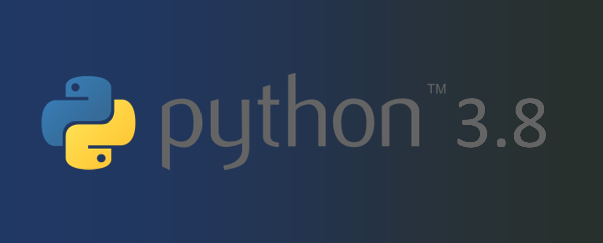
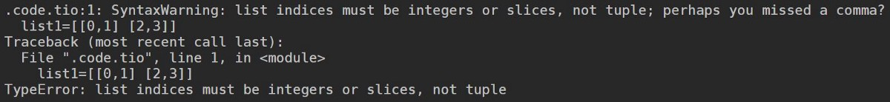

# 摘要

即将发布的Python版本为该语言增加了一些很棒的新功能，并通过基本的加速修复大大提高了性能。 让我们欢迎Python 3.8并充分利用它。
# 欢迎使用Python 3.8

Python 3.8是Python编程语言的最新主要版本，它包含许多新功能和优化。

> Python 3.8


Python 3.8的一些新功能包括：

1.海象运算符

> Walrus


在此新版本中，我们有一种新的赋值运算符，称为Walrus运算符（：=）。 该运算符的优点是可以在一行中设置和返回变量。 例如：
```
Code:sample_data = [{“id”: 1, “name”: “Srijan”},{“id”: 2, “name”: “Abhishek”},{“id”: 3, “name”: “Dilip”},{“id”: 4, “name”: “Vishal”},{“id”: 4, “name”: None},]print(“With Python 3.8 Walrus Operator:”)for entry in sample_data:    if name := entry.get(“name”):        print(f’Found name = {name}’)print(“Without Walrus operator:”)for entry in sample_data:    name = entry.get(“name”)    if name:        print(f’Found name = {name}’)Output:With Python 3.8 Walrus Operator:Found name = “Srijan”Found name = “Abhishek”Found name = “Dilip”Found name = “Vishal”Without Walrus operator:Found name = “Srijan”Found name = “Abhishek”Found name = “Dilip”Found name = “Vishal”
```

2.仅位置参数

现在，在定义方法的参数时可以使用特殊的标记“ /”，以指定该函数仅接受标记左侧的位置参数。 此处的“ /”标记表示x，y和z的值只能在位置上传递，而不能使用关键字参数。
```
Code:def func1(x,y,z=None,/):    r = x + y    if z is not None:        r -= z        return rprint(func1(2, 5)) #7print(func1(2, 5, 3)) #4print(func1(x=2, y=10)) #TypeErrorprint(func1(2, 10, z=3)) #TypeError
```

3. f字符串还支持“ =”

现在，您可以在f-string中使用“ =”运算符来获取并打印值。这意味着现在我们可以在f-string中执行算术运算。
```
a=5b=6print(f'sum={a+b}') #11
```

4.新的语法警告

Python在此新版本中引入了针对缺少逗号的新警告消息以及错误消息。 解释器将抛出此有用的警告消息，这将帮助用户快速找到他们的错误。
```
list1=[[0,1] [2,3]] #this will give a SyntaxWarning of missing comma along with the TypeError.
```

> SyntaxWarning


5.可逆字典

reversed（）现在可用于字典。 Python已开始保留从3.7开始在字典中插入键的顺序，但是现在在3.8中您也可以将其反转。
```
dict1={'a':5,'b':6}print(dict1)    #{'a': 5, 'b': 6}print(list(reversed(dict1)))    ['b', 'a']
```

6.多处理共享内存

使用多重处理，可以在所有Python实例之间全局共享和访问数据。 这将大大简化存储，存储，访问和传输数据的速度。

7.用于创建泡菜文件的新协议

Python中的Pickle主要用于序列化和反序列化数据，以及可在其他地方使用的代码。 在此新版本中，Python默认情况下将使用协议4，您也可以将其与协议5一起使用。 这将使API充分利用，从而提高性能。 对于在数据科学领域工作的人来说，这是一个令人振奋的消息，因为即使在空间较小或有限的服务器中，它也可以与Django和Flask很好地配合使用。

8.改进的CPython

Python还表示，他们已经改进了Python的C引擎。 这将使使用Python进行优化变得容易。 数据科学领域的人们曾遇到许多实例，其中Python或Jupyter环境由于大量数据而崩溃。 随着其CPython模块的改进，用户可以期望在处理和查询数据方面获得更好的结果。

9.绩效提升

此版本增加了一些性能，可加快解释器的速度。 他们之中有一些是：
+ operator.itemgetter（）现在提高了33％。
+ 现在，collections.namedtuple（）中的字段查找速度提高了两倍以上。
+ 列表构造函数现在创建的列表平均减少12％。
+ uuid.UUID现在使用插槽来减少内存占用。
+ 现在，一些简单的内置方法的调用速度提高了20％到50％。

还有更多…要了解更多信息，请查看https://www.python.org/downloads/release/python-380/
