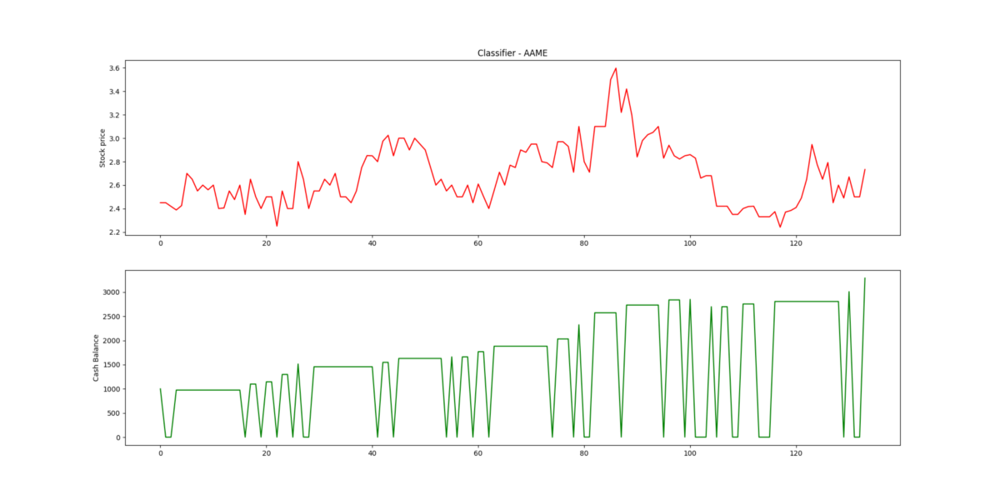

最初发布在http://shortcircuitsandinfiniteloops.blogspot.com。

> Image by Pexels on Pixabay

在您建立第一个基本回归模型或分类模型的那一刻，它至少会引起您的注意。 大量的时间序列数据，再加上年轻人退休的可能性，在祖父的阁楼上寻找旧藏宝图的吸引力不可抗拒。 你怎么不考虑呢？ 您可以使用机器学习来预测市场吗？

我至少必须尝试。 这是我所做的，也是我学到的。

网上有很多小规模的教程都是一个不错的起点。 他们向您展示如何提取股票的历史记录，也许计算一些指标，然后将其提供给回归算法，并尝试预测第二天的价值。 或者，他们使用分类器来预测股票是上涨还是下跌，而无需预测价值。

对于从这里出发，我有两个想法。 首先，我想做得更大。 我的理论是，某些股票，货币和财务指标之间可能存在隐藏的关系，这些关系太微妙了以至于无法发现。 我认为机器学习算法可能可以将它们挑选出来。

其次，我不会挑选想要预测的股票。 我打算训练所有模型，然后看看哪种股票表现最好。 当时的想法是某些公司可能比其他公司更具可预测性，因此我需要找到它们。

我首先下载了标准普尔500指数中大多数股票的历史记录，一堆货币价值历史记录和几十个财务指标。 Python脚本负责将它们转换为一致的格式，填充缺失值，并删除至少不能追溯到2000年代初期的时间序列。 总而言之，当尘埃清除后，我在一张漂亮的熊猫表中有一千列的数据，其中包含18年的数据。

一旦完成，我将使用出色的TA-lib库为5、10和30天的窗口的每个时间序列计算一堆指标。 我没有财务背景，也不知道哪些会真正增加价值，所以我采取了添加很多方法，然后让模型进行分类的方法。 这使列数爆炸。 数据集已准备好输入32,000列以上的训练模型。

我选择XGBoost作为我的算法的原因是其整体性能以及能够轻松查看模型用于预测的功能。 我将其设置为遍历数据集中的所有股票，为每个股票训练两个模型。 第一个是分类器，它可以预测第二天股票会上涨还是下跌。 第二个是回归模型，用于预测第二天的收盘价。

对于每种模型，我都会使用95％的可用数据进行训练，然后将其余数据用于验证测试，以模拟从未见过的库存数据。 剩下的5％大约相当于3个月的交易数据。 任何机器学习模型都可以很好地预测训练过的数据-诀窍是使其更通用，并在从未公开的数据上表现良好。

为了进行验证运行，开始了$ 1000的模拟投资。 如果预测库存会增加，则买入，如果预测下降，则卖出。 没有做任何努力来考虑交易成本，因为我想看看没有这个结果的结果。

我将Jetson TX2放了一个月。

发现了什么？

不出所料，对于大多数股票来说，结果都很差-准确度并不比掷硬币更好。 但是，有些数据在验证数据上表现得异常出色。 在3到6个月内，我的模拟资金增长了两倍或三倍，而一对夫妇在这段时间内产生了20倍的利润。 原来，图表可以使您的心率飙升。 谁知道？

请记住，这是算法从未见过的数据-最后5％保留在训练数据集中。

> Top is stock closing price, bottom is cash. Dips to near zero are buys.

我找到了吗？ 是否有一些与市场指标巧妙关联的股票，因此可以预测吗？ 如果是这样，我可以从价格波动中赚钱。

当我编写代码并运行它时，距离下载巨型数据集已经过去了几个月。 我对其进行了更新，以包括最新的交易数据，并决定查看该模型在该时间范围内的工作情况。他们在验证运行方面做得很好-如果在过去的几个月中我一直与他们进行实时交易，他们的表现是否也一样？ 这一点让我感到非常兴奋。

结果令人费解，令人沮丧。 在最初的训练和验证运行中表现出色的模型在运行后续数据时可能还不错，但也可能会严重失败并烧毁所有的种子资金。 模拟有一半时间会赚钱，一半时间会破产。 有时，它比抛硬币要好几个百分点，而有时却要糟得多。 发生了什么事？ 它看起来很有希望。

得到教训

终于，我想到了我所做的一切。

如果股价是随机波动，则结果的波动正好在50％左右。 通过让我的程序搜寻数百只股票来寻找表现良好的股票，它偶然发现了一些在验证时间范围内预测良好的股票。 但是，仅在几周或几个月之后，在随机游走的另一部分中，它失败了。

没有微妙的潜在模式。 这个模型只是偶然地幸运了几次，我让樱桃挑选了这些实例。 这是不可重复的。

因此，它被带回家了-机器学习不是魔术。 它无法预测随机序列，因此在训练模型时必须非常小心自己的偏见。 仔细的验证至关重要。

我确信我不会成为阁楼上旧藏宝图召集的最后受害者，但要谨慎行事。 如果您想学习，随机时间序列要少得多。 模拟，仔细验证，并注意自己的偏见。
# 当我尝试使用机器学习进行市场预测时会发生什么
