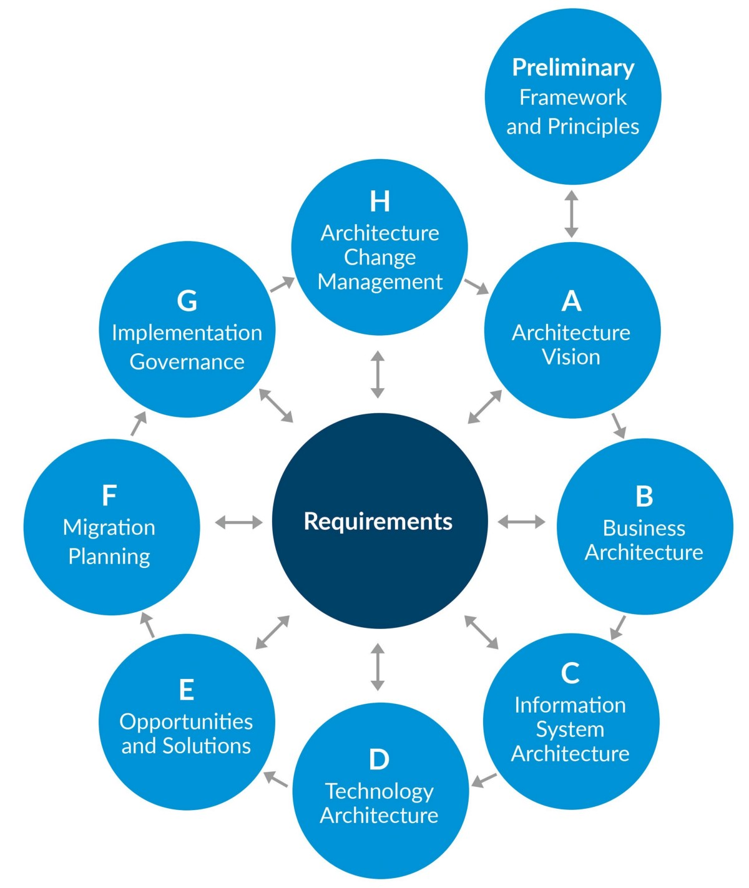

# 我在学习企业架构时学到的东西

“我们认为企业体系结构是充分描述业务功能和业务需求并将它们与信息系统需求联系起来的过程。”

在作为开发人员的职业生涯中前进，我对软件体系结构的概念越来越好奇。 我们经常将建筑的概念发展为我们感兴趣领域的内聚设计。 我越深入研究该主题，就越能将其与软件体系结构模式和最新技术联系起来。 每当我想到架构时，想到的关键字都是面向服务的架构，pull vs push，AQMP vs RPC，Cloud vs内部部署等。

我只听说过企业架构一词。 最初，我以为我要处理应用于企业的同一体系结构概念。 我期待有关可伸缩性，体系结构模式等的担忧。 为了进一步了解该主题，我研究了“开放团体”提供的资源。 它们提供了将企业体系结构应用于组织“开放团体体系结构框架”（TOGAF）的框架。

令我惊讶的是，在学习材料期间，我很少遇到IT准则或模式。 相反，我发现了旨在向包括IT在内的组织提供业务变更的工具和方法。 我看到自己的视野只是一幅大画的一小部分-我开始欣赏的一幅画。 为了掌握更多信息，我选择了TOGAF认证的学习途径。

在这里，我将概述从以前作为开发人员的角度来看的一些主要差异。
# 描述

企业架构（EA）是“一种定义明确的实践，用于始终使用整体方法进行企业分析，设计，规划和实施，以成功地制定和执行策略。 企业体系结构采用体系结构原理和实践来指导组织进行执行其战略所必需的业务，信息，流程和技术更改。” — OpenGroup

该定义已经给出了很好的提示-业务驱动的实施和计划。 开放小组建议一种应用EA的方法，称为架构开发方法（ADM）。

> TOGAF ADM Phases


此方法分阶段概述了体系结构开发，依次概述：
+ 建筑愿景->着重于理解需求和利益相关者的关注。 显示最终体系结构的草案及其对企业的影响。
+ 业务->设计业务架构，并得到利益相关者的批准。
+ 信息系统->根据以前的业务架构，由领域专家设计数据和应用程序架构。
+ 技术->设计将支持应用程序和数据的技术平台体系结构。
+ 计划->将先前阶段中分析的所有必需工作分组为工作包。 与项目组合管理集成，以将工作包计划到组织路线图中。
+ 实施->遵循团队执行的实施。
+ 变更管理->连续过程，以确保体系结构满足要求，并跟踪新机会。

基本上，ADM的结果是
+ 基于设计架构的系统实施
+ 治理流程可确保实施连续有效。

我简化了描述和阶段，以大致了解该方法。 如果您想更详细地了解ADM，建议您在“ The Open Group”网站上找到TOGAF文档。

此方法是抽象的-认为是针对特定组织量身定制的。 任何阶段都可以更改，删除或重新排序。 尽管如此，ADM确实适用某些概念，而与企业无关。
# 企业至上

认识到需求是设计的主要条件。

架构开发始于“业务架构”（B阶段），它将为应用程序，数据和技术架构提供基础。 这样可以确保在设计解决方案时将重点放在业务成果上。

乍一看似乎很简单，但是有多少次我们被吸引到技术卓越的思路中，而很少关注特定需求。 开发人员和IT架构师都是聪明的人。 他们喜欢智能解决方案，并且常常对如何解决问题感到兴奋。 使用“下一件大事”或“找到完美的工具”很容易成为我们关注的焦点。 如果管理不当，则可能使我们的注意力从完全理解需求转移到为其构建特定的系统。

TOGAF强调首先关注业务成果。 这并不意味着我们会忽略技术卓越，相反，我们会在各个阶段更加专注于该主题，甚至可能会提供有关业务体系结构的反馈。 这将我带入下一个主题。
# 迭代中的机会

好的设计就是好的生意。

TOGAF建议采用迭代方法进行体系结构开发。 那比听起来更具有影响力。 结果，它允许所有阶段的反馈回路。

例如，当我们评估技术体系结构时，我们可以就影响业务活动的新技术（或缺乏新技术）提供建议。 这样，IT可能会对业务需求产生有意义的影响。 例如，由于“例如，我们可以使用云共享此信息，而无需手动发送”或“我们也可以以x成本而不是上门交易的价格在线出售”等技术，可以简化或取消某些业务活动。 门推销员”等

通过使用通用语言“业务体系结构”来实现这种理解。 通过与业务体系结构进行交互，解决方案架构师/领域专家可以将IT /技术产生的机会传达给业务。 业务架构师和利益相关者可能会决定利用此机会，更改业务体系结构，开始迭代设计业务，应用程序和技术。 该框架提供了一种一致的方式，可以从IT向业务提供反馈，从而可以专注于结果和卓越的技术。

请注意，业务体系结构应该与技术关注点分离开来，但是鉴于某些领域的技术和产品进步速度，它们可能会以以前无法预期的方式影响业务活动。
# 建筑是关于连续性的

变化是唯一不变的。 坚持下去是唯一的错误。

架构过程尚未完成。 企业体系结构涉及“变更管理”作为一个连续的过程。 在此过程中，我们监视体系结构的当前状态。 这意味着我们会及时监控原始需求是否仍然得到满足，并跟踪可能出现的新机会（例如新产品，新技术等）。

这种方法很有趣，因为它将架构本身视为要维护的工件-涉及人员，IT和业务变更的工件。 作为开发人员，我遇到了实施新逻辑的情况，因此我必须轻描淡写并跟踪以前的要求，以避免冲突。 当更改管理多个业务流程的软件方面时，通常会发生这种情况。 这必须在实施过程中完成。 拥有专门监视此框架的框架，可以进行更安全的更改，更好的需求管理和更健康的系统。
# 建筑是关于人的

设计只有在有人使用时才能完成。

企业体系结构是围绕业务战略重组企业本身。 它与特定的IT系统设计无关，而与人员和流程有关。 它是为每个企业量身定制的，以实现变化和一系列连续活动。 在大多数组织中，该体系结构将影响业务，IT和项目组合管理级别的人员。 实际上，TOGAF的主要要点之一就是组织的“架构能力”，即企业使用所需架构变更的能力。 实际上，这通常意味着对人员进行“培训”，以确保对变更的正确理解和理解。 您可能拥有迄今为止设计最有效的体系结构，但是如果人们无法使用它，那么您肯定会失败。

要牢记这是一个强大而扎根的概念。 企业架构师的工作是使所有参与者协调一致，从而带来所需的更改并保持连续性。
# 结论

学习企业架构为我提供了一个有趣的观点。 作为开发人员，我们是解决问题的人。 从整个组织的角度查看所需的更改将考虑涉及业务，IT，人员和流程的一系列新问题和解决方案。 理解这些问题是另一种挑战，最初看起来似乎与我们很遥远，但会影响我们的工作和环境。 这拓宽了我们在变更实施之外如何管理变更的视野。
```
(本文翻译自Elman Hasa的文章《What I learned studying Enterprise Architecture》，参考：https://medium.com/swlh/what-i-learned-studying-enterprise-architecture-cafbde9e6dc2)
```
