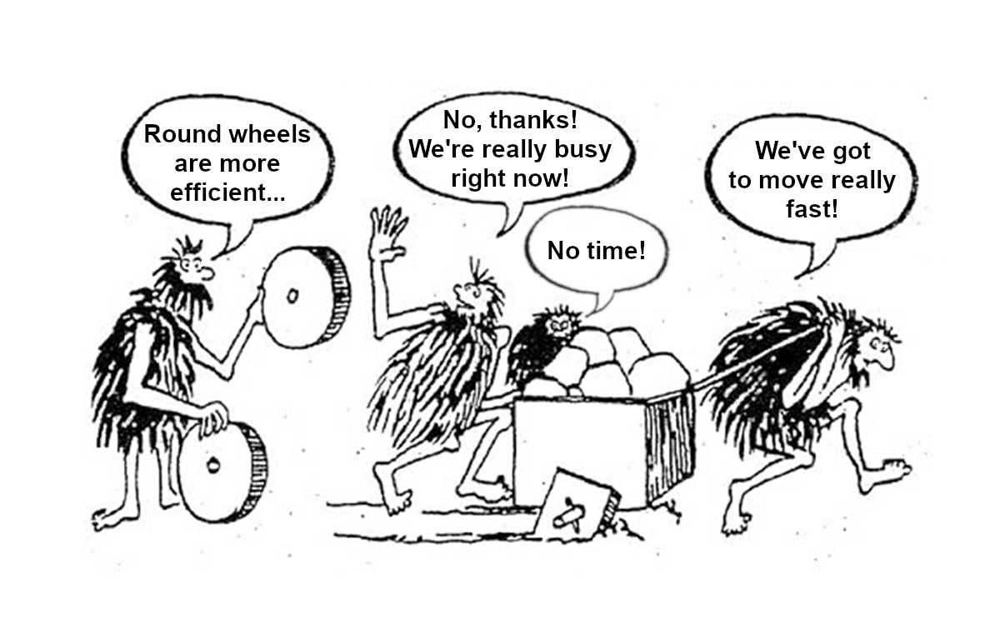

# 什么是技术债务以及如何计量

> Too busy for efficiency. This image has been modified by me. Source: https://pbs.twimg.com/media/DTvOdk9VMAAwBQ5.png


俗话说，破解鸡蛋有多种方法。 不用说，这个概念也适用于软件工程。 在设计软件系统的大部分时间里，将有不止一种方法来实现它。 这提出了一个挑战：寻找最佳方法。
# 困境

似乎最好，最有效的构建软件系统的方法通常不是最明显，最直观的。 看看蛮力算法（大多是直观，简单，明显和简单）与先进而有效的对应算法（不是那么明显和直观）的计算复杂性，就可以证明这一点。

比起高级解决方案，它更容易并且很自然地推断出非常简单的解决方案。 除此之外，还需要快速交付功能，工程团队可能会发现自己在一种耗时，先进但更好的方法上选择了一种快速简便的方法，这将在将来节省每个人不必要的维护成本。
# 团队决定：让我们继续前进，我们稍后再讨论

为了做出采用低效，快速且简便的方法的决定，团队可能会认为，在将来的某个时刻，将进行工作以解决这种“小”效率低下的问题：“我们现在只需要快速行动” 成为每个人的口头禅。 很快发现，每个人都必须快速行动的那一刻永远不会消失，而始终行动的唯一方法就是快速。 解决累积的软件问题的时间似乎总是会侵蚀建立新功能的时间。 思想将永远是：

我们现在可以构建一些非常酷的新功能。

另一个流行的是：

如果有时间，我们稍后会再讲。

但是，正如经验教训给我们中的一些人一样，软件熵的概念将确保这段时间永远不会到来。

软件熵是软件随着时间的推移变得难以维护且昂贵的趋势。

随着发布新功能的压力越来越大，团队通过将新代码从糟糕的代码中分支出来，进一步加剧了问题。 毫无疑问，该团队慢慢地逐渐放弃了任何时候都写干净代码的承诺，无论如何都要遵守标准和约定，最终，没人再谈论即将进行的改进了。 以下事实使团队不断努力，这对团队造成了沉重打击：

随着时间的推移，维护软件变得越来越容易。 维护的成本往往最高，或者保持不变，或者变得更加困难和昂贵，尤其是随着代码库的扩展。

通过选择简单的方法而不是更好，先进但耗时的方法，团队仅在软件方面承担了债务。 他们必须在将来的某个时候偿还技术债务，以使其软件高效，可扩展和可维护。

技术债务[蓄意]是指为了在短期内快速采取行动而做出糟糕的设计和/或实施决策，而不是花费更长的时间但保留了效率，可维护性和合理性的更好方法而产生的成本。 代码库。

但是，这里的问题是，开始缓慢而稳定地积累技术债务权益后，它很难停止，因为在构建新功能时，您必须编写更多不良代码以包含现有不良代码的负面影响，然后再编写一些新功能。 为了维护不断增长的混乱局面，需要编写更糟糕的代码，直到团队开始大声疾呼要求完全替换当前系统为止，因为甚至很难阅读代码的任何部分并从中获取任何意义。 一点一点地累积起来的技术债务和软件熵的现实（技术债务增加）使代码库变得无法弥补。

上面使用的示例适用于故意产生的技术债务。 可能会无意中招致技术债务。 工程团队突然发现自己正在处理技术债务问题的一种非常简单的方法是，如果他们的技术过时了。 随着软件标准的不断提高，遗留软件的过时以及随之而来的依赖项方面的技术负担。
# 请提供数字-我们如何衡量技术债务？

> How do we assign numbers to this Technical Debt concept? Source: https://static.wixstatic.com/media/279667_7ef75f79ddad467f964792939632dd79~mv2.jpg


如果我们不能在如此重要的概念上加一个数字，那对决策无济于事。 量化之后，我们可以进行分析比较，知道自己是否正在取得进展，可以根据数据进行计划。 非技术团队成员可以了解业务运行所用软件的质量。

但是，确定代码质量涉及很多变量，其中技术债务的计算是一个重要因素。 其中一些变量包括复杂性（环行和认知），代码行，一致性，可维护性指数，Halstead复杂性度量，继承深度，传入和传出耦合，嵌套深度，写入n行的时间等。 考虑一下，似乎很难知道我们需要做多少工作来偿还技术债务。但是，事实证明，有一个简单的解决方案可以解决此问题，这取决于我们选择表达问题的方式：

以比率表示技术债务计算。 修复软件系统的成本[修复成本]与开发它的成本[开发成本]的比率。 该比率称为技术债务比率[TDR]：
```
Technical Debt Ratio = (Remediation Cost / Development Cost) x 100%
```

真的很简单吗？ 技术债务比率[TDR]只是修复成本与开发成本的比率。

通常，没有人希望获得很高的技术债务比率（TDR），一些团队倾向于小于或等于5％的值。 高TDR分数反映出软件的质量真的很差。例如，如果补救和开发成本均以时间[小时]表示，则TDR分数仅表明工程团队需要多长时间才能恢复其代码库的健全性， 达到质量。 因此，始终应选择较小的TDR值。

始终首选较小的TDR值

可以根据解决团队内部代码问题的规则，使补救成本[RC]成为团队认为相关的任何代码质量度量的函数。 RC也可以用时间来表示。例如，如果团队选择将RC [以时间表示]设为圈复杂度的函数，换句话说，解决代码函数RC中的问题所花费的时间就是 直接与该代码函数的循环复杂度成正比，那么一旦计算出整个文件的循环复杂度，就很容易确定修复整个文件所花费的时间。 这只是一个RC确定的示例，我们在这里将不讨论圈复杂度的计算。基本上，出于以下推理：
```
RC α Cyclomatic ComplexityRC = k(Cyclomatic Complexity)k is a constant
```

一旦给出了上面的k和环复杂度，就可以很容易地计算出RC。

开发成本[DC]可以想象为编写某些代码行的成本[编写那么多行代码所花费的时间]。 例如，如果一个文件有100行代码[LOC]，并且平均需要花费0.27小时来写一行，即每行成本-CPL为0.27小时，那么开发成本[DC]将为：
```
0.27 hours/line x 100 lines = 27 hours.
```

这意味着在该文件中开发代码花费了27个小时。

现在，我们已将TDR的所有相关变量都包含在其相关的缩写中，让我们再次提醒自己这些缩写：
```
Development Cost: DC [hours]Lines Of Code: LOC [lines]Cost Per Line: CPL [hours]Remediation Cost: RC [hours]Technical Debt Ratio: TDR
```

因此，请参考TDR的定义，我们可以这样写：
```
TDR = ( RC / DC ) x 100%
```

哪里：
```
DC = CPL x LOC
```

让我们看一个示例代码库，其中补救时间为365.8小时； 代码行数为26,398行； 每条线的成本为0.27小时/条线。

解：
```
RC = 365.8 hoursLOC = 26,398 linesCPL = 0.27 hours/lineRecall that DC = CPL x LOC=> DC = 0.27 hours/line x 26,398 lines   DC = 7,125.83 hoursTherefore:    TDR = ( RC / DC ) x 100%    TDR = ( 365.8 hours / 7,125.83 hours ) x 100%    TDR = 5.1%
```

此示例代码库的技术债务比率为5.1％
# 结论

快速回顾一下，技术债务是工程师在构建软件时试图通过选择快速简便的方法而不是先进，高效但耗时的方法来偷工减料时产生的成本。 随着时间的推移，技术债务会累积利息，并增加软件熵。 为了有效地衡量技术债务，我们需要将其表示为修复软件系统所需的成本与构建系统所需的成本之比。 此数量称为技术债务比率[TDR]。

希望您喜欢阅读。 请让我知道您的想法，特别是如果我错过了任何有助于进一步阐明这一非常重要的软件指标的信息。
```
(本文翻译自Daniel Okwufulueze的文章《What Technical Debt Is And How It’s Measured》，参考：https://medium.com/the-andela-way/what-technical-debt-is-and-how-its-measured-ff41603005e3)
```
