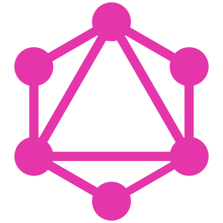

## GraphQL：大图
### 在本课程中，您将学习GraphQL，它的核心概念以及为什么要选择GraphQL来构建API。
# 为什么开发人员喜欢GraphQL？


您是否听说过GraphQL并想知道它是否适合您的下一个项目？ 在本文中，我们将了解什么是GraphQL及其好处。
# GraphQL简介


如果您是GraphQL的新手，那么这里总而言之就是简短的故事。 GraphQL是可用于API的新规范。 它是使用REST编写API的替代方法。

它是由Facebook开发的，作为其移动应用程序的内部解决方案，后来被开源给社区。 从那时起，它就在开发人员中广泛流行，并已成为构建服务的首选解决方案。

GraphQL是一种查询语言，与您使用的语言无关。 这只是一个规范。 客户端可以从服务器查询所需的数据。 然后服务器以对查询的JSON响应进行响应。 这里要注意的有趣的事情是，客户可以确切地要求他们所需要的东西，而他们只能收到。 是!
# 为什么选择GraphQL？

在选择任何技术之前，我们需要了解选择它的原因。 让我们深入研究一下，了解GraphQL为什么可以满足您的开发需求。
# 1.出色的开发人员经验


与REST之类的替代方案相比，使用GraphQL的最大好处是它提供了卓越的开发人员体验。 值得注意的是，使用GraphQL，前端开发人员将受益匪浅。 客户端驱动的方法为客户端提供了强大的功能，可通过创建自定义查询来查询他们喜欢的内容。
# 没有API版本

这可能会使某些开发人员感到惊讶。 GraphQL已将开发人员引入API设计和开发的全新时代。 由于客户端仅要求提供所需的数据，因此使用GraphQL的API设计非常灵活。 没有API的版本控制，添加新字段不会影响当前客户端对API的调用。 这是什么意思？ 好吧，开发人员不必面对维护多个API版本的巨大麻烦。

这些API可以不断发展而无需更改版本。

对GraphQL API的修改是不间断的更改。 开发人员非常希望使用此原理，以便他们可以轻松进行工作。 GraphQL在API开发中提供了开发人员从未见过的更高级别的灵活性。
# 团队独立工作

借助GraphQL，多个团队可以并行独立工作。 您是否曾经因为前端团队正在等待后端团队发布最新版本的API或最终确定API而停止开发的情况？ 遇到前端/客户端团队在等待API最终版本时停滞不前的情况非常普遍。 这导致开发延误并导致挫败感。

使用GraphQL，前端团队和后端团队可以独立工作。 使用GraphQL具有的严格类型化架构，团队可以并行工作。 前端团队可以继续使用该API的模拟版本。 他们还可以使用它来测试代码。 这为开发人员提供了愉快的体验，而不会停止他们的开发工作。
# 2.声明式数据获取

使用GraphQL的最大好处之一就是其声明式数据获取方法。

GraphQL：不会多次往返服务器，不会超量提取，也不会数据不足

可以汇总查询以单次询问您到底想要什么。 使用这种方法，您可以消除数据的任何过度获取或不足。 您询问您到底需要什么，而GraphQL会给您您所要求的东西。
# 进行中的GraphQL查询

让我们尝试通过下面的示例更好地理解这一点。 假设我们要访问博客上的数据。 我想构建一个显示博客作者信息的应用程序。 我希望它显示作者的姓名，作者撰写的博客文章以及作者撰写的三个最新博客主题。

GraphQL查询请求

我们的查询如下所示：
```
{  author (id: 6) {    name     posts (last: 3) {      title    }    topics (last : 3) {     name    }  }}
```

我们传递需要响应的字段。 我们正在寻找作者的姓名，最近写的三篇博客文章以及最近写的三篇主题。 查询的结构旨在准确地询问我们需要什么。

GraphQL查询响应

这是我们从服务器获得的JSON响应形式。
```
{  "data" : {    "author" : {      "name" : "Adhithi Ravichandran",      "posts" : [        { title: "Why Developers Like GraphQL?"},        { title: "Web Accessibility And Why You Should Care"},        { title: "Becoming A Better Developer"}      ],      "topics" : [        { name: "GraphQL"},        { name: "Web"},        { name: "General"}      ]    }  }}
```

我们从服务器返回了一个JSON响应，它完全符合我们的要求。 它返回了作者姓名，作者撰写的最后三篇帖子以及作者撰写的最后三个主题。 仅此而已，仅需一次访问服务器即可完成所有操作。 这不是很神奇吗？
# 3.强类型架构


您应该使用GraphQL的另一个原因是由于它的类型强。 我们知道GraphQL本质上是一种查询语言，并且它是强类型的。 这意味着GraphQL模式应具有其使用的所有对象的类型。 因此，该模式充当客户端和服务器之间的契约。 以下示例显示了如何在GraphQL模式中定义类型。
```
type Person { id : ID name: String age: Int gender: String}
```

我们定义了类型为Person的复杂对象Person。 该对象包含几个字段，每个字段都有自己的类型。

强类型的GraphQL模式具有多个优点。
+ 代码是可预测的
+ 模式充当客户端和服务器之间的契约
+ 团队可以独立工作
+ 可以及早发现错误
# 结论

该帖子最初发布在https://programmingwithmosh.com/

希望您喜欢GraphQL为什么非常适合您的下一个项目。 如果您想了解GraphQL的概况，请查看我在Pluralsight上名为GraphQL：The Big Picture的课程
## GraphQL：大图
### 在本课程中，您将学习GraphQL，它的核心概念以及为什么要选择GraphQL来构建API。

这里还有一些其他资源，可以帮助您开始使用GraphQL。

其他资源：

https://graphql.org/

https://graphql.org/learn/

https://www.graphql.com/

如果您有任何意见，请在下面发表您的意见，并与您的团队和朋友分享这篇文章。 要保持联系，您可以在Twitter上关注我@AdhithiRavi
```
(本文翻译自Adhithi Ravichandran的文章《Why Developers Like GraphQL?》，参考：https://medium.com/@adhithiravi/why-developers-like-graphql-f90fcd48c872)
```
