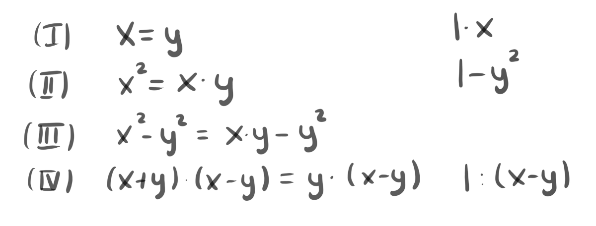
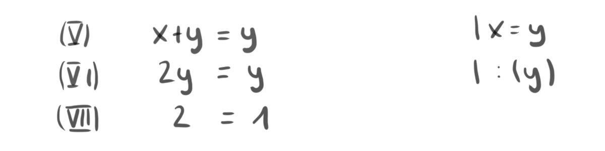
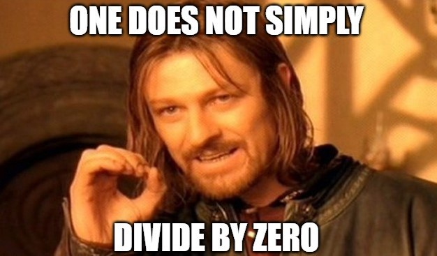
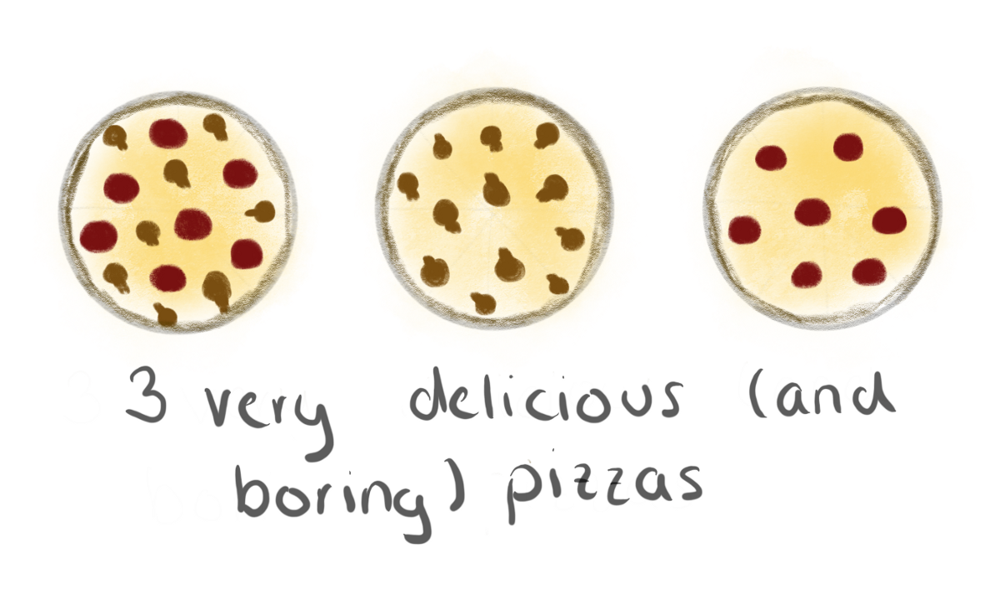
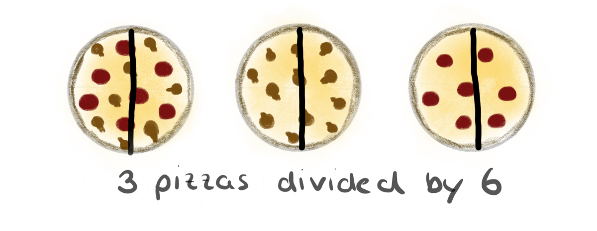
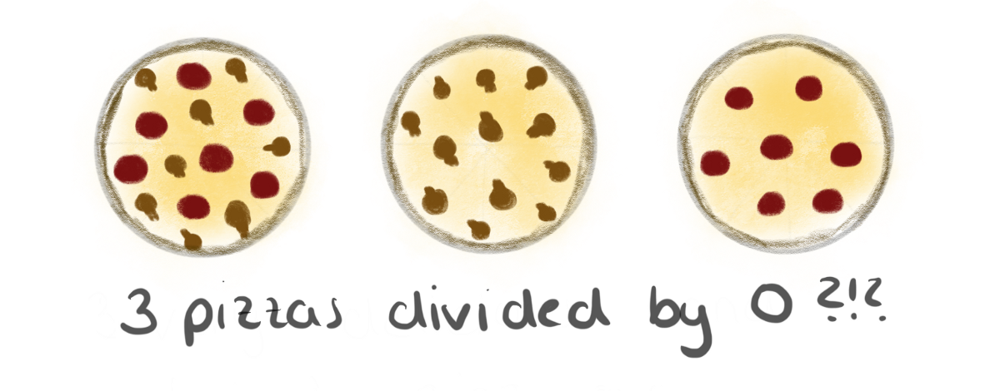

# 零除可以使正确的陈述为假

更为逻辑的答案是，被零除可以使任何语句为假，甚至是真实的语句。

让我们看一个简单的计算。

> Calculation Drawn by Author.


这是中学或初中的典型计算的一部分。 在第一行（I）中，我们设置x = y。 然后，将两边都乘以x，得到方程式，如第（II）行所示。 然后，我们在两边都减去y²来接收方程式（III）并分解。 这将我们引到第（IV）行所示的方程式。 到目前为止，一切都正确。

现在，除以（x-y），然后再进行一些计算。

> Calculation Drawn by Author.


除以（x-y）导致线（V）。 请记住，一开始我们设置x = y，所以现在将其代入方程式（VI）。 然后被y除以得到第（VII）行中的最后一个方程，该方程由2 = 1给出，这显然是错误的！

什么？ 这里发生了什么？ 如何解释呢？ 我们学到的关于数学的所有知识突然之间都错了吗？ 有什么我们想念的吗？ 问题出在哪里？

幸运的是，答案很简单：由于x = y，因此x-y = 0，所以从方程（IV）到方程（V）的方式除以0。

计算中的其他所有内容都是正确的（在最后一步中，我们仍需小心除以y！），但是这一小步骤对我们来说毁了一切。

或几乎所有内容：它可能破坏了我们计算的正确性，但确实为我们提供了一个绝妙的解释，说明为什么我们永远不应该除以0。因为除以0可以使真实的陈述为假。

> Meme by Author.


因此我们可以得出结论：1不能简单地除以0。
# 为什么除以0真是个坏主意
## 给所有曾经想知道为什么老师对0除法如此疯狂的人的解释

您很可能在您的生活中上过某种数学课。 而且，无论您对这些类的记忆消失了多少，您都可能还记得这一点：一不应该被零除。

老师通常告诉您的是：
+ 要么：未定义除以零。
+ 或者：除以零是没有意义的。
+ 或者：如果除以零，则可能是任何结果。
# 直觉的解释

是的，直观的解释是除以零没有多大意义。 要了解这一点，让我们回到小学的学习方式。 试想一下，您有3个披萨。

> Drawing by Author. (Art class was the only class I ever failed — so please, I am trying here!)


如果我们将这三个披萨除以三人，每个人都会得到一个披萨（一个披萨/人）。 如果我们将这三个披萨除以六个人，那么每个人都会得到一半的披萨（每人0.5个披萨）。

> Drawing by Author.


到目前为止，非常容易。 希望您一直与我在一起，直到这里。 现在，将六个披萨除以0人。 每个人都得到多少比萨饼？
+ 0？
+ 3？
+ 无穷？

> Drawing by Author.


这些答案似乎都不令人满意。 人为零，所以没人能得到任何东西。 因此，结果应为0吗？ 还是应该说还有3个披萨，所以答案应该是3个？ 还是看极限，答案应该是无穷大？

正确的答案显然不是很清楚，因此，简单地说一下是有道理的：未定义除以0，因为没有直观的答案。

但是，如果您是喜欢逻辑的人（例如我），那么这个答案就不会很令人满意。 取而代之的是，我会再给您一个解释，希望您终生满意。下次有人问您为什么不能除以0时，这就是您的光辉时刻。
```
(本文翻译自Maike Elisa的文章《Why dividing by 0 is Such a Bad Idea》，参考：https://medium.com/swlh/why-dividing-by-0-is-such-a-bad-idea-dfa9a5ff8229)
```
