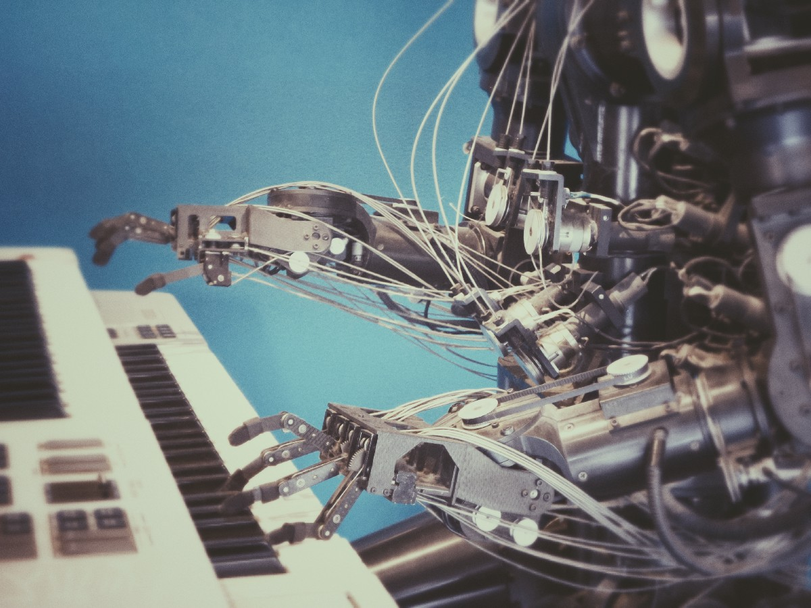

# 为什么情报可能比我们想象的要简单
## 新大脑皮层的教训

> Photo by Paweł Czerwiński on Unsplash

您需要多少信息来建立一个人，更具体地说是一个人的大脑？

毕竟，我们是迄今为止地球上最复杂的物种。 为了解决这个问题，我们的一些大脑认为我们的大脑是宇宙中最复杂的结构！

然而，番茄比人类具有更多的基因。 准确地说是7000多。

> Arguably not the most complex structure in the observable universe. Photo by Immo Wegmann on Unsplash

查看我们的基因，我们很难弄清我们所有复杂性的编码位置。

大约只有20000个基因开始，其中大约有一半与其他事物有关，例如建立手脚和重要器官。

从数学上讲（考虑到我们的基因组可以看作是携带信息的代码，信息正在由类似于图灵机的东西处理，正如我在这里更详细地解释的那样），我们的基因组经过无损处理后仅携带了2500万字节的大脑设计信息 压缩。

相对于成年人在新皮层中所具有的10 -1连接（一万亿！）的量规，我们大脑的最新部分仅存在于灵长类动物中，并且在智人中异常大。 您会看到，如果我们对基因的理解不完全错位，那么假设我们的大部分知识和能力直接编码在基因中是不合理的。

唯一的选择是，需要一种更简单，更有效的方法来定义我们的大脑和新皮质的蓝图。

并以此构建原型智能系统。
## 统一的脑功能理论

杰夫·霍金斯（Jeff Hawkins）在他的《关于智力的书》中抱怨说，大脑的普遍图片由高度专业化的区域组成。

他将这种情况与19世纪的生物学家越来越详细地研究了各种各样的物种而没有留意生命背后的统一原理进行了比较。 在达尔文提出进化论之前，还没有人知道如何用一种笼统的叙述来描述自然世界的多重表象。

同样，大脑看起来可能由许多不同的高度专业化的大脑区域组成，但是它们明显的专业化不应使我们得出结论，即它们可能并非全部基于相同的解剖学和算法原理而工作。

实际上，我们观察到新皮层的解剖结构具有令人惊讶的同质性。 神经可塑性表明，大多数大脑区域可以轻松承担以前由其他大脑区域执行的任务，从而在其设计原理后面显示出一定的通用性。

诺曼·道奇（Norman Doidge）在畅销书《改变自身的大脑》中讲述了令人印象深刻的故事，讲述了患者将整个感觉系统重新映射到大脑的新部分的过程，例如人们通过用相机记录的视觉刺激直接将视觉刺激映射到嘴里来学会用舌头观察 。

对中风患者的研究同样表明，中风丧失的能力通常是由新的大脑区域重新获得的，而聋哑人可以重新绘制其Broca区域（负责语言处理）以控制其手部动作，并通过手语进行交流，而不是 他们的嘴巴运动，以便与他们说话。

大脑发挥不可思议的能力和灵活性来学习新事物。 大多数人可以学习与他们一起成长的任何一种语言，或者选择在以后的生活中学习一种新的语言，也可以学习他们选择的任何一种工具（公认地获得了不同的成功），依此类推。

可塑性和灵活学习的事实可以解释为，根据我们基因中信息的稀疏性，指向了新大脑皮层的生物学设置及其所使用的学习算法所基于的通用结构。
## 思想的结构

很难将概念本身概念化（正如我在最近有关思想几何学的文章中所深入探讨的那样），但是存在某些结构和模式，并且这些结构和模式深深地贯穿了我们认知的各个方面。

正如雷·库兹韦尔（Ray Kurzweil）在他的《如何创造思维》一书中所解释的那样，我们以一种分层的方式来感知世界，这种方式由复杂程度不断提高的简单模式组成。 他认为，模式识别是所有思想的基础，从最原始的模式到高度抽象和复杂的概念。

以语言和写作为例。 细线构成了我们可以识别为字母的模式。 各种字母组成单词，然后是句子。 句子形成段落，整篇文章。 最后，从以高度特定的方式排列的少量最小模式中，出现了叙事和意义。
## 模式识别生物学

现代神经影像学数据表明，新皮层由称为皮质柱的均匀结构种类组成。 每个人都由大约100个神经元组成。

Kurzweil提出，这些列构成了他所谓的最小模式识别器。 通过将模式识别器的各层彼此连接在一起来创建概念层次，每个模式识别器都专门根据许多可能的感官模式（例如眼睛，耳朵，鼻子）的输入来识别单个模式。

在基本特征提取（例如检测视觉刺激中的边缘或识别音调）的基础上，这些模式会叠加起来以形成越来越复杂的模式。
![Layers detecting patterns of increasing sophistication in visual data, leading to abstract labels like “elephant” or “penguin”. Credit to Sven Behnke [CC BY-SA 4.0]](1*igmH6L7atBD5GuW3CmFYCA.jpeg)
> Layers detecting patterns of increasing sophistication in visual data, leading to abstract labels like “elephant” or “penguin”. Credit to Sven Behnke [CC BY-SA 4.0]

模式识别器不限于处理视觉或听觉刺激。 它可以将各种信号作为输入处理，并根据输入中包含的结构生成输出。 学习意味着连接模式识别器并学习其权重结构（基本上是他们对彼此输入的反应有多强，以及它们彼此之间有多少相互联系），类似于学习神经网络时所做的。

但是，大脑在善于解决许多不同任务的同时又如何如此均质呢？ 答案可能在于神经科学和计算机科学的交集。
## 信息的作用

视觉，听觉和感觉信息有什么共同点？ 显而易见的答案是，这些都是某种信息。

坦率地说，信息的定义有些棘手，并且在信息时代被抛弃得太多了，但在大脑中进行信息处理的情况下，它具有技术意义。 要了解这种体系结构如何对我们如此有效，就必须迈出一步，即意识到可以将大脑视为一种信息处理设备。

神经元（神经计算的基础货币）的输入有很多统一性。 大脑正在处理的任何信号，总是由神经元的时空激发模式组成。 我们在外部世界中观察到的每种模式都在我们的感觉器官中编码为神经激发模式，然后根据库兹韦尔的说法，模式识别器的层次结构会向上和向下流动，直到成功提取含义为止。

神经科学证据得到计算机科学思想的支持。 佩德罗·多明戈斯（Pedro Domingos）在他的《大师算法》一书中提出，我们可能会找到一种通用算法，只要有正确的数据，它就能使我们学习到几乎所有我们能想到的东西。

这种通用学习算法甚至可以由已经存在的学习算法（例如贝叶斯网络，连接主义或符号主义方法，进化算法，支持向量机等）的混合组成。

尽管我们还不确定如何从算法的角度学习大脑，但是大脑也可能使用类似于该通用算法的东西。 作为最基本的例子，当然有希伯来语学习，这种学习已在某种程度上发生在大脑中。 对于更复杂的算法，研究人员一直在尝试寻找生物学上可行的机制来在大脑中进行反向传播，以及其他许多方面。

但是很明显，大脑非常擅长学习，并且需要以一种原则上可以理解并且很可能在计算机上建模的方式来做到这一点。
## 神经网络中的信息丢失

识别模式的诀窍是对其进行解码，以分析隐藏在信号内部的相关信息。 了解大脑的行为方式可能是了解智力如何运作的关键步骤之一。

On Intelligence的作者Jeff Hawkins抱怨我们在研究信息在大脑中的作用时工具的匮乏，但是在理解计算体系结构中的信息流方面取得了越来越多的进步。

今年夏天，我非常荣幸地参加了以色列神经科学家Naftali Tishby关于其信息瓶颈方法的两次演讲。 他以闪闪发光的眼睛和热情吸引着整个人群，他解释了当深度神经网络从输入数据中提取相关特征时如何过滤信息（观看他在斯坦福大学的演讲以得到介绍）。

该理论阐明了信息在深度神经网络中的流动方式（并提供了一个很好的理由，说明深度网络比浅层网络的工作性能要好得多）。

当您从300x300像素的图片中识别出人脸时，您就有90000像素包含信息，但是如果您知道通常由什么构成的人脸，则人脸信息的特征就少得多（例如，相关特征，例如 眼睛，嘴巴的宽度，鼻子的位置等）。

例如，在一些深层次的生成模型（例如Autoencoders，可以在此处找到介绍）中使用了此思想，在该模型中，学习了数据的潜在低维表示形式，然后将其用于生成高维，逼真的外观输出。
![The basic setup of a neural network. Credit to Glosser.ca [CC BY-SA 3.0 (https://creativecommons.org/licenses/by-sa/3.0)]](1*Qrz31f3twT_ItaugfYCBgw.png)
> The basic setup of a neural network. Credit to Glosser.ca [CC BY-SA 3.0 (https://creativecommons.org/licenses/by-sa/3.0)]

网络训练方法（例如随机梯度下降）使网络可以通过有效地从输入中抛出所有不相关的信息来过滤出相关的模式（例如Ian Goodfellow在他的著作《深层》中指出的那样，在对照片中的物体进行分类时忽略了照片的背景） 学习）。

Tishby将其与从瓶子底部流到顶部的水进行比较：瓶颈变得越来越紧密，信息流通的越来越少。 但是，如果瓶颈设置得当，到达顶部的水最终将携带所有必要的信息。

> Photo by Jadon Barnes on Unsplash

之所以提出这一点，是因为我认为这种信息理论的观点可以帮助我们理解由模式识别器组成的新皮层的概念。

模式识别器从数据中提取模式。 这些模式仅构成输入的一小部分，因此，实质上，大脑的模式识别器被设置为从我们的感知数据中提取与我们的生存相关的信息，并将此提取的数据分类为知识层次结构（我在 在我关于“思想的几何学”的文章中，如何将其构造成概念空间的篇幅更长）。 然后，我们可以使用这些命令将秩序带入混乱的世界，增加我们生存的机会。

这是大脑的工作。 它的核心是不断地从数据中学习有用模式的信息过滤和排序设备。

这很可能是我们所认为的智能的核心，因此在构建我们自己的智能系统时，我们不妨从中学习一些东西（就像我们已经学过的一样）。
## 为什么智慧可能比我们想象的要简单

关于AI的未来，我不是先知，我希望您被教导不要对互联网上的陌生人的看法过分相信，因此请您放心。

我承认，信息处理和情报比简单的模式分类要多得多（例如，请参阅我关于“蚂蚁和神经网络问题”的文章）。

在我们“解决”智能之前，有许多问题需要解决。 正如Yann LeCun在这里指出的那样，推断因果关系或一般常识知识结构是一个大问题，并且在算法中建立世界的预测模型（正如我在有关贝叶斯脑假说的文章中详细介绍的那样） 在许多其他必要步骤中可能是必要的下一步。

在训练机器人智能地执行任务时，在强化学习中会遇到其他与更好的目标功能相关的悬而未决的问题。 聪明意味着解决问题，而其中的一个主要方面是找出定义目标然后实现这些目标的最佳方法（在大脑中，这种作用被认为是由基底神经节发挥的作用）。

因此，只要堆叠模式识别器，就不会突然带来像人类一样在推理周围运转的机器人。

> Photo by Franck V. on Unsplash

我仍然认为，由新证据支持的遗传密码中所包含的信息稀疏性，证明了新皮层及其学习算法的简单性和通用性，应该让我们停下来，并抓住机会在不久的将来建造高度智能的机器 更重要的是（库兹韦尔预测机器将在2029年通过图灵测试，在2045年通过人类水平的AI）。

作为P.W. 安德森在他关于科学的层次结构的著名论文中说，更多的不同之处在于，如果我们找到了扩大简单事物的正确方法，那么扩大简单事物的使用可能会产生更多的结果。 在深度学习的最新成功中，其中一些已经很明显，深度学习与扩大可用数据和计算能力紧密相关。

对我来说，理解和建立自己的智慧绝对是令人振奋的前景。

但是，正如许多人强调的那样（本特德演讲提供了摘要），人工智能的兴起可能对整个人类产生重大影响，应将其视为一个问题。 即使我们高估了这个问题（因为坦率地说我们爱思考世界末日的想法也太多了），我们应该比后悔更安全。

因为毕竟大自然是通过进化的盲目幻想来产生智力的。 看来我们可能很快也会提出。
