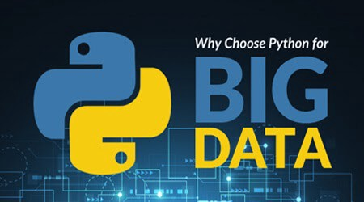
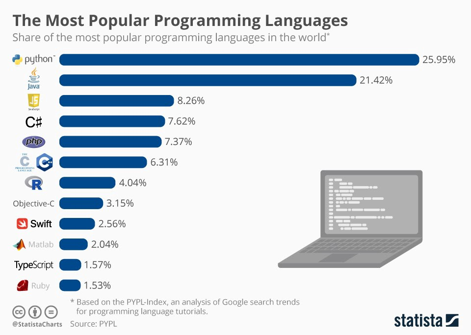
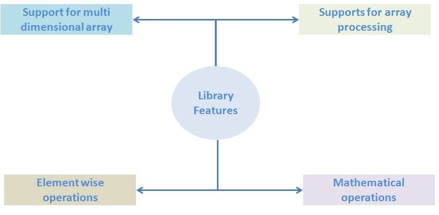
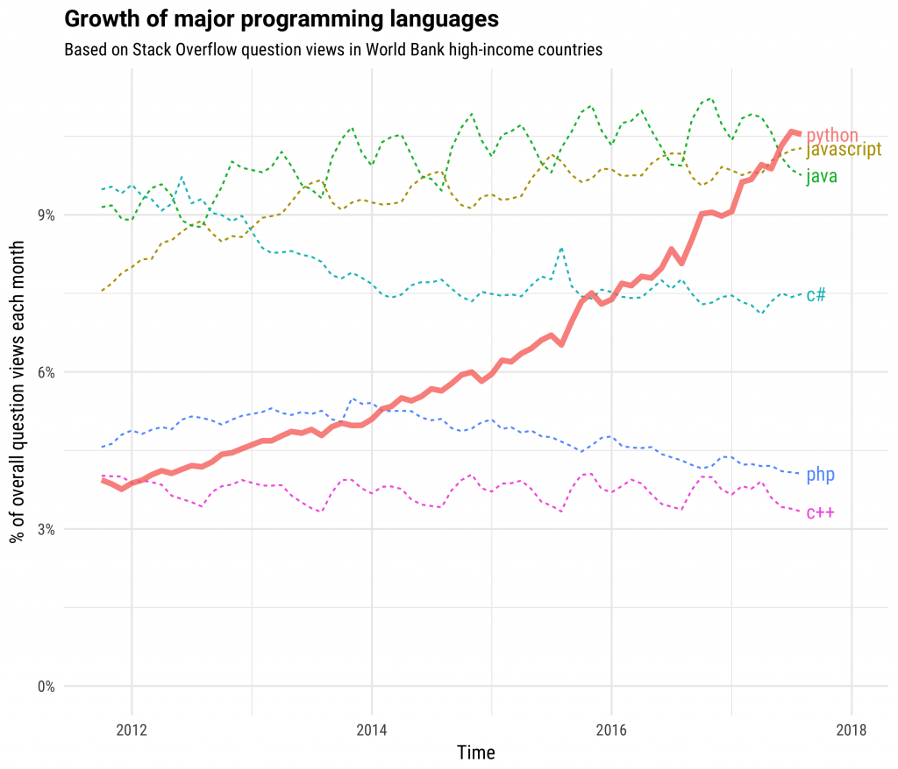

# 为什么Python编程非常适合大数据？
## 我们将在博客中讨论使用Python处理大数据的主要好处。

> Source

## Python无处不在！

随着Python在各个主要行业中的广泛使用，Python已成为该镇讨论的热门话题。 根据堆栈溢出趋势，Python被公认为增长最快的编程语言。

根据2019年Stack Overflow开发人员调查，Python是第二种“最受欢迎的”语言，有73％的开发人员选择Python胜过市场上其他流行的语言。

Python是Reddit，Instagram和Venmo等知名公司使用的通用开放源代码编程语言。
## 为什么选择Python处理大数据？

Python和大数据是现在入侵市场空间的新组合。 大数据公司对Python的需求很大。 在这个博客中，我们将讨论使用Python的主要好处，以及为什么Python在大数据领域已经成为当今企业的首选。
## 简单编码

与其他可用于编程的语言相比，Python编程涉及更少的代码行。 它能够以最少的代码行执行程序。 而且，Python自动提供帮助来识别和关联数据类型。

“ Python是一种真正出色的语言。 当有人提出一个好主意时，大约需要一分钟零五行来编写几乎可以完成您想要的内容的程序。” —杰克·詹森（Jack Jansen）

Python编程遵循基于缩进的嵌套结构。 该语言可以在短时间内处理冗长的任务。 由于对数据处理没有限制，因此您可以在商用机器，便携式计算机，云和台式机中计算数据。

之前，与Java和Scala等相对语言相比，Python被认为是一种较慢的语言，但是现在情况发生了变化。

Anaconda平台的出现为该语言提供了极大的速度。 这就是为什么用于大数据的Python成为业内最受欢迎的选项之一的原因。 您还可以聘请可以在您的企业中实现这些Python优势的Python开发人员。
## 开源

Python是在基于社区的模型的帮助下开发的，是一种开源编程语言。 作为一种开源语言，Python支持多种平台。 而且，它可以在Windows和Linux等各种环境中运行。

“我最喜欢的可维护性语言是Python。 它具有简单，简洁的语法，对象封装，良好的库支持以及可选的命名参数。” Bram Cohen说。


资源
## 图书馆支持

Python编程提供了多个库的使用。 这使其成为科学计算等领域的著名编程语言。 由于大数据涉及大量数据分析和科学计算，因此Python和大数据是很好的伴侣。

Python提供了许多经过测试的分析库。 这些库包含以下软件包：
+ 数值计算
+ 数据分析
+ 统计分析
+ 可视化
+ 机器学习


资源
## Python与Hadoop的兼容性

Python和Hadoop都是开源大数据平台。 这就是为什么Python比其他编程语言更兼容Hadoop的原因。 您可以将这些Python功能纳入您的业务。 为此，您需要聘请知名的Python开发公司的Python开发人员。
## 使用Pydoop软件包有什么好处？

1.访问HDFS API

Pydoop软件包（Python和Hadoop）使您可以访问Hadoop的HDFS API，从而可以编写Hadoop MapReduce程序和应用程序。HDFSAPI对您有何好处？ 所以，你去。 HDFS API使您可以轻松地在文件，目录和全局文件系统属性上读写信息，而不会遇到任何障碍。

2.提供MapReduce API

Pydoop提供了MapReduce API，以最少的编程工作即可解决复杂的问题。 该API可用于实现“计数器”和“记录读取器”等高级数据科学概念，这使Python编程成为大数据的最佳选择。

另外，请阅读-“用于金融应用程序开发的Python是否合适？”
## 速度

由于Python的高速和高性能，它被认为是最流行的软件开发语言之一。 由于可以很好地加速代码，Python是大数据的合适选择。

Python编程支持原型构想，这些构想有助于使代码快速运行。 而且，在这样做的同时，Python还保持了代码和过程之间的透明性。

Python编程有助于使代码具有可读性和透明性，从而为代码的维护提供了极大的帮助。

另外，请阅读-“将Python用于大数据和分析”
## 范围

Python允许用户简化数据操作。 由于Python是一种面向对象的语言，因此它支持高级数据结构。 Python管理的一些数据结构包括列表，集合，元组，字典等。

除此之外，Python还有助于支持科学计算操作，例如矩阵运算，数据框等。Python的这些令人难以置信的功能有助于扩大语言的范围，从而使其能够加快数据运算的速度。 这就是使Python和大数据成为致命组合的原因。


资源
## 数据处理支持

Python具有支持数据处理的内置功能。 您可以使用此功能来支持对非结构化和非常规数据的数据处理。 这就是大数据公司偏爱选择Python的原因，因为Python被认为是大数据中最重要的要求之一。 因此，聘请离岸Python程序员，并在您的企业中利用使用Python的优势。
## 最后的话

这些是使用Python的一些好处。 因此，到现在为止，您将清楚地知道为什么将用于大数据的Python认为是最合适的。 Python是一种简单且开源的语言，具有高速且强大的库支持。

“大数据是正在发生的所有大趋势的基础。” –克里斯·林奇

随着大数据技术在全球范围内的普及，满足该行业的要求无疑是一项艰巨的任务。 但是，凭借其令人难以置信的优势，Python已成为大数据的合适选择。 您还可以在企业中利用Python来利用其优势。
```
(本文翻译自Scarlett Rose的文章《Why is Python Programming a perfect fit for Big Data?》，参考：https://towardsdatascience.com/why-is-python-programming-a-perfect-fit-for-big-data-5ac54ee8f95e)
```
