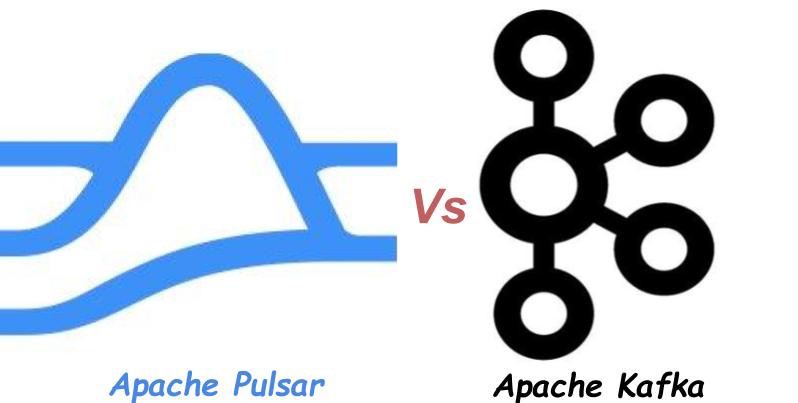
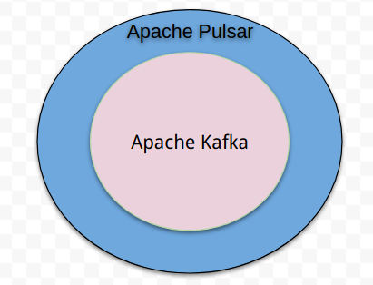

# 为什么Nutanix Beam继续使用Apache Pulsar而不是Apache Kafka？


在Nutanix Beam（Saas产品）中，我们处理大量数据以查找有关云支出以及云安全性的见解。 Nutanix Beam建立在我们的微服务和服务网格架构上，使用Consul，Nomad，Vault，Envoy和Docker进行同步RPC样式请求。 尽管我们不会在这里讨论我们的微服务架构（这是在不同的日子和不同的帖子：），但是我们将重点关注支持该架构的关键技术-团队和微服务之间的异步通信。

我们使用Disque＆Conductor进行批处理。 这两个系统都是基于队列的系统。 我们希望将发布/订阅功能添加到我们的平台中，这导致我们寻找一种流媒体平台，在该平台中我们可以可靠地存储事件并在需要时重播它们。 由于我们的某些团队成员以前有过Kafka的经验，并且以中等规模经营Kafka，因此选择Kafka对我们来说很容易。 但是，在部署技术之前，我们强烈认为，重要的是要了解当前的形势并验证我们的技术选择，以免我们屈服于可能对项目不利的熟悉技术。 同样，务必谨慎地做出此决定，因为流媒体平台将成为此SaaS产品的关键组件。

当我们在Github问题中提到Apache Pulsar时，我们首先了解到它，并决定开始针对我们的流媒体平台用例对其进行评估。 考虑到Pulsar处于Apache的保护伞下，并且已经从Apache的孵化过程中毕业，成为一个顶级项目，我们可以确信它是一项成熟的技术。 Apache pulsar在Yahoo中已投入生产多年，并采用了此处提到的许多公司。 我们收集了需要流平台的用例列表，并且开始深入分析Apache Pulsar的体系结构以及Pulsar的协调性，持久性，可靠性，高可用性，容错性和客户端生态系统。

Apache Pulsar简介

Apache Pulsar是最初在Yahoo创建的开源分布式pub-sub消息传递系统，现已成为Apache Software Foundation的一部分。

Apache Pulsar使用一种将消息处理，服务和存储分离的架构。 存储层嵌入了Apache BookKeeper，以实现数据持久性，复制和高可用性。 消息服务由构成服务层的一组无状态代理处理，消息处理由该体系结构自己的层中的Pulsar Functions处理。 此体系结构的每一层都可以独立扩展-我们可以独立扩展BookKeeper（存储层）以提高存储容量和吞吐量，Pulsar代理（服务层）以提高消息服务吞吐量，而功能工作者（处理层）则可以处理更多数据处理 。

要了解有关Apache Pulsar的更多信息，请参阅Apache Pulsar网站和文档。
# 发展的好处：

收集用例时发现的一件有趣的事情是，我们经常想同时使用消息队列和pub-sub模型来使用消息。 但是，我们不能将Kafka用作排队系统，因为您可以拥有的最大工作人员数量受到分区数量的限制，并且由于无法在单个消息级别上确认消息。 您将需要通过在自己的数据存储中维护单个消息确认的记录来手动在Kafka中提交偏移量，这会增加很多额外的开销—我认为这是太多的开销。

使用Pulsar，您无需担心要使用哪种模型来使用数据。 在Pulsar中，您可以在偏移级别使用和提交，也可以在消息级别使用和确认。 有关其工作原理的更多详细信息，Streamlio团队在此处写了一个不错的博客。 同样值得注意的是，如果使用者崩溃，Apache Pulsar将如何处理消息传递：在订阅级别定义的延迟之后，Pulsar将再次将消息发布给另一个使用者。
# 运营收益：

这就是事情变得有趣的地方。 由于我们以中等规模运营Kafka，我们已经了解了它的几个局限性。 我们看到Pulsar可以解决这些限制并更好地满足我们的需求。
# 事件重播和落后的消费者：

在Apache Kafka中，当消费者落后时，由于落后的消费者引入了随机读取，因此生产者的吞吐量下降了。 Kafka的架构的设计方式是，高吞吐量取决于仅以追加方式顺序访问数据。

Apache Pulsar通过结合使用基于段的架构和读写之间的隔离来解决此问题。 您可以在此博客中了解更多信息。 简而言之，热读取由代理的内存中缓存处理，热写入由日志处理。 事件重播/滞后使用者从分类帐读取访问数据，分类帐与日志位于不同的磁盘上。

例如，假设有一个主题，我们有5个消费者，他们所有人阅读愉快，没有任何滞后。 在这种情况下，读取由代理缓存提供。 周期性地，后台进程将数据从BookKeeper日记帐移到分类帐。 现在想象一下，我们的机器学习工程师突然决定从本主题的开始就决定使用它来训练/重新训练他的模型，因为他调整了模型的sigma＆mu :)。 由于滞后的消费/事件重播是由位于不同磁盘中的分类帐提供的，因此事件重播不会影响消费者读取主题中最新数据的性能。
## 保留数据而不会爆炸我们的云账单

Apache Pulsar通过其存储分层功能解决了此问题，该功能可以将较旧的数据卸载到可扩展的存储系统中，例如Amazon s3，Google Cloud Storage，Minio等。我们可以根据时间和大小配置卸载策略。 一旦主题中的数据达到指定的时间或大小阈值，较旧的数据段将移至对象存储。 最好的部分是，当使用者请求已被卸载到对象存储的数据时，Pulsar会从对象存储透明地将该数据提供给使用者。 使用者不知道数据是来自磁盘还是对象存储。 这样，您的主题分区大小不仅限于单个代理上的存储大小。
## 在线扩展：

将节点添加到Apache Kafka群集不一定能解决与过载节点有关的性能问题。 为什么不？ 添加到Kafka群集中的新节点将用于添加后创建的新主题，但不会自动减轻过载节点的一些负担。 要使用它们来分散负载，您需要进行手动的，成本高昂的数据重新平衡，以将某些主题从旧节点迁移到新节点。

在Pulsar中，存储由Apache BookKeeper提供的存储层处理。 Pulsar使用基于段的体系结构，其中主题分区中的消息被收集为段，然后将其持久化。 结果，在主题分区和节点之间不存在与Kafka中一样的一对一映射。 添加新的存储节点后，某些新段将存储在新节点上，从而立即减少了先前存在的节点上的负载。

Jack Vanlightly在此博客中有一个很好的图表，说明了其工作原理。
## 数百万个主题：

我们的用例的另一个重要要求是能够支持数百万个主题。 例如，假设我们要重播一位客户的数据。 只要我们为每个客户创建一个主题，就可以轻松地为特定客户的主题创建订阅，然后使用该客户的数据。 就像删除主题一样，删除客户数据变得非常简单。

但是，在Apache Kafka中，扩展多个主题是一个实际的体系结构问题。 Kafka为每个主题创建多个文件（资源）。 因此，我们可以创建的主题数量将受到限制。 但是，如果我们要将来自许多甚至所有客户的数据放在一个主题中，那么当我们要重放单个客户的数据时，我们将被迫重放整个主题并丢弃所有消息，但与消息关联的消息除外。 我们感兴趣的单个客户。即使我们要使用带有客户ID的分区主题作为分区键，以便我们仅选择存储单个客户数据的分区，也会浪费大量资源。 经纪人和消费者方面。

Pulsar不会按主题创建文件。 由于它使用Apache BookKeeper的细分存储架构，因此创建的细分数量不受主题数量决定。 我们非常喜欢此功能，因为有了它，我们可以继续为每个客户创建一个主题，这是一种更简单，更有效的设计。
## 生产部署

Pulsar在生产中运行了最近6个月，并支持用例，例如发布/订阅，排队和架构注册表。
# 结论

总的来说，我们对Pulsar的看法是，它极大地简化了Nutanix Beam中的异步通信设计。 凭借其可伸缩性和设计，我们可以根据业务用例来决定如何在消费者端使用数据，而不是强迫我们在数据提取期间做出这些决定。 这种灵活性可以帮助我们更好地支持不断变化的业务需求。

> Apache Pulsar is Next Generation Persisted Streaming Pub/Sub & Queuing Platform.


要了解有关apache pulsar的工作方式的更多信息，请阅读Jack Vanightly撰写的这篇很棒的文章。 另外，streamlio团队有不错的博客文章，深入讨论了每个脉冲星建筑细节。 Apache Pulsar拥有一个很棒的社区，在帮助我们正确处理并合并合并请求请求时非常受欢迎。

PS：撰写本文时要记住，每种技术在这个世界上都有其地位。 为了突出某些架构差异，我们将其与kafka进行了比较。 我们过去曾经使用过kafka，也非常感谢kafka＆kafka社区。

在评论部分让我知道您的想法。 您可以在Twitter上关注我@SkyRocknRoll
```
(本文翻译自Yuvaraj Loganathan的文章《Why Nutanix Beam went ahead with Apache Pulsar instead of Apache Kafka?》，参考：https://medium.com/@yuvarajl/why-nutanix-beam-went-ahead-with-apache-pulsar-instead-of-apache-kafka-1415f592dbbb)
```
