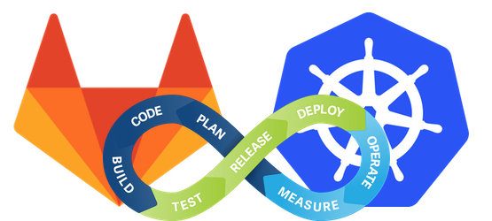

## 使用CI / CD和Kubernetes更快地部署代码| Kubernetes引擎| 谷歌云
### 使用持续集成和部署（CI / CD），可以更快地部署代码，防止中断并节省资金。
## Kubernetes模式
### undefined
## alexellis / k3sup
### k3sup是一个轻量级实用程序，可在任何本地或远程VM上使用k3从零到KUBECONFIG。 您需要的只是ssh…
# 谢谢！

谢谢阅读！ 希望本文能使您对Kubernetes以及它可以提供的东西有很好的感觉。

本文确实并不详尽，并且有一些非常高级的Kubernetes概念，不在本文讨论范围之内。

如果您想玩Kubernetes，建议您检查以下内容，这是一个用于在Linux主机上引导k8的零配置工具：
## alexellis / k3sup
### k3sup是一个轻量级实用程序，可在任何本地或远程VM上使用k3从零到KUBECONFIG。 您需要的只是ssh…

而且，如果您有兴趣将自己的牙齿打入一些更高级的Kubernetes模式中，建议您本书：
## Kubernetes模式
### 随着微服务和技术的发展，开发人员设计，构建和运行软件的方式已发生了显着变化。

最后，我还建议您看以下漫画：
## 使用CI / CD和Kubernetes更快地部署代码| Kubernetes引擎| 谷歌云
### 使用持续集成和部署（CI / CD），可以更快地部署代码，防止中断并节省资金。
## Kubernetes速查表— Linux Academy
### 如果您像我一样，可能会在终端机那一刻，将手悬停在键盘上，然后…
## Kubectl概述
### 编辑此页面Kubectl是一个命令行界面，用于针对Kubernetes集群运行命令。 kubectl寻找...
# …还要别的吗？
## Kubectl

kubectl是用于控制k8s集群并从集群公开信息的主要CLI。


语法非常简单，但是要学习的命令很多：
## Kubectl概述
### 编辑此页面Kubectl是一个命令行界面，用于针对Kubernetes集群运行命令。 kubectl寻找...
## Kubernetes速查表— Linux Academy
### 如果您像我一样，可能会在终端机那一刻，将手悬停在键盘上，然后…
## 工作

除了无限长运行的服务外，k8s还具有作业和cron作业的概念，它们可以按定义的时间表运行。

您可能会想到，这类工作负载是通过kube-scheduler进行调度的，并且为具有明确寿命的服务（例如，一直运行到流程完成然后终止）提供了很好的选择。
## 等

etcd不仅是集群创建的所有内容的分类帐，而且还可以用作应用程序配置和秘密存储。

这意味着您可以放入有用的内容，例如数据库URI和密码，然后在资源定义中根据需要引用它们！
# 它是如何做到的？
## 节点数


节点是集群中能够运行容器的虚拟机或物理机。

节点运行所需的容器运行时（例如Docker-尽管默认为容器化）以及服务kubelet和kube-proxy。
+ kubelet —在每个工作节点上运行的代理，该代理管理在pod中运行的容器。 它将容器的当前状态与容器的规格相匹配。
+ kube-proxy —一种高度灵活的代理，可转发许多不同类型的请求，并负责处理节点与Kubernetes之间的所有交互。

除这些基本服务外，Pods也可以在节点上运行，并且一个节点可以一次运行多个Pod。

## 豆荚

Kubernetes容器是可在k8s集群上部署的最小，最简单的对象。

Pod在Kubernetes节点上运行。 一个Pod可以包含一个或多个容器以及多个容器。
## 卷数


与Docker中的卷概念类似，尽管容器具有短暂的（短暂的）性质，Kubernetes卷还是一种抽象化持久化与Pod相关的数据的概念的方式，并且可以确保数据可以在容器重启后持久化。

卷本质上只是一个简单的目录，可跨Pod内运行的各个容器访问。

Kubernetes卷通常绑定到Pod，因此尽管它们将在各个容器重启之间持久存在，但默认情况下，如果Pod不再存在，它们将不存在（除非您将它们配置为持久存在）。
## 控制平面


控制平面或Kubernetes Master是在主节点上运行的一系列服务。

这些服务控制k8s软件与集群的交互方式。 服务主要包括：
+ kube-apiserver —一个组件，负责公开k8s集群，并充当集群中所有主组件和辅助组件之间的集群通信的主要接口。
+ kube-scheduler —具有易于定义但在Pod中调度Pod以及在群集中的什么时候运行Pod的重要职责的组件。
+ etcd — k8和pod用来存储资源定义，pod的自定义应用程序配置以及集群内存在的任何对象的状态的分布式键值存储。
+ kube-controller-manager —一个组件，负责管理容器的生命周期。 kube-controller-manager通过kube-apiserver从etcd检索所需集群状态和当前集群状态，并根据需要实例化或删除所需的资源。

控制平面组件可以驻留在单个主节点中，也可以分布在多个主节点上的各种拓扑中。
## 簇


集群是运行由Kubernetes管理的服务/吊舱/组件或Kubernetes软件本身的节点组。

群集必须至少具有一个主节点。 为了使集群执行有意义的工作，您还必须部署一些服务。 这些服务通常必须部署在辅助节点上，尽管有可能并且也可以在主节点上部署服务。
## 服务

Kubernetes Pod的寿命不是无限的。 最终，如果发布了在Pod中运行的容器的较新版本或其他原因，则可以将其删除。

服务是一种抽象的Pod，实际上是跨Pod的负载均衡器，解决了Pod之间的服务相互依赖和可用性问题（可能不存在）。


如果您有一个应用程序的一个切片在一个Pod中运行，而另一个切片在另一个Pod中运行，则尽管其中Pod的组成各不相同，但您仍可以将服务用作一种从一个服务到另一个服务的持续可用接口的维护方式。 每个服务。
## 入口

Ingress是k8s的机制，可将集群中运行的服务暴露给外界。


入口由入口控制器管理，并通过HTTP和HTTPS提供到服务的路由。
## 部署

部署将所有k8s概念包装在一起，是您向k8s提供的一条指令，以创建或循环运行Pods（正在运行应用程序容器）的服务。

k8中的部署不仅仅是安装软件的简单脚本。

Kubernetes管理部署的部署，以维护服务的可用性，并在发生故障时处理回滚。
# 我该怎么办？

Kubernetes可以做什么？ 很明显，很多事情：
+ 部署和运行容器化的应用程序

但是然后：
+ 服务发现和负载平衡
+ 发布管理和自动推出/回滚
+ “自我修复”
+ 机密和配置管理
# Kubernetes的重点是什么？

您为什么要关心Kubernetes？ 它解决什么问题？

在最简单的层面上，k8s解决了另一个解决方案所产生的问题：容器化。


如果您不熟悉，容器化就是将应用程序打包并将其打包到一个可运行/可执行的软件映像中的过程。

容器化应用程序的过程需要了解其输入，依赖项，配置文件和输出，然后将所有这些内容烘焙为不可变的映像。

根据映像的不同，开发该映像的过程可能会非常困难，但是一旦构建完成，就可以在任何系统上随意将其实例化为容器（前提是该系统具有容器运行时，例如Docker）。

容器化主要解决了开发环境和生产环境之间应用程序可移植性的问题。

具备在任何系统上轻松生成各种应用程序的功能，可以轻松生成多个实例。 这解决了可伸缩性的问题，但是又产生了多个实例的笨拙以及需要管理它们的新问题。 这是Kubernetes解决的核心问题：编排。

> Source: Google Cloud

# 另一个Kubernetes（k8s）指南
## 从头开始学习Kubernetes

> Photo by Bobby Burch on Unsplash


近年来，Kubernetes（k8s）的受欢迎程度激增。 如果您要部署许多容器化的应用程序，那么无论在私有云还是公共云环境中，k8无疑都是当前的最佳解决方案。

所有主要和不太主要的云提供商都提供托管的k8s集群服务。


基于Web的存储库托管平台/ DevOps生命周期工具/“您可能需要做的所有事情”工具GitLab提供了集成，可直接部署到您定义的Kubernetes集群中。 其他所有VCS产品也纷纷效仿。


关键是……它非常受欢迎，并且地球上几乎每个主要的基于技术的公司都在为此投入巨资。 它并没有消失，您可能应该了解一两件事。
```
(本文翻译自Andy Macdonald的文章《Yet Another Kubernetes (k8s) Guide》，参考：https://medium.com/better-programming/yet-another-kubernetes-k8s-guide-52377a72ce65)
```
